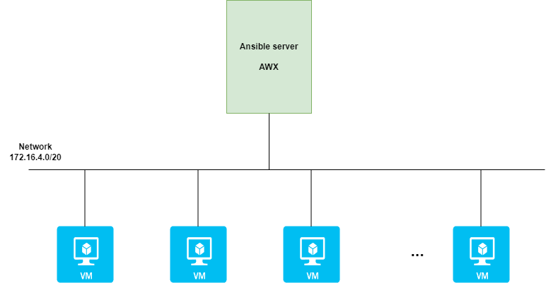
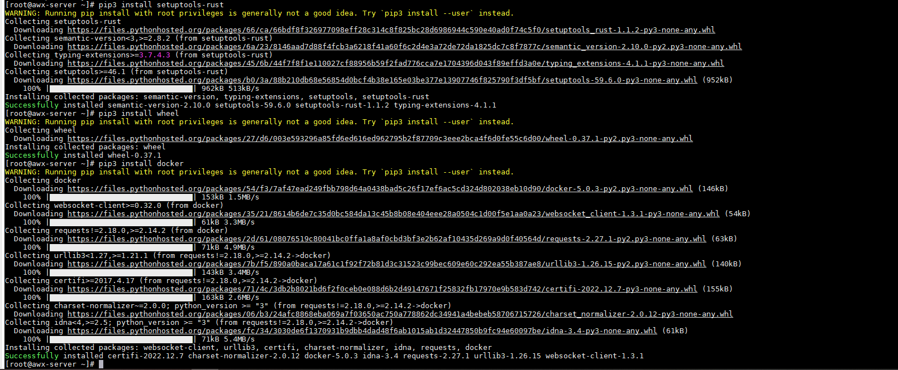
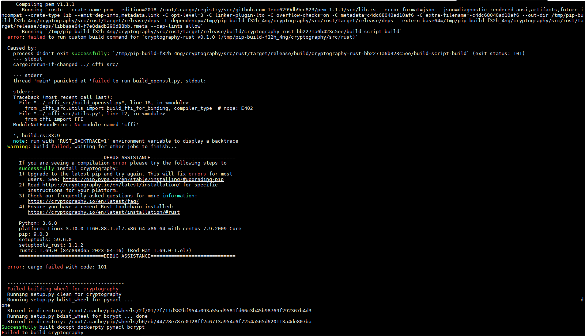
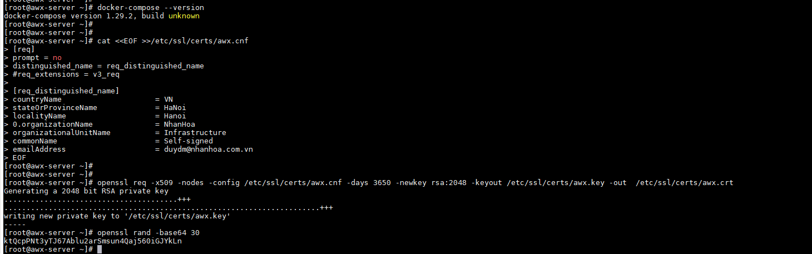
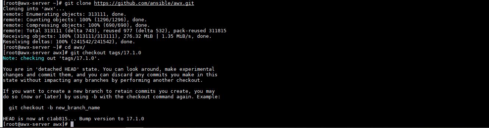
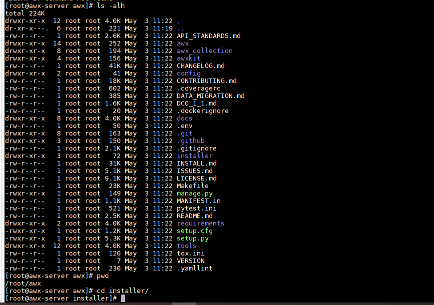
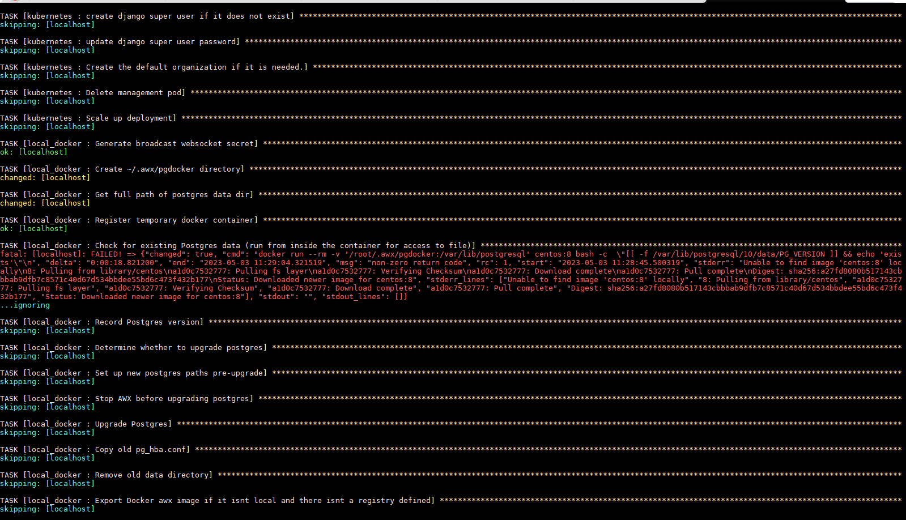
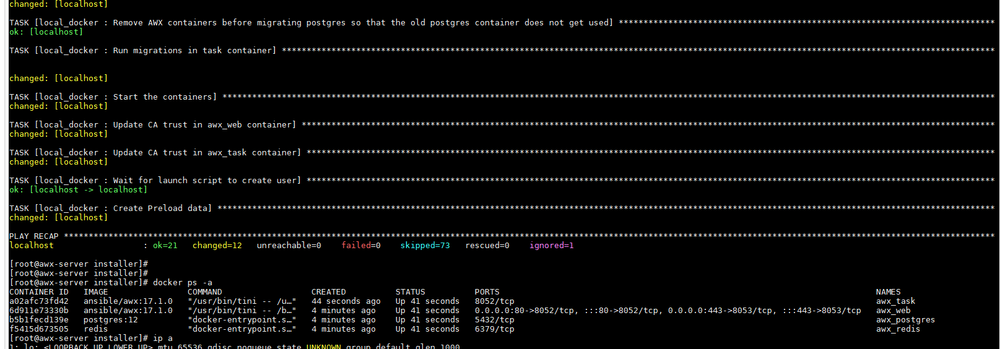
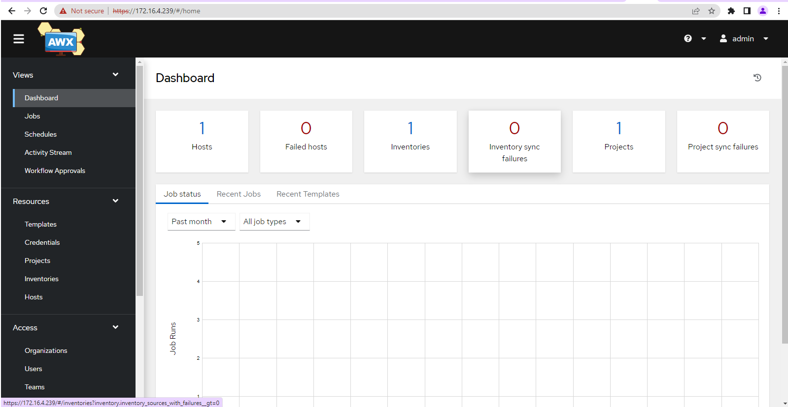
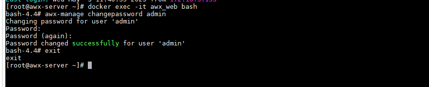

# Cài đặt AWX Ansible

### Mục lục

[1. Mô hình](#mohinh)<br>
[2. Cài đặt](#caidat)<br>

Ansible là một công cụ để tự động hóa quá trình triển khai 1 kịch bản trên nhiều host, thông thường sẽ phải thực hiện bằng các lệnh command line để triển khai các playbook. AWX là cung cấp giao diện web phủ lên ansible server cho người dùng có thể thực hiện các playbook ansible trên giao diện web dễ dàng sử dụng, lưu lại log, lập lịch thực hiện...

<a name="mohinh"></a>
## 1. Mô hình



<a name="caidat"></a>
## 2. Cài đặt

### 2.1 Thiết lập ban đầu

**Update**

```
yum install epel-release -y
yum update -y
```

**Thiết lập IP**

```
hostnamectl set-hostname awx-server
sudo systemctl disable firewalld
sudo systemctl stop firewalld
sed -i 's/SELINUX=enforcing/SELINUX=disabled/g' /etc/sysconfig/selinux
sed -i 's/SELINUX=enforcing/SELINUX=disabled/g' /etc/selinux/config
```

**Cài đặt NTPD**

```
yum install chrony -y 

systemctl start chronyd 
systemctl enable chronyd
systemctl restart chronyd 

chronyc sources -v
```

```
sudo date -s "$(wget -qSO- --max-redirect=0 google.com 2>&1 | grep Date: | cut -d' ' -f5-8)Z"
ln -f -s /usr/share/zoneinfo/Asia/Ho_Chi_Minh /etc/localtime
```

**CMD log**

```
curl -Lso- https://raw.githubusercontent.com/nhanhoadocs/ghichep-cmdlog/master/cmdlog.sh | bash
```

**Reboot**

```
init 6
```

### 2.2 Cài đặt AWX

- Cài đặt một số gói cần thiết

```
yum install git wget vim python3-pip -y
```

- Cài đặt ansible

```
yum -y install ansible
```

- Cài đặt và cấu hình Docker và các gói cần thiết


```
yum install -y yum-utils device-mapper-persistent-data lvm2
yum-config-manager --add-repo https://download.docker.com/linux/centos/docker-ce.repo
yum -y install docker-ce

usermod -aG docker $(whoami)
systemctl daemon-reload
systemctl enable docker --now
```

- Cài đặt Docker-compose và các gói cần thiết


```
yum -y install rust cargo python3-devel libevent-devel openssl-devel gcc 
pip3 install setuptools-rust
pip3 install wheel
pip3 install docker
```



- Cài đặt Docker-compose

```
pip3 install docker-compose
docker-compose --version
```



- Thiết lập cấu hình cert và key để sử dụng SSL/TLS

```
cat <<EOF >>/etc/ssl/certs/awx.cnf
[req]
prompt = no
distinguished_name = req_distinguished_name
#req_extensions = v3_req

[req_distinguished_name]
countryName                     = VN
stateOrProvinceName             = HaNoi
localityName                    = Hanoi
0.organizationName              = NhanHoa
organizationalUnitName          = Infrastructure
commonName                      = Self-signed
emailAddress                    = duydm@nhanhoa.com.vn
EOF
```

- Khởi tạo Cert và Key

```
openssl req -x509 -nodes -config /etc/ssl/certs/awx.cnf -days 3650 -newkey rsa:2048 -keyout /etc/ssl/certs/awx.key -out  /etc/ssl/certs/awx.crt
```

- Khởi tạo một chuỗi key ngẫu nhiên để cấu hình secret key cho AWX, lưu lại output

```
openssl rand -base64 30
```

Kết quả

```
[root@awx-server ~]# openssl rand -base64 30
ktQcpPNt3yTJ67Ablu2arSmsun4Qaj560iGJYkLn
[root@awx-server ~]#
```




- Clone repository của AWX từ Github

```
git clone https://github.com/ansible/awx.git

cd awx/

git checkout tags/17.1.0
````



- Khởi tạo thư mục lưu trữ dữ liệu cho PostgreSQL, thư mục này sẽ được mount vào thư mục lưu dữ liệu trong container của PostgreSQL

```
mkdir -p /var/lib/awx/pgdocker
cd installer/
```



- Cấu hình tệp inventory như dưới, chỉnh sửa các thông tin password tùy ý.

```
cp inventory inventory.bak
```

```
localhost ansible_connection=local ansible_python_interpreter="/usr/bin/env python3"
[all:vars]
dockerhub_base=ansible
awx_task_hostname=awx
awx_web_hostname=awxweb
postgres_data_dir="/var/lib/awx/pgdocker" # Khai báo thư mục lưu project
host_port=80 # Khai báo port Nginx muốn sử dụng
host_port_ssl=443
ssl_certificate="/etc/ssl/certs/awx.crt"
ssl_certificate_key="/etc/ssl/certs/awx.key"
docker_compose_dir="~/.awx/awxcompose"
pg_username=awx
pg_password=awxpass
pg_database=awx
pg_port=5432
admin_user=admin
admin_password=MY_password # Khai báo password của bạn
create_preload_data=True
secret_key=ktQcpPNt3yTJ67Ablu2arSmsun4Qaj560iGJYkLn #đã khởi tạo ở tren
project_data_dir=/var/lib/awx/projects # Khai báo thư mục lưu data tạo ở bước 7
```

- Thực hiện chạy playbook cài đặt AWX

```
ansible-playbook -i inventory install.yml
```

- Kiểm tra container được khởi tạo

```
docker ps -a
```





- Truy cập giao diện sử dụng thông tin đã được cấu hình để login




- Đổi pass admin

```
docker exec -it awx_web bash
awx-manage changepassword admin
```




