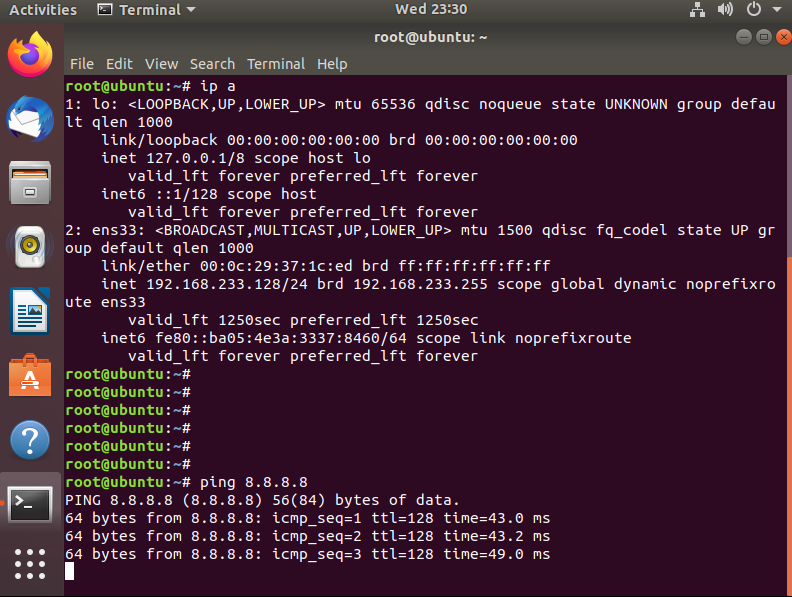
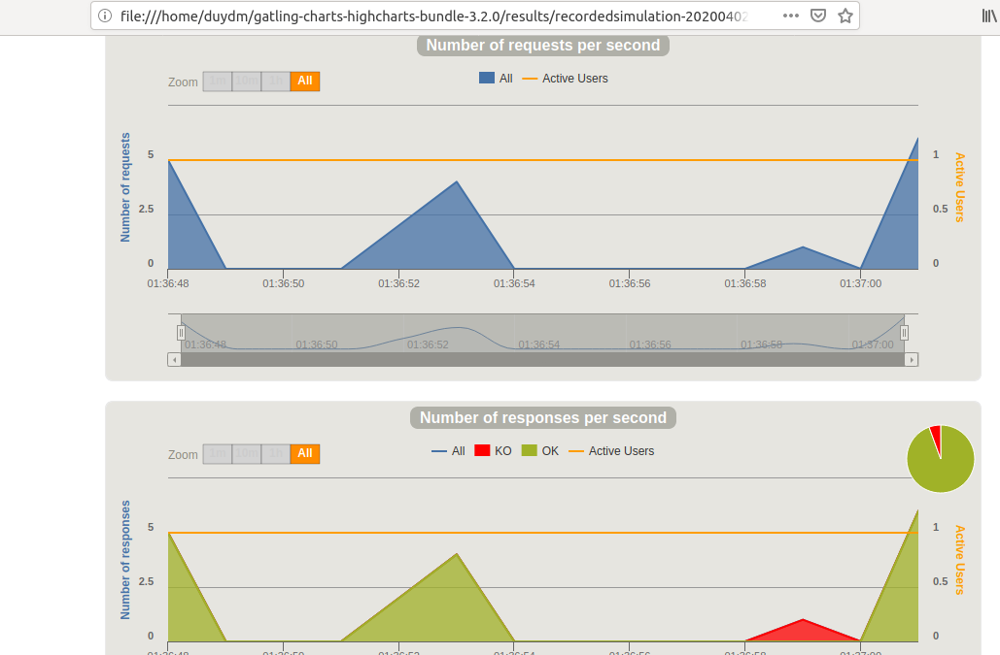

## Ghi chép cài đặt gatling IO

## 1. Mô hình


## 2. Cài đặt gatling IO

Gatling tool được cài đặt trên server Ubuntu 18.04 Desktop



+ Gatling.io chỉ tương thích với phiên bản JDK 8

```
sudo apt install openjdk-8-jdk -y
```
+ Download gatling.io

```
wget https://repo1.maven.org/maven2/io/gatling/highcharts/gatling-charts-highcharts-bundle/3.2.0/gatling-charts-highcharts-bundle-3.2.0-bundle.zip
```

```
apt install unzip
unzip gatling-charts-highcharts-bundle-3.2.0-bundle.zip
```

+ Cấu trúc thư mục source gatling

```
bin: Chứa các script thực hiện Gatling và Recorder
conf: Chứa cấu hình cho Gatling như Log, Report, ..
lib: Chứa thư viên sử dụng bởi Gatling
user-files: Chứa dữ liệu người dùng
simulations: Chứa các kịch bản test (Scale file).
data: Chứa các dữ liệu mẫu (Feeder files)
bodies: Chứa template cho Request ảo
results: Chứa kết quả sau những lần thực hiện test
```


### 3. Cài đặt môi trường web client

Dựng một web server để test hiệu năng của web server đó.

Webserver chạy trên môi trường CentOS 7 hoặc dựng một site wordpress để test.

- Setup môi trường

```
yum install https://centos7.iuscommunity.org/ius-release.rpm -y
yum install python-devel -y
yum install python36-devel -y
yum install python36 -y
yum install python36u-mod_wsgi -y
yum install python-pip -y
yum install python36u-pip -y
pip3.6 install virtualenv
```

- Cài đặt web

```
cd ~/
mkdir django-demo
cd django-demo
virtualenv env
source env/bin/activate
pip install django==2.1.1
django-admin startproject project
cd project/
python manage.py migrate 
```

- Tạo tài khoản Admin

```
python manage.py createsuperuser

Username (leave blank to use 'root'): admin
Email address: manhduy@test.com
Password: Password
Password (again): Password
Superuser created successfully.
```


- Chạy server web

```
python manage.py runserver 103.xxx.xxx.xxx:80

Performing system checks…
System check identified no issues (0 silenced).
February 14, 2019 - 09:55:24
Django version 2.1.1, using settings 'project.settings'
Starting development server at http://103.xxx.xxx.xxx:80/
Quit the server with CONTROL-C.
```

ALLOWED_HOSTS = ['XX.XX.XX.XX'] trong file `/root/django-demo/project/project/settings.py`

Login

```
http://103.xxx.xxx.xxx:80/
http://103.xxx.xxx.xxx/admin/
```


### 4. Sử dụng Gatling Recorder

Gatling Recorder. Gatling Recorder là bộ thu thập tháo tác người dùng hay sẽ quay lại các thao tác thực hiện trên trình duyệt, sau đó chuyển hóa các thao tác thành Gatling script (.scala script). 

Sau khi có Gatling script sẽ chỉnh sửa tạo ra các bài test khác nhau (như tăng số lượng người dùng truy cập, thay đổi tham số request, …).

B1: Khởi động Gatling Recorder tại máy Ubuntu 18 desktop

```
cd gatling-charts-highcharts-bundle-3.2.0/bin
./recorder.sh
```


B2: Khởi động proxy Gatling Recorder

```
Nhập localhost HTTP/HTTPS: 8000 – Khởi tạo proxy sẽ có port bằng 8000
Nhập Class Name*: RecordedSimulation – Tên kịch bản sẽ bằng RecordedSimulation
Chọn start
```


B3: Trỏ Proxy trình duyệt về Proxy Server của Gatling Recorder (sử dụng Firefox)

Tham khảo <a href="https://www.wikihow.com/Enter-Proxy-Settings-in-Firefox" target="_blank">tại đây! </a>


Sau khi trỏ proxy Ubuntu về Proxy Server của Gatling Recorder, các thao tác trên trình duyệt sẽ được Gatling thu thập từ đó tạo ra các kịch bản test.

B4: Thực hiện kịch bản

```
Người dùng truy cập vào trang chủ
Người dùng chuyển sang trang admin
Người dùng đăng nhập vào trang admin
Người dùng đăng xuất khỏi trang admin
```

- Kết quả thu được tại Gatling recorder


Save lại xuất hiên ở trong thư mục chứa file recoder .scala


### 5. Sử dụng Gatling Test


- Chạy kịch bản vừa quay

```
cd gatling-charts-highcharts-bundle-3.2.0/bin
./gatling.sh
```

Lựa chọn `RecordedSimulation`


Truy cập đường dẫn kết quả bằng, mở file index.html bằng trình duyệt.





- Ở kịch bản trên giả lập với 1 user thao tác, muốn giả lập với nhiều user tìm đoạn code sau trong scala chỉnh sửa và thực hiện chạy kịch bản.

```
setUp(scn.inject(atOnceUsers(15))).protocols(httpProtocol)
```

Chạy lại kịch bản và xem kết quả

```
cd gatling-charts-highcharts-bundle-3.2.0/bin
./gatling.sh
```


- Giả lập với 500 user truy cập

```
setUp(scn.inject(atOnceUsers(500))).protocols(httpProtocol)
```


Tham khảo:

https://gatling.io/docs/current/quickstart

https://news.cloud365.vn/performance-testing-phan-2-huong-dan-cai-dat-gatling-tren-ubuntu-18-04/

