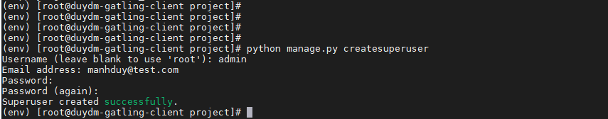
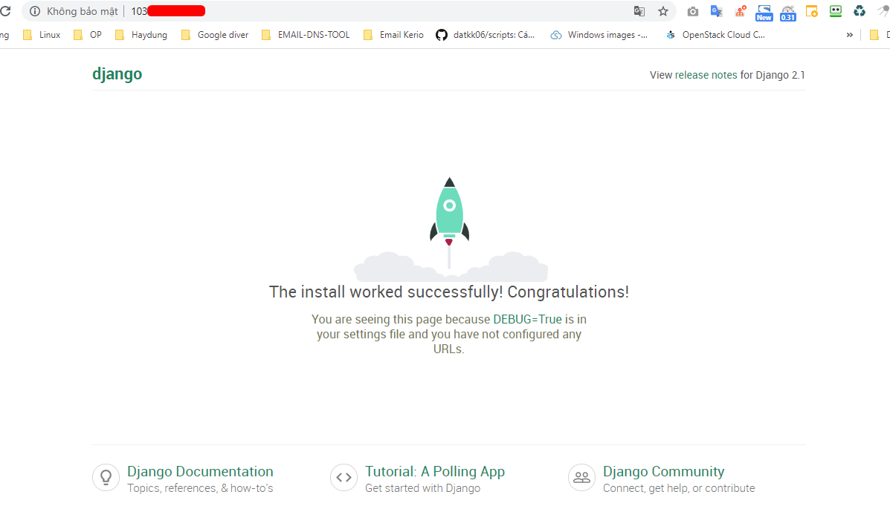
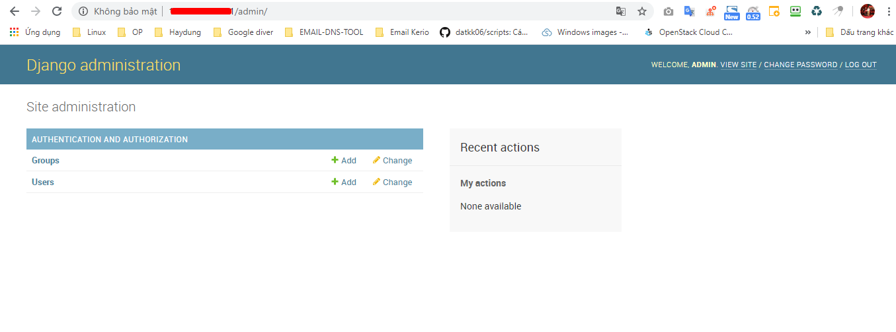

## Ghi chép cài đặt gatling IO

## 1. Mô hình


## 2. Cài đặt gatling IO

Gatling tool được cài đặt trên server Ubuntu 18.04

+ Gatling.io chỉ tương thích với phiên bản JDK 8

```
sudo apt install openjdk-8-jdk -y
```
+ Download gatling.io

```
wget https://repo1.maven.org/maven2/io/gatling/highcharts/gatling-charts-highcharts-bundle/3.2.0/gatling-charts-highcharts-bundle-3.2.0-bundle.zip
```

```
apt install unzip
unzip gatling-charts-highcharts-bundle-3.2.0-bundle.zip
```

+ Cấu trúc thư mục source gatling

```
bin: Chứa các script thực hiện Gatling và Recorder
conf: Chứa cấu hình cho Gatling như Log, Report, ..
lib: Chứa thư viên sử dụng bởi Gatling
user-files: Chứa dữ liệu người dùng
simulations: Chứa các kịch bản test (Scale file).
data: Chứa các dữ liệu mẫu (Feeder files)
bodies: Chứa template cho Request ảo
results: Chứa kết quả sau những lần thực hiện test
```


### 3. Cài đặt môi trường web client

Dựng một web server để test hiệu năng của web server đó.

Webserver chạy trên môi trường CentOS 7 hoặc dựng một site wordpress để test.

- Setup môi trường

```
yum install https://centos7.iuscommunity.org/ius-release.rpm -y
yum install python-devel -y
yum install python36-devel -y
yum install python36 -y
yum install python36u-mod_wsgi -y
yum install python-pip -y
yum install python36u-pip -y
pip3.6 install virtualenv
```

- Cài đặt web

```
cd ~/
mkdir django-demo
cd django-demo
virtualenv env
source env/bin/activate
pip install django==2.1.1
django-admin startproject project
cd project/
python manage.py migrate 
```

- Tạo tài khoản Admin

```
python manage.py createsuperuser

Username (leave blank to use 'root'): admin
Email address: manhduy@test.com
Password: Password
Password (again): Password
Superuser created successfully.
```



- Chạy server web

```
python manage.py runserver 103.xxx.xxx.xxx:80

Performing system checks…
System check identified no issues (0 silenced).
February 14, 2019 - 09:55:24
Django version 2.1.1, using settings 'project.settings'
Starting development server at http://103.xxx.xxx.xxx:80/
Quit the server with CONTROL-C.
```

ALLOWED_HOSTS = ['XX.XX.XX.XX'] trong file `/root/django-demo/project/project/settings.py`

Login

```
http://103.xxx.xxx.xxx:80/
http://103.xxx.xxx.xxx/admin/
```






