## Ghi chép cài đặt gatling trên windows 10

Ngoài việc cài đặt gatling trên Ubuntu 18 desktop hoàn toàn có thể cài đặt trên windows 10 một các đơn giản.

### 1. Cài đặt java jre-8

Có thể downdows bản java jre-8 <a href="https://www.oracle.com/java/technologies/javase-jdk8-downloads.html">tại đây!</a>

Hoặc có thể down trong thư mục scripts của github này <a href="https://github.com/domanhduy/ghichep/tree/master/DuyDM/Benchmark-tool/Gatling-tool/scripts">tại đây!</a>

Thực hiện cài đặt đơn giản 

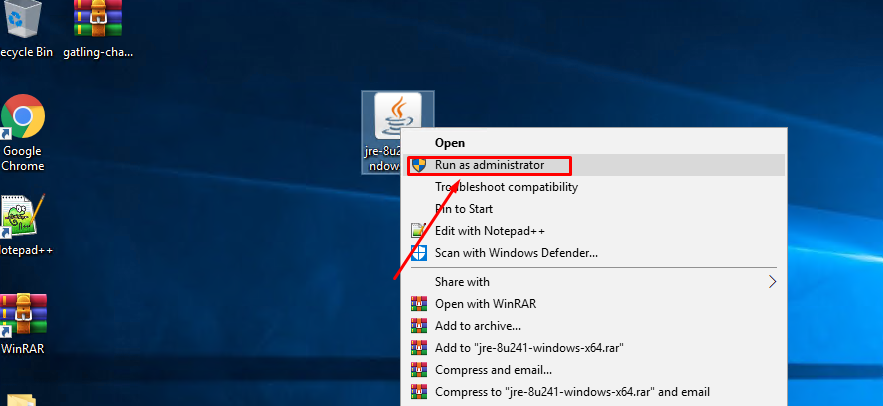

`Next` cho tới khi hoàn thành

### 2. Download source gatling

- Nhập đường link trên trình duyệt file source gatling sẽ tự đông tải xuống.

```
https://repo1.maven.org/maven2/io/gatling/highcharts/gatling-charts-highcharts-bundle/3.2.0/gatling-charts-highcharts-bundle-3.2.0-bundle.zip
```
Hoặc có thể down trong thư mục scripts của github này <a href="https://github.com/domanhduy/ghichep/tree/master/DuyDM/Benchmark-tool/Gatling-tool/scripts">tại đây!</a>


- Giải nén

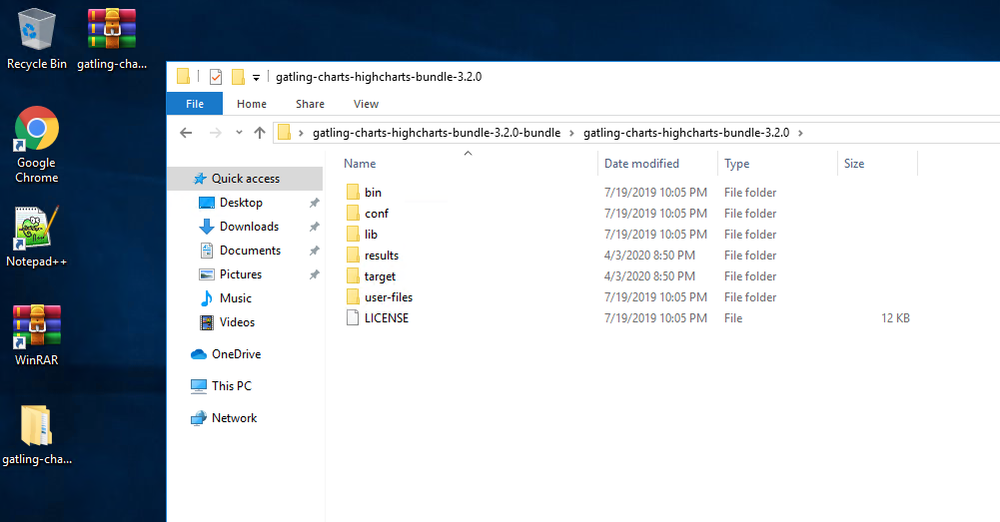

+ Cấu trúc thư mục source gatling

```
bin: Chứa các script thực hiện Gatling và Recorder
conf: Chứa cấu hình cho Gatling như Log, Report, ..
lib: Chứa thư viên sử dụng bởi Gatling
user-files: Chứa dữ liệu người dùng
simulations: Chứa các kịch bản test (Scale file).
data: Chứa các dữ liệu mẫu (Feeder files)
bodies: Chứa template cho Request ảo
results: Chứa kết quả sau những lần thực hiện test
```
### 3. Cài đặt môi trường web client

Xem hướng dẫn trong phần 3 <a href="https://github.com/domanhduy/ghichep/blob/master/DuyDM/Benchmark-tool/Gatling-tool/docs/2.Cai-dat-gatling-io-ubuntu18-desktop.md">tại đây!</a>

### 4. Thiết lập proxy

Thiết lập proxy để mọi truy cập trên trình duyệt (sử dụng chrome) được ghi lại bởi gatling tạo thành kịch bản.

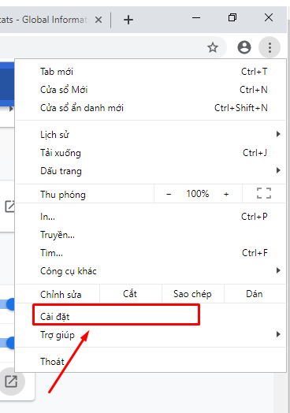

Tại `Nâng cao` => `Mở tùy chọn cài đặt proxy trên máy tính của bạn`

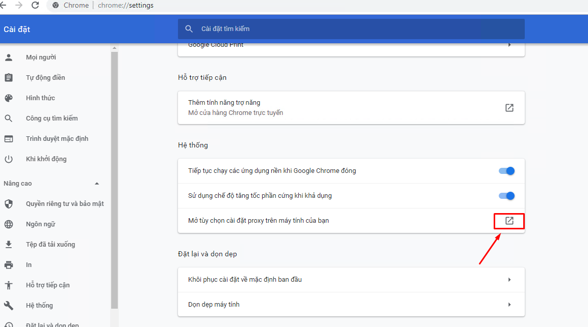

Sẽ mở phần cấu hình proxy của windows 10

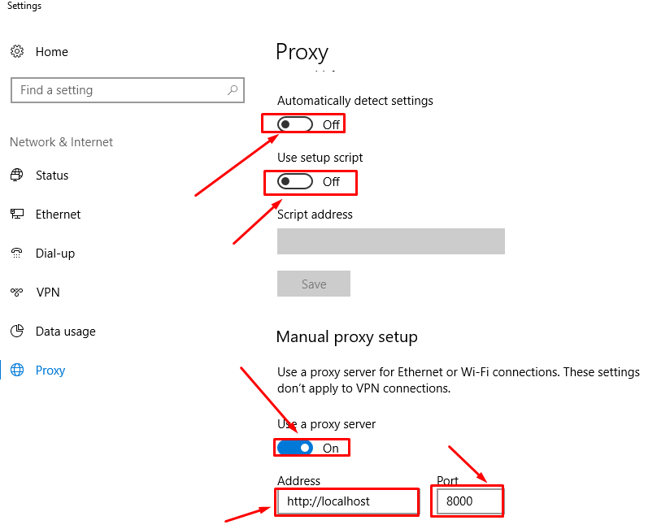

Thiết lâp Address `http://localhost`, port : `8000` => `Save`

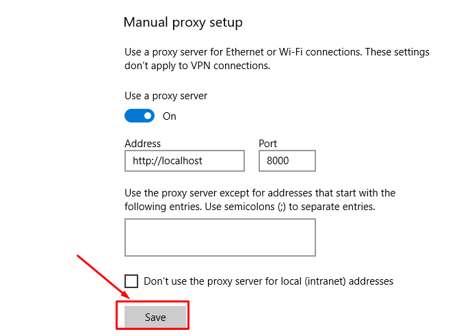

### 5. Sử dụng Gatling Recorder

B1: Khởi động Gatling Recorder

Chạy file `recorder.bat` trong `gatling-charts-highcharts-bundle-3.2.0\bin`

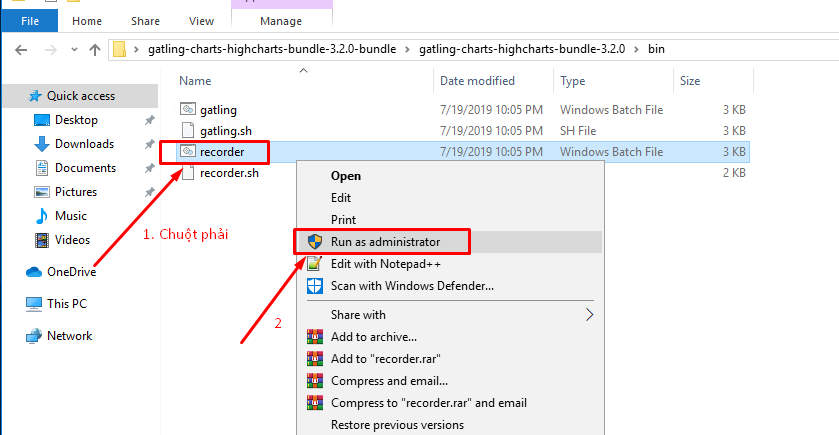

Chờ một lát giao diện thiết lập gatling hiện lên.

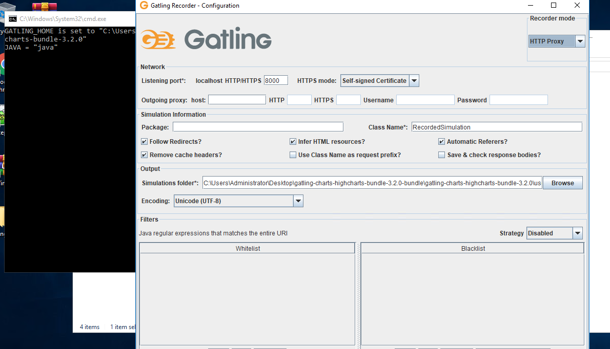

Start để bắt đầu.

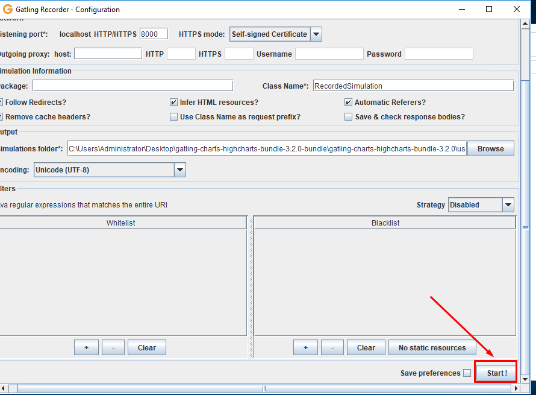

B2: Thực hiện kịch bản

```
Người dùng truy cập vào trang chủ
Người dùng chuyển sang trang admin
Người dùng đăng nhập vào trang admin
Người dùng đăng xuất khỏi trang admin
```

- Kết quả thu được tại Gatling recorder

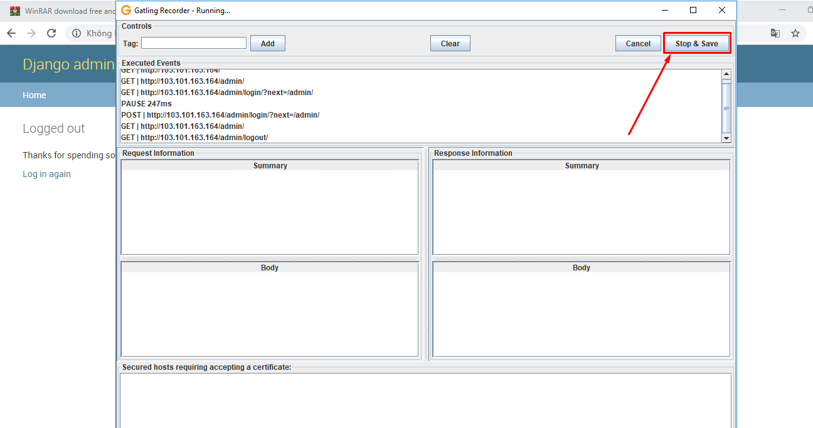

Save lại xuất hiên ở trong thư mục chứa file recoder .scala

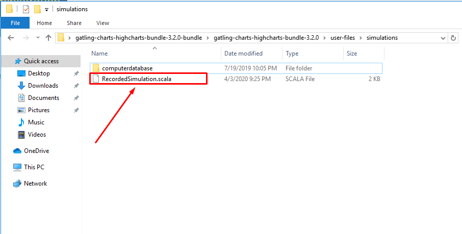

### 6. Sử dụng Gatling Test

- Chạy kịch bản vừa quay

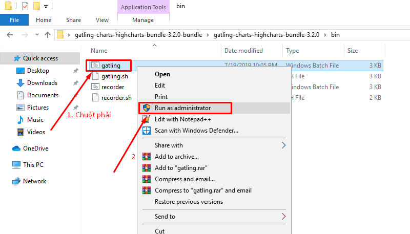

Chờ một lát lựa chọn đúng kịch bản vừa quay.

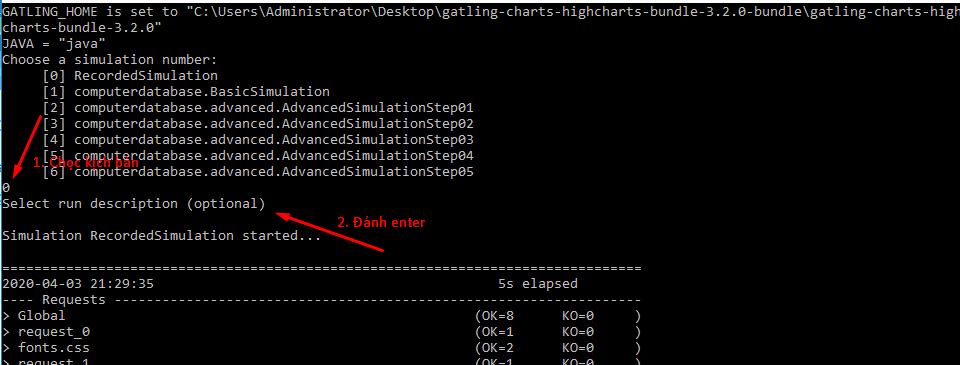

Truy cập đường dẫn kết quả bằng, mở file index.html bằng trình duyệt.

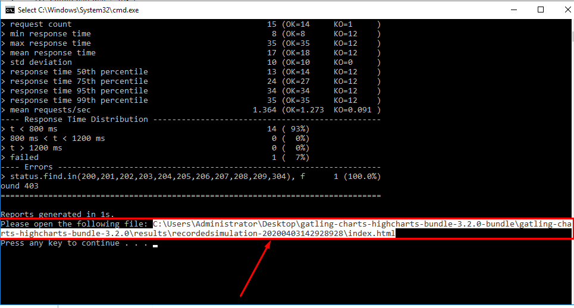

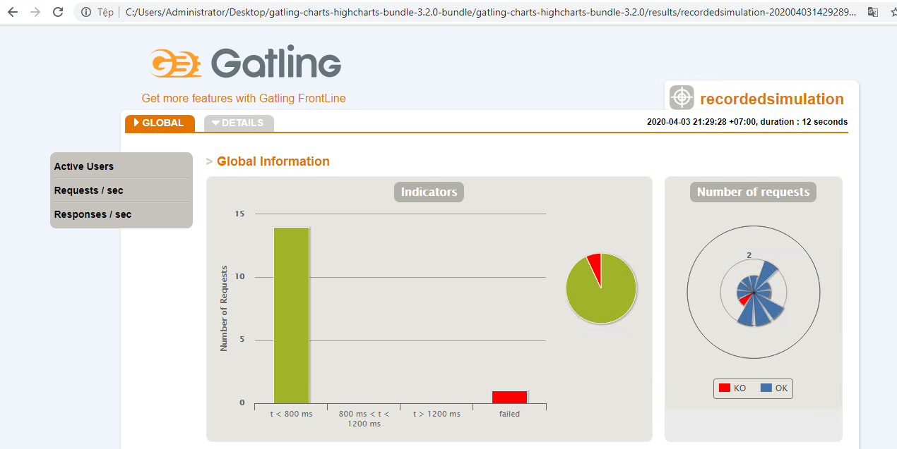

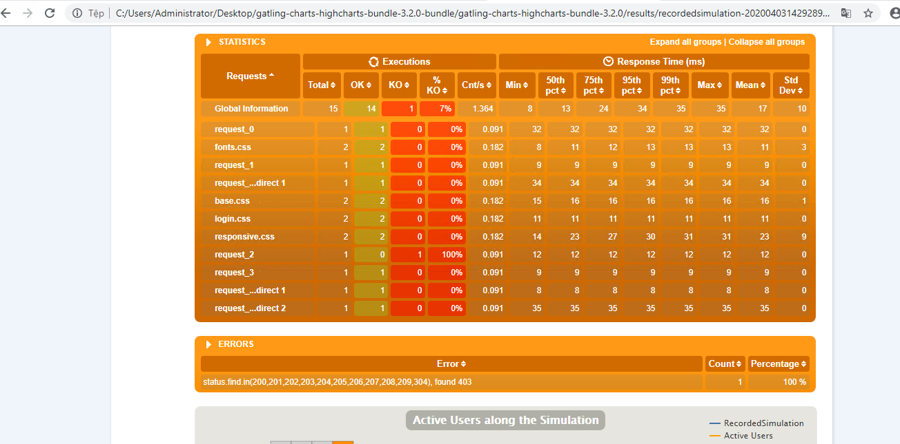

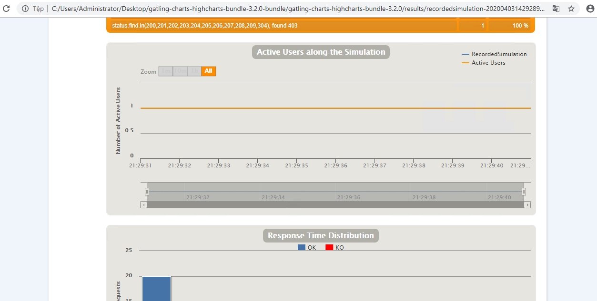

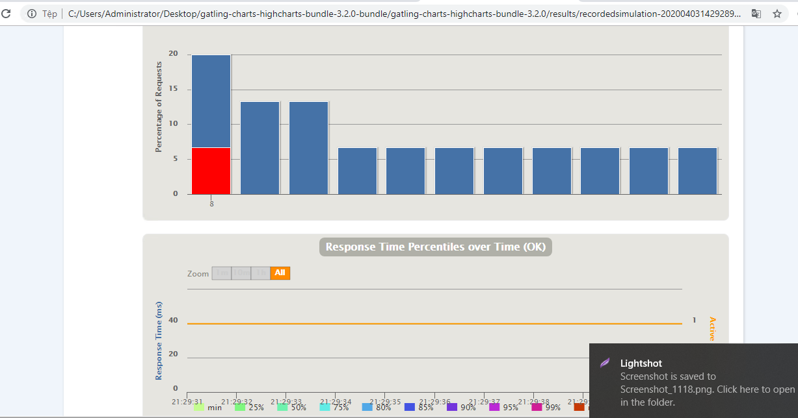

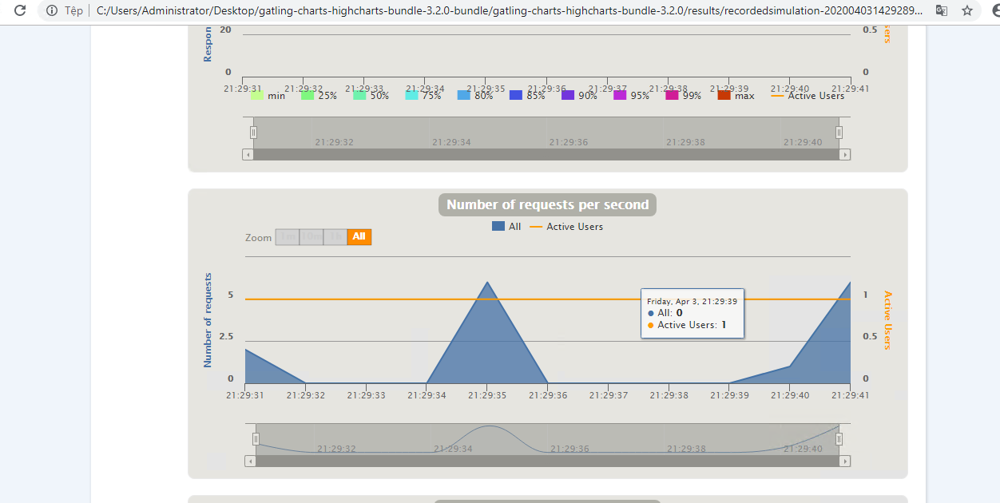

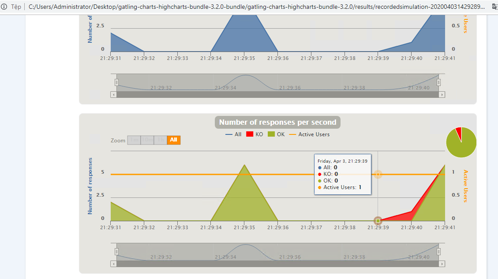
