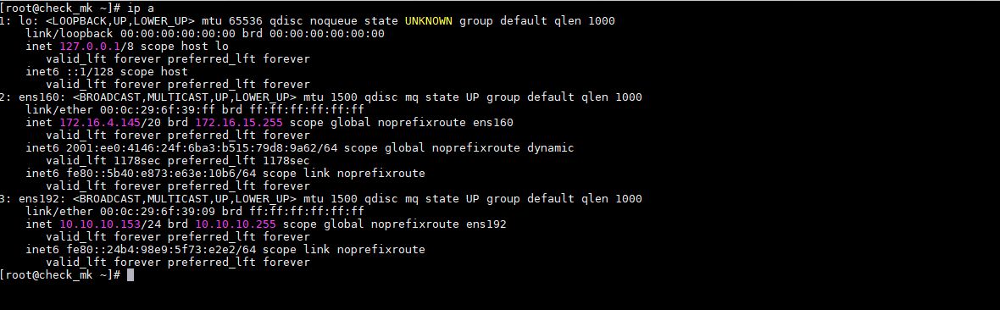
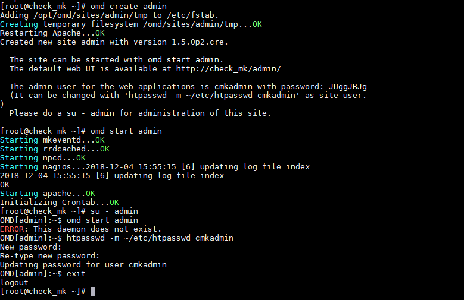
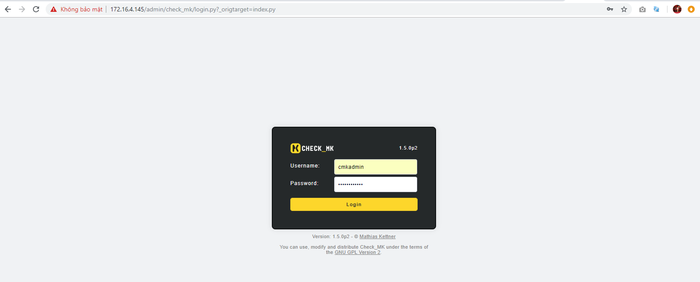
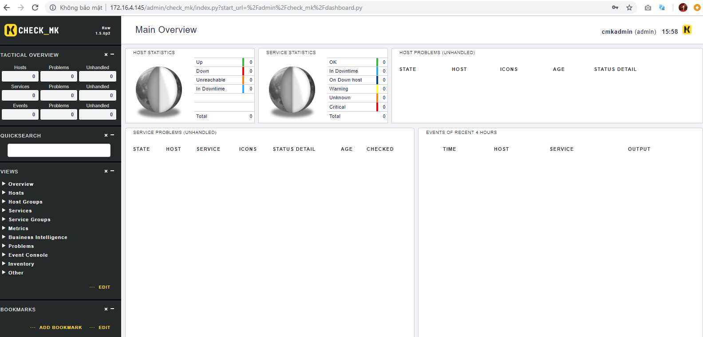

# Hướng dẫn cài đặt Check_MK Centos7

## 1. Chuẩn bị

OS: CentOS7

CPU: 4 vCPU

RAM: 4 GB

Disk: 100 GB

## 2. Mô hình - Cài đặt cơ bản

### 2.1. Mô hình

### 2.2. Cài đặt cơ bản

- Update

```
yum install epel-release -y
yum update -y
```

- Set ip, hostname, firewall, selinux

```
hostnamectl set-hostname check_mk
echo "Setup IP ens160"
nmcli c modify ens160 ipv4.addresses 172.16.4.145/20
nmcli c modify ens160 ipv4.gateway 172.16.10.1
nmcli c modify ens160 ipv4.dns 8.8.8.8
nmcli c modify ens160 ipv4.method manual
nmcli con mod ens160 connection.autoconnect yes

echo "Setup IP ens192"
nmcli c modify ens192 ipv4.addresses 10.10.10.153/24
nmcli c modify ens192 ipv4.method manual
nmcli con mod ens192 connection.autoconnect yes

sudo systemctl disable firewalld
sudo systemctl stop firewalld
sed -i 's/SELINUX=enforcing/SELINUX=disabled/g' /etc/sysconfig/selinux
sed -i 's/SELINUX=enforcing/SELINUX=disabled/g' /etc/selinux/config

init 6
```




## 3. Cài đặt Check_MK

+ Download & Install package

```
yum install wget -y
yum install xinetd openssl -y
```

+ Installation Check_MK

```
wget https://mathias-kettner.de/support/1.5.0p2/check-mk-raw-1.5.0p2-el7-38.x86_64.rpm
yum install -y check-mk-raw-1.5.0p2-el7-38.x86_64.rpm
```

+ Create OMD - change password admin

```
omd create admin
omd start admin
su - admin
htpasswd -m ~/etc/htpasswd cmkadmin
exit
```


+ Restart service

systemctl restart xinetd
systemctl status xinetd

+ Login

http://$ipserver/$nameomd

http://172.16.4.145/admin/





