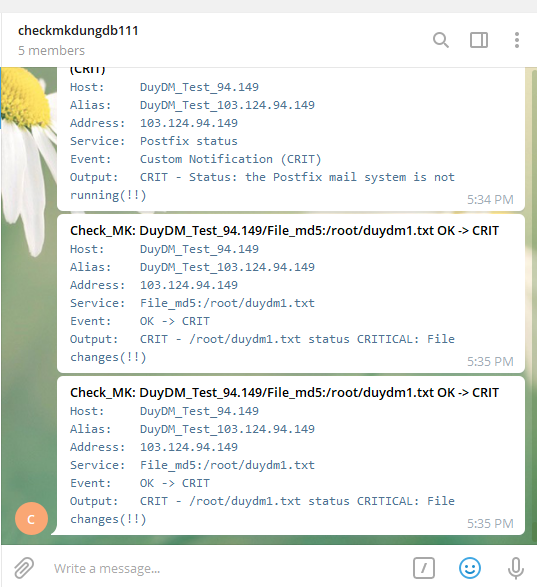

# Ghi chép lại các bước monitoring tự thay đổi của file bởi checkmk

Giám sát sự thay đổi nội dung của một file xem bị thay đổi, sửa, xóa nội dung của file hay không.

### Thao tác cài đặt agent và giám sát client


- Download script check md5 file

```
cd /usr/lib/check_mk_agent/local
wget https://raw.githubusercontent.com/domanhduy/ghichep/master/DuyDM/Check-MK/thuc-hanh/scripts/check_file_md5.py
```

- Chỉnh sửa file script để khai báo, giám sát sự thay đổi của các file cần giám sát

```
cd /usr/lib/check_mk_agent/local
vi check_file_md5.py
```

Khai báo những file cần kiểm tra vào dòng `FILES = []` sử dụng đường dẫn tuyệt đối, giám sát nhiều file thì cú pháp cách nhau dấu phẩy.

```
FILES = ['/root/duydm1.txt', '/etc/passwd']
```


Phân quyền thực thi cho script

```
chmod +x check_file_md5.py
```

- Kiểm tra 

```
check_mk_agent | grep "File_md5"
```

Output như ở dưới là script đã chuẩn.


### Thao tác trên giao diện checkmk

Discovery lại các service trên host sẽ thấy phần giám sát file


Chỉnh sửa file theo dõi cảnh báo xảy ra.





### Tham khảo

https://github.com/niemdinhtrong/thuctapsinh/blob/master/NiemDT/Ghichep_checkmk/docs/13.Huong-dan-su-dung-plugin-check-file-thay-doi.md


