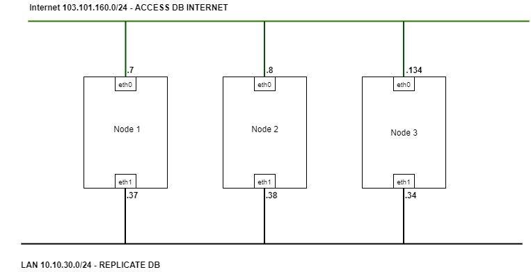
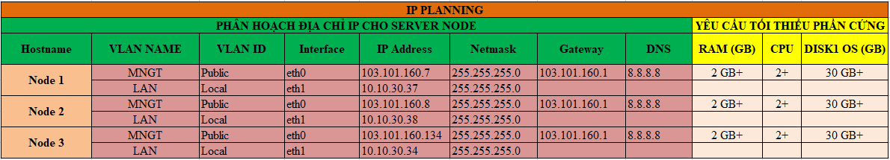
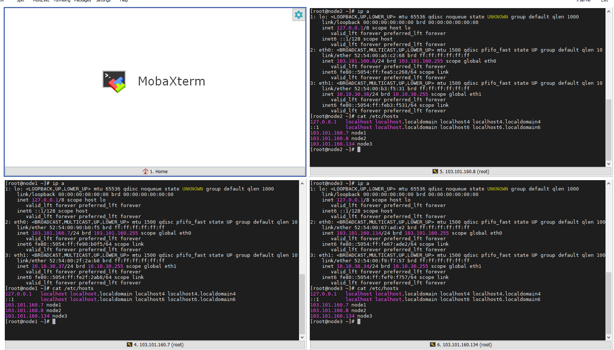
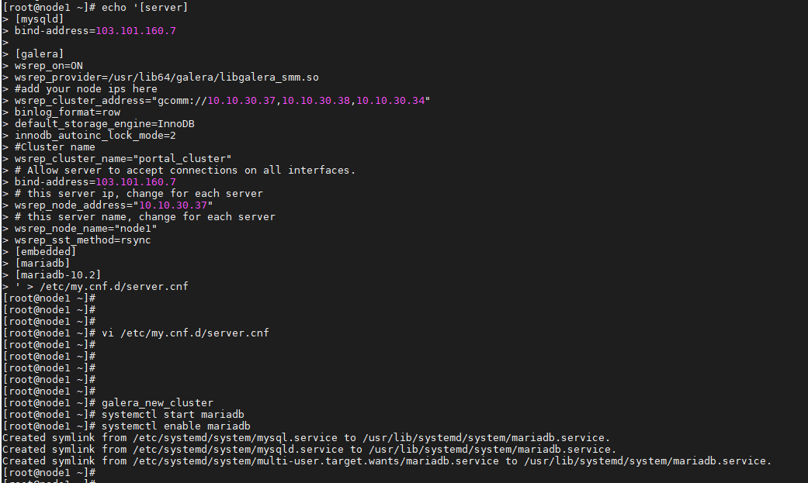
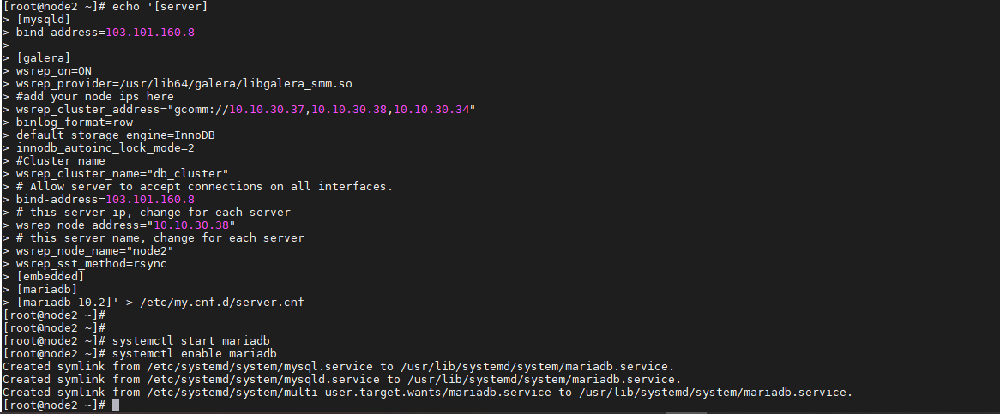
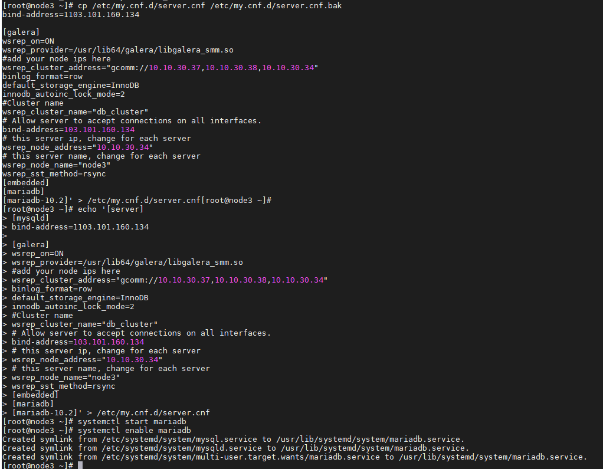
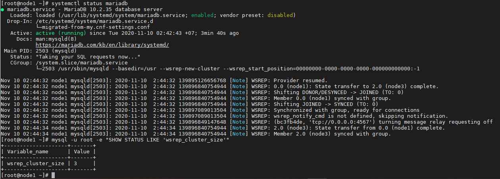

## Ghi chép cài đặt Galera database 3 node CentOS7

### Mục lục

[1. Mô hình](#mohinh)<br>
[2. Quy hoạch IP](#ip)<br>
[3. Chuẩn bị](#chuanbi)<br>
[4. Cài đặt Galera database 3 node CentOS7](#caidat)<br>

<a name="mohinh"></a>
## 1. Mô hình

- Mô hình đấu nối



<a name="ip"></a>
## 2. Quy hoạch IP



<a name="chuanbi"></a>
## 3. Chuẩn bị

Chuẩn bị chung thực hiện trên cả 3 node:

**Thiết lập IP**

```
hostnamectl set-hostname node1
sudo systemctl disable firewalld
sudo systemctl stop firewalld
sudo systemctl disable NetworkManager
sudo systemctl stop NetworkManager
sudo systemctl enable network
sudo systemctl start network
sed -i 's/SELINUX=enforcing/SELINUX=disabled/g' /etc/sysconfig/selinux
sed -i 's/SELINUX=enforcing/SELINUX=disabled/g' /etc/selinux/config
```

```
yum install epel-release -y
yum update -y
```

**Cài đặt NTPD**

```
yum install chrony -y 

systemctl start chronyd 
systemctl enable chronyd
systemctl restart chronyd 

chronyc sources -v
```

```
sudo date -s "$(wget -qSO- --max-redirect=0 google.com 2>&1 | grep Date: | cut -d' ' -f5-8)Z"
ln -f -s /usr/share/zoneinfo/Asia/Ho_Chi_Minh /etc/localtime
```

**CMD log**

```
curl -Lso- https://raw.githubusercontent.com/nhanhoadocs/ghichep-cmdlog/master/cmdlog.sh | bash
```

**Cấu hình host**

```
echo "103.101.160.7 node1" >> /etc/hosts
echo "103.101.160.8 node2" >> /etc/hosts
echo "103.101.160.134 node3" >> /etc/hosts
```



<a name="caidat"></a>
## 4. Cài đặt Galera database 3 node CentOS7

### 4.1. Cài đặt MariaDB 

**Thực hiện trên các node**

- Khai báo repo

```
echo '[mariadb]
name = MariaDB
baseurl = http://yum.mariadb.org/10.2/centos7-amd64
gpgkey=https://yum.mariadb.org/RPM-GPG-KEY-MariaDB
gpgcheck=1' >> /etc/yum.repos.d/MariaDB.repo
yum -y update
```

```
yum install -y mariadb mariadb-server
```

```
yum install -y galera rsync
```

**Lưu ý**: Không khởi động dịch vụ mariadb sau khi cài (Liên quan tới cấu hình Galera Mariadb)

### 4.2. Cấu hình Galera Cluster

- Tại `node 1`

```
cp /etc/my.cnf.d/server.cnf /etc/my.cnf.d/server.cnf.bak

echo '[server]
[mysqld]
bind-address=103.101.160.7

[galera]
wsrep_on=ON
wsrep_provider=/usr/lib64/galera/libgalera_smm.so
#add your node ips here
wsrep_cluster_address="gcomm://10.10.30.37,10.10.30.38,10.10.30.34"
binlog_format=row
default_storage_engine=InnoDB
innodb_autoinc_lock_mode=2
#Cluster name
wsrep_cluster_name="db_cluster"
# Allow server to accept connections on all interfaces.
bind-address=103.101.160.7
# this server ip, change for each server
wsrep_node_address="10.10.30.37"
# this server name, change for each server
wsrep_node_name="node1"
wsrep_sst_method=rsync
[embedded]
[mariadb]
[mariadb-10.2]
' > /etc/my.cnf.d/server.cnf
```

```
wsrep_cluster_address: Danh sách các node thuộc Cluster, sử dụng địa chỉ IP (Bài lab IP Replicate 0.10.30.37,10.10.30.38,10.10.30.34)
wsrep_cluster_name: Tên của cluster
wsrep_node_address: Địa chỉ IP của node đang thực hiện
wsrep_node_name: Tên node (Giống với hostname)
Không được bật mariadb (Quan trọng, nếu không sẽ dẫn tới lỗi khi khởi tạo Cluster)
```

- Tại `node 2`

```
cp /etc/my.cnf.d/server.cnf /etc/my.cnf.d/server.cnf.bak

echo '[server]
[mysqld]
bind-address=103.101.160.8

[galera]
wsrep_on=ON
wsrep_provider=/usr/lib64/galera/libgalera_smm.so
#add your node ips here
wsrep_cluster_address="gcomm://10.10.30.37,10.10.30.38,10.10.30.34"
binlog_format=row
default_storage_engine=InnoDB
innodb_autoinc_lock_mode=2
#Cluster name
wsrep_cluster_name="db_cluster"
# Allow server to accept connections on all interfaces.
bind-address=103.101.160.8
# this server ip, change for each server
wsrep_node_address="10.10.30.38"
# this server name, change for each server
wsrep_node_name="node2"
wsrep_sst_method=rsync
[embedded]
[mariadb]
[mariadb-10.2]' > /etc/my.cnf.d/server.cnf
```

- Tại `node 3`

```
cp /etc/my.cnf.d/server.cnf /etc/my.cnf.d/server.cnf.bak

echo '[server]
[mysqld]
bind-address=1103.101.160.134

[galera]
wsrep_on=ON
wsrep_provider=/usr/lib64/galera/libgalera_smm.so
#add your node ips here
wsrep_cluster_address="gcomm://10.10.30.37,10.10.30.38,10.10.30.34"
binlog_format=row
default_storage_engine=InnoDB
innodb_autoinc_lock_mode=2
#Cluster name
wsrep_cluster_name="db_cluster"
# Allow server to accept connections on all interfaces.
bind-address=103.101.160.134
# this server ip, change for each server
wsrep_node_address="10.10.30.34"
# this server name, change for each server
wsrep_node_name="node3"
wsrep_sst_method=rsync
[embedded]
[mariadb]
[mariadb-10.2]' > /etc/my.cnf.d/server.cnf
```

### 4.3. Khởi động dịch vụ

- Tại `node1`, khởi tạo cluster

```
galera_new_cluster
systemctl start mariadb
systemctl enable mariadb
```



- Tại `node2`, `node3`, chạy dịch vụ mariadb





- Kiểm tra tại `node1`

```
mysql -u root -e "SHOW STATUS LIKE 'wsrep_cluster_size'"
```




