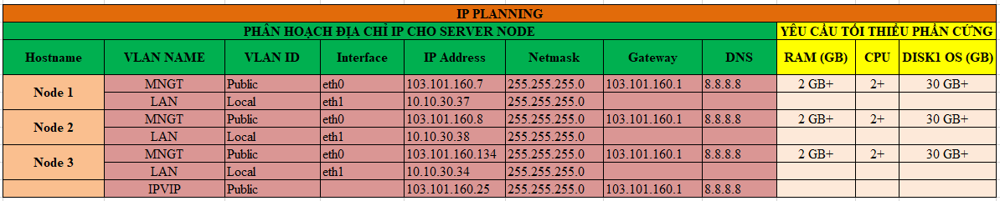

## Ghi chép cài đặt Haproxy Pacemaker cho Cluster Galera 3 node trên CentOS 7 Wordpress

### Mục lục

[1. Mô hình](#mohinh)<br>
[2. Quy hoạch IP](#ip)<br>
[3. Chuẩn bị](#chuanbi)<br>
[4. Cài đặt Galera database 3 node CentOS7 Wordpress](#caidat)<br>

<a name="mohinh"></a>
## 1. Mô hình

- Mô hình đấu nối


- Mô hình hoạt động


<a name="ip"></a>
## 2. Quy hoạch IP



<a name="chuanbi"></a>
## 3. Chuẩn bị

Thực hiện cài đặt chuẩn bị môi trường, galera mariadb theo tài liệu <a href="https://github.com/domanhduy/ghichep/blob/master/DuyDM/Cluster-HA/Cluster/docs/2.Cai-dat-galare-3node-centos7.md" target="_blank">tại đây</a>!


<a name="caidat"></a>
## 4. Cài đặt Galera database 3 node CentOS7 Wordpress

### 4.1. Cài đặt Haproxy bản 1.8

**Thực hiện trên tất cả các node**

- Cài đặt

```
sudo yum install wget socat -y
wget http://cbs.centos.org/kojifiles/packages/haproxy/1.8.1/5.el7/x86_64/haproxy18-1.8.1-5.el7.x86_64.rpm 
yum install haproxy18-1.8.1-5.el7.x86_64.rpm -y
```

```
cp /etc/haproxy/haproxy.cfg /etc/haproxy/haproxy.cfg.bak
```

- Cấu hình Haproxy

```
echo 'global
    log         127.0.0.1 local2
    chroot      /var/lib/haproxy
    pidfile     /var/run/haproxy.pid
    maxconn     4000
    user        haproxy
    group       haproxy
    daemon
    stats socket /var/lib/haproxy/stats
defaults
    mode                    http
    log                     global
    option                  httplog
    option                  dontlognull
    option http-server-close
    option forwardfor       except 127.0.0.0/8
    option                  redispatch
    retries                 3
    timeout http-request    10s
    timeout queue           1m
    timeout connect         10s
    timeout client          1m
    timeout server          1m
    timeout http-keep-alive 10s
    timeout check           10s
    maxconn                 3000

listen stats
    bind :8080
    mode http
    stats enable
    stats uri /stats
    stats realm HAProxy\ Statistics

listen galera
    bind 103.101.160.25:3306
    balance source
    mode tcp
    option tcpka
    option tcplog
    option clitcpka
    option srvtcpka
    timeout client 28801s
    timeout server 28801s
    option mysql-check user haproxy
    server node1 103.101.160.7:3306 check inter 5s fastinter 2s rise 3 fall 3
    server node2 103.101.160.8:3306 check inter 5s fastinter 2s rise 3 fall 3 backup
    server node3 103.101.160.134:3306 check inter 5s fastinter 2s rise 3 fall 3 backup' > /etc/haproxy/haproxy.cfg
```

- Cấu hình Log cho HAProxy

```
sed -i "s/#\$ModLoad imudp/\$ModLoad imudp/g" /etc/rsyslog.conf
sed -i "s/#\$UDPServerRun 514/\$UDPServerRun 514/g" /etc/rsyslog.conf
echo '$UDPServerAddress 127.0.0.1' >> /etc/rsyslog.conf

echo 'local2.*    /var/log/haproxy.log' > /etc/rsyslog.d/haproxy.conf

systemctl restart rsyslog
```

- Bổ sung cấu hình cho phép kernel có thể binding tới IP VIP

```
echo 'net.ipv4.ip_nonlocal_bind = 1' >> /etc/sysctl.conf
```

```
sysctl -p
```

- Tắt dịch vụ HAProxy

```
systemctl stop haproxy
systemctl disable haproxy
```

- Trên `node 1` tạo user `haproxy`, phục vụ plugin health check của HAProxy (option mysql-check user haproxy)

Login mariadb

```
mysql -uroot -p
```


```
CREATE USER 'haproxy'@'node1';
CREATE USER 'haproxy'@'node2';
CREATE USER 'haproxy'@'node3';
CREATE USER 'haproxy'@'%';
```


### 4.2. Cài đặt Cluster Pacemaker

**Bước 1: Cài đặt pacemaker corosync**

**Thực hiện trên tất cả các node**

```
yum -y install pacemaker pcs

systemctl start pcsd 
systemctl enable pcsd
```

Thiết lập mật khẩu user `hacluster`

Nhập chính xác và nhớ mật khẩu user hacluster, đồng bộ mật khẩu trên tất cả các node

**Bước 2: Tạo Cluster**

- Chứng thực cluster (Chỉ thực thiện trên cấu hình trên một node duy nhất, ví dụ sẽ thực hiện trên node1), nhập chính xác tài khoản user `hacluster`.


```
pcs cluster auth node1 node2 node3
```

Kết quả

```
[root@node1 ~]# pcs cluster auth node1 node2 node3
Username: hacluster
Password:
node1: Authorized
node3: Authorized
node2: Authorized
[root@node1 ~]#
```


- Khởi tạo cấu hình cluster ban đầu (thực hiện trên node1)

```
pcs cluster setup --name ha_cluster node1 node2 node3
```

```
ha_cluster: Tên của cluster khởi tạo
node01, node02, node03: Hostname các node thuộc cluster, yêu cầu khai báo trong /etc/host
```


Kết quả

```
[root@node1 ~]# pcs cluster setup --name ha_cluster node1 node2 node3
Destroying cluster on nodes: node1, node2, node3...
node1: Stopping Cluster (pacemaker)...
node2: Stopping Cluster (pacemaker)...
node3: Stopping Cluster (pacemaker)...
node1: Successfully destroyed cluster
node3: Successfully destroyed cluster
node2: Successfully destroyed cluster

Sending 'pacemaker_remote authkey' to 'node1', 'node2', 'node3'
node2: successful distribution of the file 'pacemaker_remote authkey'
node3: successful distribution of the file 'pacemaker_remote authkey'
node1: successful distribution of the file 'pacemaker_remote authkey'
Sending cluster config files to the nodes...
node1: Succeeded
node2: Succeeded
node3: Succeeded

Synchronizing pcsd certificates on nodes node1, node2, node3...
node1: Success
node3: Success
node2: Success
Restarting pcsd on the nodes in order to reload the certificates...
node1: Success
node3: Success
node2: Success
[root@node1 ~]#
```


- Khởi động Cluster

```
pcs cluster start --all
```

Kết quả

```
[root@node1 ~]# pcs cluster start --all
node1: Starting Cluster (corosync)...
node2: Starting Cluster (corosync)...
node3: Starting Cluster (corosync)...
node1: Starting Cluster (pacemaker)...
node3: Starting Cluster (pacemaker)...
node2: Starting Cluster (pacemaker)...
[root@node1 ~]#
```


- Cho phép cluster khởi động cùng OS

```
pcs cluster enable --all 
```

Kết quả

```
[root@node1 ~]# pcs cluster enable --all
node1: Cluster Enabled
node2: Cluster Enabled
node3: Cluster Enabled
[root@node1 ~]#
```


**Bước 3: Thiết lập Cluster (Thực hiện trên 1 node ở bài lab là node 1)**

- Bỏ qua cơ chế STONITH

```
pcs property set stonith-enabled=false
```

- Cho phép Cluster chạy kể cả khi mất quorum.

```
pcs property set no-quorum-policy=ignore
```

- Hạn chế Resource trong cluster chuyển node sau khi Cluster khởi động lại.

```
pcs property set default-resource-stickiness="INFINITY"
```

- Kiểm tra thiết lập cluster

```
pcs property list
```

Kết quả

```
[root@node1 ~]# pcs property list
Cluster Properties:
 cluster-infrastructure: corosync
 cluster-name: ha_cluster
 dc-version: 1.1.21-4.el7-f14e36fd43
 default-resource-stickiness: INFINITY
 have-watchdog: false
 no-quorum-policy: ignore
 stonith-enabled: false
[root@node1 ~]#
```


- Tạo Resource IP VIP Cluster

```
pcs resource create Virtual_IP ocf:heartbeat:IPaddr2 ip=103.101.160.25 cidr_netmask=24 op monitor interval=30s
```

- Tạo Resource quản trị dịch vụ HAProxy

```
pcs resource create Loadbalancer_HaProxy systemd:haproxy op monitor timeout="5s" interval="5s"
```

- Ràng buộc thứ tự khởi động dịch vụ, khởi động dịch vụ Virtual_IP sau đó khởi động dịch vụ Loadbalancer_HaProxy

```
pcs constraint order start Virtual_IP then Loadbalancer_HaProxy kind=Optional
```

- Ràng buộc resource Virtual_IP phải khởi động cùng node với resource Loadbalancer_HaProxy

```
pcs constraint colocation add Virtual_IP Loadbalancer_HaProxy INFINITY
```

- Kiểm tra trạng thái Cluster

```
pcs status
```


```
[root@node1 ~]# pcs status
Cluster name: ha_cluster
Stack: corosync
Current DC: node1 (version 1.1.21-4.el7-f14e36fd43) - partition with quorum
Last updated: Tue Nov 10 09:07:41 2020
Last change: Tue Nov 10 09:07:19 2020 by root via cibadmin on node1

3 nodes configured
2 resources configured

Online: [ node1 node2 node3 ]

Full list of resources:

 Virtual_IP     (ocf::heartbeat:IPaddr2):       Started node2
 Loadbalancer_HaProxy   (systemd:haproxy):      Started node2

Daemon Status:
  corosync: active/enabled
  pacemaker: active/enabled
  pcsd: active/enabled
```

- Kiểm tra cấu hình Resource

```
pcs resource show --full
```

```
[root@node1 ~]# pcs resource show --full
 Resource: Virtual_IP (class=ocf provider=heartbeat type=IPaddr2)
  Attributes: cidr_netmask=24 ip=103.101.160.25
  Operations: monitor interval=30s (Virtual_IP-monitor-interval-30s)
              start interval=0s timeout=20s (Virtual_IP-start-interval-0s)
              stop interval=0s timeout=20s (Virtual_IP-stop-interval-0s)
 Resource: Loadbalancer_HaProxy (class=systemd type=haproxy)
  Operations: monitor interval=5s timeout=5s (Loadbalancer_HaProxy-monitor-interval-5s)
              start interval=0s timeout=100 (Loadbalancer_HaProxy-start-interval-0s)
              stop interval=0s timeout=100 (Loadbalancer_HaProxy-stop-interval-0s)
[root@node1 ~]#
```

- Kiểm tra ràng buộc trên resource

```
pcs constraint
```

```
[root@node1 ~]#  pcs constraint
Location Constraints:
Ordering Constraints:
  start Virtual_IP then start Loadbalancer_HaProxy (kind:Optional)
Colocation Constraints:
  Virtual_IP with Loadbalancer_HaProxy (score:INFINITY)
Ticket Constraints:
[root@node1 ~]#
```

### 4.3. Kiểm tra

- Kiểm tra trạng thái dịch vụ

```
http://IP_VIP:8080/stats
```

```
http://103.101.160.25:8080/stats
```


Kết nối tới database MariaDB thông qua IP VIP

```
mysql -h 103.101.160.25 -u haproxy -p
```


- Tắt node 2 node chứa `Virtual_IP`, `Loadbalancer_HaProxy`

Kiểm tra trạng thái Cluster, `node2` đã bị tắt. Dịch vụ `Virtual_IP` và `Loadbalancer_HaProxy` được chuyển sang `node1` tự động.


Tại thời điểm node2 bị tắt, Pacemaker Cluster sẽ tự đánh giá, di chuyển các dịch vụ Virtual_IP và Loadbalancer_HaProxy sang node đang sẵn sàng trong Cluster, duy trì dịch vụ luôn hoạt động dù cho 1 node trong cluster gặp sự cố. Đồng thời, Cluster Galera sẽ vẫn hoạt động bình thường dù 1 node trong cluster xảy ra sự cố.


- Tắt tiếp node 1 (lúc này hệ thống chỉ có duy nhất node3 đang chạy).


