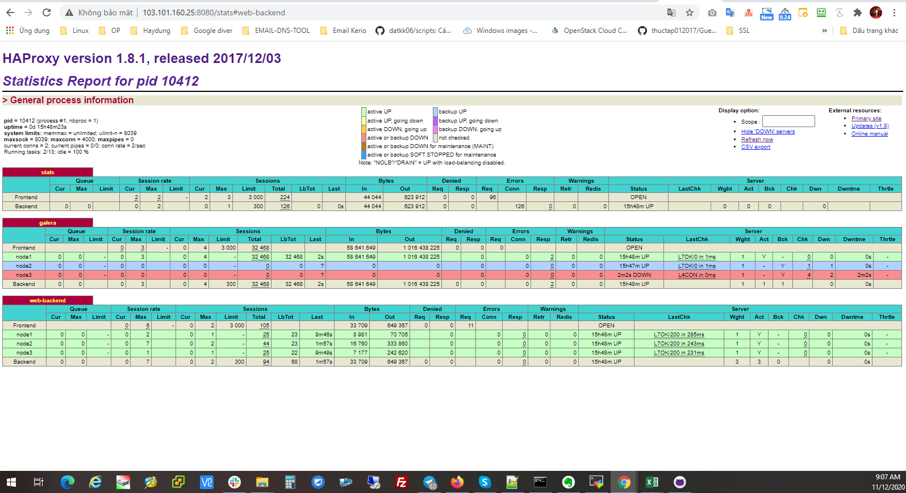

## Ghi chép vận hành, xử lý sự cố galera mariadb


### Mục lục

[1. Chuẩn bị môi trường](#moitruong)<br>
[2. Xử lý sự cố](#suco)<br>
[3. Vận hành](#vanhanh)<br>

<a name="moitruong"></a>
## 1. Chuẩn bị môi trường

Sử dụng tiếp kết quả và mô hình của bài cài đặt về pacemaker - haproxy - galera mariadb để test các case vận hành với mariadb.

Triển khai pacemaker - haproxy - galera mariadb <a href="https://github.com/domanhduy/ghichep/blob/master/DuyDM/Cluster-HA/Cluster/docs/3.Cai-dat-haproxy-pamaker-cluster-galare-3-node-wp.md" target="_blank">tại đây</a>!

**Định nghĩa về sự cố**

Trường hợp xảy ra sự cố có 2 kiểu:

`An toàn`: Tức dịch vụ tắt bình thường `systemctl stop mariadb`

`Không an toàn`: Khi tiến trình bị crash, os xảy ra vấn đề, mất điện ....

<a name="suco"></a>
## 2. Xử lý sự cố

### 2.1. Trường hợp 1: 1 node xảy ra vấn đề

Mô hình triển khai có 3 node về mặt lý thuyết 1 node down thì cụm vẫn hoạt động bình thường.

**Down 1 node an toàn**

- Sự cố

```
systemctl stop mariadb
```





- Xử lý

Start lại tiến trình database, dịch vụ hoạt động bình thường

```
systemctl start mariadb
```


**Down 1 không an toàn init 0**

- Sự cố

```
init 0
```


- Xử lý

Khởi động lại OS và tiến trình database, dịch vụ hoạt động bình thường


**Down 1 không an toàn kiểu mất điện tắt nóng server**

- Sự cố

Mất điện server


- Xử lý

Khởi động lại OS và tiến trình database, dịch vụ hoạt động bình thường


### 2.2. Trường hợp 2: 2 node xảy ra vấn đề

**Down 2 node an toàn lần lượt**

- Sự cố

Stop node 1 -> node 2

```
systemctl stop mariadb
```


- Xử lý

Start tiến trình database, dịch vụ hoạt động bình thường


```
systemctl start mariadb
```

Stop node 2 -> node 1 (tắt sau thì bật trước).


**Down 2 không an toàn init 0**

- Sự cố

```
init 0
```


- Xử lý

Khởi động lại OS ở các node và tiến trình database, dịch vụ hoạt động bình thường


**Down 2 không an toàn kiểu mất điện tắt nóng server**

- Sự cố


Database bị phân mảnh -> 


Xác định trạng thái `split brain` cluster đang có vấn đề.

Login mysql

```
mysql -u root -p
```

```
SHOW STATUS LIKE 'wsrep%';
```

Xem các tham số `wsrep_cluster_status          | non-Primary `, `wsrep_local_state_comment     | Initialized`, ` wsrep_ready                   | OFF` dấu hiệu của cluster đang có vấn đề.


Xem log mariadb sẽ báo `timed out`, `connection to peer`

```
2020-11-12 11:26:55 139828347782912 [Note] WSREP: New COMPONENT: primary = no, bootstrap = no, my_idx = 0, memb_num = 1
2020-11-12 11:26:55 139828347782912 [Note] WSREP: Flow-control interval: [16, 16]
2020-11-12 11:26:55 139828347782912 [Note] WSREP: Received NON-PRIMARY.
2020-11-12 11:26:55 139828347782912 [Note] WSREP: Shifting SYNCED -> OPEN (TO: 510)
2020-11-12 11:26:55 139828347782912 [Note] WSREP: New COMPONENT: primary = no, bootstrap = no, my_idx = 0, memb_num = 1
2020-11-12 11:26:55 139828347782912 [Note] WSREP: Flow-control interval: [16, 16]
2020-11-12 11:26:55 139828347782912 [Note] WSREP: Received NON-PRIMARY.
2020-11-12 11:26:55 139828569024256 [Note] WSREP: New cluster view: global state: bc40f3b7-22c3-11eb-a2d6-f21ad702ac27:510, view# -1: non-Primary, number of nodes: 1, my index: 0, protocol version 3
2020-11-12 11:26:55 139828569024256 [Note] WSREP: wsrep_notify_cmd is not defined, skipping notification.
2020-11-12 11:26:55 139828569024256 [Note] WSREP: New cluster view: global state: bc40f3b7-22c3-11eb-a2d6-f21ad702ac27:510, view# -1: non-Primary, number of nodes: 1, my index: 0, protocol version 3
2020-11-12 11:26:55 139828569024256 [Note] WSREP: wsrep_notify_cmd is not defined, skipping notification.
2020-11-12 11:26:56 139828356175616 [Note] WSREP: (ef3bfb74, 'tcp://0.0.0.0:4567') connection to peer 00000000 with addr tcp://10.10.30.34:4567 timed out, no messages seen in PT3S, socket stats: rtt: 0 rttvar: 250000 rto: 2000000 lost: 1 last_data_recv: 4294838773 cwnd: 1 last_queued_since: 171477632045 last_delivered_since: 171477632045 send_queue_length: 0 send_queue_bytes: 0
2020-11-12 11:26:59 139828356175616 [Note] WSREP: (ef3bfb74, 'tcp://0.0.0.0:4567') connection to peer 00000000 with addr tcp://10.10.30.38:4567 timed out, no messages seen in PT3S, socket stats: rtt: 0 rttvar: 250000 rto: 2000000 lost: 1 last_data_recv: 4294841774 cwnd: 1 last_queued_since: 174478275622 last_delivered_since: 174478275622 send_queue_length: 0 send_queue_bytes: 0
2020-11-12 11:27:00 139828356175616 [Note] WSREP: (ef3bfb74, 'tcp://0.0.0.0:4567') connection to peer 00000000 with addr tcp://10.10.30.34:4567 timed out, no messages seen in PT3S, socket stats: rtt: 0 rttvar: 250000 rto: 2000000 lost: 1 last_data_recv: 4294842774 cwnd: 1 last_queued_since: 175478502338 last_delivered_since: 175478502338 send_queue_length: 0 send_queue_bytes: 0
2020-11-12 11:27:03 139828356175616 [Note] WSREP: (ef3bfb74, 'tcp://0.0.0.0:4567') connection to peer 00000000 with addr tcp://10.10.30.38:4567 timed out, no messages seen in PT3S, socket stats: rtt: 0 rttvar: 250000 rto: 2000000 lost: 1 last_data_recv: 4294845775 cwnd: 1 last_queued_since: 178479359365 last_delivered_since: 178479359365 send_queue_length: 0 send_queue_bytes: 0
2020-11-12 11:27:04 139828356175616 [Note] WSREP: (ef3bfb74, 'tcp://0.0.0.0:4567') connection to peer 00000000 with addr tcp://10.10.30.34:4567 timed out, no messages seen in PT3S, socket stats: rtt: 0 rttvar: 250000 rto: 2000000 lost: 1 last_data_recv: 4294846775 cwnd: 1 last_queued_since: 179479624152 last_delivered_since: 179479624152 send_queue_length: 0 send_queue_bytes: 0
2020-11-12 11:27:08 139828356175616 [Note] WSREP: (ef3bfb74, 'tcp://0.0.0.0:4567') connection to peer 00000000 with addr tcp://10.10.30.38:4567 timed out, no messages seen in PT3S, socket stats: rtt: 0 rttvar: 250000 rto: 4000000 lost: 1 last_data_recv: 4294850276 cwnd: 1 last_queued_since: 182980411567 last_delivered_since: 182980411567 send_queue_length: 0 send_queue_bytes: 0
2020-11-12 11:27:09 139828356175616 [Note] WSREP: (ef3bfb74, 'tcp://0.0.0.0:4567') connection to peer 00000000 with addr tcp://10.10.30.34:4567 timed out, no messages seen in PT3S, socket stats: rtt: 0 rttvar: 250000 rto: 2000000 lost: 1 last_data_recv: 4294851276 cwnd: 1 last_queued_since: 183980716187 last_delivered_since: 183980716187 send_queue_length: 0 send_queue_bytes: 0
2020-11-12 11:27:12 139828356175616 [Note] WSREP: (ef3bfb74, 'tcp://0.0.0.0:4567') connection to peer 00000000 with addr tcp://10.10.30.38:4567 timed out, no messages seen in PT3S, socket stats: rtt: 0 rttvar: 250000 rto: 2000000 lost: 1 last_data_recv: 4294854277 cwnd: 1 last_queued_since: 186981650821 last_delivered_since: 186981650821 send_queue_length: 0 send_queue_bytes: 0
2020-11-12 11:27:13 139828356175616 [Note] WSREP: (ef3bfb74, 'tcp://0.0.0.0:4567') connection to peer 00000000 with addr tcp://10.10.30.34:4567 timed out, no messages seen in PT3S, socket stats: rtt: 0 rttvar: 250000 rto: 2000000 lost: 1 last_data_recv: 4294855277 cwnd: 1 last_queued_since: 187981889615 last_delivered_since: 187981889615 send_queue_length: 0 send_queue_bytes: 0
2020-11-12 11:27:17 139828356175616 [Note] WSREP: (ef3bfb74, 'tcp://0.0.0.0:4567') connection to peer 00000000 with addr tcp://10.10.30.34:4567 timed out, no messages seen in PT3S, socket stats: rtt: 0 rttvar: 250000 rto: 2000000 lost: 1 last_data_recv: 4294859278 cwnd: 1 last_queued_since: 191982931438 last_delivered_since: 191982931438 send_queue_length: 0 send_queue_bytes: 0
2020-11-12 11:28:29 139828356175616 [Note] WSREP: (ef3bfb74, 'tcp://0.0.0.0:4567') reconnecting to d58d8245 (tcp://10.10.30.38:4567), attempt 30
2020-11-12 11:28:31 139828356175616 [Note] WSREP: (ef3bfb74, 'tcp://0.0.0.0:4567') reconnecting to 00ef0daa (tcp://10.10.30.34:4567), attempt 30
2020-11-12 11:29:59 139828356175616 [Note] WSREP: (ef3bfb74, 'tcp://0.0.0.0:4567') reconnecting to d58d8245 (tcp://10.10.30.38:4567), attempt 60
2020-11-12 11:30:01 139828356175616 [Note] WSREP: (ef3bfb74, 'tcp://0.0.0.0:4567') reconnecting to 00ef0daa (tcp://10.10.30.34:4567), attempt 60
```


```
curl 10.10.30.37
```
Báo `Error establishing a database connection`


**Nguyên nhân của sự cố**: Database bị phân mảnh sự trên các dấu hiệu trên -> Dẫn tới web không connect được tới database -> Haproxy check sẽ báo lỗi 503 nên dẫn tới `web-backend` httpd cũng báo đỏ.


- Xử lý

Khôi phục lại database -> `web-backend` httpd báo xanh.

Bước 1: Chắc chắn tắt hẳn 2 node trong trạng thái lỗi.

Bước 2: Tại node không lỗi thực hiện

```
mysql -u root -e "SET GLOBAL wsrep_provider_options='pc.bootstrap=1';"
```

Nếu database của bạn báo `Access denied for user 'root'@'localhost' (using password: NO)` -> Login  mysql và thực hiện tiếp

```
mysql -u root -p
SET GLOBAL wsrep_provider_options='pc.bootstrap=1';
SHOW STATUS LIKE 'wsrep_cluster_size';
```

```
[root@node1 ~]# mysql -u root -p
Welcome to the MariaDB monitor.  Commands end with ; or \g.
Your MariaDB connection id is 3303
Server version: 10.2.35-MariaDB-log MariaDB Server

Copyright (c) 2000, 2018, Oracle, MariaDB Corporation Ab and others.

Type 'help;' or '\h' for help. Type '\c' to clear the current input statement.

MariaDB [(none)]> SET GLOBAL wsrep_provider_options='pc.bootstrap=1';
Query OK, 0 rows affected (0.01 sec)

MariaDB [(none)]> SHOW STATUS LIKE 'wsrep_cluster_size';
+--------------------+-------+
| Variable_name      | Value |
+--------------------+-------+
| wsrep_cluster_size | 1     |
+--------------------+-------+
1 row in set (0.01 sec)

MariaDB [(none)]>exit;
Bye
```


Sau 2 bước trên cluster sẽ hoạt động trở lại. Quá cluster database hoạt động bình thường -> web connect được tới database -> Haproxy check có phản hồi nên dẫn tới `web-backend` httpd sẽ xanh trở lại.


Xem các tham số `wsrep_cluster_status          | Primary `, `wsrep_local_state_comment     | Synced`, ` wsrep_ready                   | ON` cluster đã hoạt động trở lại.

Haproxy check phản hồi về `200` 


Các node đang xảy ra sự cố bật lại bình thường, dịch vụ mariadb tại các node lỗi sẽ tự join lại Cluster


### 2.3. Trường hợp 3: 3 node xảy ra vấn đề

**Down 3 node an toàn**

- Sự cố

Stop node 1 -> node 2 -> node 3

```
systemctl stop mariadb
```


- Xử lý

Start lần lượt database ở các node sẽ báo lỗi do cluster đã bị chết.

```
systemctl start mariadb
```


Kiểm tra giá trị seqno trong file `grastate.dat`. Node có giá trị `lớn nhất` sẽ là node khởi tạo lại cluster.

```
[root@node1 ~]# cat /var/lib/mysql/grastate.dat
# GALERA saved state
version: 2.1
uuid:    bc40f3b7-22c3-11eb-a2d6-f21ad702ac27
seqno:   -1
safe_to_bootstrap: 0
 [root@node1 ~]#


[root@node2 ~]# cat /var/lib/mysql/grastate.dat
# GALERA saved state
version: 2.1
uuid:    bc40f3b7-22c3-11eb-a2d6-f21ad702ac27
seqno:   -1
safe_to_bootstrap: 0
 [root@node2 ~]#


[root@node3 ~]# cat /var/lib/mysql/grastate.dat
# GALERA saved state
version: 2.1
uuid:    bc40f3b7-22c3-11eb-a2d6-f21ad702ac27
seqno:   -1
safe_to_bootstrap: 1
 [root@node3 ~]#
```

Trong bài lab database chưa có sự đọc ghi dữ liệu nên `seqno = -1` giống nhau ở các node. Tìm node có `seqno lớn nhất` để khởi tạo lại cluster.

Để khởi tạo lại cluster, thay đổi giá trị `safe_to_bootstrap` bằng `1` và chạy câu lệnh `galera_new_cluster`. Sau khi chạy câu lệnh `galera_new_cluster` cluster sẽ khởi tạo trở lại.

```
vi /var/lib/mysql/grastate.dat

sửa safe_to_bootstrap: 0 -> safe_to_bootstrap: 1
```


```
galera_new_cluster
```


Start lại service 2 node còn lại theo cách thông thường.


Kiểm tra Cluster

```
SHOW STATUS LIKE 'wsrep_cluster_size';
```


**Down 3 không an toàn init 0**

- Sự cố

```
init 0
```


- Xử lý

Trong trường hợp tốt này trạng thái database sẽ được lưu lại, khi các node hoạt động trở lại Cluster sẽ tự khôi phục.

Trong trường hợp xấu cụm không thể khởi động lại, lần vết cụm down sau cùng (tốt nhất) hoặc chọn 1 node bất kỳ thực hiện, sẽ có rủi ro mất mát dữ liệu. 

Sau khi bật cả 3 node lần lượt lên (node tắt sau cùng trước).


```
2020-11-12 20:20:08 140593789102272 [Warning] WSREP: last inactive check more than PT1.5S ago (PT3.50388S), skipping check
2020-11-12 20:20:38 140593789102272 [Note] WSREP: view((empty))
2020-11-12 20:20:38 140593789102272 [ERROR] WSREP: failed to open gcomm backend connection: 110: failed to reach primary view: 110 (Connection timed out)
         at gcomm/src/pc.cpp:connect():160
2020-11-12 20:20:38 140593789102272 [ERROR] WSREP: gcs/src/gcs_core.cpp:gcs_core_open():209: Failed to open backend connection: -110 (Connection timed out)
2020-11-12 20:20:38 140593789102272 [ERROR] WSREP: gcs/src/gcs.cpp:gcs_open():1475: Failed to open channel 'db_cluster' at 'gcomm://10.10.30.37,10.10.30.38,10.10.30.34': -110 (Connection timed out)
2020-11-12 20:20:38 140593789102272 [ERROR] WSREP: gcs connect failed: Connection timed out
2020-11-12 20:20:38 140593789102272 [ERROR] WSREP: wsrep::connect(gcomm://10.10.30.37,10.10.30.38,10.10.30.34) failed: 7
2020-11-12 20:20:38 140593789102272 [ERROR] Aborting
```

Làm theo các bước `Down 3 node an toàn` ở trên.


**Down 3 không an toàn kiểu mất điện tắt nóng server**

- Sự cố

Thực hiện force off trên cả 3 node.


- Xử lý

Trong trường hợp tốt này trạng thái database sẽ được lưu lại, khi các node hoạt động trở lại Cluster sẽ tự khôi phục.

Trong trường hợp xấu cụm không thể khởi động lại, lần vết cụm down sau cùng (tốt nhất) hoặc chọn 1 node bất kỳ thực hiện, sẽ có rủi ro mất mát dữ liệu. 

Sau khi bật cả 3 node lần lượt lên (node tắt sau cùng trước).


Làm theo các bước `Down 3 node an toàn` ở trên nếu không được thực hiện như ở dưới.


Thực hiện trên tất cả các node

```
pkill -KILL -u mysql
systemctl stop mariadb
```

Thực hiện trên một node

```
vi /var/lib/mysql/grastate.dat

sửa safe_to_bootstrap: 0 -> safe_to_bootstrap: 1
```

```
[root@node3 ~]# cat /var/lib/mysql/grastate.dat
# GALERA saved state
version: 2.1
uuid:    bc40f3b7-22c3-11eb-a2d6-f21ad702ac27
seqno:   -1
safe_to_bootstrap: 1

[root@node3 ~]#
```

Tắt dịch vụ mariadb, khôi phục cluster

```
systemctl stop mariadb
galera_recovery
galera_new_cluster
```


Các node còn lại khởi động lại dịch vụ như bình thường

```
systemctl restart mariadb
```


### 2.4. Trường hợp 4: Khởi động lại Cluster

Trong trường hợp khởi động cluster (restart OS), cluster không hoạt động.

Trong trường hợp xấu cụm không thể khởi động lại, lần vết cụm down sau cùng (tốt nhất, ít rủi ro mất mát dữ liệu) hoặc chọn 1 node bất kỳ thực hiện(sẽ có rủi ro mất mát dữ liệu):

```
vi /var/lib/mysql/grastate.dat

sửa safe_to_bootstrap: 0 -> safe_to_bootstrap: 1
```

```
[root@node3 ~]# cat /var/lib/mysql/grastate.dat
# GALERA saved state
version: 2.1
uuid:    bc40f3b7-22c3-11eb-a2d6-f21ad702ac27
seqno:   -1
safe_to_bootstrap: 1

[root@node3 ~]#
```

Tắt dịch vụ mariadb, khôi phục cluster

```
systemctl stop mariadb
galera_recovery
galera_new_cluster
```

Kiểm tra dịch vụ

```
[root@node3 ~]# systemctl status mariadb
● mariadb.service - MariaDB 10.2.35 database server
   Loaded: loaded (/usr/lib/systemd/system/mariadb.service; enabled; vendor preset: disabled)
  Drop-In: /etc/systemd/system/mariadb.service.d
           └─migrated-from-my.cnf-settings.conf
   Active: active (running) since Thu 2020-11-12 20:48:15 +07; 9s ago
     Docs: man:mysqld(8)
           https://mariadb.com/kb/en/library/systemd/
  Process: 1920 ExecStartPost=/bin/sh -c systemctl unset-environment _WSREP_START_POSITION (code=exited, status=0/SUCCESS)
  Process: 1782 ExecStartPre=/bin/sh -c [ ! -e /usr/bin/galera_recovery ] && VAR= ||   VAR=`cd /usr/bin/..; /usr/bin/galera_recovery`; [ $? -eq 0 ]   && systemctl set-environment _WSREP_START_POSITION=$VAR || exit 1 (code=exited, status=0/SUCCESS)
  Process: 1780 ExecStartPre=/bin/sh -c systemctl unset-environment _WSREP_START_POSITION (code=exited, status=0/SUCCESS)
 Main PID: 1882 (mysqld)
   Status: "Taking your SQL requests now..."
   CGroup: /system.slice/mariadb.service
           └─1882 /usr/sbin/mysqld --basedir=/usr --wsrep-new-cluster --wsrep_start_position=bc4...

Nov 12 20:48:13 node3 systemd[1]: Starting MariaDB 10.2.35 database server...
Nov 12 20:48:15 node3 sh[1782]: WSREP: Recovered position bc40f3b7-22c3-11eb-a2d6-f21ad702ac27:572
Nov 12 20:48:15 node3 mysqld[1882]: 2020-11-12 20:48:15 139642644900032 [Note] /usr/sbin/mys... ...
Nov 12 20:48:15 node3 mysqld[1882]: 2020-11-12 20:48:15 139642644900032 [Warning] Could not ...186)
Nov 12 20:48:15 node3 systemd[1]: Started MariaDB 10.2.35 database server.
Hint: Some lines were ellipsized, use -l to show in full.
[root@node3 ~]#
```

Các node còn lại khởi động lại dịch vụ như bình thường.

```
systemctl restart mariadb
```

<a name="vanhanh"></a>
## 3. Vận hành

### 3.1. Bổ sung thêm node vào cluster galera mariadb

**Bước 1:** Cài đặt một node mới với đấu nối tương tự mô hình. Trong bài lab này bổ sung thêm 1 node mới với thông tin IP:

```
IP Public: 103.101.160.105
IP Local: 10.10.30.35
```

Cài đặt cơ bản: IP, time, selinux, cmdlog, ...

**Bước 2:** Bổ sung vào file host ở node cũ và node mới

```
10.10.30.37 node1
10.10.30.38 node2
10.10.30.34 node3
10.10.30.35 node4
```

**Bước 3:** Cài đặt MariaDB trên node4 mới

```
echo '[mariadb]
name = MariaDB
baseurl = http://yum.mariadb.org/10.2/centos7-amd64
gpgkey=https://yum.mariadb.org/RPM-GPG-KEY-MariaDB
gpgcheck=1' >> /etc/yum.repos.d/MariaDB.repo
yum -y update
```

```
yum install -y mariadb mariadb-server
```

```
yum install -y galera rsync
```

```
systemctl stop mariadb
```

**Lưu ý**: Không khởi động dịch vụ mariadb sau khi cài (Liên quan tới cấu hình Galera Mariadb)

**Bước 4:** Cấu hình Galera Cluster trên node4


```
echo '[server]
[mysqld]
bind-address=10.10.30.35

[galera]
wsrep_on=ON
wsrep_provider=/usr/lib64/galera/libgalera_smm.so
#add your node ips here
wsrep_cluster_address="gcomm://10.10.30.37,10.10.30.38,10.10.30.34,10.10.30.35"
binlog_format=row
default_storage_engine=InnoDB
innodb_autoinc_lock_mode=2
#Cluster name
wsrep_cluster_name="db_cluster"
# Allow server to accept connections on all interfaces.
bind-address=10.10.30.35
# this server ip, change for each server
wsrep_node_address="10.10.30.35"
# this server name, change for each server
wsrep_node_name="node4"
wsrep_sst_method=rsync
[embedded]
[mariadb]
[mariadb-10.2]
' > /etc/my.cnf.d/server.cnf
```

Lưu ý: `wsrep_cluster_address` đầy đủ IP các node

```
systemctl restart mariadb
```

```
[root@node4 ~]# mysql -u haproxy -e "SHOW STATUS LIKE 'wsrep_incoming_addresses'"
+--------------------------+---------------------------------------------------------------------+
| Variable_name            | Value                                                               |
+--------------------------+---------------------------------------------------------------------+
| wsrep_incoming_addresses | 10.10.30.35:3306,10.10.30.34:3306,10.10.30.38:3306,10.10.30.37:3306 |
+--------------------------+---------------------------------------------------------------------+
[root@node4 ~]#
```


**Bước 4:** Thay đổi config trên các node cũ node1, node2, node3

Thay đổi settings `wsrep_cluster_address`, điền đẩy đủ IP các node thuộc cluser hiện tại (bổ sung IP node mới), sau đó restart mariadb ở từng node.

Lúc này đã join thêm được 1 node db vào cluser.


**Bước 4:** Bổ sung

Muốn `haproxy` quản lý được thì phải cấu hình thêm trong `haproxy` ở các node cũ và cài đặt cấu hình haproxy ở node mới.


### 3.2. Thay thế một node trong cluster galera mariadb

Giả sử trường hợp 1 server chạy trong cluster galera mariadb bị hỏng không thể bật server lên được nữa. Sẽ tiến hành thay thế bổ sung vào 1 node khác với IP tương tự.

**Bước 1**: Tắt hẳn server cũ

**Bước 2**: Chuẩn bị node mới sẽ sử dụng IP của node cũ.


**Bước 3**: Cài đặt mariadb

```
echo '[mariadb]
name = MariaDB
baseurl = http://yum.mariadb.org/10.2/centos7-amd64
gpgkey=https://yum.mariadb.org/RPM-GPG-KEY-MariaDB
gpgcheck=1' >> /etc/yum.repos.d/MariaDB.repo
yum -y update
```

```
yum install -y mariadb mariadb-server
```

```
yum install -y galera rsync
```

```
systemctl stop mariadb
```

**Lưu ý**: Không khởi động dịch vụ mariadb sau khi cài (Liên quan tới cấu hình Galera Mariadb)

**Bước 4:** Cấu hình Galera Cluster trên node4


```
echo '[server]
[mysqld]
bind-address=10.10.30.34

[galera]
wsrep_on=ON
wsrep_provider=/usr/lib64/galera/libgalera_smm.so
#add your node ips here
wsrep_cluster_address="gcomm://10.10.30.37,10.10.30.38,10.10.30.34"
binlog_format=row
default_storage_engine=InnoDB
innodb_autoinc_lock_mode=2
#Cluster name
wsrep_cluster_name="db_cluster"
# Allow server to accept connections on all interfaces.
bind-address=10.10.30.34
# this server ip, change for each server
wsrep_node_address="10.10.30.34"
# this server name, change for each server
wsrep_node_name="node4"
wsrep_sst_method=rsync
[embedded]
[mariadb]
[mariadb-10.2]
' > /etc/my.cnf.d/server.cnf
```

Lưu ý: `wsrep_cluster_address` đầy đủ IP các node

```
systemctl restart mariadb
```

**Kiểm tra**: 

```
mysql -u haproxy -e "SHOW STATUS LIKE 'wsrep_incoming_addresses'"
```


