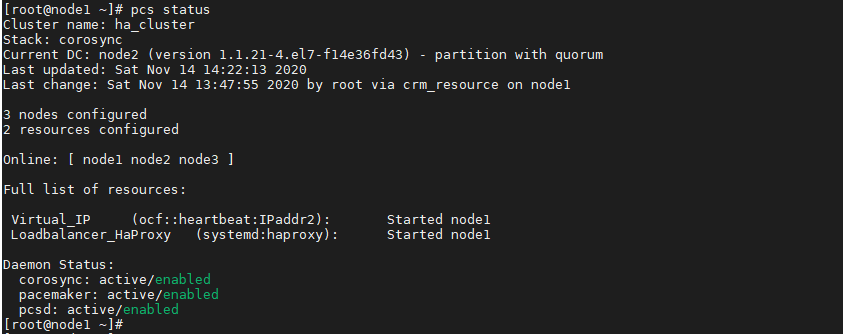
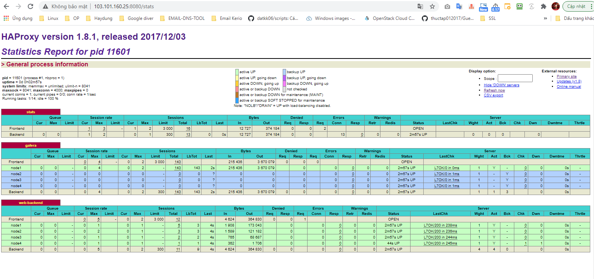
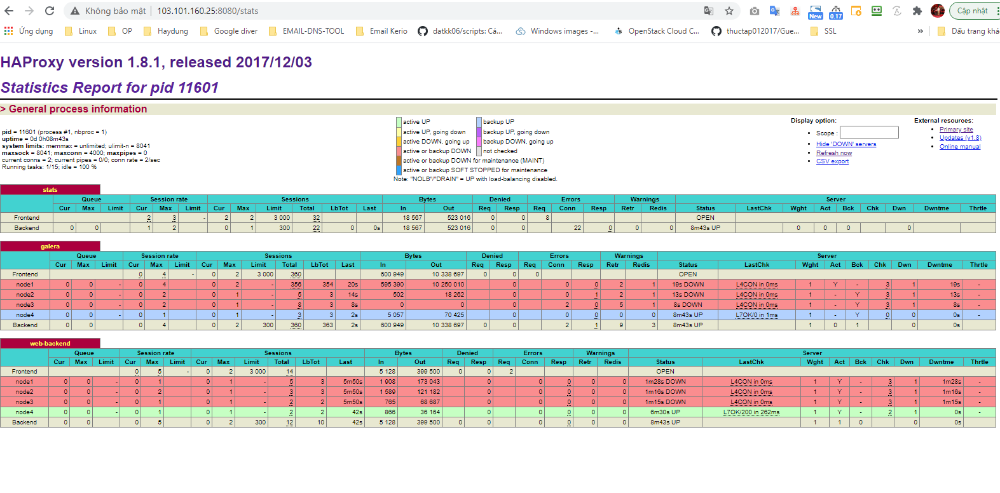

## Ghi chép vận hành, xử lý sự cố pacemaker corosync


### Mục lục

[1. Chuẩn bị môi trường](#moitruong)<br>
[2. Vận hành](#vanhanh)<br>

<a name="moitruong"></a>
## 1. Chuẩn bị môi trường

Sử dụng tiếp kết quả và mô hình của bài cài đặt về pacemaker - haproxy - galera mariadb để test các case vận hành với pacemaker corosync.

Triển khai pacemaker - haproxy - galera mariadb <a href="https://github.com/domanhduy/ghichep/blob/master/DuyDM/Cluster-HA/Cluster/docs/3.Cai-dat-haproxy-pamaker-cluster-galare-3-node-wp.md" target="_blank">tại đây</a>!



<a name="vanhanh"></a>
## 2. Vận hành

###2.1. PCS command line

- Ngừng hoạt động trên 1 node

```
pcs cluster stop <node ..>
```

- Ngừng hoạt động cả cluster

```
pcs cluster stop --all
```

- Không cho phép node khởi động cùng OS

```
pcs cluster disable <node ..>
```

- Không cho phép cluster khởi động cùng OS

```
pcs cluster disable --all
```

- Khởi động cluster trên 1 node

```
pcs cluster start <node ..>
```

- Khởi động cả cluster

```
pcs cluster start --all
```

- Cho phép node khởi động cùng OS

```
pcs cluster enable <node ..>
```

- Cho phép cluster khởi động cùng OS

```
pcs cluster enable --all
```

###2.2. Bổ sung thêm node vào cluster

**- Tại node mới**

```
+ Cài đặt cấu hình IP đúng theo mô hình kết nối.

+ Bổ sung vào /etc/host của node mới và các node cũ.

+ Cài đặt các dịch vụ giống như các node khác (database, source code, webserver...)
```

- Cài đặt gói pacemaker pcs

```
yum -y install pacemaker pcs

systemctl start pcsd 
systemctl enable pcsd
```

- Đặt mật khẩu `hacluster` giống các node thuộc cluster

```
[root@node4 ~]# passwd hacluster
Changing password for user hacluster.
New password:
Retype new password:
passwd: all authentication tokens updated successfully.
[root@node4 ~]#
```

```
systemctl start pcsd.service
systemctl enable pcsd.service
```

**- Tại node có sẵn của cluster**

- Chứng thực node mới

```
pcs cluster auth node4
```

```
[root@node1 ~]# pcs cluster auth node4
Username: hacluster
Password:
node4: Authorized
[root@node1 ~]#
```

- Bổ sung node vào cụm

```
pcs cluster node add node4
```

```
[root@node1 ~]# pcs cluster node add node4
Disabling SBD service...
node4: sbd disabled
Sending remote node configuration files to 'node4'
node4: successful distribution of the file 'pacemaker_remote authkey'
node1: Corosync updated
node2: Corosync updated
node3: Corosync updated
Setting up corosync...
node4: Succeeded
Synchronizing pcsd certificates on nodes node4...
node4: Success
Restarting pcsd on the nodes in order to reload the certificates...
node4: Success
```

- Khởi động node vừa join

```
pcs cluster start node4
pcs cluster enable node4
```

```
[root@node1 ~]# pcs cluster start node4
node4: Starting Cluster (corosync)...
node4: Starting Cluster (pacemaker)...
[root@node1 ~]# pcs cluster enable node4
node4: Cluster Enabled
```

- Kiểm tra

```
[root@node1 ~]# pcs status
Cluster name: ha_cluster
Stack: corosync
Current DC: node2 (version 1.1.21-4.el7-f14e36fd43) - partition with quorum
Last updated: Sat Nov 14 14:33:20 2020
Last change: Sat Nov 14 14:32:44 2020 by hacluster via crmd on node2

4 nodes configured
2 resources configured

Online: [ node1 node2 node3 node4 ]

Full list of resources:

 Virtual_IP     (ocf::heartbeat:IPaddr2):       Started node1
 Loadbalancer_HaProxy   (systemd:haproxy):      Started node1

Daemon Status:
  corosync: active/enabled
  pacemaker: active/enabled
  pcsd: active/enabled
[root@node1 ~]#
```






