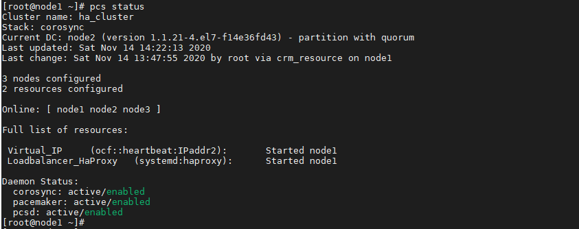
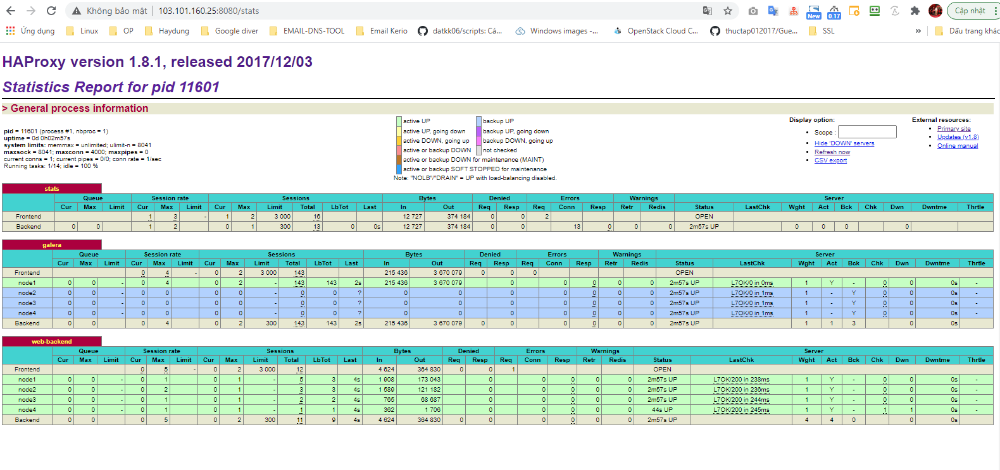

## Ghi chép vận hành, xử lý sự cố pacemaker corosync


### Mục lục

[1. Chuẩn bị môi trường](#moitruong)<br>
[2. Vận hành](#vanhanh)<br>

<a name="moitruong"></a>
## 1. Chuẩn bị môi trường

Sử dụng tiếp kết quả và mô hình của bài cài đặt về pacemaker - haproxy - galera mariadb để test các case vận hành với pacemaker corosync.

Triển khai pacemaker - haproxy - galera mariadb <a href="https://github.com/domanhduy/ghichep/blob/master/DuyDM/Cluster-HA/Cluster/docs/3.Cai-dat-haproxy-pamaker-cluster-galare-3-node-wp.md" target="_blank">tại đây</a>!



<a name="vanhanh"></a>
## 2. Vận hành

### 2.1. PCS command line

- Ngừng hoạt động trên 1 node

```
pcs cluster stop <node ..>
```

- Ngừng hoạt động cả cluster

```
pcs cluster stop --all
```

- Không cho phép node khởi động cùng OS

```
pcs cluster disable <node ..>
```

- Không cho phép cluster khởi động cùng OS

```
pcs cluster disable --all
```

- Khởi động cluster trên 1 node

```
pcs cluster start <node ..>
```

- Khởi động cả cluster

```
pcs cluster start --all
```

- Cho phép node khởi động cùng OS

```
pcs cluster enable <node ..>
```

- Cho phép cluster khởi động cùng OS

```
pcs cluster enable --all
```

### 2.2. Bổ sung thêm node vào cluster

**- Tại node mới**

```
+ Cài đặt cấu hình IP đúng theo mô hình kết nối.

+ Bổ sung vào /etc/host của node mới và các node cũ.

+ Cài đặt các dịch vụ giống như các node khác (database, source code, webserver...)
```

- Cài đặt gói pacemaker pcs

```
yum -y install pacemaker pcs

systemctl start pcsd 
systemctl enable pcsd
```

- Đặt mật khẩu `hacluster` giống các node thuộc cluster

```
[root@node4 ~]# passwd hacluster
Changing password for user hacluster.
New password:
Retype new password:
passwd: all authentication tokens updated successfully.
[root@node4 ~]#
```

```
systemctl start pcsd.service
systemctl enable pcsd.service
```

**- Tại node có sẵn của cluster**

- Chứng thực node mới

```
pcs cluster auth node4
```

```
[root@node1 ~]# pcs cluster auth node4
Username: hacluster
Password:
node4: Authorized
[root@node1 ~]#
```

- Bổ sung node vào cụm

```
pcs cluster node add node4
```

```
[root@node1 ~]# pcs cluster node add node4
Disabling SBD service...
node4: sbd disabled
Sending remote node configuration files to 'node4'
node4: successful distribution of the file 'pacemaker_remote authkey'
node1: Corosync updated
node2: Corosync updated
node3: Corosync updated
Setting up corosync...
node4: Succeeded
Synchronizing pcsd certificates on nodes node4...
node4: Success
Restarting pcsd on the nodes in order to reload the certificates...
node4: Success
```

- Khởi động node vừa join

```
pcs cluster start node4
pcs cluster enable node4
```

```
[root@node1 ~]# pcs cluster start node4
node4: Starting Cluster (corosync)...
node4: Starting Cluster (pacemaker)...
[root@node1 ~]# pcs cluster enable node4
node4: Cluster Enabled
```

- Kiểm tra

```
[root@node1 ~]# pcs status
Cluster name: ha_cluster
Stack: corosync
Current DC: node2 (version 1.1.21-4.el7-f14e36fd43) - partition with quorum
Last updated: Sat Nov 14 14:33:20 2020
Last change: Sat Nov 14 14:32:44 2020 by hacluster via crmd on node2

4 nodes configured
2 resources configured

Online: [ node1 node2 node3 node4 ]

Full list of resources:

 Virtual_IP     (ocf::heartbeat:IPaddr2):       Started node1
 Loadbalancer_HaProxy   (systemd:haproxy):      Started node1

Daemon Status:
  corosync: active/enabled
  pacemaker: active/enabled
  pcsd: active/enabled
[root@node1 ~]#
```




### 2.3. Loại bỏ node khỏi cluster

Tại node thuộc cluster (không phải node muốn loại bỏ):

```
pcs cluster node remove node4
```


### 2.4. Di chuyển resource khỏi node

- Lựa chọn resource cần di chuyển, ở đây sẽ di chuyển resource `Loadbalancer_HaProxy` sang node1


```
[root@node3 ~]# pcs status
Cluster name: ha_cluster
Stack: corosync
Current DC: node2 (version 1.1.21-4.el7-f14e36fd43) - partition with quorum
Last updated: Sat Nov 14 19:49:16 2020
Last change: Sat Nov 14 19:46:20 2020 by hacluster via crmd on node2

4 nodes configured
2 resources configured

Online: [ node1 node2 node3 node4 ]

Full list of resources:

 Virtual_IP     (ocf::heartbeat:IPaddr2):       Started node3
 Loadbalancer_HaProxy   (systemd:haproxy):      Started node3

Daemon Status:
  corosync: active/enabled
  pacemaker: active/enabled
  pcsd: active/enabled
[root@node3 ~]#
```

- Tạo ràng buộc di chuyển, câu lệnh không thực sự di chuyển resource mà tạo ràng buộc cho Resource phải tới node đích khi khởi động lại hoặc khi xảy ra lỗi.


```
pcs resource move Loadbalancer_HaProxy node1
```

Kiểm tra, ta thấy xuất hiện rằng buộc Resource: Loadbalancer_HaProxy Enable on node1

```
[root@node3 ~]# pcs constraint
Location Constraints:
  Resource: Loadbalancer_HaProxy
    Enabled on: node1 (score:INFINITY) (role: Started)
Ordering Constraints:
  start Virtual_IP then start Loadbalancer_HaProxy (kind:Optional)
Colocation Constraints:
  Virtual_IP with Loadbalancer_HaProxy (score:INFINITY)
Ticket Constraints:
[root@node3 ~]#
```

- Khởi động lại resource

```
pcs resource restart Loadbalancer_HaProxy
```

- Trạng thái mới

```
[root@node3 ~]# pcs status
Cluster name: ha_cluster
Stack: corosync
Current DC: node2 (version 1.1.21-4.el7-f14e36fd43) - partition with quorum
Last updated: Sat Nov 14 19:57:04 2020
Last change: Sat Nov 14 19:56:35 2020 by root via crm_resource on node3

4 nodes configured
2 resources configured

Online: [ node1 node2 node3 node4 ]

Full list of resources:

 Virtual_IP     (ocf::heartbeat:IPaddr2):       Started node1
 Loadbalancer_HaProxy   (systemd:haproxy):      Started node1

Daemon Status:
  corosync: active/enabled
  pacemaker: active/enabled
  pcsd: active/enabled
[root@node3 ~]#
```


- Loại bỏ ràng buộc tạm thời để resource trở lại bình thường


```
pcs resource clear Loadbalancer_HaProxy
```

```
[root@node3 ~]# pcs constraint
Location Constraints:
  Resource: Loadbalancer_HaProxy
    Enabled on: node2 (score:INFINITY) (role: Started)
Ordering Constraints:
  start Virtual_IP then start Loadbalancer_HaProxy (kind:Optional)
Colocation Constraints:
  Virtual_IP with Loadbalancer_HaProxy (score:INFINITY)
Ticket Constraints:
[root@node3 ~]# pcs resource clear Loadbalancer_HaProxy
[root@node3 ~]# pcs constraint
Location Constraints:
Ordering Constraints:
  start Virtual_IP then start Loadbalancer_HaProxy (kind:Optional)
Colocation Constraints:
  Virtual_IP with Loadbalancer_HaProxy (score:INFINITY)
Ticket Constraints:
[root@node3 ~]#
```

### 2.5. Ngừng dịch vụ tại 1 node chỉ định

- Trạng thái cluster

```
[root@node1 ~]# pcs status
Cluster name: ha_cluster
Stack: corosync
Current DC: node2 (version 1.1.21-4.el7-f14e36fd43) - partition with quorum
Last updated: Sat Nov 14 20:06:33 2020
Last change: Sat Nov 14 20:02:51 2020 by root via crm_resource on node3

4 nodes configured
2 resources configured

Online: [ node1 node2 node3 node4 ]

Full list of resources:

 Virtual_IP     (ocf::heartbeat:IPaddr2):       Started node1
 Loadbalancer_HaProxy   (systemd:haproxy):      Started node1

Daemon Status:
  corosync: active/enabled
  pacemaker: active/enabled
  pcsd: active/enabled
[root@node1 ~]#
```

Chỉ định ngừng dịch vụ `Loadbalancer_HaProxy` tại `node1` để thực hiện hoạt động bảo trì hoặc nâng cấp.

```
pcs resource ban Loadbalancer_HaProxy node1
```

Cho phép dịch vụ hoạt động trở lại

```
pcs resource clear Loadbalancer_HaProxy
```

- Khởi động lại resource

```
pcs resource restart <Resource name>
```

- Xóa resource

```
pcs resource delete <Resource name>
```

### 2.6. Lỗi Resource (Blocked)

Thực hiện cleanup resource, trạng thái resource sẽ trở lại bình thường.

```
pcs resource cleanup <Resource name>
```


### 2.7. Di chuyển IP VIP

IP VIP cấu hình dạng clone nên không thể di chuyển theo cách thông thường.

Di chuyển dịch vụ có ràng buộc với IP VIP (kiểm tra băng câu lệnh `pcs constraint` ), để pacemaker di chuyển IP VIP theo tài nguyên ràng buộc. Trong ví dụ này sẽ di chuyển dịch vụ `Loadbalancer_HaProxy` (ràng buộc IP VIP (Virtual_IP) luôn hoat động trên cùng node với http- Loadbalancer_HaProxy).

