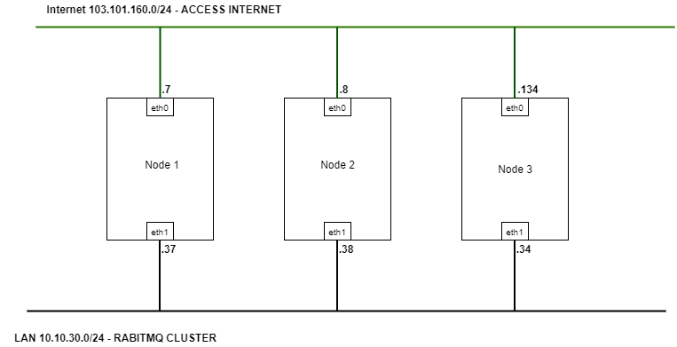
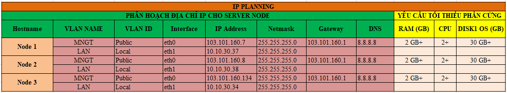
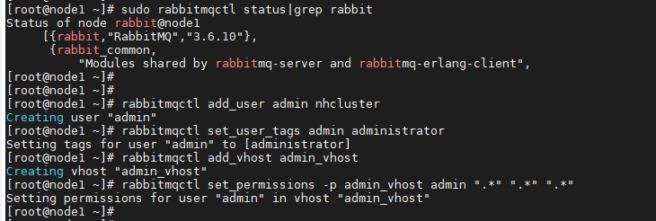
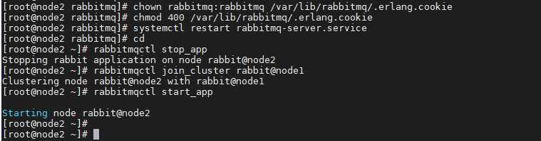
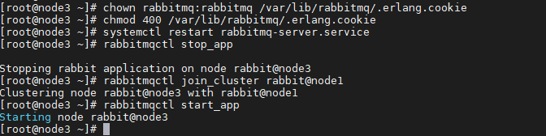

## Ghi chép cài đặt rabitmq 3 node CentOS7

### Mục lục

[1. Mô hình](#mohinh)<br>
[2. Quy hoạch IP](#ip)<br>
[3. Chuẩn bị](#chuanbi)<br>
[4. Cài đặt rabitmq 3 node CentOS7](#caidat)<br>

<a name="mohinh"></a>
## 1. Mô hình

- Mô hình đấu nối



<a name="ip"></a>
## 2. Quy hoạch IP



<a name="chuanbi"></a>
## 3. Chuẩn bị

Chuẩn bị chung thực hiện trên cả 3 node:

**Thiết lập IP**

```
hostnamectl set-hostname node1
sudo systemctl disable firewalld
sudo systemctl stop firewalld
sudo systemctl disable NetworkManager
sudo systemctl stop NetworkManager
sudo systemctl enable network
sudo systemctl start network
sed -i 's/SELINUX=enforcing/SELINUX=disabled/g' /etc/sysconfig/selinux
sed -i 's/SELINUX=enforcing/SELINUX=disabled/g' /etc/selinux/config
```

```
yum install epel-release -y
yum update -y
```

**Cài đặt NTPD**

```
yum install chrony -y 

systemctl start chronyd 
systemctl enable chronyd
systemctl restart chronyd 

chronyc sources -v
```

```
sudo date -s "$(wget -qSO- --max-redirect=0 google.com 2>&1 | grep Date: | cut -d' ' -f5-8)Z"
ln -f -s /usr/share/zoneinfo/Asia/Ho_Chi_Minh /etc/localtime
```

**CMD log**

```
curl -Lso- https://raw.githubusercontent.com/nhanhoadocs/ghichep-cmdlog/master/cmdlog.sh | bash
```

**Cấu hình host**

```
echo "103.101.160.7 node1" >> /etc/hosts
echo "103.101.160.8 node2" >> /etc/hosts
echo "103.101.160.134 node3" >> /etc/hosts
```


**Cài đặt Erlang, các gói phụ trợ**

```
yum -y install epel-release
yum update -y
yum -y install erlang socat wget
```

<a name="caidat"></a>
## 4. Cài đặt rabitmq 3 node CentOS7

**Thực hiện trên tất cả các Node**

- Cài đặt

```
wget https://www.rabbitmq.com/releases/rabbitmq-server/v3.6.10/rabbitmq-server-3.6.10-1.el7.noarch.rpm
rpm --import https://www.rabbitmq.com/rabbitmq-release-signing-key.asc
rpm -Uvh rabbitmq-server-3.6.10-1.el7.noarch.rpm
```

- Start service

```
systemctl start rabbitmq-server
systemctl enable rabbitmq-server
systemctl status rabbitmq-server
```

**Tại Node1**

- Kiểm tra trạng thái node

```
sudo rabbitmqctl status|grep rabbit
```

```
[root@node1 ~]# sudo rabbitmqctl status|grep rabbit
Status of node rabbit@node1
     [{rabbit,"RabbitMQ","3.6.10"},
      {rabbit_common,
          "Modules shared by rabbitmq-server and rabbitmq-erlang-client",
[root@node1 ~]#
```

- Tạo User cho App (nhcluster), phân quyền

```
rabbitmqctl add_user admin nhcluster
rabbitmqctl set_user_tags admin administrator
rabbitmqctl add_vhost admin_vhost
rabbitmqctl set_permissions -p admin_vhost admin ".*" ".*" ".*"
```



- Copy file `/var/lib/rabbitmq/.erlang.cookie` từ `node1` sang các node còn lại. (Có nhập password)

```
scp /var/lib/rabbitmq/.erlang.cookie root@node2:/var/lib/rabbitmq/.erlang.cookie

scp /var/lib/rabbitmq/.erlang.cookie root@node3:/var/lib/rabbitmq/.erlang.cookie
```

- Cấu hình policy HA Rabbit Cluster

```
rabbitmqctl -p admin_vhost set_policy ha-all '^(?!amq\.).*' '{"ha-mode": "all"}'
```

```
[root@node1 ~]# rabbitmqctl -p admin_vhost set_policy ha-all '^(?!amq\.).*' '{"ha-mode": "all"}'
Setting policy "ha-all" for pattern "^(?!amq\\.).*" to "{\"ha-mode\": \"all\"}" with priority "0"
[root@node1 ~]#
```

- Kiểm tra trạng thái cluster

```
rabbitmqctl cluster_status
```

```
[root@node1 ~]# rabbitmqctl cluster_status
Cluster status of node rabbit@node1
[{nodes,[{disc,[rabbit@node1]}]},
 {running_nodes,[rabbit@node1]},
 {cluster_name,<<"rabbit@node1">>},
 {partitions,[]},
 {alarms,[{rabbit@node1,[]}]}]
[root@node1 ~]#
```

- Khởi chạy app

```
[root@node1 ~]# rabbitmqctl start_app
Starting node rabbit@node1
[root@node1 ~]#
```

- Kiểm tra trạng thái cluster

```
[root@node1 ~]# rabbitmqctl start_app
Starting node rabbit@node1
[root@node1 ~]#
[root@node1 ~]# rabbitmqctl cluster_status
Cluster status of node rabbit@node1
[{nodes,[{disc,[rabbit@node1]}]},
 {running_nodes,[rabbit@node1]},
 {cluster_name,<<"rabbit@node1">>},
 {partitions,[]},
 {alarms,[{rabbit@node1,[]}]}]
[root@node1 ~]#
```

**Tại Node2**

Phân quyền file /var/lib/rabbitmq/.erlang.cookie

```
chown rabbitmq:rabbitmq /var/lib/rabbitmq/.erlang.cookie
chmod 400 /var/lib/rabbitmq/.erlang.cookie
```

Khởi động lại dịch vụ

```
systemctl restart rabbitmq-server.service
```

Join cluster node1

```
rabbitmqctl stop_app
rabbitmqctl join_cluster rabbit@node1
rabbitmqctl start_app
```



**Tại Node3**

Phân quyền file `/var/lib/rabbitmq/.erlang.cookie`

```
chown rabbitmq:rabbitmq /var/lib/rabbitmq/.erlang.cookie
chmod 400 /var/lib/rabbitmq/.erlang.cookie
```

Khởi động lại dịch vụ

```
systemctl restart rabbitmq-server.service
```

Join cluster node1

```
rabbitmqctl stop_app
rabbitmqctl join_cluster rabbit@node1
rabbitmqctl start_app
```



**Kiểm tra trên tất cả các node**

```
[root@node1 ~]# rabbitmqctl cluster_status
Cluster status of node rabbit@node1
[{nodes,[{disc,[rabbit@node1,rabbit@node2,rabbit@node3]}]},
 {running_nodes,[rabbit@node3,rabbit@node2,rabbit@node1]},
 {cluster_name,<<"rabbit@node1">>},
 {partitions,[]},
 {alarms,[{rabbit@node3,[]},{rabbit@node2,[]},{rabbit@node1,[]}]}]
[root@node1 ~]#
```

```
[root@node2 ~]# rabbitmqctl cluster_status
Cluster status of node rabbit@node2
[{nodes,[{disc,[rabbit@node1,rabbit@node2,rabbit@node3]}]},
 {running_nodes,[rabbit@node3,rabbit@node1,rabbit@node2]},
 {cluster_name,<<"rabbit@node1">>},
 {partitions,[]},
 {alarms,[{rabbit@node3,[]},{rabbit@node1,[]},{rabbit@node2,[]}]}]
[root@node2 ~]#
```

```
[root@node3 ~]# rabbitmqctl cluster_status
Cluster status of node rabbit@node3
[{nodes,[{disc,[rabbit@node1,rabbit@node2,rabbit@node3]}]},
 {running_nodes,[rabbit@node1,rabbit@node2,rabbit@node3]},
 {cluster_name,<<"rabbit@node1">>},
 {partitions,[]},
 {alarms,[{rabbit@node1,[]},{rabbit@node2,[]},{rabbit@node3,[]}]}]
[root@node3 ~]#
```

- Kích hoạt plugin rabbit management

Thực hiện trên tất cả các node

```
rabbitmq-plugins enable rabbitmq_management
chown -R rabbitmq:rabbitmq /var/lib/rabbitmq
```


