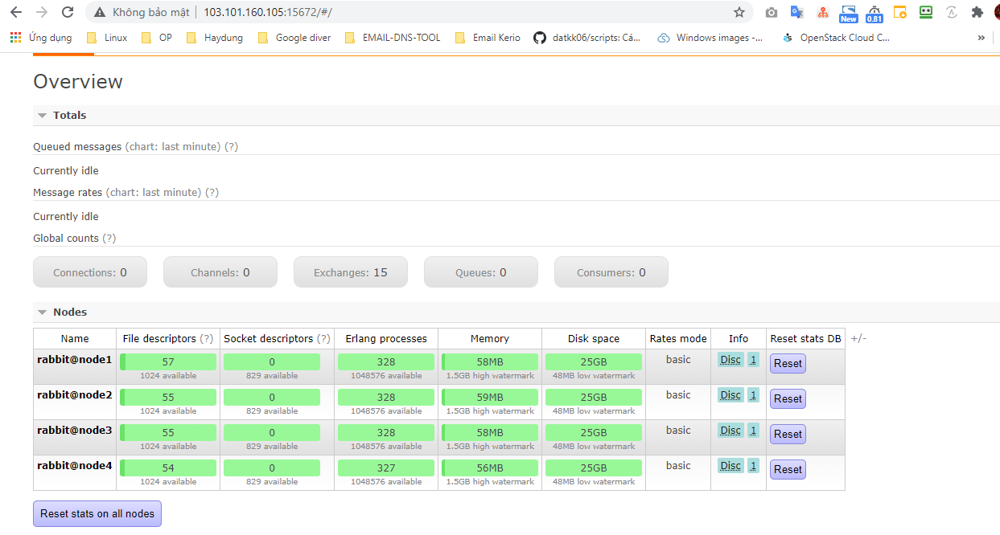
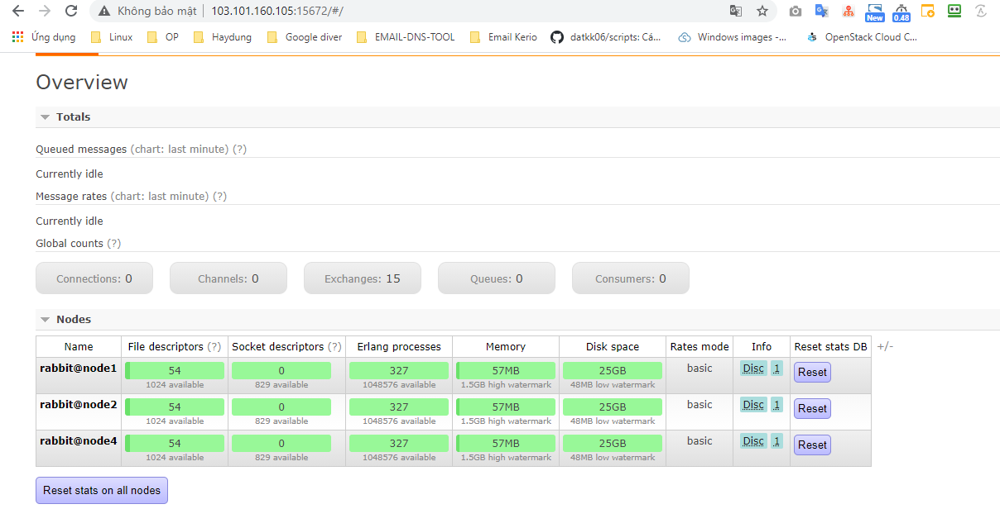
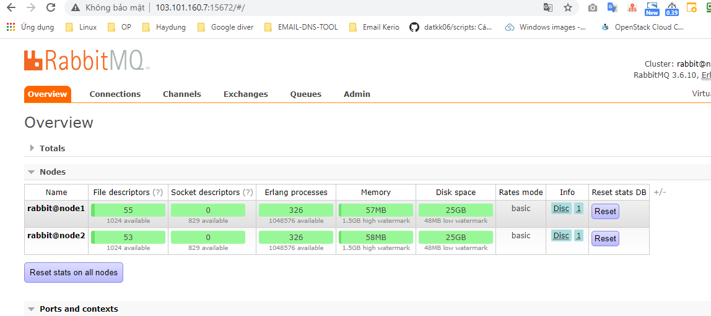
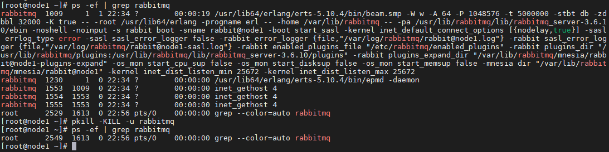
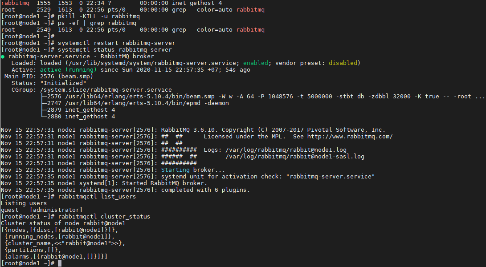

## Ghi chép vận hành, xử lý sự cố rabitmq


### Mục lục

[1. Chuẩn bị môi trường](#moitruong)<br>
[2. Xử lý sự cố](#suco)<br>
[3. Vận hành](#vanhanh)<br>

<a name="moitruong"></a>
## 1. Chuẩn bị môi trường

Sử dụng tiếp kết quả và mô hình của bài cài đặt về rabitmq để test các case vận hành với rabitmq.

Triển khai rabitmq trên CentOS7 <a href="https://github.com/domanhduy/ghichep/blob/master/DuyDM/Cluster-HA/Cluster/docs/6.Cai-dat-rabitmq-3node-centos7.md" target="_blank">tại đây</a>!

**Định nghĩa về sự cố**

Trường hợp xảy ra sự cố có 2 kiểu:

`An toàn`: Tức dịch vụ tắt bình thường `systemctl stop mariadb`

`Không an toàn`: Khi tiến trình bị crash, os xảy ra vấn đề, mất điện ....

<a name="suco"></a>
## 2. Xử lý sự cố

### 2.1. Trường hợp 1 node xảy ra vấn đề.

Mô hình triển khai có 3 node về mặt lý thuyết 1 node down thì cụm vẫn hoạt động bình thường.

**Down 1 node an toàn**

- Sự cố

```
systemctl stop rabbitmq-server
```

- Kiểm tra

Kiểm tra tại `node2` và `node3`

```
[root@node2 ~]# rabbitmqctl cluster_status
Cluster status of node rabbit@node2
[{nodes,[{disc,[rabbit@node1,rabbit@node2,rabbit@node3]}]},
 {running_nodes,[rabbit@node3,rabbit@node2]},
 {cluster_name,<<"rabbit@node1">>},
 {partitions,[]},
 {alarms,[{rabbit@node3,[]},{rabbit@node2,[]}]}]
[root@node2 ~]#
```

```
[root@node3 ~]# rabbitmqctl cluster_status
Cluster status of node rabbit@node3
[{nodes,[{disc,[rabbit@node1,rabbit@node2,rabbit@node3]}]},
 {running_nodes,[rabbit@node2,rabbit@node3]},
 {cluster_name,<<"rabbit@node1">>},
 {partitions,[]},
 {alarms,[{rabbit@node2,[]},{rabbit@node3,[]}]}]
[root@node3 ~]#
```

Node 1 không hoạt động: `{running_nodes,[rabbit@node2,rabbit@node3]}`

- Xử lý

Truy cập `node 1` start lại service rabitmq.

```
systemctl start rabbitmq-server
```

Nếu khởi động thành công kiểm tra tại các node còn lại

```
[root@node1 ~]# rabbitmqctl cluster_status
Cluster status of node rabbit@node1
[{nodes,[{disc,[rabbit@node1,rabbit@node2,rabbit@node3]}]},
 {running_nodes,[rabbit@node2,rabbit@node3,rabbit@node1]},
 {cluster_name,<<"rabbit@node1">>},
 {partitions,[]},
 {alarms,[{rabbit@node2,[]},{rabbit@node3,[]},{rabbit@node1,[]}]}]
[root@node1 ~]#
```

```
[root@node2 ~]# rabbitmqctl cluster_status
Cluster status of node rabbit@node2
[{nodes,[{disc,[rabbit@node1,rabbit@node2,rabbit@node3]}]},
 {running_nodes,[rabbit@node1,rabbit@node3,rabbit@node2]},
 {cluster_name,<<"rabbit@node1">>},
 {partitions,[]},
 {alarms,[{rabbit@node1,[]},{rabbit@node3,[]},{rabbit@node2,[]}]}]
[root@node2 ~]#
```

```
[root@node3 ~]# rabbitmqctl cluster_status
Cluster status of node rabbit@node3
[{nodes,[{disc,[rabbit@node1,rabbit@node2,rabbit@node3]}]},
 {running_nodes,[rabbit@node1,rabbit@node2,rabbit@node3]},
 {cluster_name,<<"rabbit@node1">>},
 {partitions,[]},
 {alarms,[{rabbit@node1,[]},{rabbit@node2,[]},{rabbit@node3,[]}]}]
[root@node3 ~]#
```

Node 1 đã chạy trong cluster: `{running_nodes,[rabbit@node1,rabbit@node2,rabbit@node3]}`

**Down 1 không an toàn init 0**

- Sự cố

```
init 0
```

- Xử lý

Start lại server và start lại tiến trình service rabitmq

```
systemctl start rabbitmq-server
```

**Down 1 không an toàn kiểu mất điện tắt nóng server**

- Xử lý

Start lại server và start lại tiến trình service rabitmq

```
systemctl start rabbitmq-server
```

### 2.2. Trường hợp 2 node xảy ra vấn đề.

**Down 2 node an toàn**

- Sự cố

```
systemctl stop rabbitmq-server
```

- Kiểm tra

```
[root@node3 ~]# rabbitmqctl cluster_status
Cluster status of node rabbit@node3
[{nodes,[{disc,[rabbit@node1,rabbit@node2,rabbit@node3]}]},
 {running_nodes,[rabbit@node3]},
 {cluster_name,<<"rabbit@node1">>},
 {partitions,[]},
 {alarms,[{rabbit@node3,[]}]}]
[root@node3 ~]#
```

Node 2 và node 3 down, cluster chạy duy nhất trên node 3.

- Xử lý

Start lại service ở 2 node down.

```
systemctl start rabbitmq-server
```

```
[root@node3 ~]# rabbitmqctl cluster_status
Cluster status of node rabbit@node3
[{nodes,[{disc,[rabbit@node1,rabbit@node2,rabbit@node3]}]},
 {running_nodes,[rabbit@node2,rabbit@node3]},
 {cluster_name,<<"rabbit@node1">>},
 {partitions,[]},
 {alarms,[{rabbit@node2,[]},{rabbit@node3,[]}]}]
[root@node3 ~]#
```

**Down 2 không an toàn init 0**

- Sự cố

```
init 0
```

- Xử lý

Start lại server và start lại tiến trình service rabitmq

```
systemctl start rabbitmq-server
```

**Down 2 không an toàn kiểu mất điện tắt nóng server**

- Xử lý

Start lại server và start lại tiến trình service rabitmq

```
systemctl start rabbitmq-server
```

### 2.3. Trường hợp 3 node xảy ra vấn đề.

**Down 3 node an toàn**

- Sự cố

```
systemctl stop rabbitmq-server
```

- Xử lý

Yêu cầu bật start service node cuối cùng lên đâu tiên. Còn các node còn lại không cần thứ tự.

Trong trường hợp cả 3 node đều down, không xác nhận được node nào tắt sau cùng. Cần bật 1 node bật kỳ để cluster có thể hoạt động trở lại, giải quyết theo cách này có thể gây mất mát dữ liệu queue, các node còn lại bật không cần thứ tự.

```
systemctl stop rabbitmq-server
```

**Down 3 không an toàn init 0**

- Sự cố

```
init 0
```

- Xử lý

Start lại server và start lại tiến trình service rabitmq node cuối cùng lên đâu tiên. Còn các node còn lại không cần thứ tự.

Trong trường hợp cả 3 node đều down, không xác nhận được node nào tắt sau cùng. Cần bật 1 node bật kỳ để cluster có thể hoạt động trở lại, giải quyết theo cách này có thể gây mất mát dữ liệu queue, các node còn lại bật không cần thứ tự.

```
systemctl start rabbitmq-server
```

**Down 3 không an toàn kiểu mất điện tắt nóng server**

- Sự cố

Tắt nóng cả 3 node cluster không bật lên được.

Sau khi bật node tắt cuối cùng lên cluster rabitmq lỗi.

```
[root@node3 ~]# rabbitmqctl cluster_status
Cluster status of node rabbit@node3
Error: {aborted,{no_exists,[rabbit_runtime_parameters,cluster_name]}}
[root@node3 ~]#
[root@node3 ~]#
[root@node3 ~]# systemctl status rabbitmq-server
● rabbitmq-server.service - RabbitMQ broker
   Loaded: loaded (/usr/lib/systemd/system/rabbitmq-server.service; enabled; vendor preset: disabled)
   Active: activating (start) since Sun 2020-11-15 13:45:39 +07; 7h ago
 Main PID: 1010 (beam.smp)
   Status: "Exited."
   CGroup: /system.slice/rabbitmq-server.service
           ├─1010 /usr/lib64/erlang/erts-5.10.4/bin/beam.smp -W w -A 64 -P 1048576 -t 5000000 -stbt db -zdbbl 32000 -K true -- -root ...
           ├─1226 /usr/lib64/erlang/erts-5.10.4/bin/epmd -daemon
           ├─1553 inet_gethost 4
           ├─1554 inet_gethost 4
           └─1561 inet_gethost 4

Nov 15 13:45:39 node3 systemd[1]: Starting RabbitMQ broker...
Nov 15 20:46:01 node3 rabbitmq-server[1010]: RabbitMQ 3.6.10. Copyright (C) 2007-2017 Pivotal Software, Inc.
Nov 15 20:46:01 node3 rabbitmq-server[1010]: ##  ##      Licensed under the MPL.  See http://www.rabbitmq.com/
Nov 15 20:46:01 node3 rabbitmq-server[1010]: ##  ##
Nov 15 20:46:01 node3 rabbitmq-server[1010]: ##########  Logs: /var/log/rabbitmq/rabbit@node3.log
Nov 15 20:46:01 node3 rabbitmq-server[1010]: ######  ##        /var/log/rabbitmq/rabbit@node3-sasl.log
Nov 15 20:46:01 node3 rabbitmq-server[1010]: ##########
Nov 15 20:46:01 node3 rabbitmq-server[1010]: Starting broker...
[root@node3 ~]#
```

- Xử lý

Start lại server và start lại tiến trình service rabitmq node cuối cùng lên đâu tiên. Còn các node còn lại không cần thứ tự.

Trong trường hợp cả 3 node đều down, không xác nhận được node nào tắt sau cùng. Cần bật 1 node bật kỳ để cluster có thể hoạt động trở lại, giải quyết theo cách này có thể gây mất mát dữ liệu queue, các node còn lại bật không cần thứ tự.


```
rabbitmqctl force_boot
systemctl start rabbitmq-server
```

```
[root@node3 ~]# rabbitmqctl force_boot
Forcing boot for Mnesia dir /var/lib/rabbitmq/mnesia/rabbit@node3
[root@node3 ~]# systemctl start rabbitmq-server
[root@node3 ~]# systemctl status rabbitmq-server
● rabbitmq-server.service - RabbitMQ broker
   Loaded: loaded (/usr/lib/systemd/system/rabbitmq-server.service; enabled; vendor preset: disabled)
   Active: active (running) since Sun 2020-11-15 20:52:20 +07; 20s ago
 Main PID: 2252 (beam.smp)
   Status: "Initialized"
   CGroup: /system.slice/rabbitmq-server.service
           ├─2252 /usr/lib64/erlang/erts-5.10.4/bin/beam.smp -W w -A 64 -P 1048576 -t 5000000 -stbt db -zdbbl 32000 -K true -- -root ...
           ├─2433 /usr/lib64/erlang/erts-5.10.4/bin/epmd -daemon
           ├─2561 inet_gethost 4
           ├─2562 inet_gethost 4
           └─2568 inet_gethost 4

Nov 15 20:51:55 node3 rabbitmq-server[2252]: RabbitMQ 3.6.10. Copyright (C) 2007-2017 Pivotal Software, Inc.
Nov 15 20:51:55 node3 rabbitmq-server[2252]: ##  ##      Licensed under the MPL.  See http://www.rabbitmq.com/
Nov 15 20:51:55 node3 rabbitmq-server[2252]: ##  ##
Nov 15 20:51:55 node3 rabbitmq-server[2252]: ##########  Logs: /var/log/rabbitmq/rabbit@node3.log
Nov 15 20:51:55 node3 rabbitmq-server[2252]: ######  ##        /var/log/rabbitmq/rabbit@node3-sasl.log
Nov 15 20:51:55 node3 rabbitmq-server[2252]: ##########
Nov 15 20:51:55 node3 rabbitmq-server[2252]: Starting broker...
Nov 15 20:52:20 node3 rabbitmq-server[2252]: systemd unit for activation check: "rabbitmq-server.service"
Nov 15 20:52:20 node3 systemd[1]: Started RabbitMQ broker.
Nov 15 20:52:21 node3 rabbitmq-server[2252]: completed with 6 plugins.
[root@node3 ~]# rabbitmqctl cluster_status
Cluster status of node rabbit@node3
[{nodes,[{disc,[rabbit@node1,rabbit@node2,rabbit@node3]}]},
 {running_nodes,[rabbit@node3]},
 {cluster_name,<<"rabbit@node1">>},
 {partitions,[]},
 {alarms,[{rabbit@node3,[]}]}]
[root@node3 ~]#

```

<a name="vanhanh"></a>
## 3. Vận hành

### 3.1. Bổ sung thêm node vào cluster rabbitmq

**Bước 1:** Cài đặt một node mới với đấu nối tương tự mô hình. Trong bài lab này bổ sung thêm 1 node mới với thông tin IP:

```
IP Public: 103.101.160.105
IP Local: 10.10.30.35
```

Cài đặt cơ bản: IP, time, selinux, cmdlog, ...

**Bước 2:** Bổ sung vào file host ở node cũ và node mới

```
103.101.160.7 node1
103.101.160.8 node2
103.101.160.134 node3
103.101.160.105 node4
```

**Bước 3:** Cài đặt rabbitmq trên node4 mới

- Cài đặt

```
yum -y install erlang socat wget
wget https://www.rabbitmq.com/releases/rabbitmq-server/v3.6.10/rabbitmq-server-3.6.10-1.el7.noarch.rpm
rpm --import https://www.rabbitmq.com/rabbitmq-release-signing-key.asc
rpm -Uvh rabbitmq-server-3.6.10-1.el7.noarch.rpm
```

- Start service

```
systemctl start rabbitmq-server
systemctl enable rabbitmq-server
systemctl status rabbitmq-server
```

- Copy file `/var/lib/rabbitmq/.erlang.cookie` từ `node1 - node khởi tạo` sang các `node4` mới.

```
scp /var/lib/rabbitmq/.erlang.cookie root@node4:/var/lib/rabbitmq/.erlang.cookie
```

**Tại Node4 mới**

Phân quyền file /var/lib/rabbitmq/.erlang.cookie

```
chown rabbitmq:rabbitmq /var/lib/rabbitmq/.erlang.cookie
chmod 400 /var/lib/rabbitmq/.erlang.cookie
```

Khởi động lại dịch vụ

```
systemctl restart rabbitmq-server.service
```

Join cluster node1

```
rabbitmqctl stop_app
rabbitmqctl join_cluster rabbit@node1
rabbitmqctl start_app
rabbitmqctl cluster_status
```

```
[root@node4 ~]# chown rabbitmq:rabbitmq /var/lib/rabbitmq/.erlang.cookie
[root@node4 ~]# chmod 400 /var/lib/rabbitmq/.erlang.cookie
[root@node4 ~]# systemctl restart rabbitmq-server.service
[root@node4 ~]# rabbitmqctl stop_app
Stopping rabbit application on node rabbit@node4
[root@node4 ~]# rabbitmqctl join_cluster rabbit@node1
Clustering node rabbit@node4 with rabbit@node1
[root@node4 ~]# rabbitmqctl start_app
Starting node rabbit@node4
[root@node4 ~]# rabbitmqctl cluster_status
Cluster status of node rabbit@node4
[{nodes,[{disc,[rabbit@node1,rabbit@node2,rabbit@node3,rabbit@node4]}]},
 {running_nodes,[rabbit@node1,rabbit@node3,rabbit@node2,rabbit@node4]},
 {cluster_name,<<"rabbit@node1">>},
 {partitions,[]},
 {alarms,[{rabbit@node1,[]},
          {rabbit@node3,[]},
          {rabbit@node2,[]},
          {rabbit@node4,[]}]}]
[root@node4 ~]#
```

- Kích hoạt plugin rabbit management thực hiện trên node4 mới.

```
rabbitmq-plugins enable rabbitmq_management
chown -R rabbitmq:rabbitmq /var/lib/rabbitmq
```

```
[root@node4 ~]# rabbitmq-plugins enable rabbitmq_management
The following plugins have been enabled:
  amqp_client
  cowlib
  cowboy
  rabbitmq_web_dispatch
  rabbitmq_management_agent
  rabbitmq_management

Applying plugin configuration to rabbit@node4...
 started 6 plugins.
[root@node4 ~]# chown -R rabbitmq:rabbitmq /var/lib/rabbitmq
```

**Lưu ý:**

Khi join cluster, node join không được chạy dịch vụ, nếu chạy sẽ dẫn tới lỗi. Có thể chọn 1 node bất kỳ trong cluster để join, không phụ thuộc vào node khởi tạo cluster.




### 3.2. Loại bỏ một node khởi cluster rabitmq


- Có 2 cách thực hiện:

```
Cách 1: Tại node mong muốn được loại bỏ
Cách 2: Tại 1 node bất kỳ trong cụm, loại bỏ node mong muốn
```

- Thực hiện theo cách 1

```
rabbitmqctl stop_app
rabbitmqctl reset
rabbitmqctl start_app
rabbitmqctl cluster_status
```

Tại node muốn loại bỏ

```
[root@node3 ~]# rabbitmqctl cluster_status
Cluster status of node rabbit@node3
[{nodes,[{disc,[rabbit@node3]}]},
 {running_nodes,[rabbit@node3]},
 {cluster_name,<<"rabbit@node3">>},
 {partitions,[]},
 {alarms,[{rabbit@node3,[]}]}]
[root@node3 ~]# rabbitmqctl cluster_status
Cluster status of node rabbit@node3
[{nodes,[{disc,[rabbit@node3]}]},
 {running_nodes,[rabbit@node3]},
 {cluster_name,<<"rabbit@node3">>},
 {partitions,[]},
 {alarms,[{rabbit@node3,[]}]}]
[root@node3 ~]#
```

Tại node khác còn lại của cụm.

```
[root@node1 ~]# rabbitmqctl cluster_status
Cluster status of node rabbit@node1
[{nodes,[{disc,[rabbit@node1,rabbit@node2,rabbit@node4]}]},
 {running_nodes,[rabbit@node2,rabbit@node4,rabbit@node1]},
 {cluster_name,<<"rabbit@node1">>},
 {partitions,[]},
 {alarms,[{rabbit@node2,[]},{rabbit@node4,[]},{rabbit@node1,[]}]}]
[root@node1 ~]#

[root@node2 ~]# rabbitmqctl cluster_status
Cluster status of node rabbit@node2
[{nodes,[{disc,[rabbit@node1,rabbit@node2,rabbit@node4]}]},
 {running_nodes,[rabbit@node1,rabbit@node4,rabbit@node2]},
 {cluster_name,<<"rabbit@node1">>},
 {partitions,[]},
 {alarms,[{rabbit@node1,[]},{rabbit@node4,[]},{rabbit@node2,[]}]}]
[root@node2 ~]#

[root@node4 ~]# rabbitmqctl cluster_status
Cluster status of node rabbit@node4
[{nodes,[{disc,[rabbit@node1,rabbit@node2,rabbit@node4]}]},
 {running_nodes,[rabbit@node1,rabbit@node2,rabbit@node4]},
 {cluster_name,<<"rabbit@node1">>},
 {partitions,[]},
 {alarms,[{rabbit@node1,[]},{rabbit@node2,[]},{rabbit@node4,[]}]}]
```



- Thực hiện theo cách 2

Trong bài lab đứng ở node 1 loại bỏ node 4 khỏi cluster.

Truy cập node mong muốn loại bỏ, tắt dịch vụ. Không thể loại bỏ node với dịch vụ đang chạy

```
rabbitmqctl stop_app
```

```
[root@node4 ~]# rabbitmqctl stop_app
Stopping rabbit application on node rabbit@node4
[root@node4 ~]#
```

Tại 1 node bất kỳ trong cụm, loại bỏ node mong muốn

```
rabbitmqctl forget_cluster_node rabbit@node4
```

```
[root@node1 ~]# rabbitmqctl forget_cluster_node rabbit@node4
Removing node rabbit@node4 from cluster
[root@node1 ~]#
```

Kiểm tra

```
[root@node1 ~]# rabbitmqctl cluster_status
Cluster status of node rabbit@node1
[{nodes,[{disc,[rabbit@node1,rabbit@node2]}]},
 {running_nodes,[rabbit@node2,rabbit@node1]},
 {cluster_name,<<"rabbit@node1">>},
 {partitions,[]},
 {alarms,[{rabbit@node2,[]},{rabbit@node1,[]}]}]
```

Quay lại node mong muốn loại bỏ, hiện tại đã không thể chạy lại dịch vụ, cần reset lại trạng thái cluster

```
rabbitmqctl reset
rabbitmqctl start_app
rabbitmqctl cluster_status
```

```
[root@node4 ~]# rabbitmqctl reset

Resetting node rabbit@node4
[root@node4 ~]# rabbitmqctl start_app
Starting node rabbit@node4
[root@node4 ~]# rabbitmqctl cluster_status
Cluster status of node rabbit@node4
[{nodes,[{disc,[rabbit@node4]}]},
 {running_nodes,[rabbit@node4]},
 {cluster_name,<<"rabbit@node4">>},
 {partitions,[]},
 {alarms,[{rabbit@node4,[]}]}]
[root@node4 ~]#
```



### 3.3. Khởi tạo lại Cluster

- Sự cố

Trong trường hợp không thể khôi phục dịch vụ, chạy lại cluster

Yêu cầu khởi tạo lại Cluster nhanh chóng

- Xử lý

**Thực hiện trên tất cả node thuộc cluster**

Xóa bỏ dữ liệu cũ của cluster

```
cd /var/lib/rabbitmq/mnesia/
rm -rf *
```

Loại bỏ tiến trình RabbitMQ

```
# Kiểm tra tiến trình
ps -ef | grep rabbitmq 

# Loại bỏ
pkill -KILL -u rabbitmq
````



Khởi tạo lại tiến trình

```
systemctl restart rabbitmq-server
```

Kiểm tra lại dịch vụ

```
systemctl status rabbitmq-server
```

Kiểm tra danh sách user hiện có

```
rabbitmqctl list_users
```

Kiểm tra trạng thái Cluster

```
rabbitmqctl cluster_status
```



Làm mới Cluster hiện có

```
rabbitmqctl stop_app
rabbitmqctl reset
rabbitmqctl start_app
```

Lúc này các node sẽ được hiểu là cluster độc lập

```
[root@node1 ~]# rabbitmqctl cluster_status
Cluster status of node rabbit@node1
[{nodes,[{disc,[rabbit@node1]}]},
 {running_nodes,[rabbit@node1]},
 {cluster_name,<<"rabbit@node1">>},
 {partitions,[]},
 {alarms,[{rabbit@node1,[]}]}]
[root@node1 ~]#

[root@node2 ~]# rabbitmqctl cluster_status
Cluster status of node rabbit@node2
[{nodes,[{disc,[rabbit@node2]}]},
 {running_nodes,[rabbit@node2]},
 {cluster_name,<<"rabbit@node2">>},
 {partitions,[]},
 {alarms,[{rabbit@node2,[]}]}]
[root@node2 ~]#
```

Join lại các node vào cluster

Đứng từ node 2 để join vào cluster node 1

```
systemctl restart rabbitmq-server.service
rabbitmqctl stop_app
rabbitmqctl join_cluster rabbit@node1
rabbitmqctl start_app
```

```
[root@node2 ~]# rabbitmqctl cluster_status
Cluster status of node rabbit@node2
[{nodes,[{disc,[rabbit@node1,rabbit@node2]}]},
 {running_nodes,[rabbit@node1,rabbit@node2]},
 {cluster_name,<<"rabbit@node1">>},
 {partitions,[]},
 {alarms,[{rabbit@node1,[]},{rabbit@node2,[]}]}]
[root@node2 ~]#
```

```
[root@node1 ~]# rabbitmqctl cluster_status
Cluster status of node rabbit@node1
[{nodes,[{disc,[rabbit@node1,rabbit@node2]}]},
 {running_nodes,[rabbit@node2,rabbit@node1]},
 {cluster_name,<<"rabbit@node1">>},
 {partitions,[]},
 {alarms,[{rabbit@node2,[]},{rabbit@node1,[]}]}]
[root@node1 ~]#
```

Đứng ở node khỏi tạo tạo User cho App (nhcluster), phân quyền

```
rabbitmqctl add_user admin nhcluster
rabbitmqctl set_user_tags admin administrator
rabbitmqctl add_vhost admin_vhost
rabbitmqctl set_permissions -p admin_vhost admin ".*" ".*" ".*"
```
