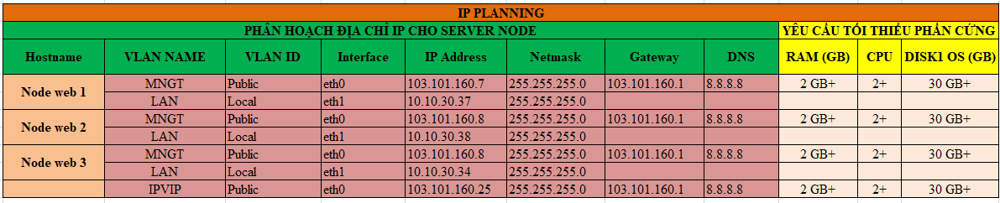
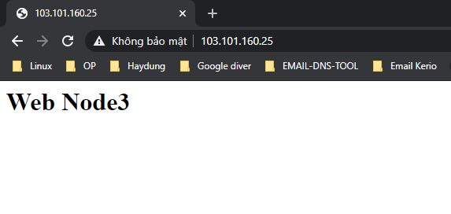

# Ghi chép lại các bước cài đặt, triển khai Haproxy Keepalive cho Apache trên CentOS 7

### Mục lục

[1. Mô hình](#mohinh)<br>
[2. Quy hoạch IP](#ip)<br>
[3. Chuẩn bị](#chuanbi)<br>
[4. Triển khai Haproxy Keepalive cho Apache trên CentOS 7](#caidat)<br>

<a name="mohinh"></a>
## 1. Mô hình

- Mô hình đấu nối


- Mô hình hoạt động


<a name="ip"></a>
## 2. Quy hoạch IP



<a name="chuanbi"></a>
## 3. Chuẩn bị

Chuẩn bị chung thực hiện trên cả 3 node:

**Thiết lập IP**

```
hostnamectl set-hostname node1
sudo systemctl disable firewalld
sudo systemctl stop firewalld
sudo systemctl disable NetworkManager
sudo systemctl stop NetworkManager
sudo systemctl enable network
sudo systemctl start network
sed -i 's/SELINUX=enforcing/SELINUX=disabled/g' /etc/sysconfig/selinux
sed -i 's/SELINUX=enforcing/SELINUX=disabled/g' /etc/selinux/config
```

```
yum install epel-release -y
yum update -y
```

**Cài đặt NTPD**

```
yum install chrony -y 

systemctl start chronyd 
systemctl enable chronyd
systemctl restart chronyd 

chronyc sources -v
```

```
sudo date -s "$(wget -qSO- --max-redirect=0 google.com 2>&1 | grep Date: | cut -d' ' -f5-8)Z"
ln -f -s /usr/share/zoneinfo/Asia/Ho_Chi_Minh /etc/localtime
```

**CMD log**

```
curl -Lso- https://raw.githubusercontent.com/nhanhoadocs/ghichep-cmdlog/master/cmdlog.sh | bash
```


<a name="caidat"></a>
## 4. Triển khai Haproxy Keepalive cho Apache trên CentOS 7

### 4.1. Cấu hình Apache

- Thực hiện trên node1

```
yum install httpd -y
cat /etc/httpd/conf/httpd.conf | grep 'Listen 80'
sed -i "s/Listen 80/Listen 10.10.30.37:8081/g" /etc/httpd/conf/httpd.conf

echo '<h1>Web Node1</h1>' > /var/www/html/index.html
systemctl start httpd
systemctl enable httpd
```


- Thực hiện trên node2

```
yum install httpd -y
cat /etc/httpd/conf/httpd.conf | grep 'Listen 80'
sed -i "s/Listen 80/Listen 10.10.30.38:8081/g" /etc/httpd/conf/httpd.conf

echo '<h1>Web Node2</h1>' > /var/www/html/index.html
systemctl start httpd
systemctl enable httpd
```


- Thực hiện trên node3

```
yum install httpd -y
cat /etc/httpd/conf/httpd.conf | grep 'Listen 80'
sed -i "s/Listen 80/Listen 10.10.30.34:8081/g" /etc/httpd/conf/httpd.conf

echo '<h1>Web Node3</h1>' > /var/www/html/index.html
systemctl start httpd
systemctl enable httpd
```


### 4.2. Cấu hình Keepalive

**- Cài đặt trên 3 node**

```
yum install keepalived -y
```

```
cp /etc/keepalived/keepalived.conf /etc/keepalived/keepalived.conf.bak
```

```
systemctl start keepalived
systemctl enable keepalived
```

**- Cấu hình keepalive**

Chỉnh sửa file `/etc/keepalived/keepalived.conf`

- Trên `node1`

```
vrrp_script chk_haproxy {
    script "killall -0 haproxy"
    interval 2
    weight 2
}
vrrp_instance VI_1 {
    interface eth0
    state MASTER
    virtual_router_id 51
    priority 101
    virtual_ipaddress {
        103.101.160.25/24
    }
    track_script {
        chk_haproxy
    }
}
```

```
systemctl restart keepalived
```

- Trên `node2`


```
vrrp_script chk_haproxy {
    script "killall -0 haproxy"
    interval 2
    weight 2
}
vrrp_instance VI_1 {
    interface eth0
    state BACKUP
    virtual_router_id 51
    priority 100
    virtual_ipaddress {
        103.101.160.25/24
    }
    track_script {
        chk_haproxy
    }
}
```

```
systemctl restart keepalived
```


- Trên `node3`


```
vrrp_script chk_haproxy {
    script "killall -0 haproxy"
    interval 2
    weight 2
}
vrrp_instance VI_1 {
    interface eth0
    state BACKUP
    virtual_router_id 51
    priority 99
    virtual_ipaddress {
        103.101.160.25/24
    }
    track_script {
        chk_haproxy
    }
}
```

```
systemctl restart keepalived
```


### 4.2. Cấu hình haproxy

Thực hiện trên tất cả các node.

```
sudo yum install wget socat -y
wget http://cbs.centos.org/kojifiles/packages/haproxy/1.8.1/5.el7/x86_64/haproxy18-1.8.1-5.el7.x86_64.rpm 
yum install haproxy18-1.8.1-5.el7.x86_64.rpm -y
```

```
cp /etc/haproxy/haproxy.cfg /etc/haproxy/haproxy.cfg.bak
```


```
echo 'global
    log         127.0.0.1 local2
    chroot      /var/lib/haproxy
    pidfile     /var/run/haproxy.pid
    maxconn     4000
    user        haproxy
    group       haproxy
    daemon
    stats socket /var/lib/haproxy/stats

defaults
    mode                    http
    maxconn                 8000
    log                     global
    option                  httplog
    option                  dontlognull
    option http-server-close
    retries                 3
    timeout http-request    20s
    timeout queue           1m
    timeout connect         10s
    timeout client          1m
    timeout server          1m
    timeout http-keep-alive 10s
    timeout check           10s

listen stats
    bind *:8080 interface ens160
    mode http
    stats enable
    stats uri /stats
    stats realm HAProxy\ Statistics
    stats admin if TRUE

listen web-backend
    bind *:80
    balance  roundrobin
    cookie SERVERID insert indirect nocache
    mode  http
    option  httpchk
    option  httpclose
    option  httplog
    option  forwardfor
    server node1 10.10.30.37:8081 check cookie node1 inter 5s fastinter 2s rise 3 fall 3
    server node2 10.10.30.38:8081 check cookie node2 inter 5s fastinter 2s rise 3 fall 3
    server node3 10.10.30.34:8081 check cookie node3 inter 5s fastinter 2s rise 3 fall 3' > /etc/haproxy/haproxy.cfg

```

- Cấu hình Log cho HAProxy

```
sed -i "s/#\$ModLoad imudp/\$ModLoad imudp/g" /etc/rsyslog.conf
sed -i "s/#\$UDPServerRun 514/\$UDPServerRun 514/g" /etc/rsyslog.conf
echo '$UDPServerAddress 127.0.0.1' >> /etc/rsyslog.conf

echo 'local2.*    /var/log/haproxy.log' > /etc/rsyslog.d/haproxy.conf

systemctl restart rsyslog
```

- Bổ sung cấu hình cho phép kernel có thể binding tới IP VIP

```
echo 'net.ipv4.ip_nonlocal_bind = 1' >> /etc/sysctl.conf
sysctl -p
```

```
systemctl restart haproxy
systemctl enable haproxy
```

- Truy cập trang quản trị haproxy

```
http://IP_VIP:8080/stats
```

```
http://103.101.160.25:8080/stats
```


- Truy cập web server thông qua IP VIP

Cấu hình `sticky session` (thể hiện ở config `cookie node1`, `cookie node2`, `cookie node3` trong file config của haproxy) trên request vì vậy trong một thời điểm chỉ có thể kết nối tới 1 web server. Để truy cập tới các webserver còn lại mở trình duyệt ẩn danh và truy cập lại.





### 4.3. Test case

- Down node 1 IP VIP nhảy sang node 2


- Down node 1, node 2 IP VIP nhảy sang node 3


