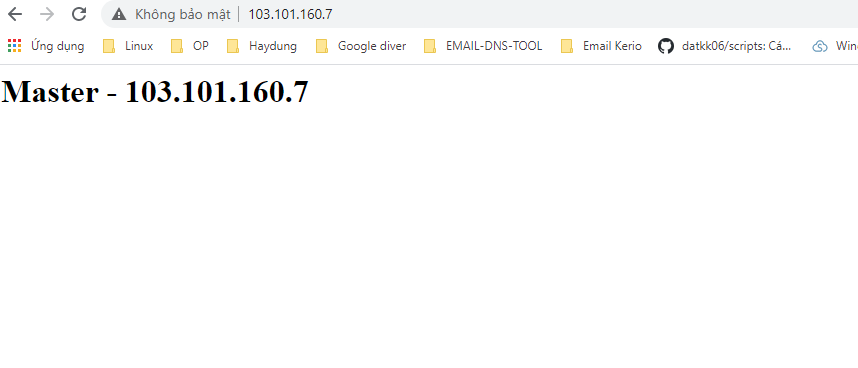
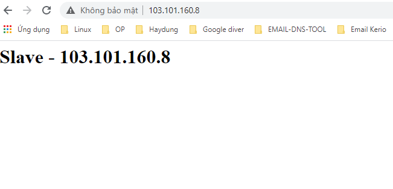
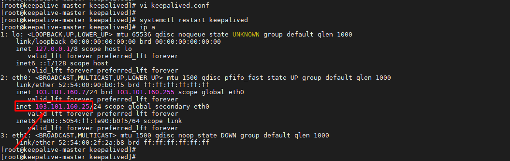
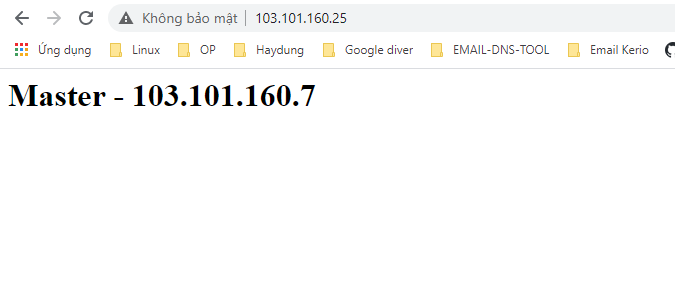
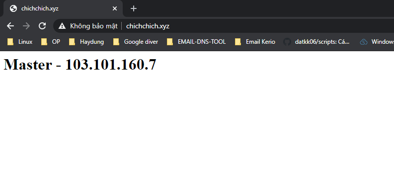
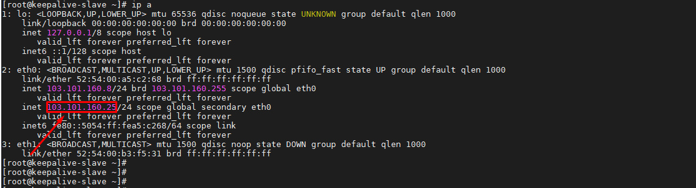
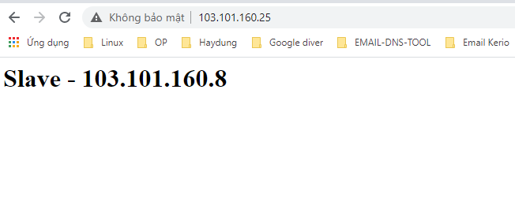
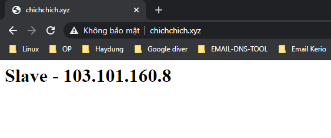
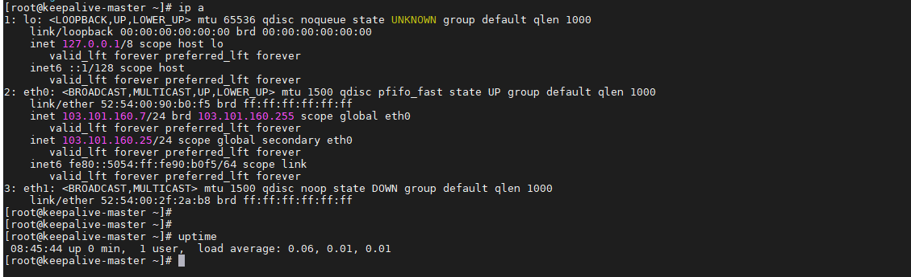
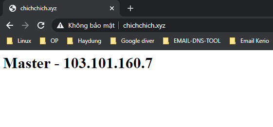

# Ghi chép lại các bước cài đặt, triển khai keepalive cho dịch vụ web server apache.


### Mục lục

[1. Mô hình](#mohinh)<br>
[2. Quy hoạch IP](#ip)<br>
[3. Chuẩn bị](#chuanbi)<br>
[4.Triển khai keepalive web apache](#caidat)<br>

<a name="mohinh"></a>
## 1. Mô hình

Z"
ln -f -s /usr/share/zoneinfo/Asia/Ho_Chi_Minh /etc/localtime
```

**CMD log**

```
curl -Lso- https://raw.githubusercontent.com/nhanhoadocs/ghichep-cmdlog/master/cmdlog.sh | bash
```

<a name="caidat"></a>
## 4.Triển khai keepalive web apache

### 4.1. Cài đặt webserver apache

Thực hiện trên cả 2 node master, slave

```
yum install httpd -y
systemctl start httpd
systemctl enable httpd
```






### 4.2. Cài đặt keepalive trên 2 node

```
yum install keepalived -y
```

```
cp /etc/keepalived/keepalived.conf /etc/keepalived/keepalived.conf.bak
```

```
systemctl start keepalived
systemctl enable keepalived
```

### 4.3. Cấu hình keepalive

**Thực hiện trên node master**

Chỉnh sửa file `/etc/keepalived/keepalived.conf`

```
vrrp_script chk_httpd {
    script "killall -0 httpd"
    interval 2
    weight 2
}
vrrp_instance VI_1 {
    interface eth0
    state MASTER
    virtual_router_id 51
    priority 101
    virtual_ipaddress {
        103.101.160.25/24
    }
    track_script {
        chk_httpd
    }
}
```

```
systemctl restart keepalived
```

**Thực hiện trên node slave**

Chỉnh sửa file `/etc/keepalived/keepalived.conf`

```
vrrp_script chk_httpd {
    script "killall -0 httpd"
    interval 2
    weight 2
}
vrrp_instance VI_1 {
    interface eth0
    state BACKUP
    virtual_router_id 51
    priority 99
    virtual_ipaddress {
        103.101.160.25/24
    }
    track_script {
        chk_httpd
    }
}
```

```
systemctl restart keepalived
```

Kiểm tra node `master` sẽ thấy `IP VIP 103.101.160.25` do keepalive quản lý.




Thực hiện truy cập web server qua IP VIP

http://103.101.160.25/ hoặc `http://chichchich.xyz/` đã trỏ domain về IP IP.






**- Giải thích các tham số cơ bản trong cấu hình keepalive**

Cấu trúc cấu hình định nghĩa theo kiểu các block config.

`interval` kiểm tra trạng thái dịch vụ 2s mỗi lần.

`weight 2` nếu kiếm tra thành công có phản hồi trả về node sẽ được + 2 điểm.

`vrrp_instance` là block cấu hình chính.

`interface` tên card mạng sẽ cấu hình cho IP VIP nhảy vào.

`state` trạng thái node đó đóng cài trò gì `MASTER` hoặc `BACKUP`

`priority` trên mỗi node là giá trị khác nhau càng lớn độ ưu tiên càng cao sử dụng trong quá trình bầu master.

`virtual_router_id` ID định tuyền giữa các node có chung một giá trị nữa các node.

`track_script`  giúp keepalived xác định node nào sẽ nắm IP VI. Trong ví dụ node master được cấu hình với độ ưu tiên bằng 101. Nếu node master kiểm tra dịch vụ httpd thành công thì độ ưu tiên của nó không đổi nhưng nếu kiếm tra thất bại thì độ ưu tiên của node master sẽ giảm đi 2 và thập hơn node slave. Khi đó node slave sẽ được chuyển IP VIP sang. Đây là cách dịch vụ keepalived hoạt động.

### 4.4. Test case

- Node master up IP VIP sẽ ở trên node master và dịch vụ sẽ đọc vào node master


- Tắt node master

IP VIP sẽ nhảy sang node slave



Dịch vụ sẽ đọc vào node slave





- Bật lại node master

IP VIP sẽ ở trên node master và dịch vụ sẽ đọc vào node master






### Tham khảo

https://blog.cloud365.vn/linux/haproxy-keepalived-apache/


