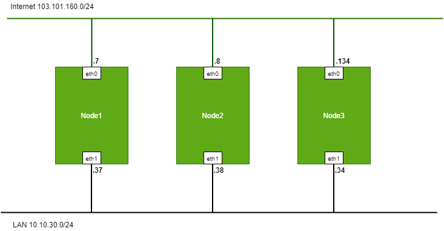
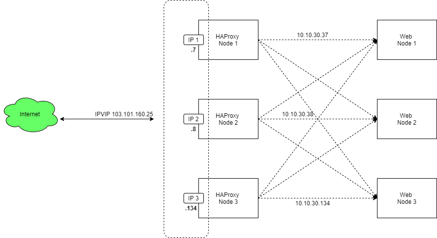
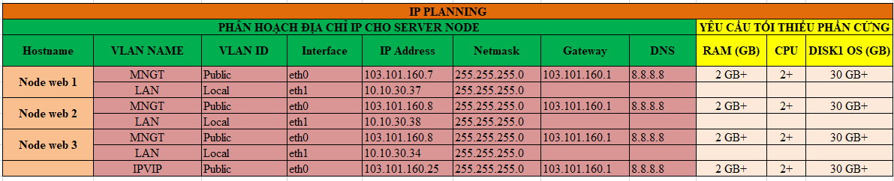
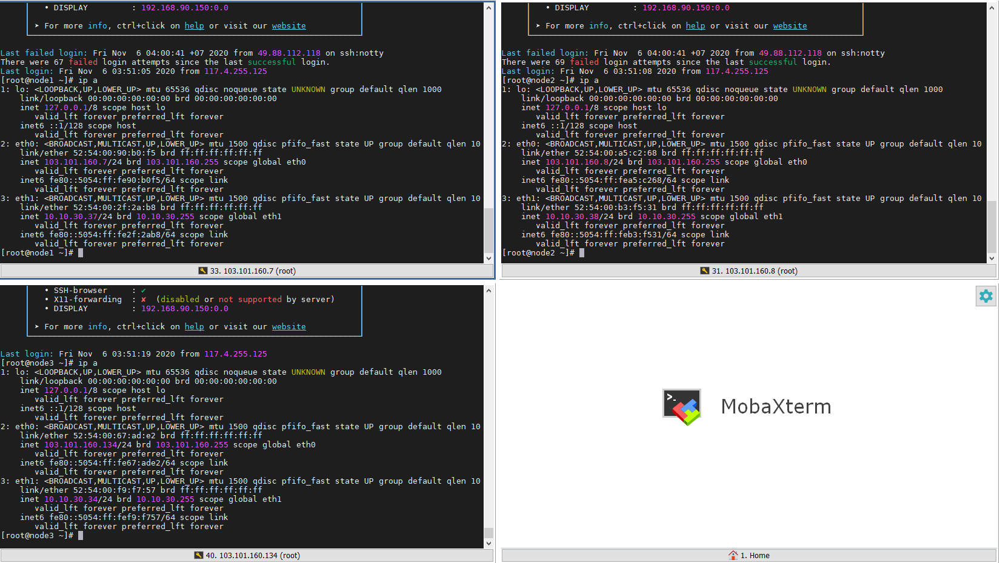

# Ghi chép lại các bước cài đặt, triển khai Haproxy Keepalive cho Apache trên CentOS 7

### Mục lục

[1. Mô hình](#mohinh)<br>
[2. Quy hoạch IP](#ip)<br>
[3. Chuẩn bị](#chuanbi)<br>
[4. Triển khai Haproxy Keepalive cho Apache trên CentOS 7](#caidat)<br>

<a name="mohinh"></a>
## 1. Mô hình

- Mô hình đấu nối



- Mô hình hoạt động



<a name="ip"></a>
## 2. Quy hoạch IP



<a name="chuanbi"></a>
## 3. Chuẩn bị

Chuẩn bị chung thực hiện trên cả 3 node:

**Thiết lập IP**

```
hostnamectl set-hostname node1
sudo systemctl disable firewalld
sudo systemctl stop firewalld
sudo systemctl disable NetworkManager
sudo systemctl stop NetworkManager
sudo systemctl enable network
sudo systemctl start network
sed -i 's/SELINUX=enforcing/SELINUX=disabled/g' /etc/sysconfig/selinux
sed -i 's/SELINUX=enforcing/SELINUX=disabled/g' /etc/selinux/config
```

```
yum install epel-release -y
yum update -y
```

**Cài đặt NTPD**

```
yum install chrony -y 

systemctl start chronyd 
systemctl enable chronyd
systemctl restart chronyd 

chronyc sources -v
```

```
sudo date -s "$(wget -qSO- --max-redirect=0 google.com 2>&1 | grep Date: | cut -d' ' -f5-8)Z"
ln -f -s /usr/share/zoneinfo/Asia/Ho_Chi_Minh /etc/localtime
```

**CMD log**

```
curl -Lso- https://raw.githubusercontent.com/nhanhoadocs/ghichep-cmdlog/master/cmdlog.sh | bash
```



<a name="caidat"></a>
## Triển khai Haproxy Keepalive cho Apache trên CentOS 7


