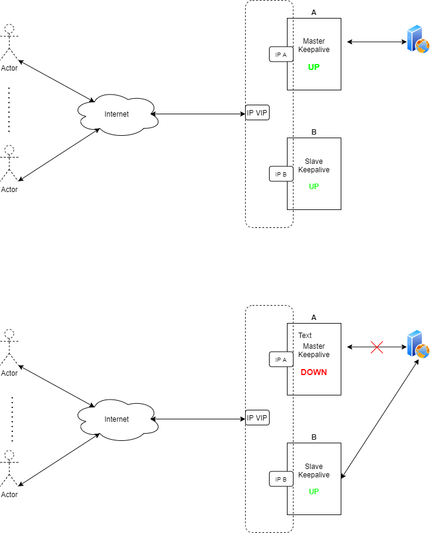

## Tổng quan về giải pháp keepalive

- Keepalive có thể coi là một giải pháp đảm bảo tính sẵn sàng của hệ thống, đảm bảo tính HA (High Available), ngay ở cái tên cũng có thể gợi nhớ là giữ lấy sự sống, sự sống ở đây là hệ thống của một hệ thống nào đó (network, system...)

### Thành phần chính:

+ `Keepalive interval`: Thời gian giữa các lần gửi gói tin keepalive từ thiết bị. Giá trị này có thể cấu hình tùy chỉnh.

+ `keepalive retries:` Số lần mà một thiết bị cố gắng gửi gói tin keepalive kiểm tra trạng thái khi không nhận được phản hồi từ thiết bị khác. Nếu quá số lần này thì có thể xem là thiết bị đầu kia có trạng thái đường kết nối đứt hoặc không còn hoạt động.

### Sự hoạt động

+ Một gói tin `keepalive` sẽ được gửi từ một thiết bị A với số thời gian quy định giữa các lần gửi, đến thiết bị B.

+ Sau khi gói tin keepalive đó gửi đi, A sẽ mong chờ một gói tin phản hồi từ B để kiểm tra đường kết nối giữa hai thiết bị đang hoạt động ổn định.

+ Nếu không nhận được gói tin phản hồi, thiết bị A sẽ gửi tiếp một số lần thử gửi lại gói tin (retries) và chờ đợi tiếp.

+ Nếu sau `n` lần không gửi gói tin keepalive vẫn không nhận được phản hồi thì lúc này, thiết bị A sẽ xem như thiết bị B đã down hoặc đường truyền giữa 2 thiết bị đã `down`.

+ Lúc này dịch vụ sẽ quyết định các hoạt động khác nếu thiết bị B down như là chuyển hướng data sang đường khác.

