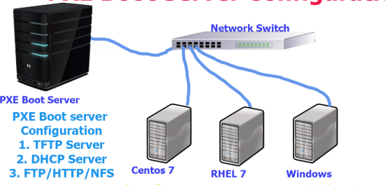
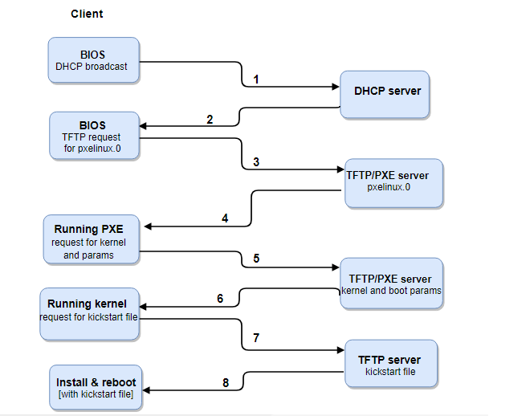

# Lý thuyết về cobbler

## 1. Tổng quát

### 1.1 Cơ chế PXE - Preboot eXecution Environment

- PXE (Preboot eXecution Environment) là cơ chế cho phép khởi động một phần mềm lấy qua mạng. Trong ngữ cảnh server vật lý để có thể khởi động PXE thì phía máy client cần NIC card mạng có khả năng PXE và hệ thống mạng có máy chủ DHCP và TFPT để cấp IP và phân bổ các image xuống client. PXE làm việc với network card (NIC) trong PC, biến NIC thành một boot device. PXE boot hệ điều hành cho các PC từ network bằng cách lấy một "boot image" từ server. File này có thể là một OS hay pre-OS cho PC. Bởi PXE làm việc cùng với NIC nên yêu cầu NIC phải có PXE-enable.

- Ngoài các hình thức cài đặt thông qua USB, đĩa CD, thì có thể cài đặt qua PXE server thông qua mạng internet, cài được hàng loạt các thiệt bị một lúc một cách tự động.

- PXE bao gồm 2 thành phần: PXE Client và PXE Server. 

+ PXE Client (PXE boot code) nằm trên card mạng. Các server, laptop hầu hết đều cho phép khởi động máy tính qua mạng với PXE boot code. Các mainboard có card mạng onboard cũng hầu hết có thành phần này. Card mạng có PXE boot code cũng được coi là một thiết bị khởi động giống như các thiết bị khởi động khác: ổ mềm, ổ cứng, ổ CD/DVD, ổ USB. 

+ PXE Server là phần mềm chạy trên một máy tính nào đó trong mạng LAN. Phần mềm này hỗ trợ các giao thức TFTP, DHCP.

**DHCP** cấp phát địa chỉ IP để các máy client có thể liên lạc với các máy khác và với TFTP server để lấy các file boot và file cấu hình cần thiết.

**TFTP** cung cấp dịch vụ truyền các file boot và file cấu hình cần thiết cho Client.

- Hoạt động PXE

PXE kích hoạt trên NIC của client sẽ gửi đi bản tin request tới DHCP server, để lấy được địa chỉ IP của nó và IP của máy chủ TFTP server, và vị trí các file boot trên TFTP server.

1) Máy client được khởi động NIC của client gửi đi bản tin broadcast để tìm DHCP server.

2) DHCP server nhận được bản tin của client và gửi lại các thông tin cần thiết cho client (IP, subnet mask, gateway, DNS ...). Và cung cấp cho client thông tin về vị trí của TFTP server và boot image (pxelinux.0 - đây là file chứa các mã lệnh để cho biết loại kernel mà hệ thống sẽ boot).

3) Khi client nhận được các thông tin này, nó sẽ liên lạc với TFTP server để lấy boot image.

4) TFTP server gửi lại boot image (pxelinux.0), và client sẽ sử lý nó.

5) Mặc định, boot image tìm được thư mục pxelinux.cfg trên TFTP server để lấy các file cấu hình

6, 7, 8) Client doownload tất cả các file cần thiết (filesystem, kickstart, ...) và tải về, client install và reboot.

### 1.2. Kickstart

- Hiểu đơn giản là phần cấu hình sẵn các thông số mặc định cho 1 os muốn cài thông qua PXE bỏ qua các bước "Next" và nhập các thông tin khi cài đặt. Các file Kickstart có thể được lưu trong một server riêng biệt (thường trong cùng PXE hoặc TFTP server), và có thể lấy được bởi bất kì máy tình nào trong suốt quá trình máy đó cài đặt

- Kickstart options

https://access.redhat.com/documentation/en-us/red_hat_enterprise_linux/6/html/installation_guide/s1-kickstart2-options

### 1.3. Cobbler

- Cobbler là một gói công cụ tiện ích cho phép triển khai hoàn chỉnh một máy chủ PXE server với khả năng cài đặt tự động các phiên bản Linux thông qua môi trường mạng đồng thời hỗ trợ kết hợp tính năng của file kickstart cho phép tự động hóa hoàn toàn quy trình cài đặt, loại bỏ hẳn các thao tác trả lời trong quá trình triển khai.
- Cobbler có thể cung cấp, quản lý DNS và DHCP, cập nhật gói, quản lý cấu hình...

## 2. Thành phần trong cobbler

- Cobbler cho phép tự động hóa nhiều bước khác nhau trong quá trình cài đặt Linux, giúp cho người quản trị dễ dàng hơn trong việc cài đặt số lượng lớn các client chạy hệ điều hành Linux với những cấu hình khác nhau.
- Các thành phần chính của Cobbler cũng tương tự như của một PXE server bình thường: TFTP server, DHCP server, Kickstart file. Cobbler còn có thêm một số phần nổi bật như:

+ Web server: cung cấp giao diện web tương tác cho người quản trị, thông qua đó quản lý các profile cũng như các máy trạm được cài đặt.
+ DNS server: Thành phần không bắt buộc

## 3. Đối tượng trong cobbler

+ Distro: Đại diện cho một hệ điều hành, chứa các thông tin về kernel và initrd, thêm vào đó là các dữ liệu khác như các thông số của kernel.

+ Profile: Chỉ tới các distro, một file kickstart, và các repository có thể, các dữ liệu khác như một vài thông số đặc biệt của kernel.

+ System: Đại diện cho các máy được cung cấp, nó chỉ tới một profile hoặc một image và chứa thông tin về IP và địa chỉ MAC, quản lý tài nguyên (địa chỉ, credential, type) và nhiều loại data chuyên biệt hơn.

+ Repository: Giữ thông tin về các mirror repo cho quá trình cài đặt và cập nhật phần mềm của các máy client.

+ Image: có thể thay thế cho distro cho các file mà không phù hợp với loại này.

## Tham khảo

https://github.com/hocchudong/ghichep-cobbler/blob/master/docs/1.Cobbler-Tong_quan.md
https://github.com/hocchudong/thuctap012017/blob/master/TamNT/PXE-Kickstart-Cobbler/docs/1.Tong_quan_PXE-Kickstart.md

