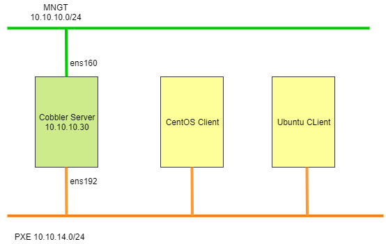

# Ghi chép các bước cài đặt Cobbler trên CentOS7

### Mục lục

[1. Mô hình triển khai](#mohinh)<br>
[2. Thiết lập ban đầu](#thietlap)<br>
[3. Cài đặt](#caidat)<br>

<a name="mohinh"></a>
## 1. Mô hình triển khai



- Bài lab thực hiện trên server cài đặt ảo hóa VMware.

- **Lưu ý**: Tắt DHCP server của mạng 10.10.14.0/24

<a name="thietlap"></a>
## 2. Thiết lập ban đầu

**Update**

```
yum install epel-release -y
yum update -y
```

**Cấu hình IP**


```
nmcli c modify ens160 ipv4.addresses 10.10.10.155/24
nmcli c modify ens160 ipv4.gateway 10.10.10.1
nmcli c modify ens160 ipv4.dns 8.8.8.8
nmcli c modify ens160 ipv4.method manual
nmcli con mod ens160 connection.autoconnect yes
sudo systemctl disable firewalld
sudo systemctl stop firewalld
sudo systemctl disable NetworkManager
sudo systemctl stop NetworkManager
sudo systemctl enable network
sudo systemctl start network
sed -i 's/SELINUX=enforcing/SELINUX=disabled/g' /etc/sysconfig/selinux
sed -i 's/SELINUX=enforcing/SELINUX=disabled/g' /etc/selinux/config
```

**Cài đặt NTPD**

```
yum install chrony -y 
```

```
systemctl start chronyd 
systemctl enable chronyd
systemctl restart chronyd 
```
 - Kiểm tra đồng bộ thời gian
 
```
chronyc sources -v
```

**Cài đặt CMD Log**

```
curl -Lso- https://raw.githubusercontent.com/nhanhoadocs/ghichep-cmdlog/master/cmdlog.sh | bash
```

<a name="caidat"></a>
## 3. Cài đặt


