# Ghi chép các bước cài đặt Cobbler trên CentOS7

### Mục lục

[1. Mô hình triển khai](#mohinh)<br>
[2. Thiết lập ban đầu](#thietlap)<br>
[3. Cài đặt](#caidat)<br>
[4. Cấu hình](#cauhinh)<br>

<a name="mohinh"></a>
## 1. Mô hình triển khai


- Bài lab thực hiện trên server cài đặt ảo hóa VMware.

- **Lưu ý**: Tắt DHCP server của mạng 10.10.14.0/24

<a name="thietlap"></a>
## 2. Thiết lập ban đầu

**Update**

```
yum install epel-release -y
yum update -y
```

**Cấu hình IP**


```
nmcli c modify ens160 ipv4.addresses 10.10.10.30/24
nmcli c modify ens160 ipv4.gateway 10.10.10.1
nmcli c modify ens160 ipv4.dns 8.8.8.8
nmcli c modify ens160 ipv4.method manual
nmcli con mod ens160 connection.autoconnect yes

nmcli c modify ens192 ipv4.addresses 10.10.14.30/24
nmcli c modify ens192 ipv4.method manual
nmcli con mod ens192 connection.autoconnect yes

sudo systemctl disable firewalld
sudo systemctl stop firewalld
sudo systemctl disable NetworkManager
sudo systemctl stop NetworkManager
sudo systemctl enable network
sudo systemctl start network
sed -i 's/SELINUX=enforcing/SELINUX=disabled/g' /etc/sysconfig/selinux
sed -i 's/SELINUX=enforcing/SELINUX=disabled/g' /etc/selinux/config
```

**Cài đặt NTPD**

```
yum install chrony -y 
```

```
systemctl start chronyd 
systemctl enable chronyd
systemctl restart chronyd 
```
 - Kiểm tra đồng bộ thời gian
 
```
chronyc sources -v
```

**Cài đặt CMD Log**

```
curl -Lso- https://raw.githubusercontent.com/nhanhoadocs/ghichep-cmdlog/master/cmdlog.sh | bash
```

<a name="caidat"></a>
## 3. Cài đặt

- Cài các package cần thiết cho cobbler

```
yum install cobbler cobbler-web dnsmasq syslinux xinetd bind bind-utils dhcp debmirror pykickstart fence-agents-all -y
```

+ **cobbler, cobbler-web**: Các package cài đặt chạy dịch vụ cobbler và giao diện web của cobbler.

+ **dnsmasq, bind, bind-utils, dhcp**: Các package chạy dịch vụ quản lý DNS và quản lý DHCP cho các máy client boot OS từ cobbler.

+ **syslinux**: Một chương trình bootloader và tiện ích cho phép đẩy vào client cho phép client boot OS qua mạng.(pxelinux)

+ **xinetd**: Tạo socket kết nối với máy client. Dựa vào cổng và giao thức (tcp hay udp) nó biết được phải trao đổi dữ liệu mà nó nhận được với back-end nào dựa vào thuộc tính server trong file cấu hình. Được sử dụng để quản lý và tạo socket cho TFTP server truyền file boot cho client.

+ **debmirror**: Package cài đặt cho phép tạo một mirror server chứa các gói phần mềm cài đặt của các distro trên một server local.
 
+ **pykickstart**: thư viện python cho phép đọc và chỉnh sửa nội dung file kickstart, hỗ trợ cobbler chỉnh sửa file kickstart thông qua giao diện web.

+ **fence-agents-all**

- Enable service

```
systemctl start cobblerd
systemctl enable cobblerd
systemctl start httpd
systemctl enable httpd
```

<a name="cauhinh"></a>
## 4. Cấu hình cobbler

- **Thực hiện sửa file cấu hình của Cobbler, file cấu hình Cobbler `/etc/cobbler/settings` **

+ Cấu hình password, sử dụng openssl để sinh ra mật khẩu đã được mã hóa:

```
openssl passwd -1
```
Ví dụ:

```
[root@cobbler ~]# openssl passwd -1
Password:
Verifying - Password:
$1$LZPjRqrT$1Co2OVdHMuNluneJkDPex.
[root@cobbler ~]#
```
+ Sửa file `/etc/cobbler/settings` với các thông số `default_password_crypted` (dòng 101)với password đã được mã hóa vừa sinh ra ở trên, và cập nhật các thông số của DHCP, DNS, PXE từ 0 lên 1 như sau:

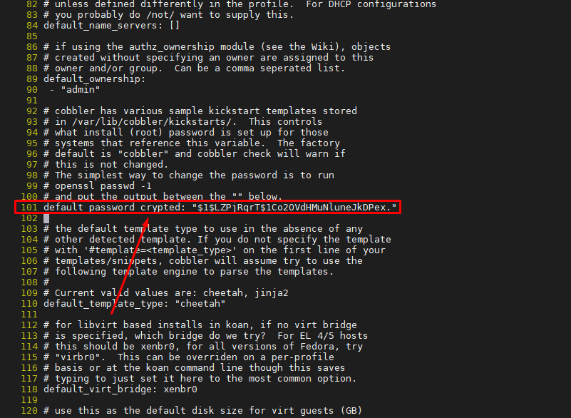

`password` này được sử dụng để làm password mặc định cho client khi được cấu hình trong file kickstart sử dụng với tùy chọn --iscrypted

```
#Root password
rootpw --iscrypted $default_password_crypted
```
+ Để thực hiện boot PXE, cần một DHCP server để cấp phát IP và chuyển hướng trực tiếp client boot tới TFTP server nơi chứa các file boot. Cobbler có thể quản lý và thực hiện việc này và quản lý dịch vụ DNS. Cấu hình thông qua sửa đồi thông số manage_dhcp và manage_dns(cho phép dịch vụ DHCP, DNS chạy local trên máy server). 

```
sed -i 's/manage_dhcp: 0/manage_dhcp: 1/g' /etc/cobbler/settings
sed -i 's/manage_dns: 0/manage_dns: 1/g' /etc/cobbler/settings
```

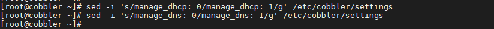

+ Kích hoạt cho phép boot các file cấu hình cài đặt OS qua card mạng

```
sed -i 's/pxe_just_once: 0/pxe_just_once: 1/g' /etc/cobbler/settings
```

+ Chỉnh sửa IP của TFTP server (next_server) và IP của Cobbler (server).

```
sed -i 's/next_server: 127.0.0.1/next_server: 10.10.14.30/g' /etc/cobbler/settings
sed -i 's/server: 127.0.0.1/server: 10.10.14.30/g' /etc/cobbler/settings
```

`server` là địa chỉ IP của cobbler server (không nên sử dụng địa chỉ 0.0.0.0, nên sử dụng địa chỉ IP mà bạn muốn các client sử dụng để liên lạc với cobbler server với các giao thức như http, tftp), `next_server` là địa chỉ IP của TFTP server mà các file boot (kernel, initrd) được lấy về. Ở hướng dẫn này cài tất cả trên cobbler server nên khai báo là địa chỉ sải PXE cobbler server.

- **Cập nhật file cấu hình DHCP và DNSMASQ**

+ Cấu hình dải DHCP cho phép Cobbler cấp phát cho Client, và thông tin về các file pxelinux.0 gửi về cho client. cho phép trong dải từ 10.10.14.210 tới 10.10.14.220

Sửa trong file `/etc/cobbler/dhcp.template` như sau:

```
subnet 10.10.14.0 netmask 255.255.255.0 {
     option routers             10.10.14.1;
     option domain-name-servers 8.8.8.8;
     option subnet-mask         255.255.255.0;
     range dynamic-bootp        10.10.14.210 10.10.14.220;
     default-lease-time         21600;
     max-lease-time             43200;
     next-server                $next_server;
     class "pxeclients" {
          match if substring (option vendor-class-identifier, 0, 9) = "PXEClient";
          if option pxe-system-type = 00:02 {
                  filename "ia64/elilo.efi";
          } else if option pxe-system-type = 00:06 {
                  filename "grub/grub-x86.efi";
          } else if option pxe-system-type = 00:07 {
                  filename "grub/grub-x86_64.efi";
          } else if option pxe-system-type = 00:09 {
                  filename "grub/grub-x86_64.efi";
          } else {
                  filename "pxelinux.0";
          }
     }

}
```
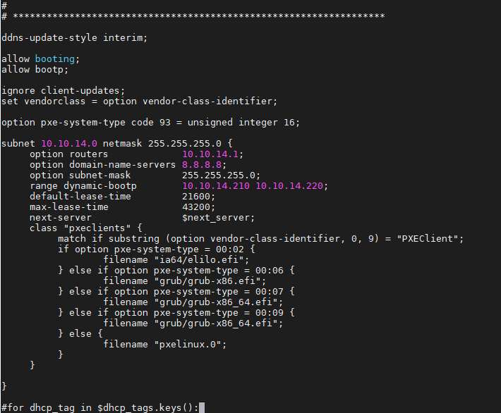

+ Cập nhật dải địa chỉ IP được cấp phát cho client trong file `/etc/cobbler/dnsmasq.template`

```
dhcp-range=10.10.14.210,10.10.14.220
```


+ Sửa `disable = yes` thành `disable = no` trong file `/etc/xinetd.d/tftp`

```
service tftp
{
        socket_type             = dgram
        protocol                = udp
        wait                    = yes
        user                    = root
        server                  = /usr/sbin/in.tftpd
        server_args             = -s /var/lib/tftpboot
        disable                 = no
        per_source              = 11
        cps                     = 100 2
        flags                   = IPv4
}
```
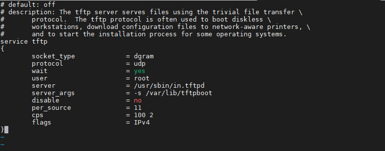

+ Comment `@dists="sid";` và `@arches="i386";` trong file `/etc/debmirror.conf` để hỗ trợ các distro debian (dòng 28, 30)

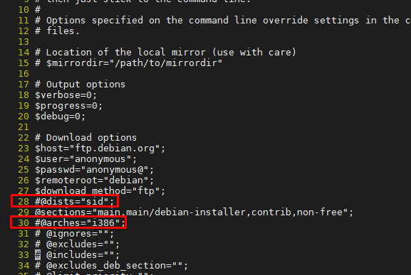

+ Khởi động lại một số service

```
systemctl enable rsyncd.service
systemctl restart rsyncd.service
systemctl restart cobblerd
systemctl restart xinetd
systemctl enable xinetd
cobbler get-loaders
cobbler check
cobbler sync
systemctl enable dhcpd
```

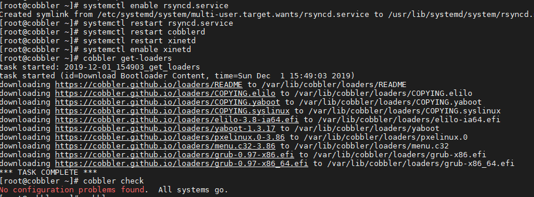
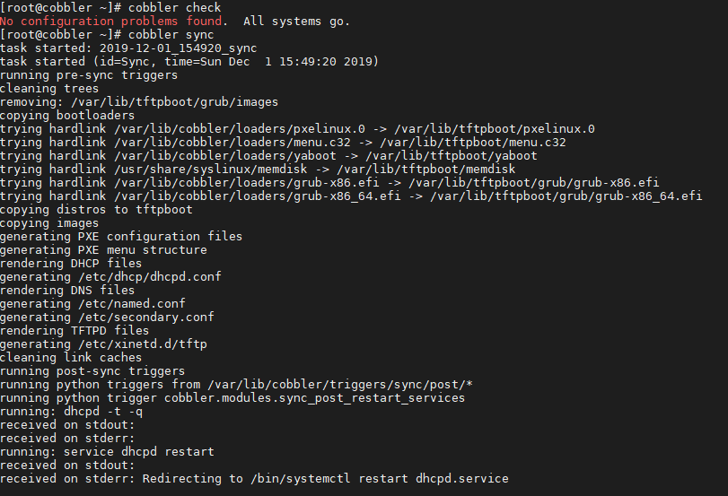
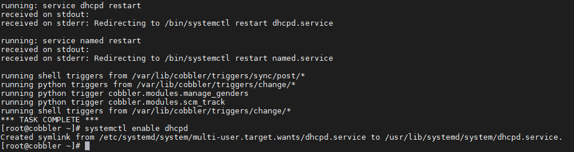

- **Truy cập vào giao diện Web**

```
https://ip_cobbler_server/cobbler_web/
```

```
https://10.10.10.30/cobbler_web/
```
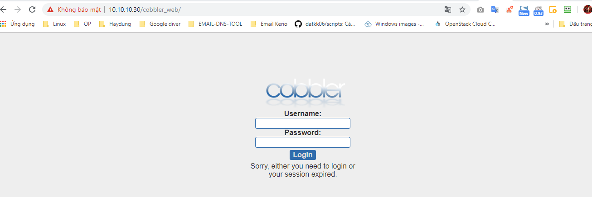

Tài khoản mặc định có username là `cobbler`, mật khẩu là `cobbler` .

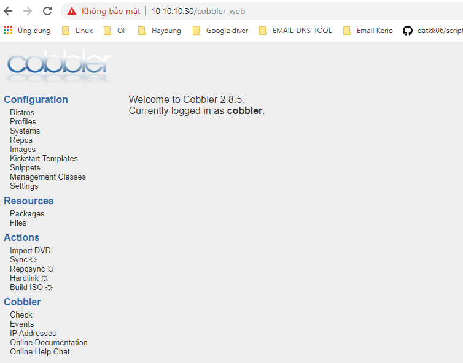


**Lưu ý**: Cobbler server đã cài libvirt và có một vào mạng được tạo thì cần phải xóa tất cả các mạng đó, để tránh conflict với dnsmasq do libvirt quản lý.

+ Thay đổi password mặc định login web của user cobbler

```
htdigest /etc/cobbler/users.digest "Cobbler" cobbler
```

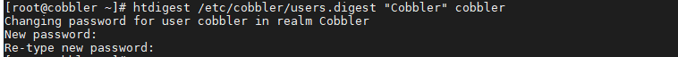

+ Thêm một user login web quản cobbler

```
htdigest /etc/cobbler/users.digest "Cobbler" duydm
```

Sau khi thêm user mới, kiểm tra lại user mới đã có chưa trong file `/etc/cobbler/users.digest` là được.

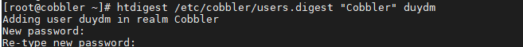

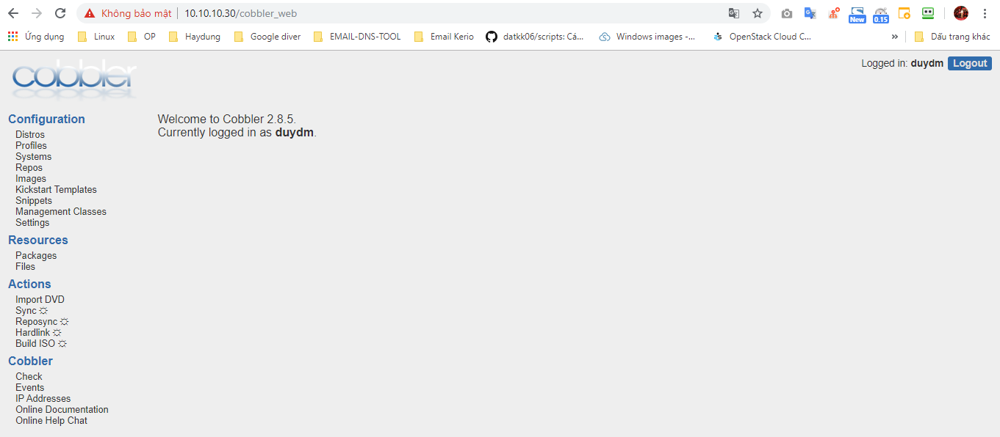

Cài đặt thành công cobbler

### Tham khảo

https://github.com/hocchudong/ghichep-cobbler/blob/master/docs/2.Cobbler-cai_dat_centos7.md


