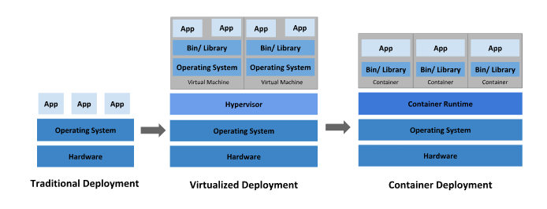

# Tổng quan về Kubernetes K8s

### Mục lục

[1. Kubernetes là gì?](#k8s)<br>
[2. Sự cần thiết của K8s](#canthiet)<br>


<a name="k8s"></a>
## 1. Kubernetes là gì?


`Kubernetes` là có thể hiểu là một giải pháp open source giúp system admin có thể triển khai - phát triển - public - scale - update ứng dụng dưới dạng container dễ dàng và có tính tự động.

`Kubernetes` còn được gọi là Container Orchestration Engine, là một trong các orchestration tools nằm trong hệ sinh thái của container (công cụ điều phối container). Kubernetes Orchestration cho phép người dùng xây dựng các dịch vụ ứng dụng mở rộng nhiều containers, lên lịch các containers đó trên một cụm máy chủ (cluster), mở rộng các containers và quản lý tình trạng của các containers theo thời gian.

`Kubernetes` loại bỏ rất nhiều các quy trình thủ công liên quan đến việc triển khai và mở rộng các containerized applications. Các đối tượng thuộc k8s được trừu tượng hóa để dễ dàng quản trị, và toàn bộ thao tác quản lý đều thao tác qua Kubernetes API.

`Kubernetes` có thể được triển khai trên một hoặc nhiều máy vật lý, máy ảo hoặc cả máy vật lý và máy ảo để tạo thành Kubernetes cluster.

Tên gọi `Kubernetes` có nguồn gốc từ tiếng Hy Lạp, có ý nghĩa là người lái tàu hoặc hoa tiêu. Google mở mã nguồn Kubernetes từ năm 2014. Kubernetes xây dựng dựa trên một thập kỷ rưỡi kinh nghiệm mà Google có được với việc vận hành một khối lượng lớn workload trong thực tế, kết hợp với các ý tưởng và thực tiễn tốt nhất từ cộng đồng.

<a name="k8s"></a>
## 2. Sự cần thiết của K8s

- Nhìn lại quá trình triển khai ứng dụng theo các cách từ xưa đến nay để thấy sự cần thiết của K8s 




- Triển khai ứng dụng kiểu truyền thống: 

```
+ Ứng dụng được triển khai trên các máy chủ (máy chủ vậy lý) độc lập, các thành phần của ứng dụng có thể triển khai chung ở một máy chủ hoặc riêng rẽ ở các máy chủ.

+ Không có sự phân chia rõ ràng tài nguyên cho các thành phần ứng dụng

+ Không có cách nào để xác định ranh giới tài nguyên cho các ứng dụng trong máy chủ vật lý và điều này gây ra sự cố phân bổ tài nguyên. Có thể phải triển khai nhiều máy chủ.

+ Khó quản lý, mở rộng một cách nhanh chóng.
```

- Triển khai ứng dụng kiểu ảo hóa:

```
+ Đã có sự thay đổi trong cách thức triển khai 

+ Ảo hóa chạy nhiều trên CPU của một máy chủ vật lý, cho phép các ứng dụng được cô lập giữa các VM và có tính bảo mật vì thông tin của một ứng dụng không thể được truy cập tự do bởi một ứng dụng khác.

+ Ảo hóa cho phép sử dụng tốt hơn các tài nguyên trong một máy chủ vật lý và cho phép khả năng mở rộng tốt hơn vì một ứng dụng có thể được thêm hoặc cập nhật dễ dàng, giảm chi phí phần cứng. 

+ Có thể triển khai ảo hóa dưới dạng cluster để cấp phát tài nguyên.

+ Mỗi VM tất cả các thành phần, bao gồm cả hệ điều hành bên trên phần cứng được ảo hóa. 
```

- Triển khai ứng dụng kiểu container:

Các container tương tự như VM, nhưng chúng có tính cô lập để chia sẻ OS giữa các ứng dụng. Nên container nhẹ (lightweight). Một container có hệ thống tệp (filesystem), CPU, bộ nhớ, process space.... Có thể chuyển các container đi các nền tảng tương thích khác.

**Lợi ích của container**:

```
+ Tạo mới và triển khai ứng dụng nhanh chóng: gia tăng tính dễ dàng và hiệu quả của việc tạo các container image so với việc sử dụng VM image.

+ Phát triển, tích hợp và triển khai liên tục: cung cấp khả năng build và triển khai container image thường xuyên và đáng tin cậy với việc rollbacks dễ dàng, nhanh chóng.

+ Phân biệt giữa Dev và Ops: tạo các images của các application container tại thời điểm build/release thay vì thời gian triển khai, do đó phân tách các ứng dụng khỏi hạ tầng.

+ Khả năng quan sát không chỉ hiển thị thông tin và các metric ở mức OS, mà còn cả application health và các thông số khác.

+ Tính nhất quán về môi trường trong suốt quá trình phát triển, testing và trong production.

+ Tính khả chuyển trên cloud và các bản phân phối HĐH: Chạy trên Ubuntu, RHEL, CoreOS, on-premises, Google Kubernetes Engine và bất kì nơi nào khác.

+ Quản lý tập trung ứng dụng: Tăng mức độ trừu tượng từ việc chạy một OS trên phần cứng ảo hóa sang chạy một ứng dụng trên một OS bằng logical resources.

+ Các micro-services phân tán, elastic: ứng dụng được phân tách thành các phần nhỏ hơn, độc lập và thể được triển khai và quản lý một cách linh hoạt - chứ không phải một app nguyên khối (monolithic).

+ Cô lập các tài nguyên, sử dụng tài nguyên: hiệu quả
```


### Tham khảo

https://kubernetes.io/vi/docs/concepts/overview/what-is-kubernetes/

