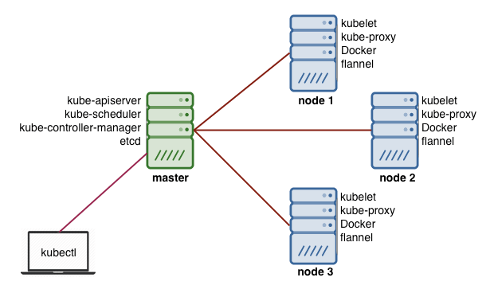
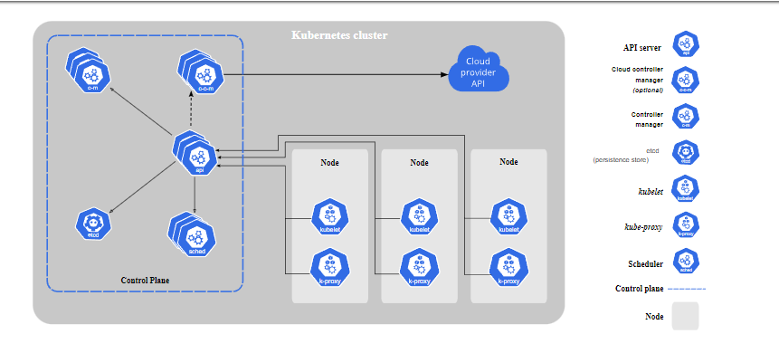
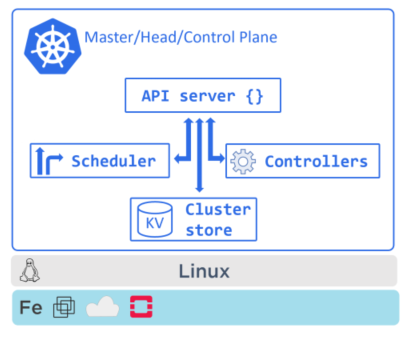
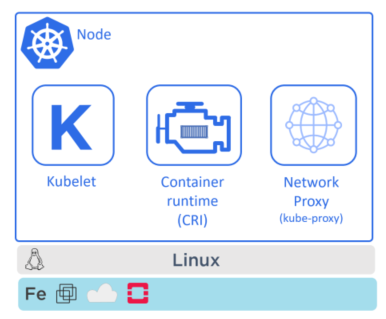
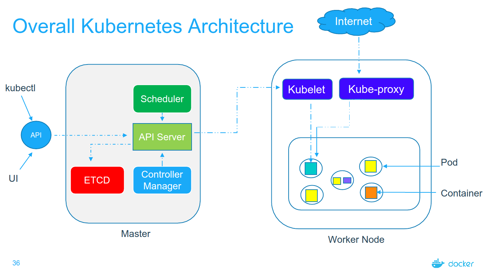
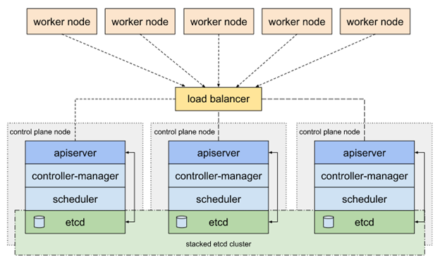

# Kiến trúc, thành phần, sự hoạt động của K8s 

### Mục lục

[1. Kiến trúc Kubernetes](#kientruc)<br>
[2. Sự hoạt động giữa các thành phần trong K8s](#suhoatdong)<br>
[3. Kiến trúc Kubernetes HA](#k8sha)<br>

<a name="kientruc"></a>
## 1. Kiến trúc Kubernetes

Kiến trúc Kubernetes cluster tương đối đơn giản, người dùng không bao giờ thao tác trực tiếp với Node, toàn bộ hoạt động quản trị sẽ thao tác với control plane bằng API.

Thuật ngữ `node` được hiểu là các máy chủ `vật lý` hoặc `ảo hóa` có cài đặt `container runtime`.

Thuật ngữ `cluster` được hiểu là cụm các máy chủ có vai trò giống nhau và hoạt động tương tự nhau, có thể thay thế lẫn nhau.

Kiến trúc Kubernetes cluster bao gồm 02 thành phần chính:

```
Control plane (Master Node)
Node (Woker Node)
```





Thông thường sẽ cài đặt sao cho hai thành phần này nằm độc lập nhau.

`Master node`  có thể được gọi là Master, Head, Head node. Còn `Worker node` có một số tên gọi khác như Minion, Node, Worker.

Việc tính toán cấu hình máy chủ của thành phần này là khác nhau. 

```
+ Với Master node thì sẽ sizing sao cho đảm bảo được tính sẵn sàng cao (nhiều hơn 2 máy chủ), và cấu hình để làm sao quản lý được số lượng Worker node hợp lý.  Vì các Worker sẽ giao tiếp với Master để báo cáo cũng như nhận chỉ thị, càng nhiều Worker node thì cấu hình càng phải cao. 

+ Sizing cho Worker node thì đơn giản hơn theo tư tưởng 1 node worker bị down thì tài nguyên ở các node worker còn lại đủ để chạy.
```

### 1.1. Control plane - Master Node

Control plane - Master Node là thành phần điều khiển toàn bộ các hoạt động chung và kiểm soát các container trên node worker.



Các thành phần chính trên master node bao gồm:

- API-server (kube-apiserver): Là đầu vào của mọi kết nối trong Kubernetes Cluster

```
+ Thành phần tiếp nhận yêu cầu người dùng hoặc ứng dụng khác
+ Sử dụng khi người dùng hoặc ứng dụng khác muốn ra chị thị đối với Kubernetes Cluster
+ Thao tác thông qua API REST
+ Hoạt động trên port 6443 (HTTPS) và 8080 (HTTP).
+ Nằm tại node Master.
```

- Controller manager (kube-controller-manager): Thực hiện các công tác điều khiển vòng lặp (control loop). Có rất nhiều thành phần điều khiển nhỏ hơn bên trong như Replication controller, Node controller, Endpoints controller... 

```
+ Thành phần quản lý Kubernetes Cluster
+ Xử lý các yêu cầu người dùng hoặc ứng dụng khác, bảo đảm các tiến trình, service chạy trong Kubernetes chạy chính xác
+ Sử dụng Port 10252
```

- Schedule (kube-scheduler): Thực hiện việc lập lịch để chạy ứng dụng trên các Worker node.

```
+ Điều phối các Pods tới các Woker Node
+ Sử dụng Port 10251
```

- Etcd: Lưu trữ thông tin của toàn bộ Kubernetes Cluster. Mặc định sử dụng là etcd. Đối với hệ thống siêu nhỏ có thể thay thế etcd bằng sqlite.

```
+ Database phân tán, sử dụng ghi dữ liệu theo cơ chế key/value trong K8S cluster.
+ Etcd được cài trên node master và lưu tất cả các thông tin trong Cluser.
+ Etcd sử dụng port 2380 để listening từng request và port 2379 để client gửi request tới.
```

### Node - Worker Node

Node - Worker Node có vai trò làm môi trường chạy các container ứng dụng người dùng.




Worker Node có 3 thành cơ bản:

`Container runtime`: Môi trường chạy Container, công nghệ thường thấy nhất là Docker. Thực hiện pull image, start và stop container theo chỉ thị từ kubelet

`kubelet`: Nhận lệnh từ control plane (Master Node), để tạo mới, thao tác tắt bật các Container ứng dụng theo yêu cầu người dùng. Thực hiện tương tác với container runtime để quản trị vòng đời ứng dụng chạy trong container.

`kube-proxy`: Cho phép người dùng truy cập vào các ứng dụng đang chạy trong Kubernetes Cluster (trong môi trường Container). Tương tác với iptables để thiết lập các chính sách truy cập.


<a name="suhoatdong"></a>
## 2. Sự hoạt động giữa các thành phần trong K8s




Xem hình minh họa để ý chiều các mũi tên

API server chính là nơi giao tiếp giữa các thành phần, gõ lệnh tương tác qua CLI (Command Line Interface) hay qua RESTful API thì cũng phải qua API server.

Từ Worker node, thì kube-proxy và Kubelet gọi tới API server để báo cáo trạng thái cũng như nhận các chỉ thị cần thực hiện.

Bên trong Master node thì chỉ có API server mới có thể tương tác với etcd. 

Có trường hợp Master node kết nối sang Worker node, kết nối từ API server sang Worker node thực hiện khi gửi yêu cầu kết nối tới các container (khi lấy log ở các stdout, hay thực hiện truy cập vào console của container. API server sẽ kết nối tới Kubelet để thực hiện các truy cập vào container)

<a name="k8sha"></a>
## 3. Kiến trúc Kubernetes HA



### Tham khảo

https://kubernetes.io/docs/concepts/overview/components/


