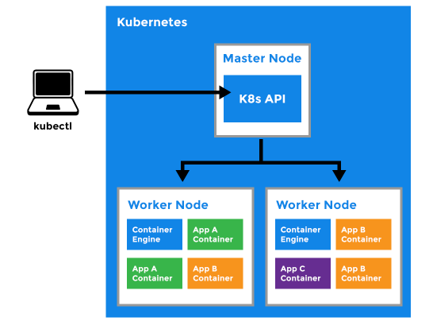
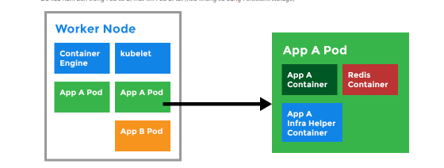
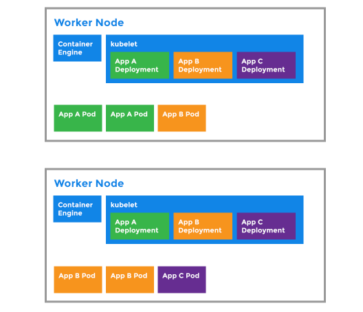

# Các khái niệm cơ bản trong K8s

Để biết và hiểu các thuật ngữ chuyên sâu thì phải bắt đầu từ các khái niệm thuật ngữ cơ bản.


- Kubectl: CLI Quản trị K8s


- Master Node: Thành phần quản trị các Node, tiệp nhận và xử lý các yêu cầu từ người dùng, người quản trị


- Worker Node: Được quản lý bởi Master Node, tiếp nhận các yêu cầu từ Master Node, chạy các Pods (Các container chạy trong Pods). Nơi chạy môi trường Container (như Docker Engine), thực hiện các thao tác downloading images, chạy các containers



- Kubelet: Nằm tại Worker Node, tiếp nhận chỉ thị bởi Master Node. Đảm bảo các Container chạy trên Worker node chạy chính xác.

- Kubernetes Pod

```
+ Pod có thể bao gồm 1 hoặc nhiều Container
+ Pod là 1 thực thể thuộc Deployments
+ Mỗi IP có địa chỉ IP khác nhau bên trong Kubernetes Cluster
+ Có thể tăng giảm số lượng Pod linh hoạt (Scale out hay Autoscaling Pod)
+ Các Container thuộc 1 Pod có thể truy cập Shared Volumes
+ Dữ liệu nằm bên trong Pod sẽ bị mất khi Pod bị tắt (nếu không sử dụng Persistent storage)
```



- Deployment

```
+ Do các Pod có thể được tạo ra và bị xóa đi linh hoạt nên cần Deployment để quản lý
+ Deployment có thể quản lý tài nguyên cấp cho Pod, số lượng nhân bản của Pod, tăng giảm số nhân bản Pod theo yêu cầu
+ Deployment tự động cập nhật khi có Pod mới tạo ra và mất đi
```



- Secret

```
+ Lưu trữ và quản lý các thông tin nhạy cảm như user, password của Cluster Kubernetes
+ Đối tượng Secret sẽ được map vào các Pod để sử dụng (Thông tin kết nối Database...)
```

- Service

Chịu trách nhiệm phát hiện, quản lý các Pod trong mạng nội bộ Kubernetes và expose dịch vụ ra ngoài Internet

Service xác định Pod dựa trên LabelSelector

Có 3 kiểu services:

```
- ClusterIP:

+ IP nội bộ K8s đại diện cho diện cho tập các Pod
+ Traffic tới sẽ được cân bằng tải tới tập các Pod thuộc deployment

- Node Port:

+ Sử dụng để expose IP nội bộ bên trong Cluster ra bên ngoài
+ Mapping 1 cặp IP + Port nội bộ tới cặp 1 cặp IP + Port Bên ngoài để có thể truy cập từ internet vào dịch vụ bên trong Cluster
+ Traffic được cân bằng tải tới tập các Pod thuộc deployment

- LoadBalancer

+ Gắn cho Deployment 1 IP Public
+ Có thể truy cập dịch vụ thông qua IP Public
+ Traffic được cân bằng tải tới tập các Pod bên trong Cluster
```

### Tham khảo

https://collabnix.github.io/kubelabs/Kubernetes_Architecture.html


