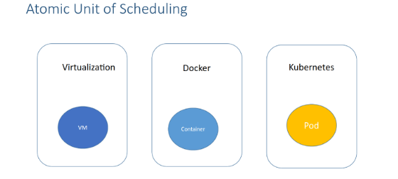
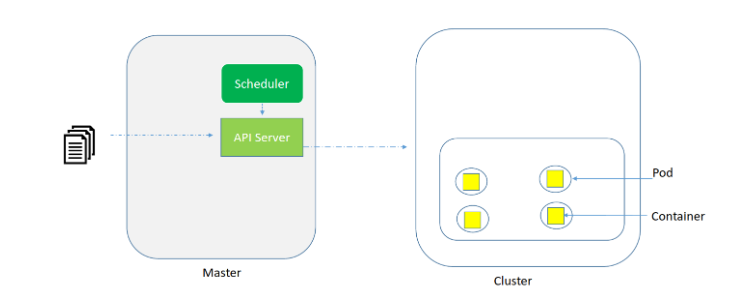
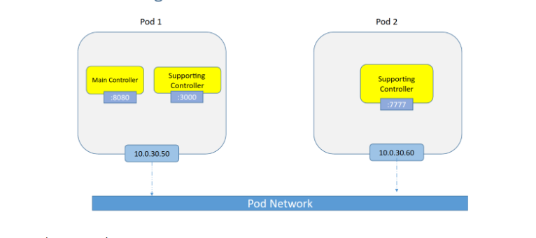
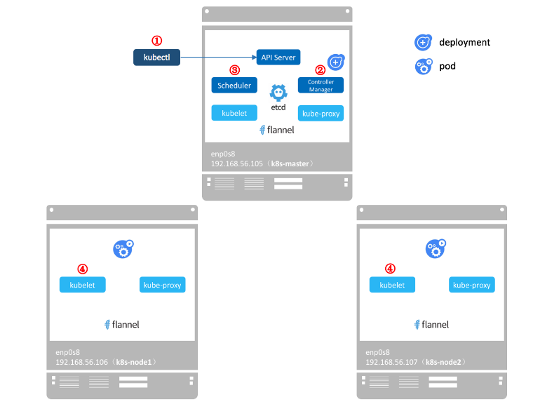
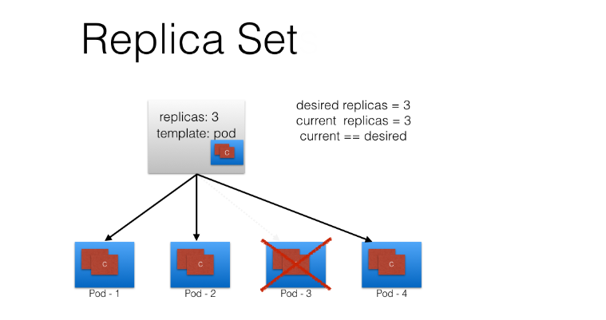

# Các khái niệm quan trọng trong K8s

### Mục lục

[1. Pod](#pod)<br>
[2. Labels](#label)<br>
[3. Replica Controllers](#repc)<br>
[4. Replica Sets](#reps)<br>
[5. Deployments](#dep)<br>
[6. Services](#ser)<br>
[7. Volumes(#vol)<br>
[8. Config Maps](#conf)<br>
[9. Daemons](#deamon)<br>
[10. Jobs](#job)<br>
[11. Namespaces](#name)<br>
[2. Quotas and Limits](#quo)<br>


<a name="pod"></a>
## 1. Pod

`Pod` là đơn vị nhỏ nhất trong K8s, 1 Pod có thể chứa 1 hoặc nhiều container dịch vụ.

`Pod` có thể được tạo ra từ command hoặc YAML/JSON file. Thao tác quản lý pods thông thường sẽ sử dụng Kubectl. Nếu pod fail hoặc khởi động không có thời hạn có thể sử dụng lệnh `kubectl describe` để xem mô tả.

Khái niệm Container đại điện cho thực thể, khái niệm này có thể đúng với Docker nhưng sẽ khác với các công nghệ runtime container khác (rkt container hoặc virtlet). Để quản lý tốt các container K8s cần bổ sung thêm các thông tin, chính sách như tài nguyên sử dụng, khi bật tắt, hoặc phát hiện các container còn sống hay không...

Vì vậy cần đối tượng có thể trừ tượng hóa các thực thể trong các công nghệ Runtime container khác nhau, K8s quyết định bổ sung khái niệm là Pod. Về mặt vật lý, `1 Pod` có thể chứa `1` hoặc `nhiều` container khi mà chúng cần quản lý như 1 thực thể.

- Tại sao Kubernetes cho phép nhiều container trong Pod?

Containers trong một Pod chạy trên một "logical host", chúng sử dụng cùng một network namespace (cùng IP address và port space) cùng IPC namespace, có thể sử dụng shared volumes. Các thuộc tính này giúp các container này có thể giao tiếp hiệu quả, đảm bảo vị trí dữ liệu. Ngoài ra, Pods cho phép bạn quản lý một số container application như là single unit.

Vì vậy, nếu một ứng dụng cần nhiều container chạy trên cùng một máy chủ, tại sao không chỉ tạo một container duy nhất với mọi thứ bạn cần? Trước tiên, bạn có khả năng vi phạm nguyên tắc "one process per container". Điều này rất quan trọng vì với nhiều process trong cùng một container, việc khắc phục sự cố container sẽ khó hơn. Đó là bởi vì logs từ các process khác nhau sẽ được trộn lẫn với nhau và khó quản lý vòng đời của process hơn. 
Ví dụ: để xử lý các process "zombie" khi process mẹ của chúng chết. Thứ hai, việc sử dụng một số container cho một ứng dụng sẽ đơn giản hơn, minh bạch hơn và cho phép tách rời các phụ thuộc phần mềm. Ngoài ra, các container chi tiết hơn có thể được tái sử dụng giữa các nhóm.

- Tại sao Kubernetes sử dụng Pod làm đơn vị triển khai nhỏ nhất chứ không phải một single container?

Mặc dù có vẻ đơn giản hơn nếu chỉ triển khai trực tiếp một container, nhưng có nhiều lý do chính đáng để thêm một lớp trừu tượng được đại diện bởi Pod. container là một thực thể hiện có, dùng để chỉ một thứ cụ thể. Thứ cụ thể đó có thể là Docker container, nhưng nó cũng có thể là rkt container hoặc VM do Virtlet quản lý. Mỗi trong số này có các yêu cầu khác nhau.

Hơn nữa, để quản lý container, Kubernetes cần thêm thông tin, chẳng hạn như chính sách khởi động lại, xác định những việc cần làm với container khi nó kết thúc hoặc kiểm tra sự sồn, xác định hành động để phát hiện xem một quy trình trong container vẫn còn sống từ quan điểm của ứng dụng, chẳng hạn như máy chủ web đáp ứng các yêu cầu HTTP.

Thay vì làm quá tải "thing" hiện có với các thuộc tính bổ sung, kiến trúc sư Kubernetes đã quyết định sử dụng một thực thể mới, Pod, chứa (wraps) một cách hợp lý một hoặc nhiều container cần được quản lý như một thực thể duy nhất.




- Cách deploy Pod 



Khi có request tạo Pod -> API Server tiếp nhận yêu cầu -> Đưa vào scheduler -> Tính toán và tạo các Pod ở các node worker hợp lý.

Nếu node worker không đủ tài nguyên thì pod sẽ không được hoặc tạo không đủ số bản theo request.


- Pod Networking



- Luồng tạo Pod 



```
- kubectl gửi yêu cầu tạo mới deployment tới API Server

- API Server chỉ thị Controller Manager tạo deployment

- Scheluter thực hiện việc lập lịch và phân bổ Pods tới các worker theo số Replicate

- Kubelet trên các Worker nhận chỉ thị từ Master tạo ra các Pod.

	+ Dựa trên thông tin (image, volume, network ..) của Pod, Kubelet sẽ sử dụng công nghệ runtime container để tạo ra các container mới.
	+ Khi tạo container thành công kubelet sẽ cập nhật lại trạng thái Pod và gửi lại Master
```

<a name="reps"></a>
## 4. Replica Sets

`ReplicateSet` được sử dụng để duy trì một tập replicate các Pod ổn định theo thời gian

`ReplicateSet` quản lý Pod qua các label. Nếu thay đổi label của Pod, ReplicateSet sẽ không quản lý Pod đó nữa.

ReplicateSet được sử dụng vì lý do Container hoặc Pod có vòng đời ngắn có thể bị lỗi khi tiến trình container gặp phải exception

Việc sử dụng ReplicateSet sẽ bảo đảm khi có Pod bị ngắt (lỗi) sẽ có Pod khác được tạo ra thay thế
Ngoài ra để Scale số lượng Pod, sẽ cấu hình tăng số nhân bản của Pod bằng ReplicateSet.

Pod có thể tách biệt khỏi một ReplicaSet bằng cách thay đổi label của chúng để chúng không còn khớp với ReplicaSet’s selector nữa.

ReplicaSets có thể bị xóa hoặc không xóa các dependent pods phụ thuộc của chúng.

Bạn có thể dễ dàng điều khiển só lượng replicas (pods) mà ReplicaSet sẽ duy trì thông qua lệnh hoặc chính sửa ở ReplicaSet configuration

Bạn có thể cấu hình ReplicaSet tự động thay đổi tỷ lệ tải CPU trên node.

Bạn có thể đã đọc về ReplicationControllers trong tài liệu, bài báo hoặc sách Kubernetes cũ hơn. ReplicaSets là sự kế thừa của ReplicationControllers. Chúng được khuyến nghị sử dụng thay vì ReplicationControllers vì chúng cung cấp nhiều tính năng hơn.





### Tham khảo

- Pod 

https://www.cnblogs.com/CloudMan6/p/8323420.html
https://collabnix.github.io/kubelabs/pods101/deploy-your-first-nginx-pod.html

- Replica Sets

https://collabnix.github.io/kubelabs/replicaset101/#how-does-replicaset-manage-pods
https://collabnix.github.io/kubelabs/SlidesReplicaSet101/ReplicaSet101.html
https://kubernetes.io/docs/concepts/workloads/controllers/replicaset/


