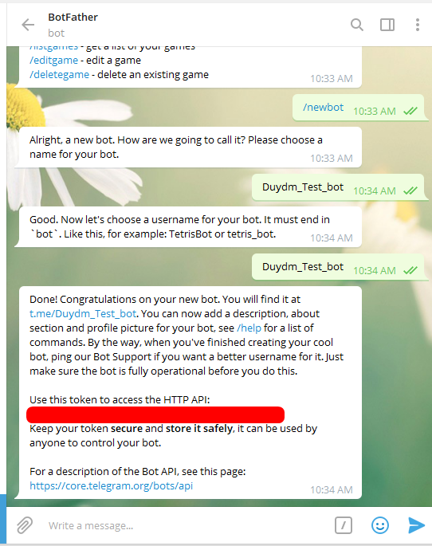
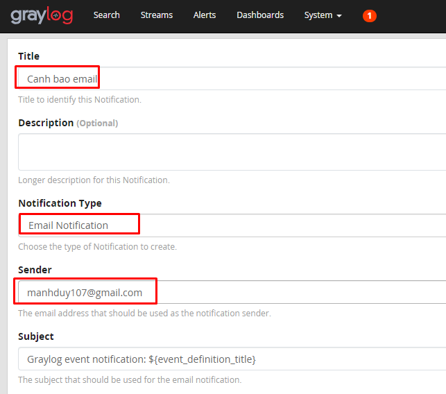
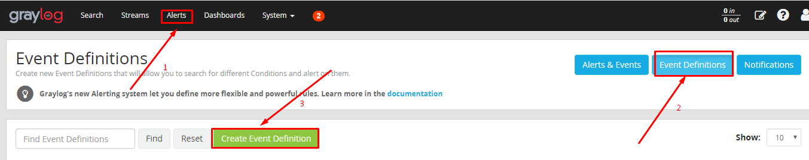

## Ghi chép cấu hình cảnh báo log quan telegram, email, slack

### 1. Telegram

- Tạo bot

Truy cập link trên trình duyệt mở bot Father `https://t.me/BotFather`




- Lưu lại chỗi token

- Cài đặt plugin telegram trên graylog server

```
cd /usr/share/graylog-server/plugin/
wget https://github.com/irgendwr/TelegramAlert/releases/download/v2.2.0/telegram-alert-2.2.0.jar
```

```
systemctl restart graylog-server
```

- Cấu hình cảnh báo trên web GUI graylog server

Click `Alerts`,  chọn tab `Notifications` => `Get Started` để tạo 1 thông báo mới.

Nhập các trường bắt buộc là `Title`, `Notification Type`, `Choose Legacy Notification` đúng với tham số cấu hình


Nhập `chat ID`, `Bot Token` và URL địa chỉ Web Interface của graylog-server => `Execute Test Notification` để thử nghiệm 1 tin nhắn gửi về group trên telegram.


### 2. Email

- Cài đặt và cấu hình `postfix` trên `graylog-server`

+ Kiểm tra và gỡ bỏ `sendmail`

```
rpm -qa | grep sendmail
```

```
yum remove sendmail*
```

+ Cài đặt postfix

```
yum -y install postfix cyrus-sasl-plain mailx
```

Đặt postfix như MTA mặc định của hệ thống

```
alternatives --set mta /usr/sbin/postfix
```

Nếu xuất hiện trả về output /usr/sbin/postfix has not been configured as an alternative for mta thì thực hiện:

```
alternatives --set mta /usr/sbin/sendmail.postfix
```

```
systemctl restart postfix
systemctl enable postfix
```

+ Chỉnh sửa config của postfix ở file `/etc/postfix/main.cf`

Thêm vào cuối file đoạn cấu hình

```
myhostname = hostname.example.com

relayhost = [smtp.gmail.com]:587
smtp_use_tls = yes
smtp_sasl_auth_enable = yes
smtp_sasl_password_maps = hash:/etc/postfix/sasl_passwd
smtp_tls_CAfile = /etc/ssl/certs/ca-bundle.crt
smtp_sasl_security_options = noanonymous
smtp_sasl_tls_security_options = noanonymous
```

+ Tạo file thông tin xác thực tài khoản mật khẩu SASL `vi /etc/postfix/sasl_passwd` và thêm thông tin:

```
[smtp.gmail.com]:587 username:password
```

`username` và `password` sẽ thay bằng tài khoản và mật khẩu của email

+ Phân quyền file

```
postmap /etc/postfix/sasl_passwd
chown root:postfix /etc/postfix/sasl_passwd*
chmod 640 /etc/postfix/sasl_passwd*
systemctl reload postfix
```

```
systemctl restart postfix
systemctl enable postfix
```

- Kiểm tra sự hoạt động của postfix

```
echo "Gui mail bang postfix" | mail -s "Mail kiem tra" <địa chỉ email người nhận>
```


- Chỉnh sửa cấu hình trên graylog server, thêm vào cuối file `/etc/graylog/server/server.conf`


```
transport_email_enabled = true
transport_email_hostname = smtp.gmail.com
transport_email_port = 587
transport_email_use_auth = true
transport_email_auth_username = your_mail@gmail.com
transport_email_auth_password = your_password
transport_email_subject_prefix = [graylog]
transport_email_from_email = your_mail@gmail.com
transport_email_use_tls = true
transport_email_use_ssl = false
```

```
systemctl restart graylog-server
```

- Tạo cảnh báo trên web GUI graylog

+ Click `Alert` => `Notifications` => `Create Notification`


Nhập các thông tin



 cũng là email đăng nhập trong graylog-server.  
Email recipient(s) để nhập email của 1 hoặc 1 nhóm người nhận. 
Body Template sẽ là phần body của email khi gửi về. 
```

+ Click `Execute Test Notification` để test thông báo trước, 1 trạng thái trả về là Success: Notification was executed  successfully => thành công => `Create`


### 3. Cấu hình cảnh báo Slack

- Cài đặt plugin trên graylog server

```
cd /usr/share/graylog-server/plugin/
```

Lựa chọn phiên bản phù hợp với graylog server để tải về.

```
https://github.com/graylog-labs/graylog-plugin-slack/releases
```

```
wget https://github.com/graylog-labs/graylog-plugin-slack/releases/download/3.1.0/graylog-plugin-slack-3.1.0.jar
```

```
systemctl restart graylog-server
systemctl status graylog-server
```

- Chuẩn bị Webhook URL

Tạo channel nhận cảnh báo => Truy cập link `https://my.slack.com/services/new/incoming-webhook` lấy Webhook URL.


- Tạo cảnh báo trên web GUI graylog

Click `Alerts` -> `Notification` -> `Create Notification`


Nhập các trường thiết lập cảnh báo slack


Click `Execute Test Notification` để test


### 4. Cấu hình gửi cảnh báo 

-  Cấu hình event cảnh báo 

+ Trên web GUI: Tại `Alerts`  chọn `Event Definitions` => `Create Event Definition`



+ Đặt tên cho cảnh báo và mô tả ngắn về cảnh báo, chọn mức cảnh báo là `Normal` và `Next`


+ Nhập thông tin như trong ảnh => `Next`


```
+ Chọn Condition Type là Filter & Aggregation 
+ Mục Search Query nhập vào truy vấn để lọc ra những bản tin log phù hợp với tiêu chí cảnh báo
+ Chọn Streams là All Messages để search toàn bộ message ( ta có thể tạo 1 streams để lọc 1 bản tin riêng)
+ Đặt thời gian cách mỗi lần tìm kiếm là 1 phút và tìm trong vòng 1 phút cuối cùng. 
```

+ `Event Fields`, là 1 trường bổ sung thông tin về cảnh báo và thêm ngữ cảnh khi cảnh báo => Có thể bỏ qua.


+ Tới `Notification` , click chọn `Add Notification` và chọn các cảnh báo về `Telegram`, `Email`, `Slack` đã tạo trước đó.


+ `Done` để kết thúc


 


