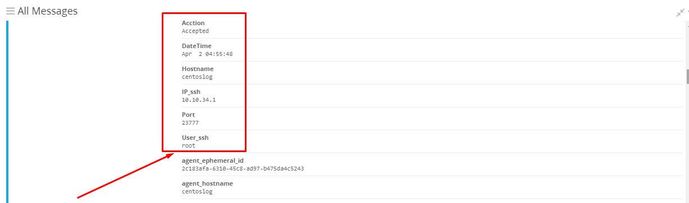

## Thiết lập dashboard trong graylog

Thiết lập dashboard để hiển thị biểu đồ, số liệu, bảng thống kê, các giá trị thu được trong phần `Search`

### 1. Tạo Grok patterns với log ssh

Thực hiện <a href="https://github.com/domanhduy/ghichep/blob/master/DuyDM/Log/docs/10-cau-hinh-canh-bao-telegram-slack-email.md#sshfail">tại đây!</a>

Mục đích để tách message log ssh ra thành các trường mong muốn, từ đó tạo biểu đồ từ giá trị của các trường đó.

### 2. Tạo dashboard ssh

Click `Dashboards` => `Create dashboard`.

Click `Save as` để tạm nhập và lưu thông tin dashboard.

Sau khi tạo xong dashboard => add thêm các trường hợp cần để giám sát.

