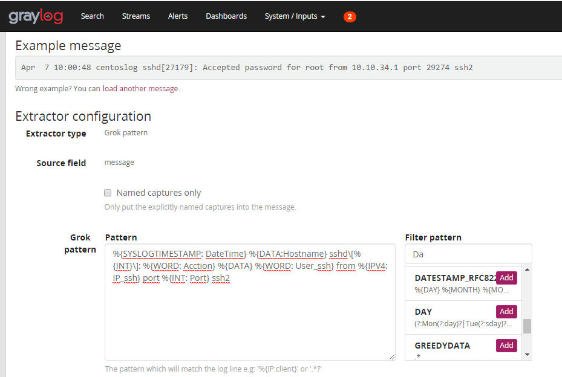
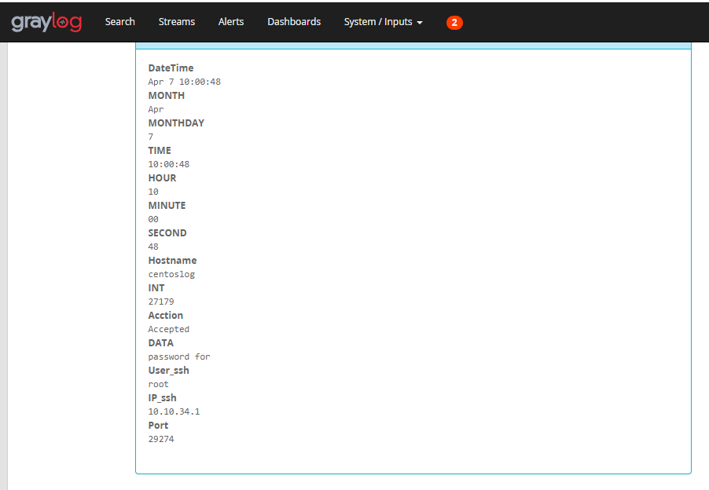
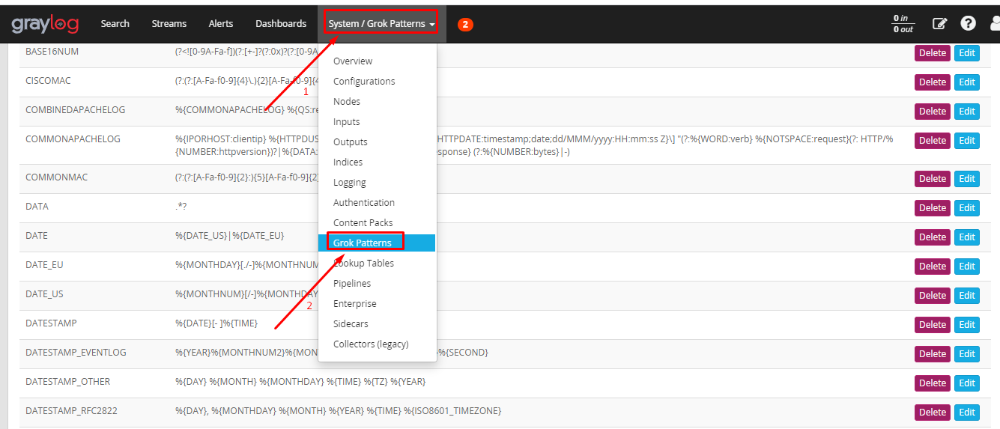
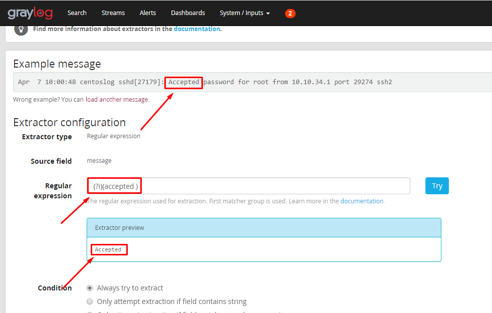

## Ghi chép về kỹ thuật xử lý dữ liệu trong graylog

Các giao thức log tiêu chuẩn đã được đặt ra (RFC3164 , RFC5424), nhưng có nhiều định dạng kiểu log khác nhau, format các trường của bản tin khác nhau, nếu đọc bằng mắt thường thì không vấn đề gì, nhưng khi sử dụng các công cụ thu thập log sẽ thu thập được các bản tin log với nhiều format log khác nhau. Graylog v2 đã bổ sung các kỹ thuật nhằm trích suất các thông tin cần thiết từ 1 bản tin log không thống nhất về mặt format message.

Graylog hỗ trợ nhiều cách trích xuất dữ liệu từ bất kỳ bất kỳ bản tin log nào (bất kể định dạng nào) đưa vào các trường có thể sử dụng trong mục đính cảnh báo.

### Mục lục

[1. Copy input](#cinput)<br>
[2. Grok pattern](#grok)<br>
[3. JSON](#json)<br>
[4. Regular Expression](#rx)<br>
[5. Replace with regular expression](#rwre)<br>
[6. Split & Index](#splitindex)<br>
[7. Substring](#substring)<br>
[8. Lookup table](#ltable)<br>

<a name="cinput"></a>
### 1. Copy input

Từ một input log đã tạo đầu vào sẽ trích xuất dữ liệu sử dụng nhiều kiểu khác nhau.

Có tính năng export, import extractor.

<a name="grok"></a>
### 2. Grok pattern

Hiểu đơn giản là trích xuất dữ liệu băng các mẫu cú pháp có sẵn, từ message đầu vào kỹ thuật nhìn xem định dạng tương ứng với pattern nào và áp dụng parttern đó để trích xuất dữ liệu.

Các biểu thức chính quy đơn giản thường đủ để trích xuất một từ hoặc số từ một dòng từ message log, nhưng nếu biết trước toàn bộ cấu trúc của một dòng thì sử dụng Grok pattern là một ưu điểm.





Thêm, sửa, xóa các parttern ở `System` => `Grok Patterns`




<a name="json"></a>
### 3. JSON

Phân tách dữ liệu dạng key : value

<a name="rx"></a>
### 4. Regular Expression

Regular Expression là việc trích xuất dữ liệu bằng cách sử dụng các biểu thức chính quy (lấy giá trị này, bỏ giá trị kia, lấy từ đâu...). Graylog sử dụng `Java Pattern class` để ánh xạ vào việc sử dụng biểu thức chính quy cho mình.

Các biểu thức chính quy của Java được phân biệt chữ hoa chữ thường theo mặc định nên phải kết hợp một số flag để bỏ qua sự phân biệt nhạy cảm hoa, thường này, sử dụng cờ `(?i)`




**Summary of regular-expression constructs**

Đọc kết hợp ở 2 trang này.

https://regex101.com/
https://regexone.com/
https://docs.oracle.com/javase/7/docs/api/java/util/regex/Pattern.html

Ví dụ:

Có message log

```
Apr  7 10:00:48 centoslog sshd[27179]: Accepted password for root from 10.10.34.1 port 29274 ssh2
```


`(?i)(Accepted)` : Lọc lấy chuỗi Accepted không phân biệt hoa thường.

=> `Accepted`

`^.*Accepted(.+)$` : Lấy từ sau chuỗi Accepted tới hết đoạn

=> `password for root from 10.10.34.1 port 29274 ssh2`

`(Accepted )`: Lấy chỉ định chuỗi Accepted phân biệt hoa thường.

<a name="ltable"></a>
###8. Lookup table

Lookup table là một tính năng cho phép tra cứu / ánh xạ / dịch các giá trị trường thông báo thành các giá trị mới và viết chúng vào các trường thông báo mới hoặc ghi đè lên các trường hiện có.

Thành phần bao gồm:

```
Data adapters
Caches
Lookup tables
Lookup results
```

- Data Adapters

Thực hiện để lookup (tra cứu) cho một giá trị cụ thể nào đó. Có thể đọc từ tệp CSV, kết nối với cơ sở dữ liệu hoặc thực hiện các yêu cầu HTTP để nhận kết quả tra cứu.

- Caches

Chịu trách nhiệm lưu lại `lookup results` để cái thiện hiệu năng tra cứu tránh quá tải databases and API. 

- Lookup tables

Là thành phần liên kết bởi môt `data adapter instance` và một `cache instance`. Cần thiết sử dụng trong các trường hợp `extractors, converters, pipeline functions và decorators`.

- Lookup Results

Lookup results được trả về bởi một bảng tra cứu thông qua data adapters và có thể chứa hai loại dữ liệu là một giá trị duy nhất và nhiều giá trị.


