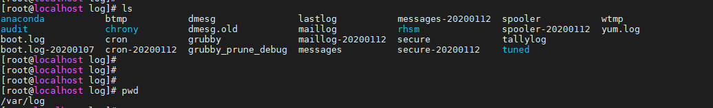

# Thư mục log trong Linux


## 1. Phân loại file log trong Linux

File log (nhật ký) là tập hợp các dòng được hệ thống ghi lại, định nghĩa và kết xuất ra file để người dùng có thể đọc và tra cứu tìm kiếm thông tin. Mặc định trong hệ điều hành Linux có những file log của hệ thống, ngoài ra còn sinh ra các file log cho các ứng dụng khi cài đặt triển khai trong môi trường Linux.


Trong Linux nơi lưu trữ tập trung các file log trong thư mục `/var/log`.




- File log được chia thành bốn loại:

```
Application Logs: Nhật ký ứng dụng
Event Logs: Nhật ký sự kiện
Service Logs: Nhật ký dịch vụ
System Logs: Nhật ký hệ thống
```

## 2. Một số file log quan trọng

### 2.1.  /var/log/messages

Trong CentOS

`[root@localhost ~]# cat /var/log/messages`

Trong Ubuntu

`root@US1604-x8664:~# cat /var/log/syslog`


File messages log này sẽ chứa nhật ký hoạt động hệ thống (System Logs). Sử dụng để lưu trữ các thông tin liên quan đến hệ thống. File log này lưu trữ tất cả dữ liệu hoạt động trên toàn hệ thống như mail, cron, daemon, kern, auth,..., đơn giản khi restart service nào đó file này cũng báo log, card mạng up/down file này cũng có thể xuất ra log.

### 2.2. /var/log/auth.log

Ghi lại log đối với vấn đề xác thực vào hệ thống (Các lần thử đăng nhập thất bại, thành công...)

Tùy thuộc vào hệ điều hành file log này có thể khác nhau.

+ Trong RedHat và CentOS log `secure` thay thế cho `auth.log`

`[root@localhost ~]# cat /var/log/secure`

Chứa các thông tin về xác thực trên hệ thống, lưu trữ các thông tin liên quan đến bảo mật, các lỗi trong quá trình xác thực. Theo dõi thông tin đăng nhập sudo, đăng nhập SSH và các lỗi khác được ghi bởi tiến trình chạy nền của dịch vụ bảo mật hệ thống. Ghi lại chi tiết về các lần đăng nhập trái phép hoặc thất bại và nó cũng lưu trữ thông tin đăng nhập thành công và theo dõi các hoạt động của người dùng hợp lệ.

+ Trong Ubuntu

`root@US1604-x8664:~# cat /var/log/auth.log`

### 2.3. var/log/boot.log

+ Trong RedHat và CentOS 

`[root@localhost ~]# cat /var/log/boot.log`

File log boot.log lưu trữ tất cả thông tin liên quan đến khởi động và mọi thông báo được ghi lại trong quá trình khởi động bao gồm tập lệnh khởi tạo hệ thống. => Có thể dùng để xác định tắt máy không đúng cách, khởi động lại hoặc lỗi khởi động, xác định thời gian ngừng hoạt động của hệ thống do tắt máy đột ngột.


+ Trong Ubuntu journalctl để xem log boot

`journalctl -b`

### 2.4. /var/log/dmesg

+ Trong CentOS

`[root@localhost ~]# cat /var/log/dmesg`

+ Trong Ubuntu

`root@US1604-x8664:~# cat /var/log/dmesg`

Thông tin về bộ kernel được ghi lại. Khi hệ thống khởi động các thông tin liên quan đến các thiết bị phần cứng và trình điều khiển được ghi lại. Vì kernel phát hiện các thiết bị phần cứng vật lý được liên kết trong quá trình khởi động, nên sẽ ghi lại trạng thái thiết bị, lỗi phần cứng và các thông báo chung khác. Nếu một thành phần phần cứng nào đó hoạt động không đúng hoặc không được phát hiện, thì có thể dựa vào tệp nhật ký này để xử lý.

### 2.5. /var/log/kern.log

`root@localhost:~# cat /var/log/kern.log`

Là nơi chứa các thông tin được ghi bởi kernel. Thông qua file log này có thể khắc phục các lỗi và cảnh báo liên quan đến kernel. Kernel log có tác dụng trong việc khắc phục sự cố kernel giúp giải quyết một số vấn đề về phần cứng.

### 2.6. /var/log/faillog

File sẽ chứa các thông tin người dùng đã đăng nhập thất bại.


