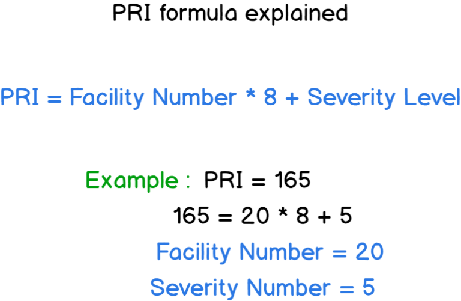

# Tìm hiểu về syslog

## 1. Khái niệm

Syslog là một giao thức dùng để xử lý các file log trong các hệ điều hành Linux. Các file log có thể được lưu tại chính máy Linux đó, hoặc có thể di chuyển và lưu tại 1 máy khác.

Syslog là một giao thức `client/server` là giao thức dùng để chuyển log và thông điệp đến máy nhận log. Máy nhận log thường được gọi là syslogd, syslog daemon hoặc syslog server. Syslog có thể gửi qua UDP hoặc TCP. Các dữ liệu được gửi dạng cleartext. Syslog dùng port `514`.

Khi một máy Linux được cài lên, máy đó sẽ tự động sinh ra các file log mặc định, có thể hiểu thành phần quản lý việc sinh ra log đó chính là syslog.

## 2. Đặc điểm của syslog

- Defining an architecture (xác định kiến ​​trúc) : Syslog là một giao thức, nó là một phần của kiến ​​trúc mạng hoàn chỉnh, với nhiều client và server.

- Message format (định dạng tin nhắn) : syslog xác định cách định dạng message. Điều này rõ ràng cần phải được chuẩn hóa vì các bản ghi thường được phân tích cú pháp và lưu trữ vào các công cụ lưu trữ khác nhau. Nên cần xác định những gì một máy khách syslog có thể tạo ra và những gì một máy chủ nhật ký hệ thống có thể nhận được.

- Specifying reliability (chỉ định độ tin cậy) : syslog cần xác định cách xử lý các tin nhắn không thể gửi được. Là một phần của TCP/IP, syslog rõ ràng sẽ bị thay đổi trên giao thức mạng cơ bản (TCP hoặc UDP) để lựa chọn.

- Dealing with authentication or message authenticity (xử lý xác thực hoặc xác thực thư): syslog cần một cách đáng tin cậy để đảm bảo rằng máy client và server đang nói chuyện một cách an toàn và tin nhắn nhận được không bị thay đổi.

## 3. Syslog facility levels & Syslog severity levels

- `Facility levels` giúp kiểm soát log đến dựa vào nguồn gốc được quy định như từ ứng dụng hay tiến trình nào. Syslog sử dụng facility để quy hoạch lại log như vậy có thể coi faicility là đại diện cho đối tượng tạo ra thông báo (kernel, process, apps,..).


+ auth  : sử dụng cho những sự kiện bảo mật, các hoạt động đòi hỏi user/password (getty, su, login).

+ authpriv:  : các thông báo liên quan đến kiểm soát truy cập và bảo mật.

+ console: Used to capture messages that would generally be directed to the system console

+ cron: cron là một tiện ích cho phép thực hiện các tác vụ một cách tự động theo định kỳ, ở chế độ nền của hệ thống.

+ deamon: sử dụng bởi các tiến trình hệ thống và các daemons khác (daemon là một chương trình hoạt động liên tục. daemon khác với các ứng trình bình thường ở chỗ, các ứng trình bình thường dừng lại sau khi hoàn tất một (hoặc một chuỗi) thao tác.
+ kern: các thông báo từ kernel.

+ ftp : log liên quan đến dịch vụ ftp.

+ mail : log liên quan đến hệ thống mail.

+ lpr  : các thông báo từ kernel.

+ mark : những thông báo được generated bởi bản thân syslogd.

+ news : hệ thống tin tức, liên quan đến giao thức Network News Protocol (nntp).

+ syslog  : những thông báo được generated bởi bản thân syslogd.

+ user : thông báo về tiến trình người dùng thông thường.

+ uucp : hệ thống con UUCP. Unix-to-Unix là một tập hợp các chương trình mức thấp cho phép kết nối các máy UNIX với nhau.

+ local0 to local7  : dự trữ cho sử dụng nội bộ

- `Severity levels`: Mức độ cảnh báo của Syslog được sử dụng để mức độ nghiêm trọng của log event, bao gồm các mức từ gỡ lỗi (debug), thông báo thông tin (informational messages) đến mức khẩn cấp (emergency levels).


```
0	emerg	Thông báo tình trạng khẩn cấp
1	alert	Hệ thống cần can thiệp ngay
2	crit	Tình trạng nguy kịch
3	error	Thông báo lỗi đối với hệ thống
4	warn	Mức cảnh báo đối với hệ thống
5	notice	Chú ý đối với hệ thống
6	info	Thông tin của hệ thống
7	debug	Quá trình kiểm tra hệ thống
```

+ debug: các messages ở chế độ debug.

+ info: messages mang thông tin.

+ notice: messages mang tính chất thông báo.

+ warning (hoặc warn): messages cảnh báo.

+ err (hoặc error): messages lỗi.

+ crit: messages nguy hiểm.

+ alert: messages về các hành động phải được thực hiện ngay.

+ emerg (hoặc panic): messages khi hệ thống không thể dùng được nữa.

## 4. Cơ chế rotate của log

Các distro sẽ cài đặt một cấu hình syslog mặc định, bao gồm logging to messages và các log files khác trong /var/log.

Để ngăn cản những files này ngày càng trở nên cồng kềnh và khó kiểm soát, một hệ thống quay vòng log file (a log file rotation scheme) nên được cài đặt.

Hệ thống cron đưa ra các lệnh để thiết lập những log files mới, những file cũ được đổi tên bằng cách thay một con số ở hậu tố.

Với loại quay vòng này, /var/log/messages của ngày hôm qua sẽ trở thành messages.1 của ngày hôm nay và một messages mới được tạo. Sự luân phiên này được cấu hình cho một số lượng lớn các file, và các log files cũ nhất sẽ được xoá khi sự luân phiên bắt đầu chạy. Ví dụ trong /var/log có các messages sau: messages, messages.1, messages-20181111, messages-20181118, …

Tiện ích thi hành rotation là logrotate. Lệnh này được cấu hình sử dụng cho một hoặc nhiều files - được xác định bởi các tham số đi cùng.

## 5. Đặc điểm của bản tin log trong linux

- Đoạn PRI là phần đầu tiên sẽ đọc trên một tin nhắn được định dạng syslog.

- Phần PRI hay Priority là một số được đặt trong ngoặc nhọn, thể hiện cơ sở sinh ra log hoặc mức độ nghiêm trọng, là một số gồm 8 bit:

+ 3 bit đầu tiên thể hiện cho tính nghiêm trọng của thông báo.

+ 5 bit còn lại đại diện cho sơ sở sinh ra thông báo.



- Header bản tin log


`TIMESTAMP`: được định dạng trên định dạng của Mmm dd hh:mm:ss – Mmm, là ba chữ cái đầu tiên của tháng. Sau đó là thời gian mà thông báo được tạo ra giờ:phút:giây. Thời gian này được lấy từ thời gian hệ thống. Nếu như thời gian của server và thời gian của client khác nhau thì thông báo ghi trên log được gửi lên server là thời gian của máy client.

`HOSTNAME` (có thể được phân giải thành địa chỉ IP). Nếu không tìm thấy, nó sẽ được gán cả IPv4 hoặc IPv6 của máy chủ.


## 6. Cách hoạt động của giao thức syslog

