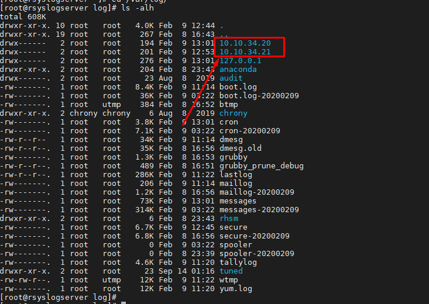
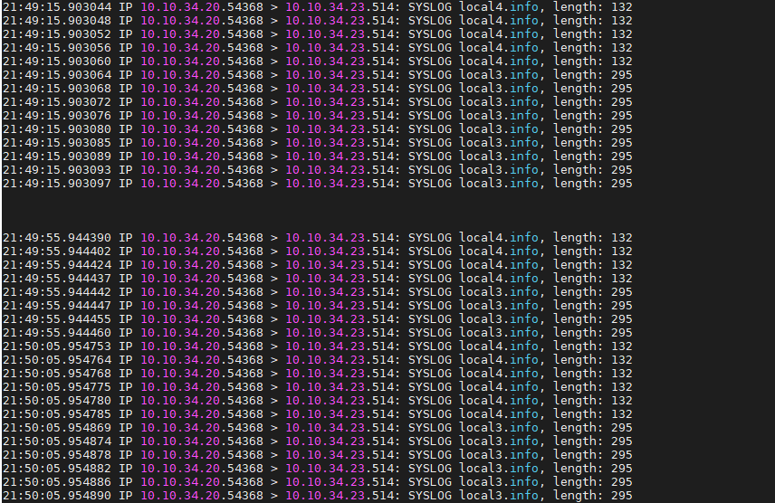
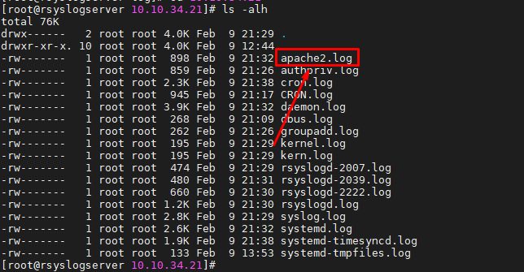
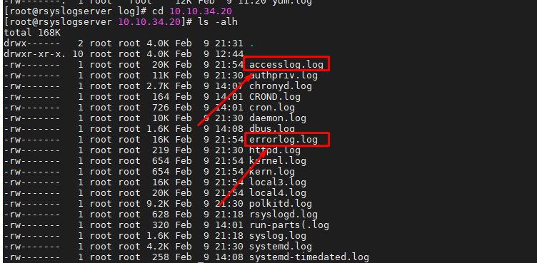

# Ghi chép đẩy log apache client - server thông quan rsyslog

### Mục lục

[1. Mô hình triển khai](#mohinh)<br>
[2. Log tập trung rsyslog](#logtaptrung)<br>
[3. Đẩy log apache](#apache)<br>


<a name="mohinh"></a>
## 1. Mô hình triển khai


<a name="logtaptrung"></a>
## 2. Log tập trung rsyslog

**Thiết lập phía rsyslog server**

- Chỉnh sửa trong file cấu hình `/etc/rsyslog.conf` của máy chủ rsyslog-server để có thể nhận các bản tin log từ các client gửi về. (bỏ comment dòng 15 - 16 để sử dụng qua UDP)

```
$ModLoad imudp
$UDPServerRun 514
```


- Để rsyslog server tạo thành các thư mục lưu riêng log đối với từng máy Client gửi về thêm dòng này vào cuối file cấu hình `/etc/rsyslog.conf`:

+ Tên thư mục dạng IP

```
$template RemoteServer, "/var/log/%fromhost-ip%/%SYSLOGFACILITY-TEXT%.log"
*.* ?RemoteServer
```

+ Tên thư mục dạng hostname

```
$template RemoteServer, "/var/log/%HOSTNAME%/%SYSLOGFACILITY-TEXT%.log"
*.* ?RemoteServer
```


+ Để lưu các file log với tên các chương trình thêm cấu hình:

```
$template TmplAuth,"/var/log/%HOSTNAME%/%PROGRAMNAME%.log" #hostname
*.*     ?TmplAuth

hoặc

$template TmplAuth,"/var/log/%fromhost-ip%/%PROGRAMNAME%.log" #ip-server
*.*     ?TmplAuth
```

+ Sau khi chỉnh sửa config -> restart service

```
systemctl restart rsyslog
```

Kiểm tra port 

```
netstat -una | grep 514
```


Kết quả khi log từ client đẩy về sẽ xuất hiện trong `/var/log/thu-muc-log-client`


**Thiết lập phía rsyslog client**

Client phải truyền đúng với giao thức như trên server (TCP hoặc UDP):

```
*.* @IPserver:514 : Đối với giao thức UDP
*.* @@IPserver:514 : Đối với giao thức TCP
```

- CentOS

```
vi /etc/rsyslog.conf
```


```
systemctl restart rsyslog
```

- Ubuntu

```
vi /etc/rsyslog.d/50-default.conf 
```


```
systemctl restart rsyslog
```

**Bắt gói tin kiểm tra log từ client gửi về server**

- Phía client `systemctl restart rsyslog`

- Phía server bắt gói tin
```
tcpdump -nni eth0 port 514
```




<a name="apache"></a>
## 3. Đẩy log apache

**Thao tác phía rsyslog server**

- Cho rsyslog giao tiếp qua port 514/UDP

```
sed -i '/$ModLoad imudp/ s/^#*//' /etc/rsyslog.conf
sed -i '/$UDPServerRun 514/ s/^#*//' /etc/rsyslog.conf
```

- Phân loại log của mỗi host vào từng folder (tên folder là HOSTNAME)

```
echo -e "\$template TmplAuth,\"/var/log/%HOSTNAME%/%PROGRAMNAME%.log\"
*.* ?TmplAuth" >> /etc/rsyslog.conf
```

- Kiểm tra firewall, selinux

**Thao tác phía client đẩy log**

- Ubuntu

+ Cài đặt

```
apt-get install apache2 -y
```

+ Chỉnh sửa file cấu hình của apache2

```
sed -i '/ErrorLog */ s/\${APACHE_LOG_DIR}\/error.log/syslog:local1/' /etc/apache2/apache2.conf 
sed -i '/ErrorLog */ s/\${APACHE_LOG_DIR}\/error.log/syslog:local1/'  /etc/apache2/sites-available/000-default.conf
sed -i '/#CustomLog */ s/\${APACHE_LOG_DIR}\/access.log/"\| \/usr\/bin\/logger -taccess -plocal1.info\"/'  /etc/apache2/sites-available/000-default.conf
```

+ Cấu hình đẩy log về rsyslog server

```
echo -e "*.* @10.10.34.23" >> /etc/rsyslog.d/50-default.conf
```

```
systemctl restart apache2
systemctl restart rsyslog
```

+ Kiểm tra firewalld


- CentOS

Trên client centOS tạo và thêm cấu hình sau

```
vi /etc/rsyslog.d/apache.conf
```

```
$ModLoad imfile #Dòng này chỉ thêm một lần

# Apache error file: 
$InputFileName /var/log/httpd/error_log #Đường dẫn file log muốn đẩy
$InputFileTag errorlog #Tên file 
$InputFileSeverity info #Các log từ mức info trở lên được ghi lại
$InputFileFacility local3 #Facility log
$InputRunFileMonitor

# Apache access file:
$InputFileName /var/log/httpd/access_log
$InputFileTag accesslog
$InputFileSeverity info
$InputFileFacility local4
$InputRunFileMonitor

$InputFilePollInterval 10 #Cứ sau 10 giây lại gửi tin nhắn
```

```
systemctl restart rsyslog
```

+ Cấu hình đẩy log về rsyslog server

```
echo -e "*.* @10.10.34.23" >> /etc/rsyslog.conf
```

**Kiểm tra**

- Đứng từ server gửi request

```
for x in {1..10}; do curl 10.10.34.20; curl 10.10.34.21; sleep 1; done
```

- Bắt gói tin ở client

```
tcpdump -nni eth0 port 514
```




- Kiểm tra trong thư mục log tập trung ở rsyslog server






