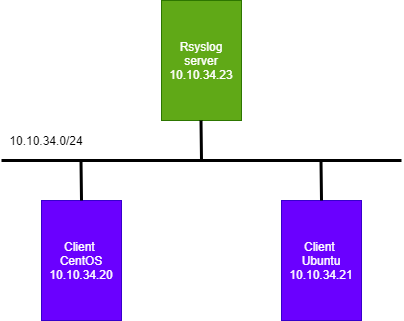
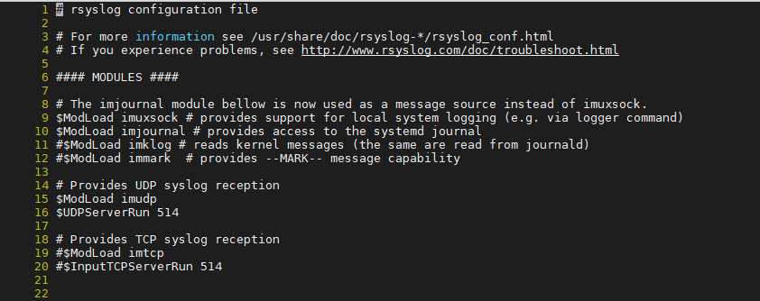
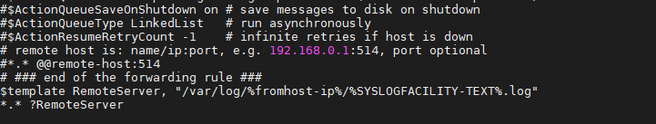
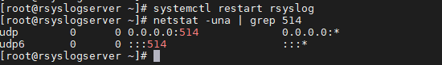
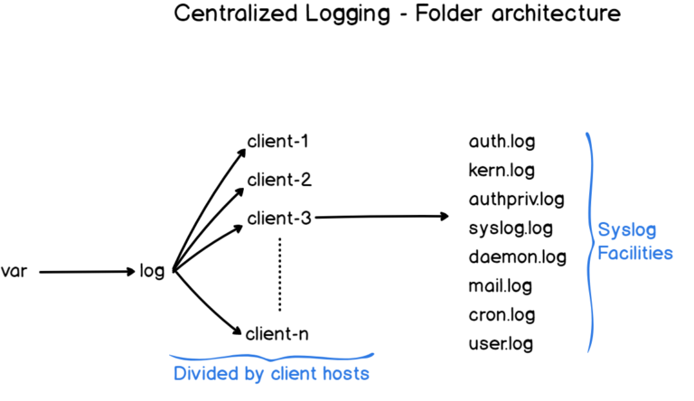
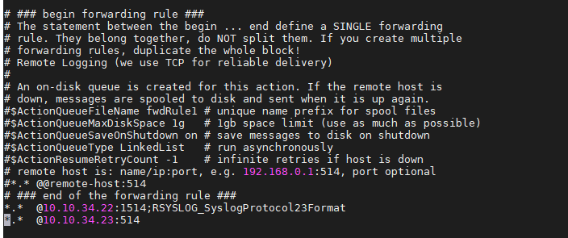
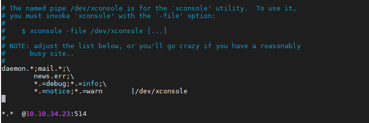
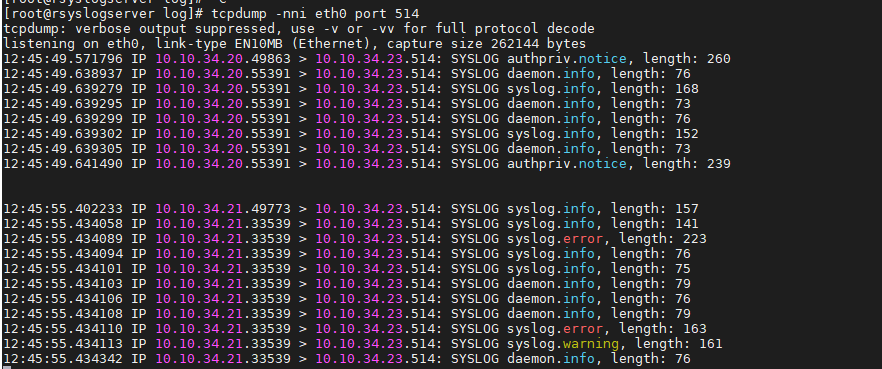

# Ghi chép đẩy log apache client - server thông quan rsyslog

### Mục lục

[1. Mô hình triển khai](#mohinh)<br>
[2. Log tập trung rsyslog](#logtaptrung)<br>


<a name="mohinh"></a>
## 1. Mô hình triển khai



<a name="logtaptrung"></a>
## 2. Log tập trung rsyslog

**Thiết lập phía rsyslog server**

- Chỉnh sửa trong file cấu hình `/etc/rsyslog.conf` của máy chủ rsyslog-server để có thể nhận các bản tin log từ các client gửi về. (bỏ comment dòng 15 - 16 để sử dụng qua UDP)

```
$ModLoad imudp
$UDPServerRun 514
```



- Để rsyslog server tạo thành các thư mục lưu riêng log đối với từng máy Client gửi về thêm dòng này vào cuối file cấu hình `/etc/rsyslog.conf`:

+ Tên thư mục dạng IP

```
$template RemoteServer, "/var/log/%fromhost-ip%/%SYSLOGFACILITY-TEXT%.log"
*.* ?RemoteServer
```

+ Tên thư mục dạng hostname

```
$template RemoteServer, "/var/log/%HOSTNAME%/%SYSLOGFACILITY-TEXT%.log"
*.* ?RemoteServer
```




+ Để lưu các file log với tên các chương trình thêm cấu hình:

```
$template TmplAuth,"/var/log/%HOSTNAME%/%PROGRAMNAME%.log" #hostname
*.*     ?TmplAuth

hoặc

$template TmplAuth,"/var/log/%fromhost-ip%/%PROGRAMNAME%.log" #ip-server
*.*     ?TmplAuth
```

+ Sau khi chỉnh sửa config -> restart service

```
systemctl restart rsyslog
```

Kiểm tra port 

```
netstat -una | grep 514
```



Kết quả khi log từ client đẩy về sẽ xuất hiện trong `/var/log/thu-muc-log-client`



**Thiết lập phía rsyslog client**

Client phải truyền đúng với giao thức như trên server (TCP hoặc UDP):

```
*.* @IPserver:514 : Đối với giao thức UDP
*.* @@IPserver:514 : Đối với giao thức TCP
```

- CentOS

```
vi /etc/rsyslog.conf
```




```
systemctl restart rsyslog
```

- Ubuntu

```
vi /etc/rsyslog.d/50-default.conf 
```



```
systemctl restart rsyslog
```

**Bắt gói tin kiểm tra log từ client gửi về server**

- Phía client `systemctl restart rsyslog`

- Phía server bắt gói tin
```
tcpdump -nni eth0 port 514
```




