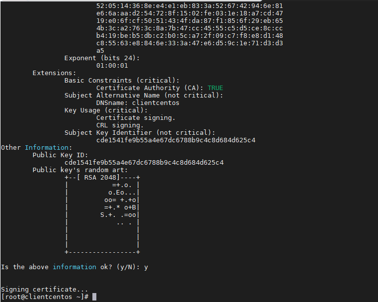

# Ghi chép mã hóa dữ liệu truyển client - server rsyslog

### Mục lục

[1. Mô hình triển khai](#mohinh)<br>
[2. Bắt gói tin trước không mã hóa](#goitinkhongmahoa)<br>
[3. Thiết lập TLS](#tls)<br>


<a name="mohinh"></a>
## 1. Mô hình triển khai


<a name="goitinkhongmahoa"></a>
## 2. Bắt gói tin trước không mã hóa

Đối với rsyslog quá trình đẩy log client về server dữ liệu dạng rõ không được mã hóa, tiến hành bắt gói tin sử dụng tcpdump và wireshark để kiểm tra.

- Trên rsyslog server bắt gói tin

```
tcpdump -i eth0 -w /mnt/captureduydm.pcap
```


- Mở bằng wireshark


<a name="tls"></a>
## 3. Thiết lập TLS

### Thao tác trên client

**- Tạo chứng chỉ CA**

+ Cài đặt GnuTLS

```
yum -y install gnutls-utils
```

+ Tạo  private key

```
certtool --generate-privkey --outfile ca-key.pem
```


+ Tạo chứng chỉ CA

```
certtool --generate-self-signed --load-privkey ca-key.pem --outfile ca.pem
```




**- Tạo key cho client**

+ Tạo private key

```
certtool --generate-privkey --outfile clientcentos-key.pem --bits 2048
```


+ Tạo các thông tin cho key

```
certtool --generate-request --load-privkey clientcentos-key.pem --outfile clientcentos-request.pem
```


+ Tạo public key

```
certtool --generate-certificate --load-request clientcentos-request.pem --outfile clientcentos-cert.pem --load-ca-certificate ca.pem --load-ca-privkey ca-key.pem
```


```
systemctl restart rsyslog
```

### Thao tác trên rsyslog server

- Tạo thư mục chứa key

```
mkdir /etc/rsyslog-keys
cd /etc/rsyslog-keys
```

- Copy key từ server

```
scp clientcentos-*.pem root@10.10.34.23:/etc/rsyslog-keys
```


- Tạo file cấu hình log tls `/etc/rsyslog.d/logserver.conf`

```
# make gtls driver the default
$DefaultNetstreamDriver gtls

# certificate files
$DefaultNetstreamDriverCAFile /etc/rsyslog-keys/ca.pem
$DefaultNetstreamDriverCertFile /etc/rsyslog-keys/clientcentos-cert.pem
$DefaultNetstreamDriverKeyFile /etc/rsyslog-keys/clientcentos-key.pem

$ModLoad imtcp  # TCP listener
$InputTCPServerStreamDriverMode 1  # run driver in TLS-only mode
$InputTCPServerStreamDriverAuthMode anon
$InputTCPServerRun 6514  # start up listener at port 10514
```


- Cài đặt GnuTLS

```
yum -y install rsyslog-gnutls
```

```
systemctl restart rsyslog
```

### Cấu hình messages trên client và kiểm tra

- Tạo thư mục chứ chứng chỉ

```
mkdir /etc/rsyslog-keys
cp ca.pem /etc/rsyslog-keys/
```


- Tạo file cấu hình vi /etc/rsyslog.d/log-client.conf

```
# certificate files
$DefaultNetStreamDriverCAFile /etc/rsyslog-keys/ca.pem

# make gtls driver the default
$DefaultNetStreamDriver gtls
$ActionSendStreamDriverMode 1	# run driver in TLS-only mode
$ActionSendStreamDriverAuthMode anon

*.*     @@(o)clientcentos.example.com:6514		# forward everything to remote server
```

```
yum -y install rsyslog-gnutls
```

```
systemctl restart rsyslog
```


