## Cấu hình thu thập log CentOS7 trên graylog server qua sidecar - filebeat

Thay vì sử dụng các phương thức đẩy log như syslog, rsyslog về graylog server có thể cài đặt và sử dụng sidecar - filebeat để đẩy log về graylog server, với nhiều tùy chọn, tùy chỉnh.

## 1. Mô hình triển khai

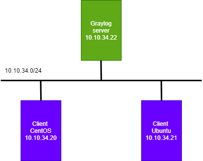

## 2. Cài đặt sidecar - filebeat trên client

- Cài đặt file Beats

```
wget https://artifacts.elastic.co/downloads/beats/filebeat/filebeat-7.4.2-x86_64.rpm
rpm -i filebeat-7.4.2-x86_64.rpm
```

- Cài đặt graylog-sidecar 

```
wget https://github.com/Graylog2/collector-sidecar/releases/download/1.0.2/graylog-sidecar-1.0.2-1.x86_64.rpm
rpm -i graylog-sidecar-1.0.2-1.x86_64.rpm
graylog-sidecar -service install
```

```
systemctl status graylog-sidecar.service
```

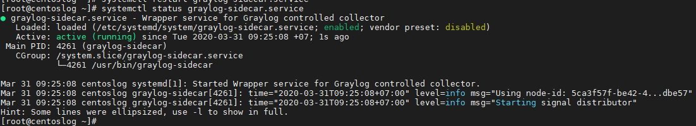

### 3. Tạo token sử dụng cho client

- Truy cập giao diện graylog server

Click `System/Sidecars` => `Create or reuse a token for the graylog-sidecar user`

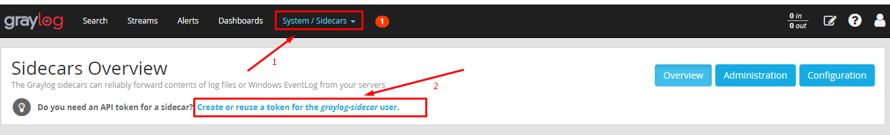

Click `Create Token` => Đặt tên

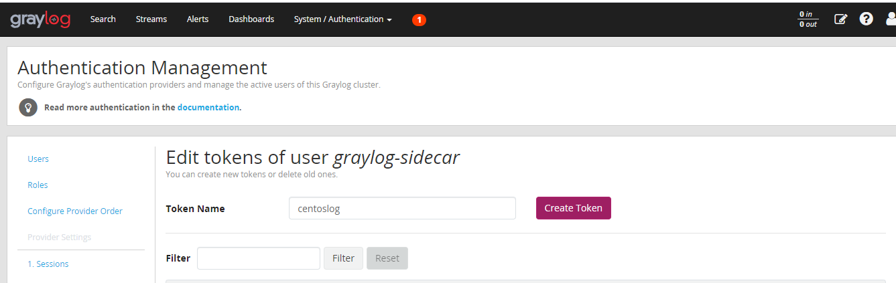

Copy lưu lại để sử dụng.

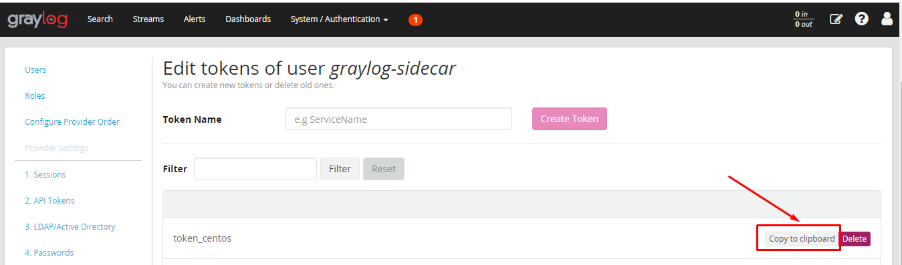


### 4. Cấu hình đầy log trên client centos7

Chỉnh sửa cấu hình tại file `/etc/graylog/sidecar/sidecar.yml`

```
cp /etc/graylog/sidecar/sidecar.yml /etc/graylog/sidecar/sidecar.yml.bk
```


```
sed -i 's|#server_url: "http://127.0.0.1:9000/api/"|server_url: "http://10.10.34.22:9000/api/"|' /etc/graylog/sidecar/sidecar.yml 

sed -i 's|server_api_token: ""|server_api_token: "13vllt4s300etuda8ssm32b0sv0k1g5qk11hj729pv91s4fv1de5"|' /etc/graylog/sidecar/sidecar.yml

sed -i 's|#log_path: "/var/log/graylog-sidecar"|log_path: "/var/log/graylog-sidecar"|' /etc/graylog/sidecar/sidecar.yml

sed -i 's|#tls_skip_verify: false|tls_skip_verify: true|' /etc/graylog/sidecar/sidecar.yml

sed -i 's|#node_name: ""|node_name: "centoslog"|' /etc/graylog/sidecar/sidecar.yml
```


```
systemctl start graylog-sidecar
systemctl enable graylog-sidecar
systemctl status graylog-sidecar
```

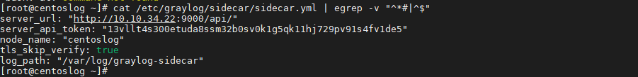

### 5. Cấu hình sidecar trên Web Interface của graylog-server 

- Khai báo input cho Sidecar: Click `System/Inputs`  => chọn input `Beats` => `Launch new input`

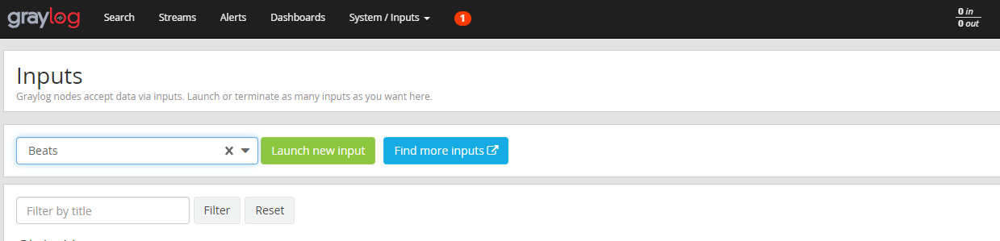

- Chỉnh sửa `input` như sau :

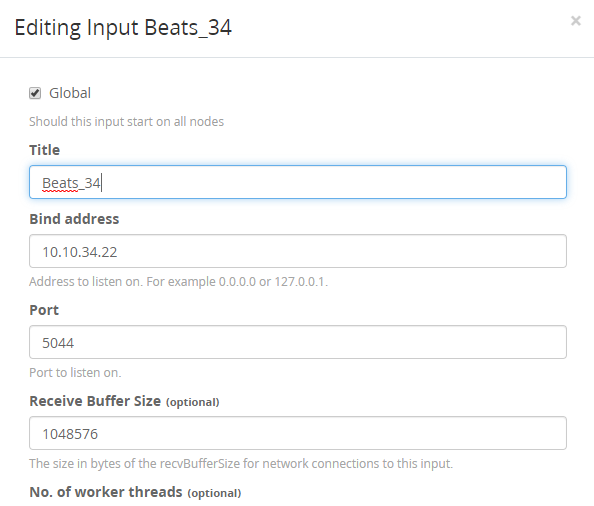

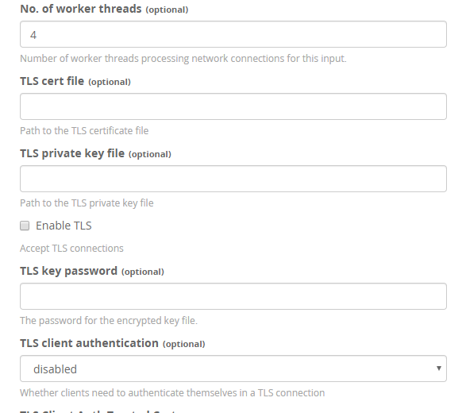

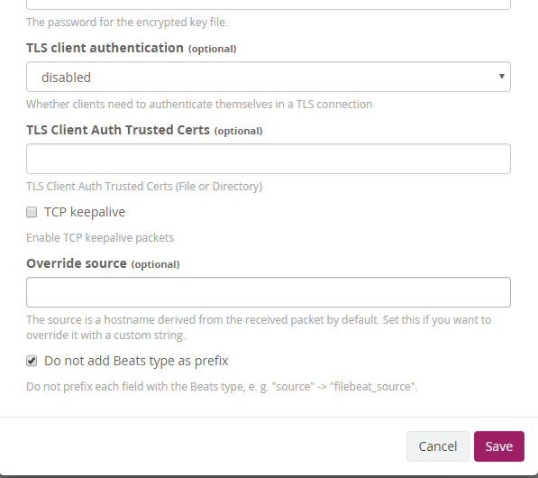

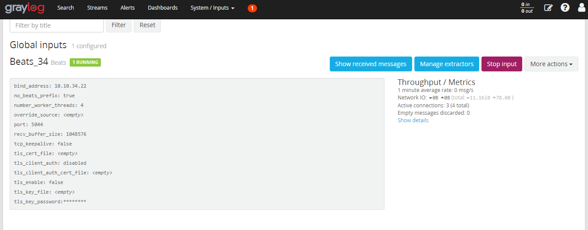


### 6. Cấu hình sidecars

- Click `System/Sidecar` => `Configuration` => `Create Configuration`

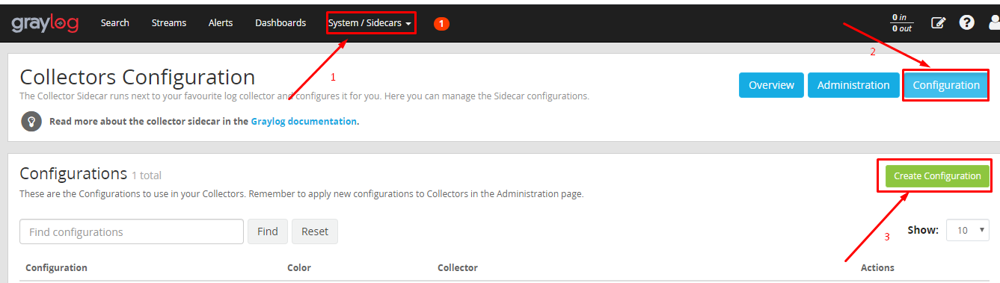

Khai báo các thông số và sửa địa chỉ ip thành địa chỉ của graylog-server. Chỉ lấy ssh nên ta xóa hết những nguồn log khác và chỉ để /var/log/secure  và bổ sung trường fields.source: ${sidecar.nodeName} 

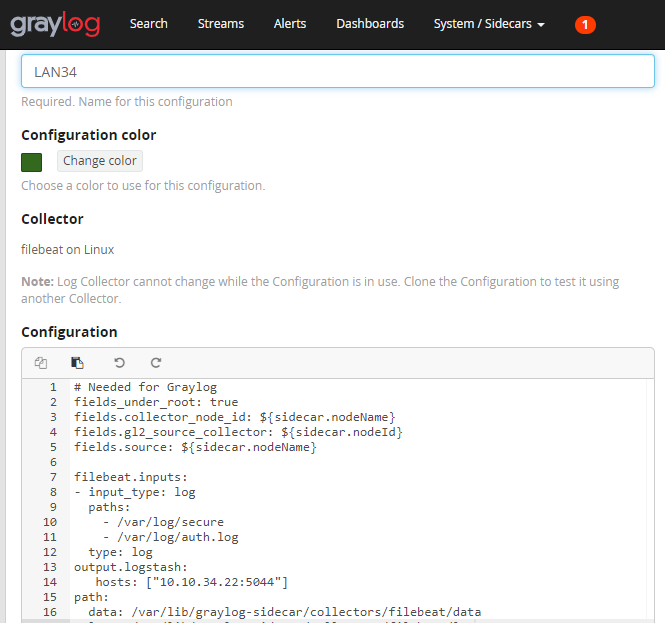

```
# Needed for Graylog
fields_under_root: true
fields.collector_node_id: ${sidecar.nodeName}
fields.gl2_source_collector: ${sidecar.nodeId}
fields.source: ${sidecar.nodeName}

filebeat.inputs:
- input_type: log
  paths:
    - /var/log/secure
    - /var/log/auth.log
  type: log
output.logstash:
   hosts: ["10.10.34.22:5044"]
path:
  data: /var/lib/graylog-sidecar/collectors/filebeat/data
  logs: /var/lib/graylog-sidecar/collectors/filebeat/log
```

- Kích hoạt filebeat

Tab `Administration`  

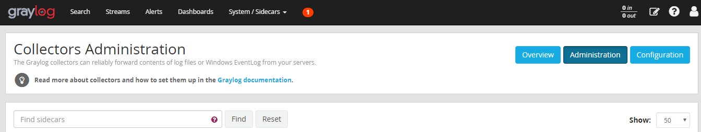

Tích chọn `filebeat`  Sau đó chọn `configuration` vừa tạo là LAN34 :

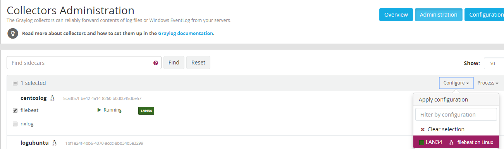

- Tại `Process` -> `Start` để khởi động trình thu thập log từ centoslog, có một cửa sổ bật lên => chọn `Confirm` để tiếp tục. 

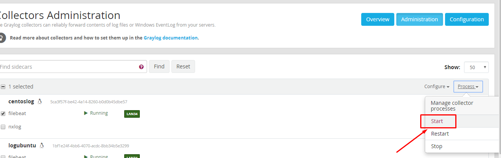

- Kiểm tra kết quả: Tại `Overview` và chọn `Show messages`

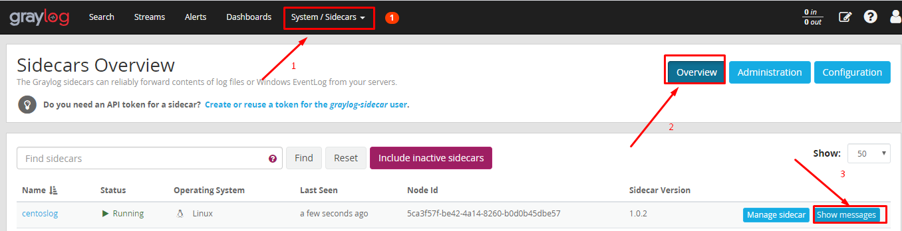

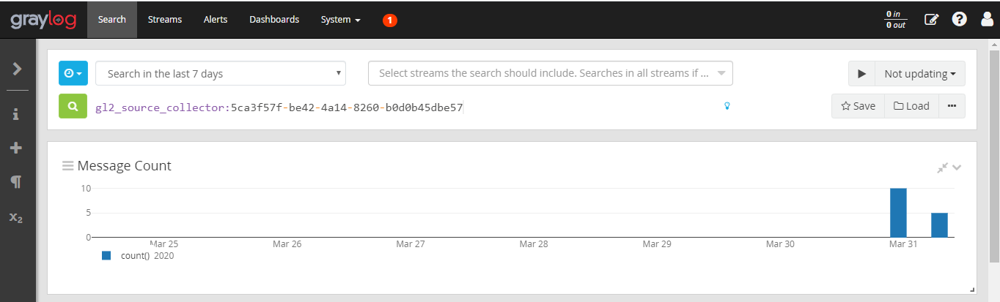


