## Cấu hình thu thập log Ubuntu trên graylog server qua sidecar - filebeat

## 1. Mô hình triển khai

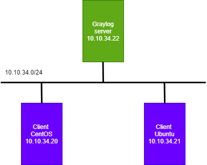

## 2. Cài đặt sidecar - filebeat trên client

- Cài đặt file Beats

```
wget -qO - https://artifacts.elastic.co/GPG-KEY-elasticsearch | sudo apt-key add -

echo "deb https://artifacts.elastic.co/packages/7.x/apt stable main" | sudo tee /etc/apt/sources.list.d/elastic-7.x.list

apt-get install -y apt-transport-https

apt-get update -y

apt-get install -y filebeat
```


- Cài đặt graylog-sidecar 

```
wget https://github.com/Graylog2/collector-sidecar/releases/download/1.0.2/graylog-sidecar_1.0.2-1_amd64.deb
sudo dpkg -i graylog-sidecar_1.0.2-1_amd64.deb
```

### 3. Tạo token sử dụng cho client

- Truy cập giao diện graylog server

Click `System/Sidecars` => `Create or reuse a token for the graylog-sidecar user`

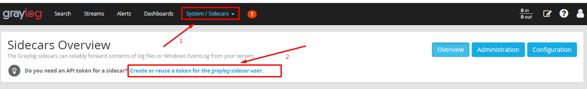

Click `Create Token` => Đặt tên

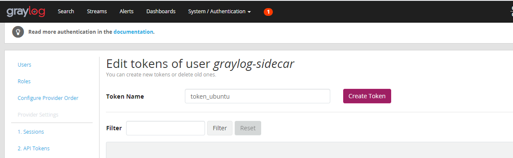

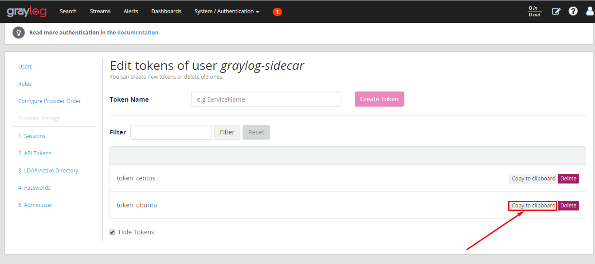

### 4. Cấu hình đầy log trên client Ubuntu

Chỉnh sửa cấu hình tại file `etc/graylog/sidecar/sidecar.yml `

```
cp /etc/graylog/sidecar/sidecar.yml /etc/graylog/sidecar/sidecar.yml.bk
```

- Khai báo IP của graylog-server 

```
server_url: "http://192.168.80.94:9000/api/"
```

IP của Client ở dải nào thì khai báo đúng IP của server ở dải đó. 


- Khai báo Token mới tạo ở dòng server_api_token  : 

```
server_api_token: "13og81k0glr7v4i3amla66pcp1664snl0ltshabqkfokbgu4f77p"
```

- Sửa node_name để khai báo hostname của client (sửa node_name theo tên của máy) : 

```
node_name: "logubuntu"
```

- Bỏ comment `list_log_files`  và sửa `/var/log/nginx` thành : 

```
list_log_files:
           - "/var/log/"
```

Bỏ comment những dòng sau : 

```
node_id: "file:/etc/graylog/sidecar/node-id"
update_interval: 10
cache_path: "/var/cache/graylog-sidecar"
log_path: "/var/log/graylog-sidecar"
```

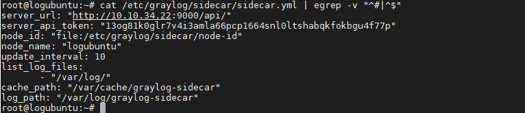

```
graylog-sidecar -service install
systemctl start graylog-sidecar
systemctl enable  graylog-sidecar
systemctl status graylog-sidecar
```

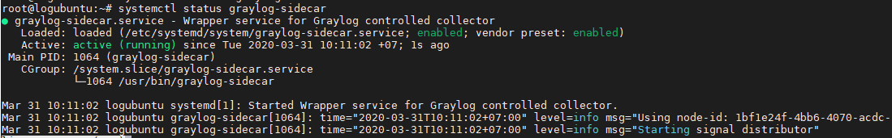


### 5. Cấu hình sidecar trên Web Interface của graylog-server 

Khai báo input cho logubuntu, input này có thể sử dụng chung cho các máy trong cùng 1 dải mạng. 


- Khai báo input cho Sidecar: Click `System/Inputs`  => chọn input `Beats` => `Launch new input`

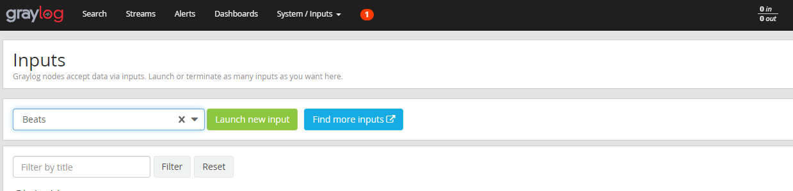

- Chỉnh sửa `input` như sau :

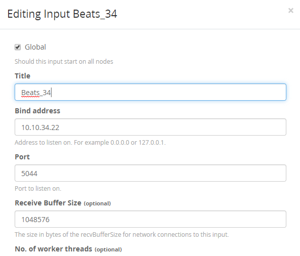

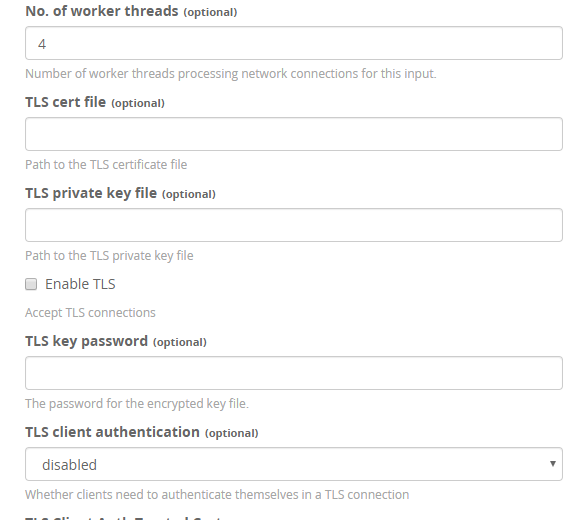

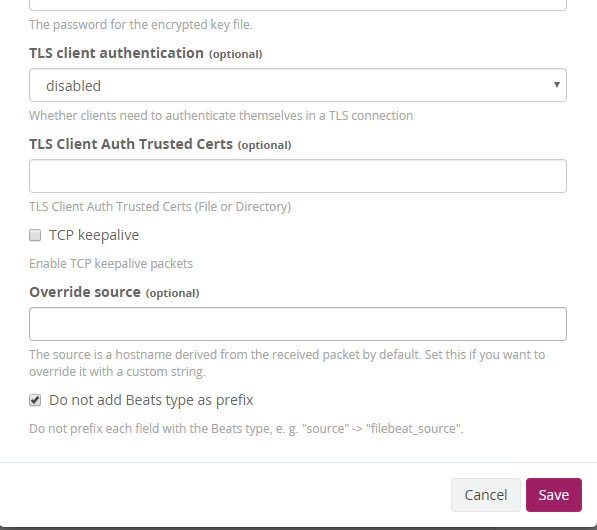

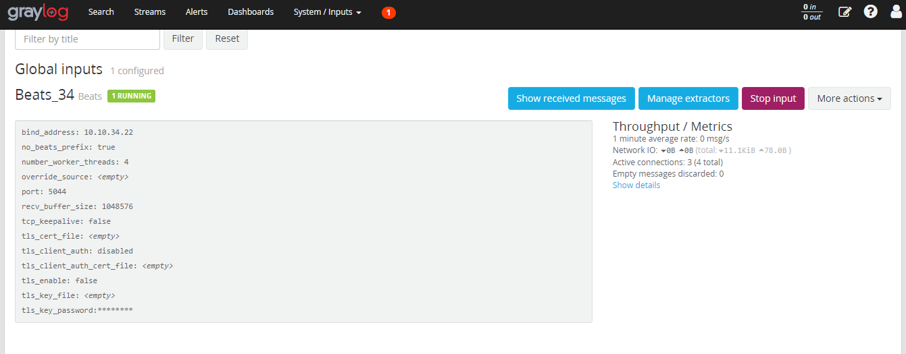

### 6. Cấu hình sidecars

Click `System/Sidecars` => `Configuration` :

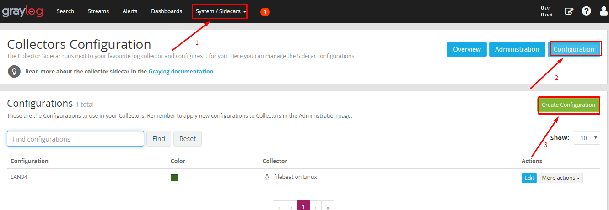


```
# Needed for Graylog
fields_under_root: true
fields.collector_node_id: ${sidecar.nodeName}
fields.gl2_source_collector: ${sidecar.nodeId}
fields.source: ${sidecar.nodeName}

filebeat.inputs:
- input_type: log
  paths:
    - /var/log/secure
    - /var/log/auth.log
  type: log
output.logstash:
   hosts: ["10.10.34.22:5044"]
path:
  data: /var/lib/graylog-sidecar/collectors/filebeat/data
  logs: /var/lib/graylog-sidecar/collectors/filebeat/log
```

- Kích hoạt filebeat

Tại `Configuration` chọn `LAN34`, một cửa sổ bật lên Confirm để xác nhận.

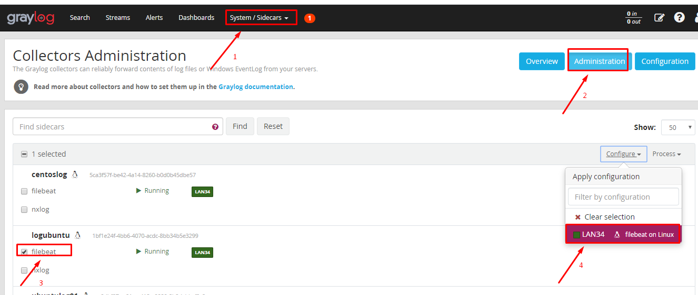

Xác nhận xong chọn `Process` và chọn `Start` để bắt đầu. 

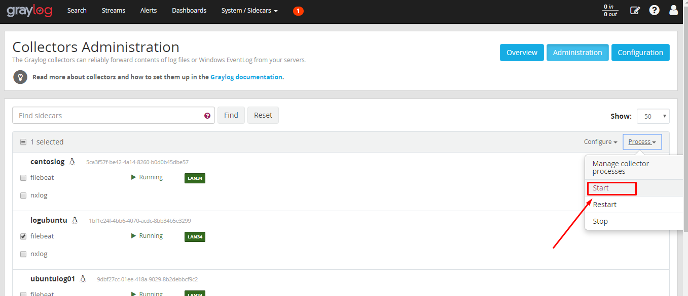

- Kiểm tra kết quả: Tại `Overview` và chọn `Show messages`

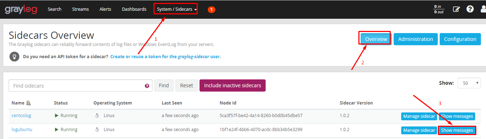

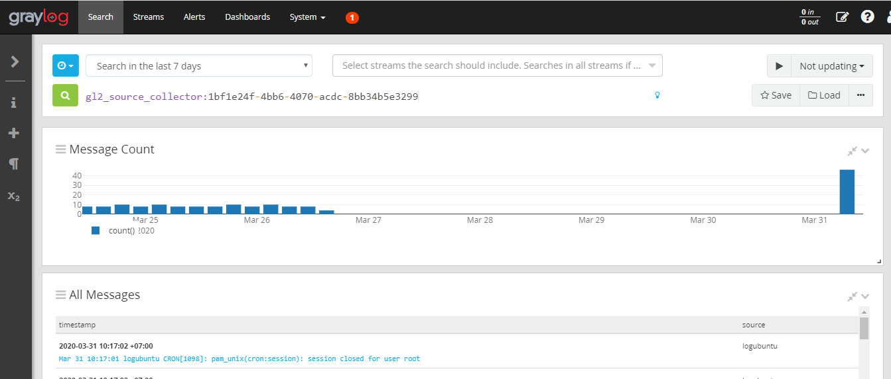


