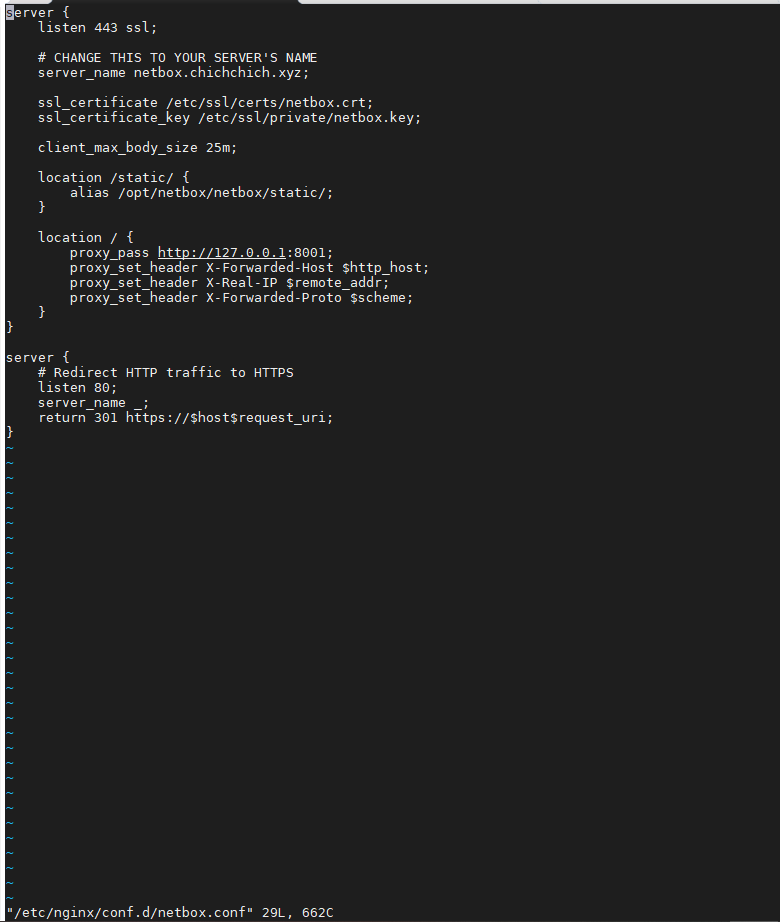

# Ghi chép lại các bước cài đặt Netbox trên CentOS 7

### Mục lục

[1. Thiết lập ban đầu](#thietlap)<br>
[2. Cài đặt netbox](#caidat)<br>

<a name="thietlap"></a>
## 1. Thiết lập ban đầu

**Thiết lập IP**

```
hostnamectl set-hostname duydmnetbox
sudo systemctl disable firewalld
sudo systemctl stop firewalld
sudo systemctl disable NetworkManager
sudo systemctl stop NetworkManager
sudo systemctl enable network
sudo systemctl start network
sed -i 's/SELINUX=enforcing/SELINUX=disabled/g' /etc/sysconfig/selinux
sed -i 's/SELINUX=enforcing/SELINUX=disabled/g' /etc/selinux/config
```

```
yum install epel-release -y
yum update -y
```

**Cài đặt NTPD**


```
yum install chrony -y 

systemctl start chronyd 
systemctl enable chronyd
systemctl restart chronyd 

chronyc sources -v
```

```
sudo date -s "$(wget -qSO- --max-redirect=0 google.com 2>&1 | grep Date: | cut -d' ' -f5-8)Z"
ln -f -s /usr/share/zoneinfo/Asia/Ho_Chi_Minh /etc/localtime
```

**CMD log**

```
curl -Lso- https://raw.githubusercontent.com/nhanhoadocs/ghichep-cmdlog/master/cmdlog.sh | bash
```

<a name="caidat"></a>
## 2. Cài đặt Netbox

**- Cài đặt PostgreSQL**

Có thể cài version mới nhất

```
yum install -y https://download.postgresql.org/pub/repos/yum/reporpms/EL-7-x86_64/pgdg-redhat-repo-latest.noarch.rpm
yum install -y postgresql96 postgresql96-server postgresql96-devel
/usr/pgsql-9.6/bin/postgresql96-setup initdb
```


Cho phép xác thực password bằng `md5` thay vì `ident` bằng các sửa 2 dòng trong file `/var/lib/pgsql/9.6/data/pg_hba.conf`

```
host    all             all             127.0.0.1/32            md5
host    all             all             ::1/128                 md5
```


+ Restart service

```
systemctl start postgresql-9.6
systemctl enable postgresql-9.6
```

+ Tạo user, password và databases sử dụng cho NetBox

```
sudo -u postgres psql
CREATE DATABASE netbox;
CREATE USER netbox WITH PASSWORD 'your_password';
GRANT ALL PRIVILEGES ON DATABASE netbox TO netbox;
\q
```


+ Kiểm tra đăng nhâp với user netbox của data bae postgres vừa tạo

```
psql -U netbox -W -h localhost netbox
\conninfo
```


**- Cài đặt Redis**

Redis là một kho lưu trữ theo dạng key-value trên memory. NetBox sử dụng Redis để làm cache và queue.

```
yum install -y redis
```

```
systemctl start redis
systemctl enable redis
```

Kiểm tra sự hoạt động của redis

```
redis-cli ping
```


**- Cài đặt NetBox**

- Cài đặt python và một số gói cần thiết. Đối với NetBox từ phiên bản `2.8` sẽ yêu cầu python tối thiểu là phiên bản `3.6`

```
yum install -y gcc python36 python36-devel python36-setuptools libxml2-devel libxslt-devel libffi-devel openssl-devel redhat-rpm-config
easy_install-3.6 pip
```

- Download source netbox

```
yum install -y wget
wget https://github.com/netbox-community/netbox/archive/v2.8.3.tar.gz
tar -xzf v2.8.3.tar.gz -C /opt
cd /opt/
mv netbox-2.8.3/ netbox
cd /opt/netbox/
```

Tạo user `netbox` để sử dụng

```
groupadd --system netbox
adduser --system --gid netbox netbox
chown --recursive netbox /opt/netbox/netbox/media/
```

Tạo một môi trường python ảo để các thư viện dùng cho NetBox không bị xung đột với các ứng dụng khác.

```
python3 -m venv /opt/netbox/venv
```

Khởi chạy môi trường

```
source venv/bin/activate
pip3 install -r requirements.txt
```


Cài thêm thư viện bổ sung `napalm` và `django-storages`

`NAPALM` cho phép NetBox tìm nạp dữ liệu trực tiếp từ các thiết bị và trả lại cho người yêu cầu thông qua API.


```
pip3 install napalm
```

`django-storages` là thư viện cho phép sử dụng các filesystem trên máy khác. Mặc định NetBox sẽ sử dụng filesytem tại local để lưu các file được tải lên. Để sử dụng các filesystem trên máy khác cần cài thư viện django-storages và cấu hình trong file `configuration.py`

```
pip3 install django-storages
```

- Cấu hình

```
cd netbox/netbox/
cp configuration.example.py configuration.py
```

Edit file `configuration.py` như sau:

+ `ALLOWED_HOSTS`:  IP hoặc domain mà bạn có thể truy cập vào NetBox


```
ALLOWED_HOSTS = [netbox.chichchich.xyz]
```

+ `DATABASE`: Khai báo thông tin connect databases.


```
DATABASE = {
    'NAME': 'netbox',               # Database name
    'USER': 'netbox',               # PostgreSQL username
    'PASSWORD': 'your_password', # PostgreSQL password
    'HOST': 'localhost',            # Database server
    'PORT': '',                     # Database port (leave blank for default)
    'CONN_MAX_AGE': 300,            # Max database connection age
}
```

+  `REDIS` để mặc định

```
REDIS = {
    'tasks': {
        'HOST': 'localhost',
        'PORT': 6379,
        # Comment out `HOST` and `PORT` lines and uncomment the following if using Redis Sentinel
        # 'SENTINELS': [('mysentinel.redis.example.com', 6379)],
        # 'SENTINEL_SERVICE': 'netbox',
        'PASSWORD': '',
        'DATABASE': 0,
        'DEFAULT_TIMEOUT': 300,
        'SSL': False,
    },
    'caching': {
        'HOST': 'localhost',
        'PORT': 6379,
        # Comment out `HOST` and `PORT` lines and uncomment the following if using Redis Sentinel
        # 'SENTINELS': [('mysentinel.redis.example.com', 6379)],
        # 'SENTINEL_SERVICE': 'netbox',
        'PASSWORD': '',
        'DATABASE': 1,
        'DEFAULT_TIMEOUT': 300,
        'SSL': False,
    }
}
```

+ `SECRET_KEY`

Tạo và chỉnh sửa trong file config

```
python /opt/netbox/netbox/generate_secret_key.py
```


-  Migrate database

```
cd /opt/netbox/netbox/
python manage.py migrate
```

Xuất hiện lỗi trong khi `migrate` như ở dưới có thể tham khảo fix

```
(venv) [root@duydmnetbox netbox]# python manage.py migrate
Traceback (most recent call last):
  File "manage.py", line 10, in <module>
    execute_from_command_line(sys.argv)
  File "/opt/netbox/venv/lib64/python3.6/site-packages/django/core/management/__init__.py", line 401, in execute_from_command_line
    utility.execute()
  File "/opt/netbox/venv/lib64/python3.6/site-packages/django/core/management/__init__.py", line 395, in execute
    self.fetch_command(subcommand).run_from_argv(self.argv)
  File "/opt/netbox/venv/lib64/python3.6/site-packages/django/core/management/base.py", line 328, in run_from_argv
    self.execute(*args, **cmd_options)
  File "/opt/netbox/venv/lib64/python3.6/site-packages/django/core/management/base.py", line 366, in execute
    self.check()
  File "/opt/netbox/venv/lib64/python3.6/site-packages/django/core/management/base.py", line 395, in check
    include_deployment_checks=include_deployment_checks,
  File "/opt/netbox/venv/lib64/python3.6/site-packages/django/core/management/commands/migrate.py", line 64, in _run_checks
    issues.extend(super()._run_checks(**kwargs))
  File "/opt/netbox/venv/lib64/python3.6/site-packages/django/core/management/base.py", line 382, in _run_checks
    return checks.run_checks(**kwargs)
  File "/opt/netbox/venv/lib64/python3.6/site-packages/django/core/checks/registry.py", line 72, in run_checks
    new_errors = check(app_configs=app_configs)
  File "/opt/netbox/venv/lib64/python3.6/site-packages/django/core/checks/urls.py", line 13, in check_url_config
    return check_resolver(resolver)
  File "/opt/netbox/venv/lib64/python3.6/site-packages/django/core/checks/urls.py", line 23, in check_resolver
    return check_method()
  File "/opt/netbox/venv/lib64/python3.6/site-packages/django/urls/resolvers.py", line 407, in check
    for pattern in self.url_patterns:
  File "/opt/netbox/venv/lib64/python3.6/site-packages/django/utils/functional.py", line 48, in __get__
    res = instance.__dict__[self.name] = self.func(instance)
  File "/opt/netbox/venv/lib64/python3.6/site-packages/django/urls/resolvers.py", line 588, in url_patterns
    patterns = getattr(self.urlconf_module, "urlpatterns", self.urlconf_module)
  File "/opt/netbox/venv/lib64/python3.6/site-packages/django/utils/functional.py", line 48, in __get__
    res = instance.__dict__[self.name] = self.func(instance)
  File "/opt/netbox/venv/lib64/python3.6/site-packages/django/urls/resolvers.py", line 581, in urlconf_module
    return import_module(self.urlconf_name)
  File "/usr/lib64/python3.6/importlib/__init__.py", line 126, in import_module
    return _bootstrap._gcd_import(name[level:], package, level)
  File "<frozen importlib._bootstrap>", line 994, in _gcd_import
  File "<frozen importlib._bootstrap>", line 971, in _find_and_load
  File "<frozen importlib._bootstrap>", line 955, in _find_and_load_unlocked
  File "<frozen importlib._bootstrap>", line 665, in _load_unlocked
  File "<frozen importlib._bootstrap_external>", line 678, in exec_module
  File "<frozen importlib._bootstrap>", line 219, in _call_with_frames_removed
  File "/opt/netbox/netbox/netbox/urls.py", line 78, in <module>
    path('admin/background-tasks/', include('django_rq.urls')),
  File "/opt/netbox/venv/lib64/python3.6/site-packages/django/urls/conf.py", line 34, in include
    urlconf_module = import_module(urlconf_module)
  File "/usr/lib64/python3.6/importlib/__init__.py", line 126, in import_module
    return _bootstrap._gcd_import(name[level:], package, level)
  File "<frozen importlib._bootstrap>", line 994, in _gcd_import
  File "<frozen importlib._bootstrap>", line 971, in _find_and_load
  File "<frozen importlib._bootstrap>", line 955, in _find_and_load_unlocked
  File "<frozen importlib._bootstrap>", line 665, in _load_unlocked
  File "<frozen importlib._bootstrap_external>", line 678, in exec_module
  File "<frozen importlib._bootstrap>", line 219, in _call_with_frames_removed
  File "/opt/netbox/venv/lib64/python3.6/site-packages/django_rq/urls.py", line 3, in <module>
    from . import views
  File "/opt/netbox/venv/lib64/python3.6/site-packages/django_rq/views.py", line 12, in <module>
    from rq.exceptions import NoSuchJobError, UnpickleError
ImportError: cannot import name 'UnpickleError'
(venv) [root@duydmnetbox netbox]#
```

Thêm dòng `rq==1.2` trong `requirements.txt` trước dòng `django-rq==2.3.1` và thực hiện `pip3 install -r requirements.txt` lại

```
source venv/bin/activate
cd /opt/netbox/
vi requirements.txt

Thêm dòng rq==1.2 như trong ảnh
```


```
source venv/bin/activate
pip3 install -r requirements.txt
```


Thực hiện migrate lại database.

```
cd /opt/netbox/netbox/
python manage.py migrate
```


- Tạo user cho netbox: User có quyền cao nhất.

```
python manage.py createsuperuser
```


- Collect các file tĩnh

```
python manage.py collectstatic --no-input
```


- Kiểm tra đăng nhập

```
python manage.py runserver 0.0.0.0:8000 --insecure
```

```
http://103.101.160.138:8000/
http://netbox.chichchich.xyz:8000/
```


**Lưu ý:** Phải khai báo host trong file config `configuration.py`


**- Cấu hình HTTP**

+ Tạo chứng chỉ SSL

```
mkdir /etc/ssl/private
openssl req -x509 -nodes -days 365 -newkey rsa:2048 -keyout /etc/ssl/private/netbox.key -out /etc/ssl/certs/netbox.crt
```


+ Cài đặt nginx

```
yum install -y nginx
```

Copy và chỉnh sửa cấu hình nginx

```
cp /opt/netbox/contrib/nginx.conf /etc/nginx/conf.d/netbox.conf
```

```
vi /etc/nginx/conf.d/netbox.conf
```




```
systemctl restart nginx
systemctl enable nginx
```

**Cấu hình systemd**

```
cp /opt/netbox/contrib/gunicorn.py /opt/netbox/gunicorn.py
cp /opt/netbox/contrib/*.service /etc/systemd/system/
```

```
systemctl daemon-reload
systemctl start netbox netbox-rq
systemctl enable netbox netbox-rq
```

Truy cập trang quản lý netbox

```
https://netbox.chichchich.xyz
```


**Tham khảo**

https://netbox.readthedocs.io/en/stable/installation/
https://news.cloud365.vn/huong-dan-cai-dat-netbox-tren-centos-7/
https://github.com/netbox-community/netbox/issues/4633

