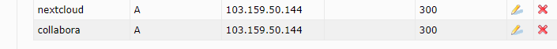
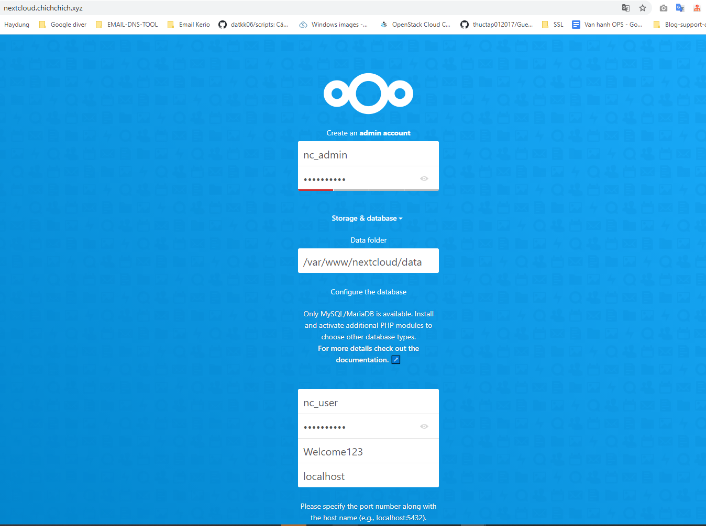
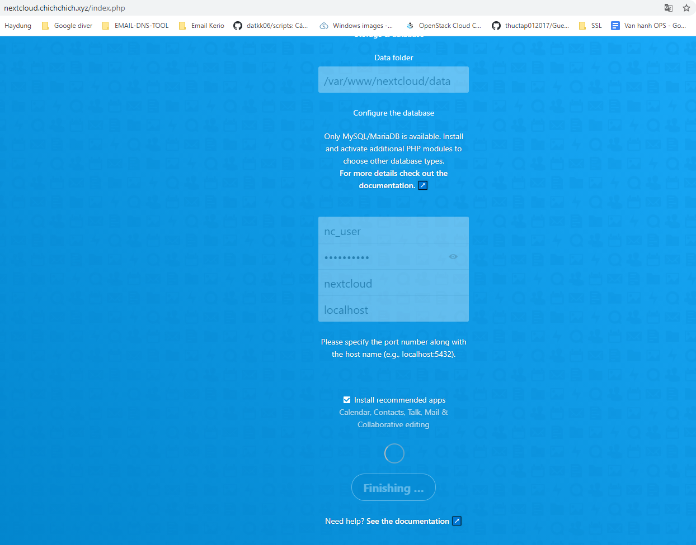
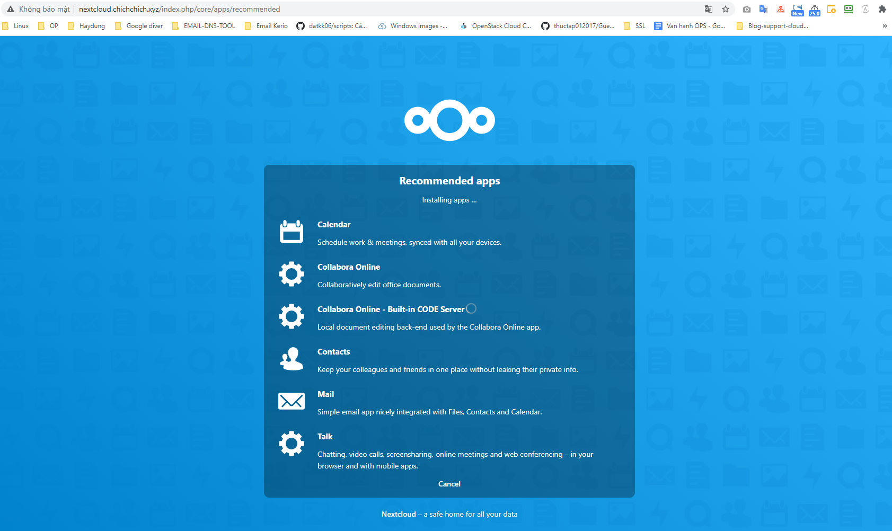
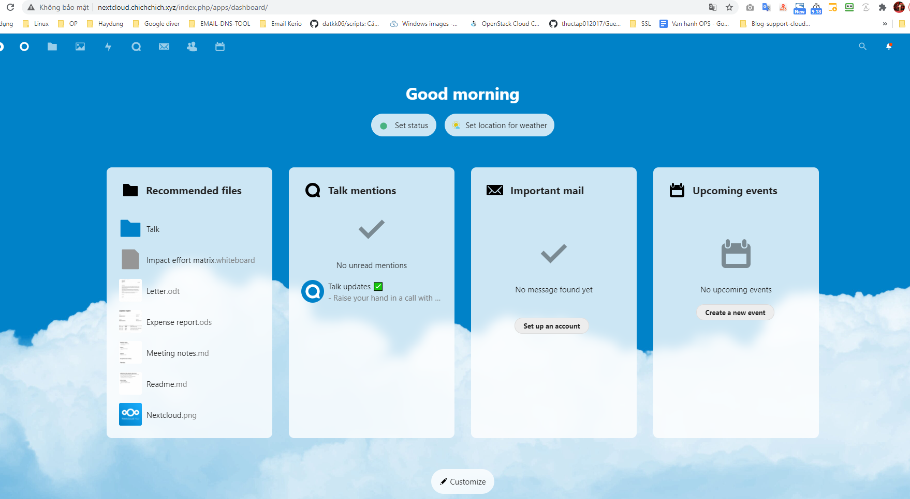
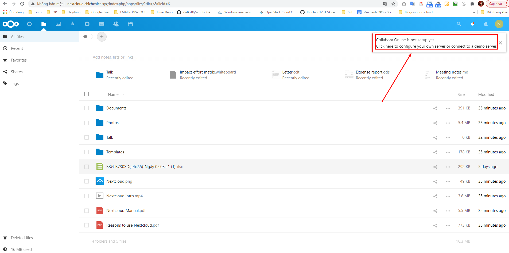
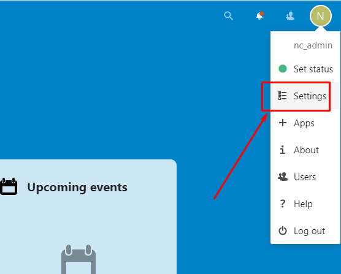
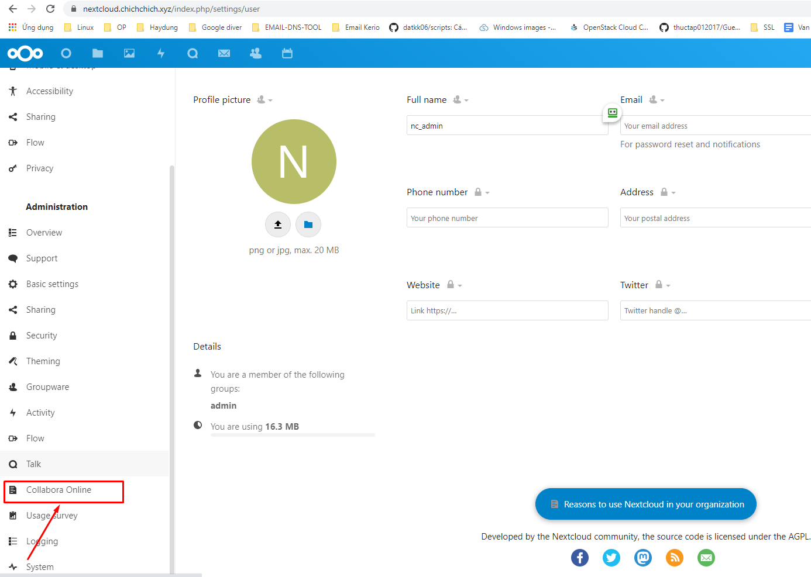
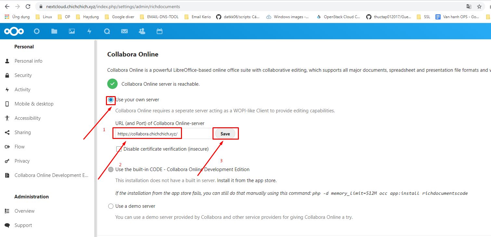
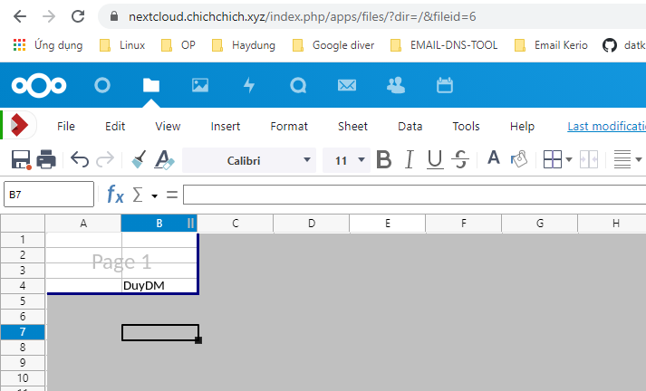

# Ghi chép lại các bước cài đặt Nextcloud trên Ubuntu 20

### Mục lục

[1. Thiết lập ban đầu](#thietlap)<br>
[2. Cài đặt nextcloud](#caidat)<br>
[3. Tích hợp collabora](#tichhop)<br>
[4. Cài đặt SSL Lets’encrypt](#letencrypt)<br>


<a name="thietlap"></a>
## 1. Thiết lập ban đầu

**Chuẩn bị**

Chuẩn bị 01 server chạy hệ điều hành Ubuntu 20

Dịch vụ cần có tên miền để hoạt động cho nextcloud và collabora

Tên miền sử dụng `chichchich.xyz`. Tạo 2 subdomain trỏ về server cài nextcloud




**Update**

```
apt-get update -y
apt-get upgrade -y 
apt-get dist-upgrade -y
```

**Cài đặt NTPD**

```
apt-get -y install chrony
systemctl enable chrony
systemctl restart chrony
chronyc sources
```

**CMD log**

```
curl -Lso- https://raw.githubusercontent.com/nhanhoadocs/ghichep-cmdlog/master/cmdlog.sh | bash
```

**Chỉnh sửa file hosts**

```
root@duydm-test-nextcloud:/var/log/apache2# cat /etc/hosts
103.159.50.144 collabora.chichchich.xyz
103.159.50.144 nextcloud.chichchich.xyz
```

<a name="caidat"></a>
## 2. Cài đặt nextcloud

**Cài đặt webserver apache2**

```
apt-get install apache2 -y
systemctl start apache2
systemctl enable apache2
```

**Cài đặt Mariadb 10.3**

```
apt-get install -y software-properties-common

apt-key adv --recv-keys --keyserver hkp://keyserver.ubuntu.com:80 0xF1656F24C74CD1D8
add-apt-repository "deb [arch=amd64,arm64,ppc64el] http://mariadb.mirror.liquidtelecom.com/repo/10.3/ubuntu $(lsb_release -cs) main"

apt update
apt install mariadb-server -y
```

Lúc cài sẽ hỏi nhập thông tin mysql lưu ý nhập password ở màn hình mầu hồng.

Tạo `user` và `password` sử dụng cho nextcloud

```
mysql -u root -p
CREATE DATABASE nextcloud;
CREATE USER 'nc_user'@'localhost' IDENTIFIED BY 'Welcome123';
GRANT ALL PRIVILEGES ON nextcloud.* TO 'nc_user'@'localhost';
FLUSH PRIVILEGES;
Exit
```

**Cài đặt php (php version 7.3 trở lên)**

```
apt install -y php libapache2-mod-php php-ldap php-mysql php-cli php-bz2 php-curl php-gd php-imagick php-intl php-mbstring php-xml php-zip
```

**Cài đặt nextcloud**

Có thể cài đặt version tùy lựa chọn, nên chọn version mới nhất.

```
wget https://download.nextcloud.com/server/releases/nextcloud-21.0.0.zip -O /mnt/nextcloud.zip
apt-get install unzip -y 
unzip /mnt/nextcloud.zip -d /var/www/
rm -f /mnt/nextcloud-21.0.0.zip
chmod 755 -R /var/www/nextcloud/
chown www-data. -R /var/www/nextcloud/
```

**Cấu hình vhost cho nextcloud**

```
cat << EOF >> /etc/apache2/sites-available/nextcloud.conf

<VirtualHost *:80>
    ServerAdmin admin@localhost.local
    DocumentRoot /var/www/nextcloud/
    ServerName nextcloud.chichchich.xyz 
  
    Alias /nextcloud "/var/www/nextcloud/"

    <Directory /var/www/nextcloud/>
       Options +FollowSymlinks
       AllowOverride All
       Require all granted
        <IfModule mod_dav.c>
        	Dav off
        </IfModule>
       SetEnv HOME /var/www/nextcloud
       SetEnv HTTP_HOME /var/www/nextcloud
    </Directory>

    ErrorLog ${APACHE_LOG_DIR}/error.log
    CustomLog ${APACHE_LOG_DIR}/access.log combined

</VirtualHost>
EOF
```

```
mv /etc/apache2/sites-available/000-default.{conf,conf.bk}
sudo a2enmod rewrite
sudo a2enmod headers
sudo a2enmod env
sudo a2enmod dir
sudo a2enmod mime
```

```
sudo a2ensite nextcloud.conf
sudo systemctl reload apache2
```

**Cấu hình giao diện web của nextcloud**

Truy cập đường link `http://nextcloud.chichchich.xyz/`

Nhập các thông tin database

```
User: nc_admin
Password: Welcome123 nextcloudpassword
nc_user : nc_user Tên user quản lý database nextcloud
password: Welcome123 Password của user quản lý databse
nextcloud : nextcloud Tên database nextcloud
localhost
```





Chờ quá trình cài đặt





Tới đây là đã cài xong nextcloud, tuy nhiên các định dạng file `.xlxs` không mở được online cần phải cài đặt thêm plugins `collabora`.



<a name="tichhop"></a>
## 3. Tích hợp collabora

collabora.chichchich.xyz

**Thiết lập package repository**

```
echo 'deb https://www.collaboraoffice.com/repos/CollaboraOnline/CODE-ubuntu2004 ./' | sudo tee /etc/apt/sources.list.d/collabora.list
```

```
sudo apt-key adv --keyserver keyserver.ubuntu.com --recv-keys 0C54D189F4BA284D
sudo apt install apt-transport-https ca-certificates
```

**Cài đặt Loolwsd  (LibreOffice Online WebSocket Daemon)**

```
sudo apt update
sudo apt install loolwsd code-brand -y
```

Cấu hình `Loolwsd`

```
sudo loolconfig set ssl.enable false
sudo loolconfig set storage.wopi.host nextcloud.chichchich.xyz
```

Tạo account admin quản lý cho `loolwsd`

```
sudo loolconfig set-admin-password
```

Nhập thông tin password

```
root@duydm-test-nextcloud:~# sudo loolconfig set-admin-password
Enter admin username [admin]: admin
Enter admin password:
Confirm admin password:
Saving configuration to : /etc/loolwsd/loolwsd.xml ...
Saved
root@duydm-test-nextcloud:~#
```

Cấu hình vhost cho collabora: Tạo file `/etc/apache2/sites-available/collabora.conf` với nội dung bên dưới

```
<VirtualHost *:80>
  ServerName collabora.chichchich.xyz
  Options -Indexes

  ErrorLog "/var/log/apache2/collabora_error"
  # Encoded slashes need to be allowed
  AllowEncodedSlashes NoDecode

  # keep the host
  ProxyPreserveHost On

  # static html, js, images, etc. served from loolwsd
  # loleaflet is the client part of Collabora Online
  ProxyPass           /loleaflet http://127.0.0.1:9980/loleaflet retry=0
  ProxyPassReverse    /loleaflet http://127.0.0.1:9980/loleaflet

  # WOPI discovery URL
  ProxyPass           /hosting/discovery http://127.0.0.1:9980/hosting/discovery retry=0
  ProxyPassReverse    /hosting/discovery http://127.0.0.1:9980/hosting/discovery

  # Capabilities
  ProxyPass           /hosting/capabilities http://127.0.0.1:9980/hosting/capabilities retry=0
  ProxyPassReverse    /hosting/capabilities http://127.0.0.1:9980/hosting/capabilities

  # Main websocket
  ProxyPassMatch "/lool/(.*)/ws$" ws://127.0.0.1:9980/lool/$1/ws nocanon

  # Admin Console websocket
  ProxyPass   /lool/adminws ws://127.0.0.1:9980/lool/adminws

  # Download as, Fullscreen presentation and Image upload operations
  ProxyPass           /lool http://127.0.0.1:9980/lool
  ProxyPassReverse    /lool http://127.0.0.1:9980/lool

</VirtualHost>
```

```
sudo a2enmod proxy proxy_wstunnel proxy_http
```

```
sudo a2ensite collabora.conf
sudo systemctl restart apache2
```

<a name="letencrypt"></a>
## 4. Cài đặt SSL Lets’encrypt

Cài đặt 2 domain `collabora.chichchich.xyz` và `nextcloud.chichchich.xyz`

```
sudo apt install certbot -y
sudo apt install python3-certbot-apache -y
sudo certbot --apache --agree-tos --redirect --hsts --staple-ocsp --email you@chichchich.xyz -d collabora.chichchich.xyz
sudo certbot --apache --agree-tos --redirect --hsts --staple-ocsp --email you@chichchich.xyz -d nextcloud.chichchich.xyz
sudo loolconfig set ssl.termination true
sudo systemctl restart loolwsd
```

**Kết nối Nextcloud với collabora**

Truy cập giao diện Nextcloud với tài khoản admin



Click `Collabora Online` - Cộng tác trực tuyến



Tích `Use your own server` -> Nhập `https://collabora.chichchich.xyz` -> `Save`



Mở file .exsl thành công.




