## Ghi chép các tìm hiểu về lý thuyết, lab VTP

### Mục lục

[I. Lý thuyết về VTP](#lythuyetvtp)<br>
[II. LAB về VTP](#labvtp)<br>


<a name="default"></a>
## I. Lý thuyết về VTP

Ở một mạng nhỏ việc quản lý các VLAN đơn giản và dễ dàng, còn ở một mạng rộng gồm nhiều thành phần việc quản lý các VLAN ở các SWITCH rất phức tạp và khó nếu không có quy hoạch và sử dụng các cấu hình đặc biệt để quản lý và phân phối VLAN.

### 1.1. Tổng quan về VTP

VTP - VLAN Trunking Protocol là giao thức độc quyền của Cisco hoạt động ở lớp 2 của mô hình OSI.

- VTP cấu hình trên thiết bị switch cho phéo người quản lý mạng cấu hình VLAN và chuyển các VLAN đó tới các thiết bị switch khác trong mạng. 

- Switch có thể được cấu hình của một VTP server, VTP client.

- VTP chỉ hiểu các VLAN trong phạm vi VLAN ID từ 1 -> 1005 và không hỗ trợ quản lý các VLAN ngoài phạm vi này.

### 1.2. Tính năng

- Đảm báo tính nhất quán của VLAN trên hệ thống mạng.

- Theo dõi và giám sát tính chính xác của VLAN.

- Tự động cấu hình

- Cấu hình trunking tự động khi một VLAN mới được thêm vào mạng.

### 1.3. Thành phần của VTP

VTP có tính chất tự động nhưng cũng phải được khoanh vùng một cách nhất định.

- `VTP Domain:` bao gồm một hoặc nhiều switch được liên kết với nhau. Tất cả các thiết bị switch trong một domain sẽ chia sẻ chi tiết cấu hình VLAN bằng VTP advertisements. Một router hoặc SW L3 sẽ định nghĩ xác định ranh giới của từng miền.

Các Swich được cấu hình cùng Domain Name được coi là cùng Domain với nhau.

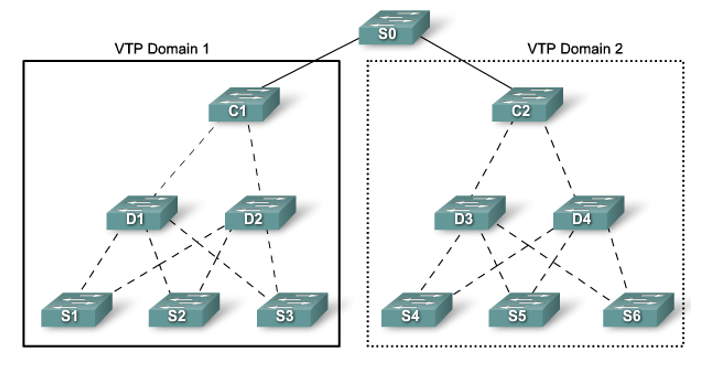

- VTP mode

Trong một domain các Switch có thể đảm nhận 1 trong 3 vai trò sau:

``` 
Server: Một domain có thể có nhiều switch mode server
 
Client: chỉ nhận thông tin VlAN từ switch server

Transparent: các VLAN tạo ra sẽ không ảnh hưởng tới Domain trên các Switch
```

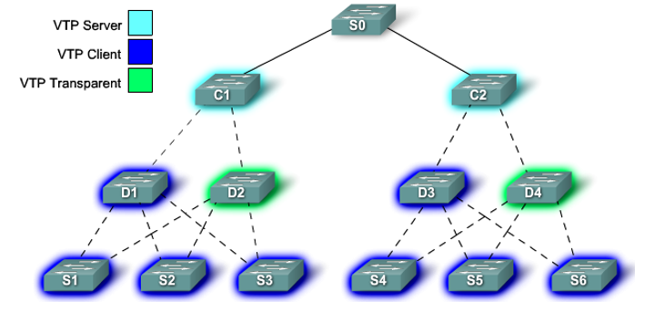

- VTP Advertisements

Sử dụng để phân phối, truyền gói tin và đồng bộ các cấu hình VLAN trên toàn mạng.

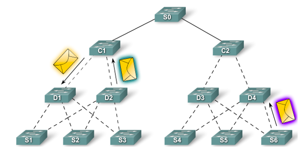

- VTP Pruning

Là cơ chế tăng cường băng thông khả dụng, lưu lượng truyền của Switch bằng cách hạn chế flooded traffic vào các đường trunk không cần thiết. Nếu không sử dụng VTP Pruning một switch sẽ làm flood traffic broadcast, multicast, không xác định lên tất cả các đường trunk trong cùng một VTP domain.

Một cách hiểu khác tăng băng thông truyền tải bằng cách hạn chế các broadcast và flood đến các Switch không chứa host thuộc về VLAN đang Broadcast.

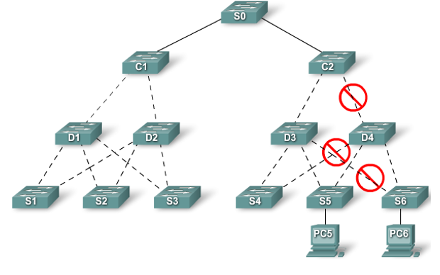

Như ở ảnh trên SW 4 không có host nào nên không gửi các gói tin VTP sang.

- VTP version

VTP version: có 3 version 1,2 và 3

VTP Version 2 là phiên bản nâng cấp của VTP Version 1.

VTP Version 3 hỗ trợ từ VLAN 1 đến VLAN 4094, trong khi VTP Version 1 và 2 hỗ trợ 1 đến 1001.

Version 1, 2, 3 đều hỗ trợ 1002 đến 1005 (1002 fddi, 1003 token-ring,1004 fddinet, 1005 trnet).

VTP Version 3 chỉ hỗ trợ từ Cisco IOS Release 12.2(33)SXI  trở về sau.

### 1.4. Hoạt động của VTP

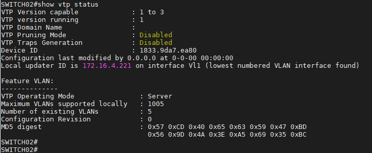

**Show vtp status command**

```
VTP Version capable             : 1 to 3 - các version VTP mà SW có thể dùng
VTP version running             : 1 - Version VTP hiện tại đang chạy. Mặc định là 1 có thể set là 2.
VTP Domain Name                 :         - đang trống thì chưa thuộc về thằng nào cả.
VTP Pruning Mode                : Disabled
VTP Traps Generation            : Disabled
Device ID                       : 1833.9da7.ea80
Configuration last modified by 0.0.0.0 at 0-0-00 00:00:00     - Thời gian chỉnh sửa VTP gần nhất.
Local updater ID is 172.16.4.221 on interface Vl1 (lowest numbered VLAN interface found) - Interface các bản tin VTP trao đổi qua nhau.

Feature VLAN:
--------------

VTP Operating Mode                : Mode hiện tại cảu VTP
Maximum VLANs supported locally   : Số VLAN hỗ trợ tối đa mà VTP quản lý được 1005
Number of existing VLANs          : Số VLAN đang hoạt động trên SW.
Configuration Revision            : đếm số lần thay đổi các VLAN trên Switch, mỗi khi chuyển domain nó sẽ chuyển về 0. Khi sang VLAN mới nó sẽ chuyển về 0
MD5 digest : Mã checksum config VLAN.
```

- VTP Domains

VTP cho phép tách mạng thành các miền quản lý nhỏ để quản lý VLAN hiệu qua hơn.

Giới hạn mức độ lan truyền các thay đổi cấu hình trong mạng nếu xảy ra lỗi.

VTP domain bao gồm một switch hoặc nhiều switch được kết nối với nhau chia sẻ cùng một VTP domain.

Quảng báo VTP domain: Đối với VTP server hoặc client switch tham giao vào một mạng hỗ trợ VTP phải là một thành phần của mạng có cùng domain. Khi switch ở các vtp domain khác nhau chũng sẽ không trao đổi thông điệp VTP. VTP server quảng bá domain tới tất cả các thiết vị switch. Việc quản bá domain sử dụng 3 thành phần servers, clients, and advertisements. 

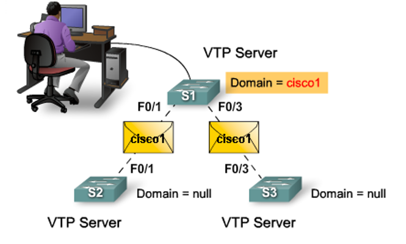

- VTP Advertising

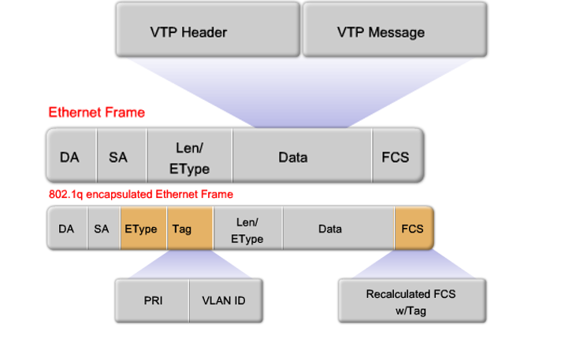

VTP Frame Details

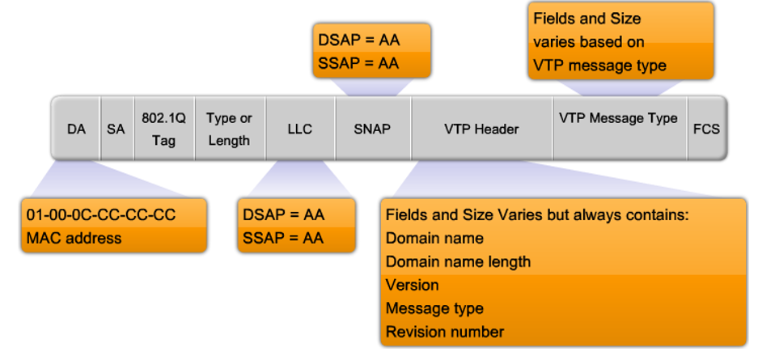

+VTP Revision Number

`VTP Revision Number`: Các Switch trong cùng Domain dựa trên Revision number để xác định xem switch có cấu hình mới hơn. Switch có Revision number thấp hơn sẽ học VLAN từ Switch có Revision number cao hơn. 

Chú ý: khi chuyển Switch Server domain thì Revision sẽ bị chuyển về 0 và sẽ học các Revision number cao hơn (có thể học từ Client).

Số này là một số 32 bit cho biết mức độ sửa đổi của VTP frame, mặc định là 0. Mỗi khi thêm hoặc xóa VLAN, sửa đổi tham số này sẽ tăng lên.

Tham số này quyết định việc switch nào có cấu hình mới hơn switch nào có cấu hình cũ hơn. Đóng vai trog quan trọng và phức tạp trong việc cho phép VTP phân phối và đồng bộ hóa VTP domain và thông tin cấu hình VLAN.

+ Summary Advertisements 

Advertisements về cơ bản chứ VTP domain, revision number hiện tại và chi tiết cấu hình VTP khách. Bản tin quảng bá gủi đi:

```
+ Mỗi 5 phút bỏi VTP server hoặc VTP client để thông báo cho các switch hỗ trợ VTP lân cận về VTP domain, revision number.
+ Ngay sau khi cấu hình được tạo.
+ Subset Advertisements
```

+ Subset Advertisements 

Chứa các thông tin của VLAN, những thay đổi bao gồm: 

```
Creating or deleting a VLAN 
Suspending or activating a VLAN 
Changing the name of a VLAN 
Changing the MTU of a VLAN
```

+ Request Advertisements

Khi một yêu cầu quảng báo được gửi đến một VTP server trong cùng một VTP domain, VTP server sẽ phản hồi bằng cách gửi một bản tin quảng báo tóm tắt (summary advertisement) và sau đó là một bản tin subnet (subset advertisement). Bản tin quảng báo được gửi đi khi:

```
+ VTP domain thay đổi
+ Nhận được bản tin quảng bá VTP từ một switch có revision number lớn hơn nó.
+ Một bản tin quảng bá bị nhỡ.
+ Swich reset lại.
```

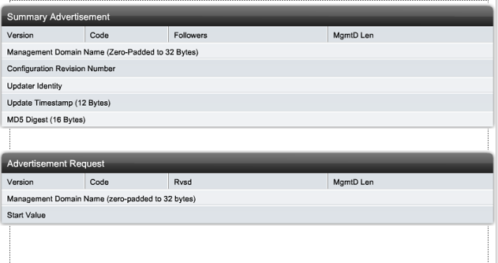


- VTP Modes

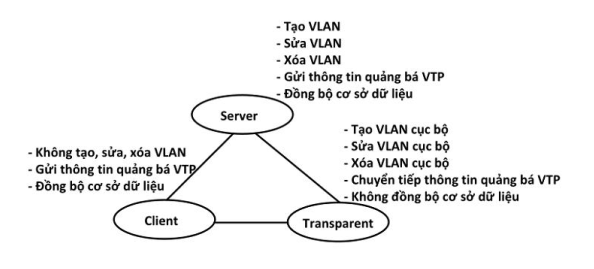

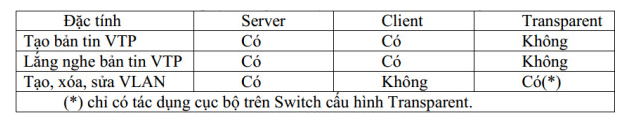

`Tạo bản tin VTP`: Bất cứ khi nào người quản trị tạo, xóa hay sửa một VLAN và muốn thông tin này quảng bá đến các Switch khác trong cùng một vùng, người quản trị phải cấu hình nó trên Switch đang làm việc ở chế độ Server. Do đó chế độ Server là một nguồn tạo bản tin VTP. Ngoài ra ở chế độ Client cũng có khả năng là nguồn của một bản tin VTP mặc dù nó không thể tạo, xóa hay sửa một VLAN. Đó là khi một Switch mới gia nhập vào hệ thống nhưng nó đã mang sẵn cấu hình VTP của vùng khác, với cùng VTP domain và chỉ số revision lớn hơn tất cả trong hệ thống của chúng ta.

Đó là lý do đôi lúc ta thấy làm việc ở chế độ Client cũng có khả năng là nguồn tạo bản tin VTP. Một Switch hoạt động ở chế độ Transparent hoàn toàn có thể tạo VLAN nhưng nó sẽ không gửi đi bản tin quảng bá VLAN mới đó. Hay nói cách khác nó chỉ hoạt động độc lập, do đó nó không phải là nguồn tạo một bản tin VTP.

`Lắng nghe bản tin VTP`: Chỉ có những Switch hoạt động ở chế độ Client hay Server mới lắng nghe bản tin VTP từ những nguồn khác trong hệ thống. Khi một Switch nhận một thông tin quảng bá đến nó từ địa chỉ multicast 01-00-0C-CC-CC-CC nó sẽ tiến hành xử lý gói tin đó. Nếu thông số revision lớn hơn của nó, khi đó quá trình đồng bộ sảy ra, Switch sẽ cập nhật thông tin nó đang có với thông tin trong bản tin vừa nhận. Nếu thông số revision của bản tin vừa nhận nhỏ hơn của Swith thì nó sẽ hủy bản tin và gửi lại bản tin khác có thông số revision lớn hơn để cập nhật cho các thiết bị khác trong mạng.

Một Switch hoạt động ở chế độ Transparent không lắng nghe bản tin VTP quảng bá trong hệ thống. Nó vẫn nhận bản tin quảng bá nhưng không xử lý, nó chỉ có nhiệm vụ chuyển tiếp bản tin đó ra liên kết trunk.

`Tạo, xóa, sửa VLAN`: Thuộc tính này có trên Switch hoạt động ở chế độ Server và Transparent. Tuy nhiên bản chất của nó là khác nhau. Khi người quản trị tạo, xóa hay sửa VLAN trên một Server, ngay lập tức thông tin quảng bá sẽ được gửi đến địa chỉ multicast 01-00-0C-CC-CC-CC với thông số revision tăng lên một. Quá trình cập nhật trong hệ thống với việc tăng thêm một VLAN mới sảy ra ngay sau đó.

Việc này cũng có thể thực hiện trên Switch hoạt động ở chế độ Transparent, người quản trị dễ dàng tạo, xóa hay sửa thông tin một VLAN, nhưng bản tin VTP quảng bá không được tạo ra, không được gửi đi trong hệ thống do đó những Switch khác không cập nhật những thông tin mới chỉnh sửa. Switch hoạt động ở chế độ Transparent làm việc một cách cục bộ không ảnh hưởng đến toàn bộ hệ thống, nó chỉ có nhiệm vụ chuyển tiếp bản tin VTP quảng bá để hệ thống thông suốt liên tục. Thuộc tính này không có ở một Switch hoạt động ở chế độ Client, nó không thể tạo, xóa hay sửa thông tin một VLAN.

- VTP Pruning: 

VTP là giao thức cho phép các switch trong cùng một domain có thể đồng bộ tất cả các thông tin VLAN. Nhưng ngoài các thông tin VLAN, các thông tin unicast và broadcast trong VLAN được đẩy ra tất cả các VLAN khác.

<a name="labvtp"></a>
## II. LAB về VTP

### 2.1. Mô hình switch VTP server - switch VTP mở rộng (default)

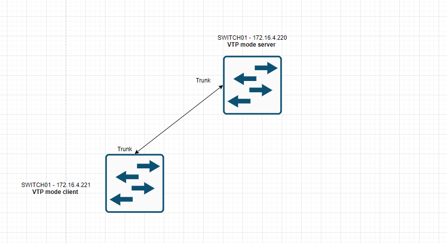

SW ở trạng thái mặc định sẽ có các thuộc tính sau

```
VTP Domain Name                 :
VTP Pruning Mode                : Disabled
VTP Traps Generation            : Disabled
VTP Operating Mode                : Server
Configuration Revision            : 1
```

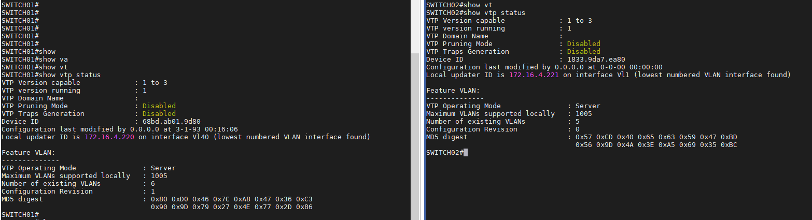

- Bài lab: SWITCH01 cấu hình chắc chắn là VTP có cấu hình mặc định.

```
+ Mode VTP server
+ VLAN10, VLAN11, VLAN12, VLAN40 (MNGT)
+ VTP Version: 1
+ Port Gi1/0/1 là port mở rộng SW trunking.
```

Mục đích: Cắm thêm 1 SWITCH02 vào mạng, SWITCH02 VTP thiết lập default => Kết quả sẽ như thế nào khi cấu hình VTP ở SWITCH01 xong.

**Bước 1**: Cấu hình VTP mode server trên SWITCH01

- Cấu hình VTP mode

```
vtp domain nhanhoalabsw1
vtp mode server
```
Kết quả

```
SWITCH01#configure terminal
Enter configuration commands, one per line.  End with CNTL/Z.
SWITCH01(config)#vtp domain nhanhoalabsw1
Changing VTP domain name from NULL to nhanhoalabsw1
SWITCH01(config)#vtp mode server
Device mode already VTP Server for VLANS.
```

- Tạo VLAN

```
SWITCH01#configure terminal
Enter configuration commands, one per line.  End with CNTL/Z.
SWITCH01(config)#vlan 10
SWITCH01(config-vlan)#name VLAN10
SWITCH01(config-vlan)#exit
SWITCH01(config)#vlan 11
SWITCH01(config-vlan)#name VLAN11
SWITCH01(config-vlan)#exit
SWITCH01(config)#vlan 12
SWITCH01(config-vlan)#name VLAN12
SWITCH01(config-vlan)#
```

- Cấu hình trunking cho đường mở rộng VLAN

```
SWITCH01#configure terminal
Enter configuration commands, one per line.  End with CNTL/Z.
SWITCH01(config)#interface Gi1/0/1
SWITCH01(config-if)#description ->uplink
SWITCH01(config-if)#switchport trunk encapsulation dot1q
SWITCH01(config-if)#switchport mode trunk
SWITCH01(config-if)#no shutdown
SWITCH01(config-if)#exit
```

**Bước 2:** Kiểm tra trên SWITCH02

Với cấu hình VTP default của SWITCH02 `mode server`, `version 1`, `Revision 0`, `vtp domain trống`, `port uplink SWITCH02 không cấu hình gì` khi cấu hình xong VTP mode server ở SWITCH01 thì kết quả của SWITCH02 sẽ như sau:

+ Domain sẽ tự động nhận VTP domain ở SWITCH01 áp xuống.

+ Các VLAN sẽ tự động nhận các VLAN ở SWITCH01 áp xuống.

+ Revision ở 2 SW bằng nhau.

Lúc này thao tác thêm, sửa, xóa VLAN ở 2 SWITCH để đồng bộ cấu hình sang SWITCH còn lại.

**Bước 3:** Mở rộng

Có thể thực hiện chuyển mode của SWITCH02 về client để quản lý VTP áp xuống từ phái server.

```
SWITCH02#configure terminal
SWITCH02(config)#vtp mode client
Setting device to VTP Client mode for VLANS.
```

Lúc này SWITCH02 không thể tạo VLAN là đồng bộ lại cho SWITCH01 mà chỉ có lắng nghe và được áp các thay đổi từ SWITCH01 xuống.


=> Cùng domain thì sẽ các SW trong domain sẽ tác động qua nhau tùy vào cấu hình (theo đúng lý thuyết của VTP).

=> Khác domain thì cho dù switch mở rộng có ở mode server, revision cao hơn cũng không thể tác động ngược trở lại được.


Vậy có thể mở rộng SWITCH theo cách server - client các SW có cùng domain, revision switch mở rộng < switch gốc.

Lưu ý: Nên cấu hình trunk trước mới cắm dây uplink.

### 2.2. Mô hình switch VTP server - switch VTP mở rộng (vtp mode client)

- Có SWITCH01 có sẵn các VLAN 10, VLAN 11 đang hoạt động:

```
VTP mode: Server
VTP domain: nhanhoalabsw1
Revision: 2
```

SWITCH01 hoạt động bình thường, yêu cầu mở rộng thêm SWITCH02 (switch mới).

- SWITCH02 mới:

```
VTP mode: Client
VTP domain: nhanhoalabsw1
Revision: 0
VLAN: Chưa có.
```

=> Kết quả: Với sự chuẩn bị như trên sau khi thông đường trunk giữa 2 SW (chỉ cần cấu hình phía đầu VTP server nếu phía up switch nhận port để mode auto) tất cả thông tin VLAN từ SWITCH01 (gốc) được cập nhật xuống SWITCH02 (switch mở rộng) một cách tự động.

Lưu ý: Nên cấu hình trunk trước mới cắm dây uplink.

### 2.3. Mô hình switch VTP server - switch VTP mở rộng mode server (có cùng VTP domain)

- Có SWITCH01 có sẵn các VLAN 10, VLAN 11 đang hoạt động:

```
VTP mode: Server
VTP domain: nhanhoalabsw1
Revision: 2
```

SWITCH01 hoạt động bình thường, yêu cầu mở rộng thêm SWITCH02 (switch mới).

- SWITCH02 mới:

```
VTP mode: Server
VTP domain: nhanhoalabsw1
Revision: 0
VLAN: Chưa có.
```

=> Kết quả: Với sự chuẩn bị như trên sau khi thông đường trunk giữa 2 SW (chỉ cần cấu hình phía đầu VTP server nếu phía up switch nhận port để mode auto) tất cả thông tin VLAN từ SWITCH01 (gốc) được cập nhật xuống SWITCH02 (switch mở rộng) một cách tự động. Lúc này các tham số

Lưu ý: Nên cấu hình trunk trước mới cắm dây uplink.

### 2.4. Mô hình switch VTP server - switch VTP mở rộng mode server (có cùng VTP domain, revision > revision switch gốc)

Trường hợp này mô phỏng trường hợp lab switch tạo các VLAN làm tăng tham số version lên khi mang đi up (đã xóa hết các VLAN ở switch mới) vô tình cấu hình chung mode server, cùng domain và revision > revision switch gốc.


- Có SWITCH01 có sẵn các VLAN 10, VLAN 11 đang hoạt động:

```
VTP mode: Server
VTP domain: nhanhoalabsw1
Revision: 2
```

SWITCH01 hoạt động bình thường, yêu cầu mở rộng thêm SWITCH02 (switch mới).

- SWITCH02 mới:

```
VTP mode: Server
VTP domain: nhanhoalabsw1
Revision: 6 (> 2 revision switch gốc)
VLAN: Chưa có.
```

=> Kết quả: Với sự chuẩn bị như trên sau khi thông đường trunk giữa 2 SW thì phía SWITCH01 switch gốc bị clear hết VLAN ở SWITCH01 đi do lúc này revision SWITCH02 > SWITCH01 mà cùng mode server, cùng domain. Cấu hình vtp lúc này của SWITCH01 bị đồng bộ theo SWITCH02.

Lưu ý: Nên cấu hình trunk trước mới cắm dây uplink.

### 2.5. Mô hình switch VTP server - switch VTP mode Transparent - switch VTP mode client

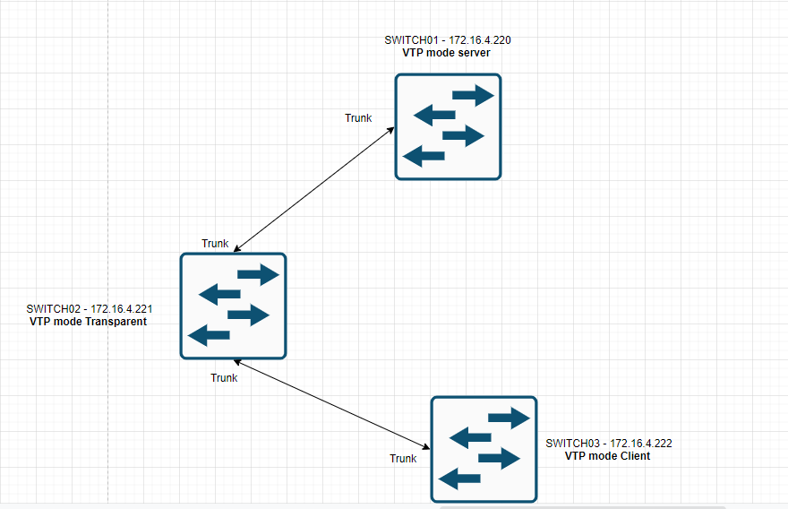

Bài lab mô tả thao tác mở rộng SW trong TH mô hình đang chạy có switch VTP server - switch VTP mode Transparent và mở rộng thêm switch thứ 3 (mode client)

- Có SWITCH01 có sẵn các VLAN 10, VLAN 11 đang hoạt động:

```
VTP mode: Server
VTP domain: nhanhoalabsw1
Revision: 2
```

- Có SWITCH02 mặc định và có cấu hình như ở dưới:

```
VTP mode: Transparent
VTP domain: nhanhoalabsw1
Revision: 0
```

- Đứng ở switch Transparent cấu hình trunk ở interface uplink

Sau khi cấu hình xong trunk trên switch Transparent không có VLAN nào thay đổi.

- Cắm dây mạng uplink giữa 2 SW server - Transparent

- Cấu hình SWITCH03:

```
VTP mode: Transparent
VTP domain: nhanhoalabsw1
Revision: 0
```

- Đứng ở switch client cấu hình trunk ở interface uplink


- Cắm dây mạng uplink giữa 2 SW Transparent - Client

Các VLAN 10, VLAN 11 sẽ được nhả xuống client, các thao tác thêm sửa xóa VLAN từ switch mode server đều được đẩy xuống client.


Nếu đặt IP interface VLAN10 ở switch mode server và switch mode client sẽ không ping thông => Phải tạo tay VLAN có tag ID là 10 ở sw Transparent thì lúc ấy sẽ thông interface VLAN. 


## III. LAB về VTP đối với cặp switch Stack

- SWITCH01 được đấu stack bởi 2 SW Cisco lại có VLAN 10, VLAN 11 đang hoạt động:

```
VTP mode: Server
VTP domain: nhanhoalabsw1
Revision: 2
```

Tạo PO uplink 


- SWITCH02 mới được đấu stack bởi 2 SW Cisco:

```
VTP mode: client
VTP domain: nhanhoalabsw1
Revision: 0
VLAN: Chưa có.
```

- Sau khi cắm dây mạng vật lý VLAN từ switch mode server sẽ nhả VLAN xuống switch client, 2 đường uplink ở switch client sẽ auto nhận mode trunk.


=> Để mở rộng theo mô hình stack này nên cấu hình trunk cho PO và các port ở 2 đầu SW sau đó cắm dây. (trunk interface 2 đầu).


- Cấu hình port-channel cho switch cissco

```
+ Tạo PO mới

SW(config)#interface port-channel 48
SW(config-if)#description ->uplink
SW(config-if)#no shutdown
SW(config-if)#switchport trunk encapsulation dot1q
SW(config-if)#switchport mode trunk
SW(config-if)#spanning-tree bpdufilter enable
SW-Provider01-E6-U45(config-if)#

+ Config interface

SW(config)#interface Gi1/0/1
SW(config-if)#description ->uplink
SW(config-if)#no shutdown
SW(config-if)#switchport trunk encapsulation dot1q
SW(config-if)#switchport mode trunk
SW(config-if)#channel-group 48 mode active


SW(config)#interface Gi2/0/1
SW(config-if)#description ->uplink
SW(config-if)#no shutdown
SW(config-if)#switchport trunk encapsulation dot1q
SW(config-if)#switchport mode trunk
SW(config-if)#channel-group 48 mode active
```


Rack
- Trên SW01 - COM4
- Dưới SW02 - COM5
- Bàn SW03

172.16.4.223 - STACK PROVIDER E8 - COM4 - Ban
172.16.4.224 - STACK VLAN E8 - COM5 - RACK


Create trigger prototype


