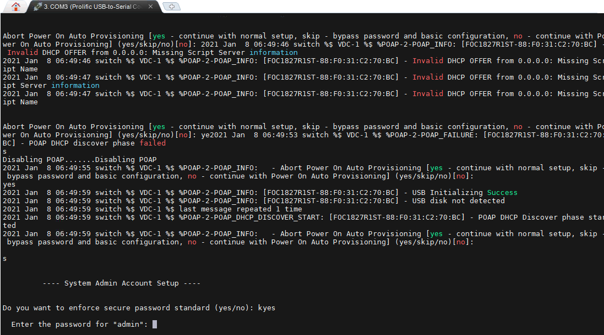
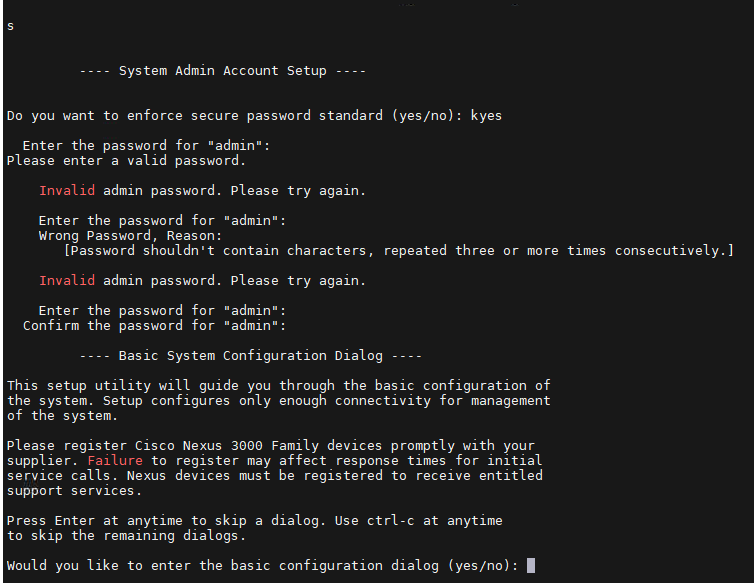

## Ghi chép các thao tác setup basic SW cisco Nexus3000 C3064PQ

### Mục lục

[1. Thiết lập cơ bản](#coban)<br>

<a name="default"></a>
## 1. Thiết lập cơ bản

- Cấu hình từ đầu đối với SW đang ở trạng thái mặc định chưa cấu hình gì thì phải cắm nguồn trải qua quá trình boot tới bước 

```
- Abort Power On Auto Provisioning [yes - continue with normal setup, skip - bypass password and basic configuration, no - continue with Power On Auto Provisioning] (yes/skip/no)[no]:
```

Lựa chọn `yes` để `normal setup`



Nhập password `admin` muốn đặt. Pass cần chữ hoa, chữ thường, số và ký tự đặc biệt.



```
Would you like to enter the basic configuration dialog (yes/no): no
Enabling feature lldp by default
```

- Set time

```
SW-CEPH-COM1(config)# clock timezone EST 7 0
```

https://www.cisco.com/c/en/us/td/docs/switches/datacenter/nexus3000/sw/fundamentals/93x/configuration/guide/b-cisco-nexus-3000-nx-os-fundamentals-configuration-guide-93x/b-cisco-nexus-3000-nx-os-fundamentals-configuration-guide-93x_chapter_0100.html

- Config SNMP

https://www.cisco.com/c/en/us/td/docs/switches/datacenter/nexus3000/sw/system_mgmt/93x/system-management/b-cisco-nexus-3000-series-nx-os-system-management-configuration-guide-93x/b-cisco-nexus-3000-series-nx-os-system-management-configuration-guide-93x_chapter_01100.html

- Thiết lập hostname

```
switch# configure terminal
Enter configuration commands, one per line. End with CNTL/Z.
switch(config)# hostname SW-CEPH-COM1
SW-CEPH-COM1(config)#
```

- Đặt password (thao tác ở mode cấu hình)

+ Pass enable

Dòng server không có password enable

+ Đổi password ssh

```
SW-CEPH-COM1# show user-account
user:admin
        this user account has no expiry date
        roles:network-admin
SW-CEPH-COM1# configure terminal
Enter configuration commands, one per line. End with CNTL/Z.
SW-CEPH-COM1(config)# username admin password New_password
SW-CEPH-COM1(config)# exit
SW-CEPH-COM1# copy running-config startup-config
[########################################] 100%
Copy complete, now saving to disk (please wait)...
SW-CEPH-COM1#
```

https://www.cisco.com/c/en/us/td/docs/switches/datacenter/sw/password_recovery/b_nx_os_pwr/nx_os_pw.html

- Đặt IP SSH

```
SW-CEPH-COM1(config)# interface mgmt0
SW-CEPH-COM1(config-if)# no shutdown
SW-CEPH-COM1(config-if)# ip address 172.16.4.180/20
SW-CEPH-COM1(config-if)# end
```

- Reset về mặc định (xóa sạch toàn bộ cấu hình, vlan của SW)

```
SW-CEPH-COM1# write erase
Warning: This command will erase the startup-configuration.
Do you wish to proceed anyway? (y/n)  [n] y
SW-CEPH-COM1#
```

```
SW-CEPH-COM1# reload
This command will reboot the system. (y/n)?  [n] y
```

```
- Abort Power On Auto Provisioning [yes - continue with normal setup, skip - bypass password and basic configuration, no - continue with Power On Auto Provisioning] (yes/skip/no)[no]:
```

Lựa chọn `yes` để `normal setup`

Sau khi cấu lại sẽ mất toàn bộ cấu hình trong file config, mất hết toàn bộ vlan, cấu hình `interface mgmt0` vẫn còn.


https://docs.netapp.com/ontap-9/index.jsp?topic=%2Fcom.netapp.doc.dot-mcc-inst-cnfg-ip%2FGUID-BFE8D886-FC64-40B6-8DBD-32F0EE1FD6C7.html

https://thinksystem.lenovofiles.com/storage/help/index.jsp?topic=%2FMCC-MetroCluster_IP_Installation_and_Configuration_Guide%2FBFE8D886-FC64-40B6-8DBD-32F0EE1FD6C7_.html


## Tham khảo

https://www.cisco.com/c/en/us/td/docs/switches/datacenter/nexus3000/sw/fundamentals/93x/configuration/guide/b-cisco-nexus-3000-nx-os-fundamentals-configuration-guide-93x/b-cisco-nexus-3000-nx-os-fundamentals-configuration-guide-93x_chapter_011.html

https://cnttshop.vn/blogs/cisco/vpc-la-gi

https://www.cisco.com/c/en/us/support/switches/nexus-3000-series-switches/products-installation-and-configuration-guides-list.html

- VTP

https://www.cisco.com/c/en/us/td/docs/switches/datacenter/nexus7000/sw/layer2/config/cisco_nexus7000_layer2switching_config_guide_8x/config_vtp.pdf


