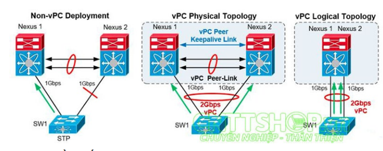
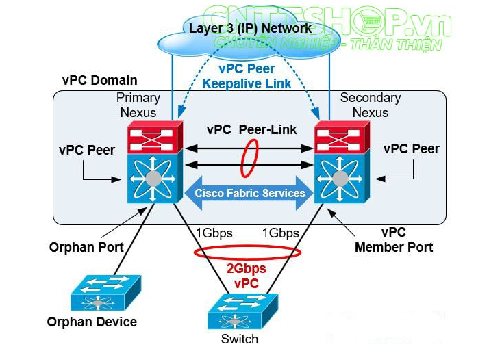

## Tìm hiểu về công nghệ vPC trên Switch Cisco Nexus

Đối với các dòng SW Cisco gốc thì việc gom 2 hoặc nhiều port của SW lại thành 1 port ảo sẽ gọi là `Port-Channel` còn đối với dòng SW Cisco Nexus sẽ không áp dụng cấu hình `Port-Channel` mà sẽ sử dụng cấu hình vPC - `virtual Port Channel`.

Cấu hình vPC sẽ khác hoàn toàn với `Port-Channel`

[1. Tổng quan về vPC](#tongquan)<br>


<a name="tongquan"></a>
## 1. Tổng quan về vPC

### 1.1. EtherChannel

- `EtherChannel`là một kỹ thuật gom hai hay nhiều đường kết nối truyền tải dữ liệu vật lý (Link Aggregation) thành một đường ảo duy nhất (Logic) có Port ảo thậm chí cả MAC ảo nhằm mục đích tăng tốc độ truyền dữ liệu và tăng khả năng dự phòng (Redundancy) cho hệ thống.

- EtherChannel có thể gom từ 2 đến 8 link FE, GE, 10GE thành 1 link logical. Khi đó, switch coi các port thuộc EtherChannel như 1 port duy nhất.

- Switch hoặc thiết bị ở 2 đầu EtherChannel phải hiểu và sử dụng công nghệ EtherChannel để đảm bảo hoạt động đúng và chống loop. Nếu chỉ có 1 đầu sử dụng EtherChannel, còn đầu bên kia không sử dụng thì có thể gây ra loop.

- Traffic không phải lúc nào cũng được phân bố đồng đều qua các đường link thuộc EtherChannel, mà phụ thuộc vào phương pháp load balancing mà switch sử dụng trong mạng.

- Nếu một trong các link thuộc EtherChannel bị down thì traffic sẽ tự động được chuyển sang link khác trong channel chỉ trong vòng vài miliseconds. Khi link up trở lại thì traffic được phân bố lại như cũ.

- Các Switch phải đều phải hỗ trợ kỹ thuật EtherChannel và phải được cấu hình EtherChannel đồng nhất giữa các Port kết nối với nhau. Các Port kết nối EtherChannel giữa 2 Switch phải tương đồng với nhau:

```
Cấu hình (Configuration)
Tốc độ (Speed)
Băng thông (Bandwidth)
Duplex (Full Duplex)
Native VLAN và các VLANs
Switchport Mode (Trunking, Access)
```

- Mặc định EtherChannel load balancing theo Source và Des IP

- Khi cần load balancing theo kiểu MAC ta có thể thay đổi. Nhưng điều này rất hiếm và không nên làm.

- Nên bó số lượng interface là chẵn vì không phải khi bó là nó share đều Bandwidth theo kiểu lấy tổng bandwidth chia cho số cổng mà nó tính dựa vào loadbancing Source hay Des IP. Lúc này nó sẽ Hash Source hay Des IP này thành 1 bit cuối cùng bit số 0 đi đường số 1, bit 1 đi đường số 2. Khi chọn 3 cổng thì nó Hash 2 bit cuối thì tương đương với 4 giá trị 0,1,2,3. Bit 0 đi đường số 1, Bit 1 đi đường số 2, Bit 2 đi đường số 3 và bit 3 nó phải quay vòng lại dây số 1.

=> Lúc này nó load EtherChannel sẽ không đều

=> Nên dùng số Port chẵn thường là dùng 2 và 4 port

Tham khảo <a href="https://viblo.asia/p/tong-quan-ve-cong-nghe-etherchannel-vyDZOWAdZwj">tại đây</a>!

### 1.2. LACP

- LACP (Link Aggregation Control Protocol )

Có hai giao thức được dùng để hình thành nên EtherChannel: `PagP` và `LACP`

```
PAgP: độc quyền của Cisco
LACP: IEEE
Static EtherChannel: Lúc này không cần phải chọn PagP hay LACP mà chúng sẽ tự thương lượng chọn PagP hay LACP
```

**PagP**

Các gói tin PagP được trao đổi giữa các switch trên các cổng EtherChannel. Các thông số của swtich láng giềng được xác định (như khả năng của cổng) và sẽ được so sánh với switch cục bộ. Các cổng có cùng neighbor ID và khả năng hình thành nhóm sẽ được nhóm lại với nhau thành các kết nối FEC. PagP hình thành nên EtherChannel chỉ trên những cổng được cấu hình cùng static VLAN hoặc là cùng loại trunking. PagP cũng thay đổi các thông số động của EtherChannel nếu một trong những cổng của bundle bị thay đổi.

VD: Nếu các thông số VLAN, speed, tốc độ duplex của một cổng trong một EtherChannel bị thay đổi, PagP sẽ thay đổi các thông số đó trong tất cả các cổng còn lại. PagP có thể được cấu hình ở chế độ active (desirable) trong đó một switch chủ động yêu cầu switch đầu xa hình thành nên EtherChannel. Khi switch hoạt động trong chế độ passive của PagP, switch sẽ chỉ bắt tay nếu switch đầu xa yêu cầu bỏ.

Tối đa gom được 8 đường.

**LACP**

+ LACP cũng gửi các gói trên các cổng EtherChannel của switch. Tuy nhiên LACP cũng gán vai trò cổng đến các đầu cuối của EtherChannel. Các switch có độ ưu tiên thấp nhất sẽ được phép ra quyết định về các cổng nào sẽ được tham gia vào EtherChannel ở một thời điểm. Các cổng được chọn lựa và trở thành active theo giá trị độ ưu tiên priority của nó, trong đó giá trị ưu tiên cao. Một tập hợp 16 kết nối có tiềm năng có thể được chỉ ra cho một EtherChannel.

+ Thông qua LACP, một switch sẽ chọn lựa ra 8 cổng có độ ưu tiên thấp nhất như là các member active của EtherChannel. Các cổng còn lại sẽ nằm trong trạng thái standby và sẽ được enable nếu một trong những kết nối active bị down. Cũng giống như PagP, LACP có thể được cấu hình trong active mode, trong đó một switch sẽ chủ động hỏi switch đằng xa bắt tay hình thành EtherChannel. Chế độ passtive thì switch chỉ chủ động hình thành EtherChannel chỉ nếu switch đầu xa khởi tạo nó.

Tối đa gom được 16 đường trong đó 8 đường active, từ đường thừ 9 trở đi dự phòng khi có đường nào đó trong 8 đường đầu bị hỏng.

```
SWITCH1(config-if)#channel-protocol ?
  lacp  Prepare interface for LACP protocol
  pagp  Prepare interface for PAgP protocol
```


Các mode trong LACP

```
SWITCH1(config-if)#channel-group 10 mode ?
  active     Enable LACP unconditionally
  auto       Enable PAgP only if a PAgP device is detected
  desirable  Enable PAgP unconditionally
  on         Enable Etherchannel only
  passive    Enable LACP only if a LACP device is detected
```

`ON`: Ở mode này thì switch tự động enable EtherChannel tuy nhiên nó lại không giới hạn hay nhận bất kỳ gói PagP nào, do đó mà phải cấu hình on mode ở hai đầu. (Thường dùng khi đầu kia không phải là thiết bị Cisco) 

`Auto`: Switch sẽ tự động enable EtherChannel nếu phát hiện device hỗ trợ `PAgP`. 

`passive`: Switch sẽ tự động enable EtherChannel nếu phát hiện device hỗ trợ `LACP`. 

`Desirable`: Switch sẽ tự động cố gắng yêu cầu đầu kia chuyển kết nối sang thành EtherChannel sử dụng trong `PAgP`.

`active`: Switch sẽ tự động cố gắng yêu cầu đầu kia chuyển kết nối sang thành EtherChannel sử dụng trong `LACP`.

- Ý nghĩa một số dòng cấu hình

```
Switch(config-if)#channel-protocol pagp|lacp
Switch(config-if)#channel-group number mode {on | auto | desirable | active| passive}
```

```
Switch(config)#lacp system-priority priority
Switch(config-if)#channel-protocol lacp
Switch(config-if)#channel-group number mode {on | passive | active}
Switch(config-if)#lacp port-priority priority
```

Lệnh đầu tiên để xác định system priority để xác định switch nào làm switch điều khiển EtherChannel, hoặc nếu priority bằng nhau thì switch nào có địa chỉ MAC nhỏ hơn sẽ được chọn. Ta còn xác định priority của cổng để xác định xem cổng nào là active và cổng nào ở trạng thái channel-group On, Passive, Activve tuần nhự tượng tự như On, Auto, Desirable trong PagP. Khi các cổng được cấu hình như là thành vên của EtherChannel, switch sẽ tự động tạo ra các cổng EtherChannel. Interface này sẽ đại diện cho cả bundle.

Trên tất cả các switch của Catalyst (2970, 3560, 4500 và 6500), ta có thể cấu hình để chọn giao thức PagP và LACP. Các model cũ hơn như 2950 có thể chỉ hỗ trợ PagP. Từng interface nằm trong EtherChannel phải được cấu hình và gán cùng một nhóm duy nhất (từ 1 đến 64).


### 1.3. vPC

**Khái niệm**

`vPC` - virtual Port Channel là một công nghệ ảo hóa port mạng vật lý xuất hiện vào năm 2009, cho phép các liên kết vật lý trên hai thiết bị Cisco Nexus 3000 5000 7000 hoặc 9000 khác nhau có thể được gom lại thành 1 cổng logic (channel) để kết nối tới các thiết bị Endpoint(một switch, máy chủ, router. firewall, load balancer hoặc bất kỳ thiết bị nào hỗ trợ công nghệ link aggregation LACP (EtherChannel).



**Thành phần kiến trúc của vPC**



- vPC Peer

Mô hình virtual Port Channel bao gồm 2 thiết bị switch Cisco Nexus trong 1 cặp, một thiết bị hoạt động ở chế độ Primary và 1 thiết bị Secondary cho phép các thiết bị khác kết nối tới 2 switch này bằng Multi-Channel Ethernet (MEC). Hai thiết bị này được gọi là vPC Peer và được kết nối với nhau thông qua vPC Peer Link.

- vPC Peer Link

`vPC peer-link` là thành phần kết nối quan trọng nhất trong thiết lập virtual Port Channel. vPC peer-link được sử dụng để đồng bộ hóa trạng thái giữa 2 thiết bị vPC thông qua các gói điều khiển vPC để tạo ra một mặt phẳng điều khiển duy nhất (1 switch logical). Trong trường hợp thiết bị vPC cũng là switch layer 3, vPC peer-link mang các gói Hot Standby Router Protocol (HSRP).

- vPC Peer Keepalive Link

`vPC Peer Keepalive Link` là đường link Layer 3 được sử dụng để xác định các thiết bị trong cụm vPC và các đường vPC Peer Link có hoạt động hay không. Không có dữ liệu hay các gói tin đồng bộ đi qua vPC Peer Keepalive Link, chỉ có các gói tin IP/UDP sử dụng port 3200 để monitor switch và các peer link trong cụm vPC. Thời gian mặc định của các gói tin này là 1giây và timeout là 5 giây.

- vPC Domain

`vPC domain` là thông số để xác định các thiết bị switch Cisco Nexus nào đang chung 1 miền vPC. Các  Switch Nexus trong 1 cụm vPC phải chung vPC Domain.

- VRF

Các VRF – Virtual Routing Forwarding là các khối chức năng được sử dụng để chia một router thành nhiều router ảo khác nhau, mỗi router ảo này sẽ sử dụng một bảng RIB (Routing Information Based) và một bảng FIB (Forwarding Information Based) riêng biệt.

Tham khảo <a href="https://cnttshop.vn/blogs/cisco/vpc-la-gi">tại đây</a>!


**Các bước cấu hình VPC**


