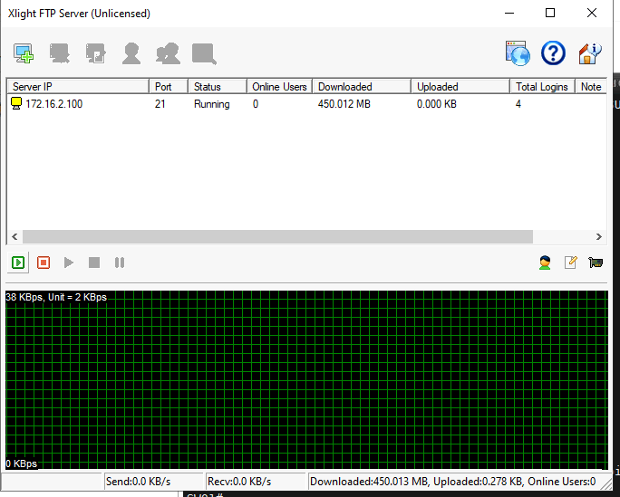
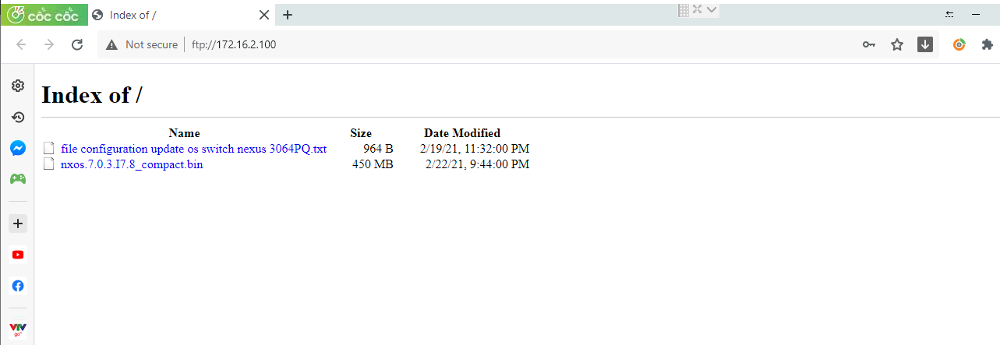
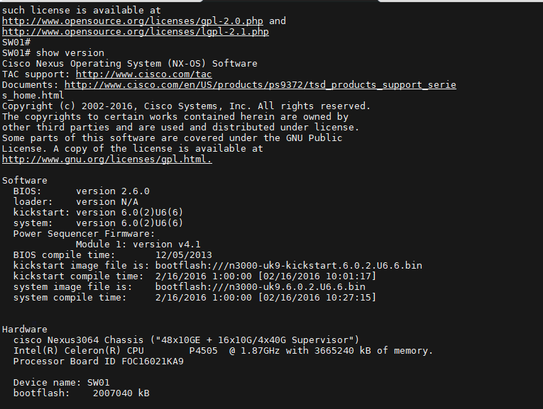
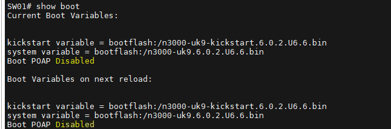
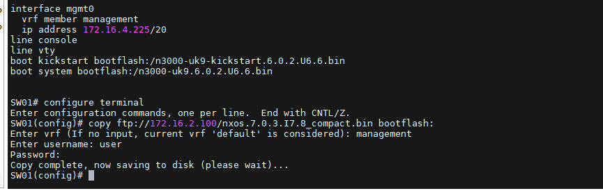
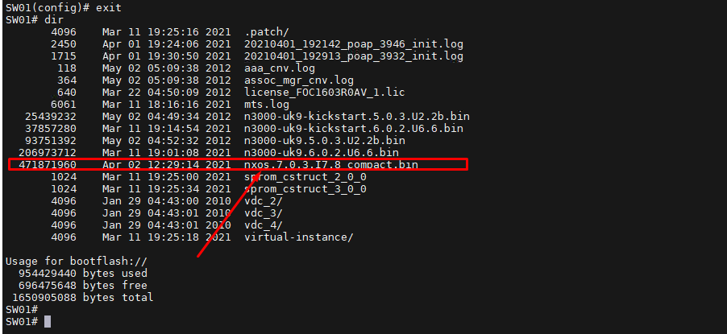
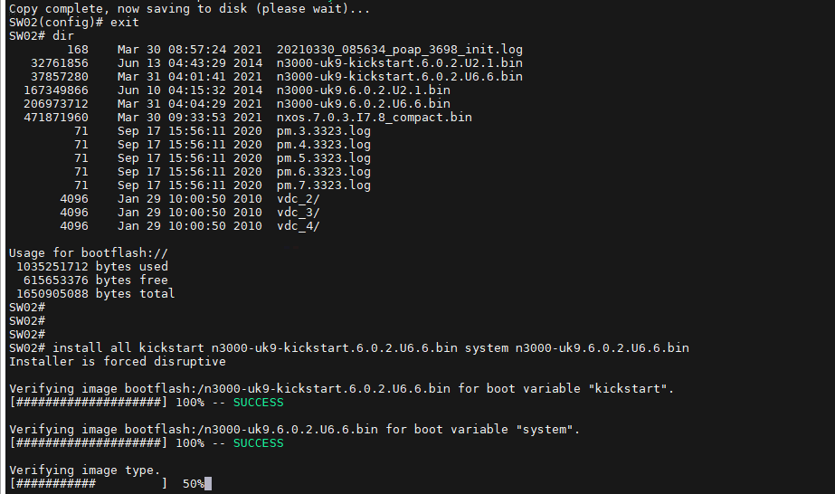
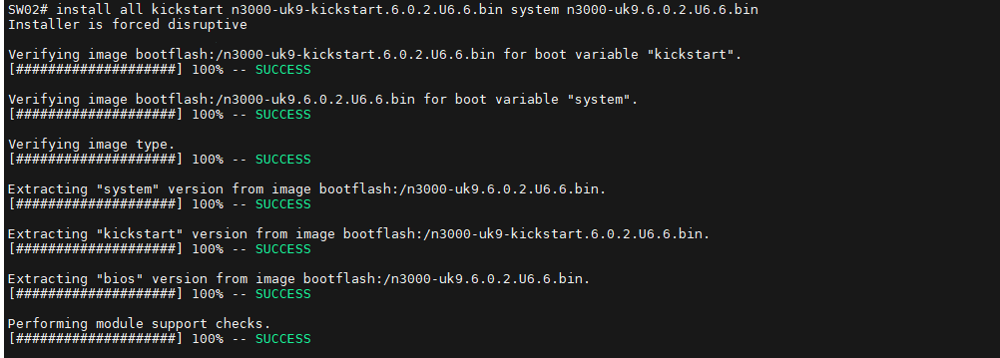

## Ghi chép các thao tác upgrade OS SW cisco Nexus3000 C3064PQ

### Mục lục

[1. Chuẩn bị](#chuanbi)<br>
[2. Thao tác](#thaotac)<br>

<a name="chuanbi"></a>
## 1. Chuẩn bị

- Cài đặt 1 FPT server để đẩy file .bin lên SW. Tham khảo <a href="https://vi.mobilegn.com/data-centers/create-virtual-ftp-servers-with-xlight-ftp-server-8236390.html" target="_blank">tại đây</a>!.

- File OS .bin

<a href="" target="_blank">tại đây</a>!.

<a name="thaotac"></a>
## 2. Thao tác

**Cài đặt và tạo FPT server**

Có thể chuẩn bị 1 laptop cấu hình IP cùng dải mới SW và cài đặt xlight-ftp-server



Cài đặt tạo username/password, đường dẫn vào thư mục chứa OS .bin




**Upgrade**

- 1 cắm console để thao tác và theo dõi các thao tác

Version hiện tại `BIOS:      version 2.6.0`





- 2 Configure IP port mgmt internet connection

```
SW01(config)#interface mgmt 0
SW01(config-if)#ip address 172.16.4.225/20
SW01(config-if)#no shutdown
SW01(config-if)#exit
```

-  3 copy iso latest IOS from Xlight FTP to switch n3k

```
SW01(config)#copy ftp://172.16.2.100/nxos.7.0.3.I7.8_compact.bin bootflash:
select the connection port is:management
log in username and pass of Xlight FTP software
```

Copy file .bin từ fpt server qua đường `management` và nhập `username/password` của FPT server


```
SW01# configure terminal
Enter configuration commands, one per line.  End with CNTL/Z.
SW01(config)# copy ftp://172.16.2.100/nxos.7.0.3.I7.8_compact.bin bootflash:
Enter vrf (If no input, current vrf 'default' is considered): management
Enter username: user
Password:
Copy complete, now saving to disk (please wait)...
SW01(config)#
```



- 4 Check NX-OS copied to bootflash or not?

```
SW01# dir
```



- 5 update Bios

```
SW01(config)#install all nxos bootflash:nxos.7.0.3.I7.8_compact.bin bios
- Do you want to continue with the installation (Y/N): [n] Y
```


```
SW01(config)# install all nxos bootflash:nxos.7.0.3.I7.8_compact.bin bios
Installer is forced disruptive

Verifying image bootflash:/nxos.7.0.3.I7.8_compact.bin for boot variable "nxos".
[########################################] 100% -- SUCCESS

Verifying image type.
[########################################] 100% -- SUCCESS

Extracting "nxos" version from image bootflash:/nxos.7.0.3.I7.8_compact.bin.
[########################################] 100% -- SUCCESS

Extracting "bios" version from image bootflash:/nxos.7.0.3.I7.8_compact.bin.
[########################################] 100% -- SUCCESS

Performing runtime checks.
[########################################] 100% -- SUCCESS

Performing module support checks.
[########################################] 100% -- SUCCESS


Compatibility check is done:
Module  bootable          Impact  Install-type  Reason
------  --------  --------------  ------------  ------
     1       yes      disruptive         reset  Unsupported in new image, module needs to be powered off


Images will be upgraded according to following table:
Module             Image         Running-Version             New-Version  Upg-Required
------  ----------------  ----------------------  ----------------------  ------------
     1              bios      v2.6.0(12/05/2013)      v4.5.0(11/09/2017)           yes


Switch will be reloaded for disruptive upgrade.
Do you want to continue with the installation (y/n)?  [n] y

Time Stamp: Fri Apr  2 12:34:16 2021


Install is in progress, please wait.

Performing runtime checks.
[########################################] 100% -- SUCCESS

Module 1: Refreshing compact flash and upgrading bios/loader/bootrom/power-seq.
Warning: please do not remove or power off the module at this time.
Note: Power-seq upgrade needs a power-cycle to take into effect.
On success of power-seq upgrade, SWITCH OFF THE POWER to the system and then, power it up.
[########################################] 100% -- SUCCESS

Time Stamp: Fri Apr  2 12:37:43 2021


Install has been successful.
SW01(config)#
```


- 6 upgate Bios

````
SW01(config)#install all nxos bootflash:nxos.7.0.3.I7.8_compact.bin
- Do you want to continue with the installation (Y/N): [n] Y
#note:Do not shutdown or restart the system during this process
-upgate successful waiting 10 second to reload
```

```
SW01# install all nxos bootflash:nxos.7.0.3.I7.8_compact.bin
Installer is forced disruptive

Verifying image bootflash:/nxos.7.0.3.I7.8_compact.bin for boot variable "nxos".
[#                                       ]   2%
                                                                                          [########################################] 100% -- SUCCESS

Verifying image type.
[########################################] 100% -- SUCCESS

Extracting "nxos" version from image bootflash:/nxos.7.0.3.I7.8_compact.bin.
[########################################] 100% -- SUCCESS

Extracting "bios" version from image bootflash:/nxos.7.0.3.I7.8_compact.bin.
[########################################] 100% -- SUCCESS

Performing runtime checks.
[########################################] 100% -- SUCCESS

Performing module support checks.
[########################################] 100% -- SUCCESS

Notifying services about system upgrade.
[########################################] 100% -- SUCCESS


Compatibility check is done:
Module  bootable          Impact  Install-type  Reason
------  --------  --------------  ------------  ------
     1       yes      disruptive         reset  Unsupported in new image, module needs to be powered off


Images will be upgraded according to following table:
Module             Image         Running-Version             New-Version  Upg-Required
------  ----------------  ----------------------  ----------------------  ------------
     1         kickstart             6.0(2)U6(6)             7.0(3)I7(8)           yes
     1              bios      v4.5.0(11/09/2017)      v4.5.0(11/09/2017)            no


Switch will be reloaded for disruptive upgrade.
Do you want to continue with the installation (y/n)?  [n] y

Time Stamp: Fri Apr  2 12:49:33 2021


Install is in progress, please wait.

Performing runtime checks.
[########################################] 100% -- SUCCESS

Setting boot variables.
[########################################] 100% -- SUCCESS

Performing configuration copy.
[########################################] 100% -- SUCCESS

Time Stamp: Fri Apr  2 12:50:34 2021


Finishing the upgrade, switch will reboot in 10 seconds.
SW01# [62608.802163]  writing reset reason 49,
2021 Apr  2 12:50:45 SW01 %$ VDC-1 %$ Apr  2 12:50:44 %KERN-0-SYSTEM_MSG: [62608.802163]  writing reset reason 49,  - kernel

(c) Copyright 2014, Cisco Systems.
N3000 BIOS v.4.5.0, Thu 11/09/2017, 09:50 PM
SW01#
```


- 7 Verify boot

Sau khi SW reboot lên

```
SW01# show boot
SW01# show version
```

```
SW01# show boot
Current Boot Variables:

sup-1
NXOS variable = bootflash:/nxos.7.0.3.I7.8_compact.bin
Boot POAP Disabled

Boot Variables on next reload:

sup-1
NXOS variable = bootflash:/nxos.7.0.3.I7.8_compact.bin
Boot POAP Disabled
SW01# show version
Cisco Nexus Operating System (NX-OS) Software
TAC support: http://www.cisco.com/tac
Copyright (C) 2002-2020, Cisco and/or its affiliates.
All rights reserved.
The copyrights to certain works contained in this software are
owned by other third parties and used and distributed under their own
licenses, such as open source.  This software is provided "as is," and unless
otherwise stated, there is no warranty, express or implied, including but not
limited to warranties of merchantability and fitness for a particular purpose.
Certain components of this software are licensed under
the GNU General Public License (GPL) version 2.0 or
GNU General Public License (GPL) version 3.0  or the GNU
Lesser General Public License (LGPL) Version 2.1 or
Lesser General Public License (LGPL) Version 2.0.
A copy of each such license is available at
http://www.opensource.org/licenses/gpl-2.0.php and
http://opensource.org/licenses/gpl-3.0.html and
http://www.opensource.org/licenses/lgpl-2.1.php and
http://www.gnu.org/licenses/old-licenses/library.txt.

Software
  BIOS: version 4.5.0
  NXOS: version 7.0(3)I7(8)
  BIOS compile time:  11/09/2017
  NXOS image file is: bootflash:///nxos.7.0.3.I7.8_compact.bin
  NXOS compile time:  3/3/2020 20:00:00 [03/04/2020 04:49:49]


Hardware
  cisco Nexus3064 Chassis
  Intel(R) Celeron(R) CPU        P4505  @ 1.87GHz with 3902972 kB of memory.
  Processor Board ID FOC16021KA9

  Device name: SW01
  bootflash:    1638000 kB
  usb1:               0 kB (expansion flash)

Kernel uptime is 0 day(s), 0 hour(s), 5 minute(s), 42 second(s)

Last reset at 802169 usecs after Fri Apr  2 12:50:44 2021
  Reason: Disruptive upgrade
  System version: 6.0(2)U6(6)
  Service:

plugin
  Core Plugin, Ethernet Plugin

Active Package(s):

SW01#
```


**Lưu ý: **

- Upgrade từ OS thấp lên cao thì không mất config. Chuyển OS từ cao xuống thấp thì bị mất config.

- Đối với các SW đang có version hiện tại từ `2.5.0` trở xuống không có hỗ trợ `nxos` phải up lên `nxos6` xong mới lên `nxos7` được. Thực hiện như ở dưới

Chuẩn bị 2 file `n3000-uk9-kickstart.6.0.2.U6.6.bin`, `n3000-uk9.6.0.2.U6.6.bin` để up từ `U1` lên `U6`

```
install all kickstart n3000-uk9-kickstart.6.0.2.U6.6.bin system n3000-uk9.6.0.2.U6.6.bin
```



SW sẽ kiểm tra xem bản IOS kickstart và system có phù hợp không :



```
SW02# install all kickstart n3000-uk9-kickstart.6.0.2.U6.6.bin system n3000-uk9.6.0.2.U6.6.bin
Installer is forced disruptive

Verifying image bootflash:/n3000-uk9-kickstart.6.0.2.U6.6.bin for boot variable "kickstart".
[####################] 100% -- SUCCESS

Verifying image bootflash:/n3000-uk9.6.0.2.U6.6.bin for boot variable "system".
[####################] 100% -- SUCCESS

Verifying image type.
[####################] 100% -- SUCCESS

Extracting "system" version from image bootflash:/n3000-uk9.6.0.2.U6.6.bin.
[####################] 100% -- SUCCESS

Extracting "kickstart" version from image bootflash:/n3000-uk9-kickstart.6.0.2.U6.6.bin.
[####################] 100% -- SUCCESS

Extracting "bios" version from image bootflash:/n3000-uk9.6.0.2.U6.6.bin.
[####################] 100% -- SUCCESS

Performing module support checks.
[####################] 100% -- SUCCESS

Notifying services about system upgrade.
[####################] 100% -- SUCCESS


Compatibility check is done:
Module  bootable          Impact  Install-type  Reason
------  --------  --------------  ------------  ------
     1       yes      disruptive         reset  Forced by the user


Images will be upgraded according to following table:
Module             Image         Running-Version             New-Version  Upg-Required
------  ----------------  ----------------------  ----------------------  ------------
     1            system             6.0(2)U2(1)             6.0(2)U6(6)           yes
     1         kickstart             6.0(2)U2(1)             6.0(2)U6(6)           yes
     1              bios      v2.5.0(06/27/2013)      v2.6.0(12/05/2013)           yes
     1         power-seq                    v4.1                    v4.1            no


Switch will be reloaded for disruptive upgrade.
Do you want to continue with the installation (y/n)?  [n] y
Time Stamp: Wed Mar 31 04:08:47 2021


Install is in progress, please wait.

Performing runtime checks.
[####################] 100% -- SUCCESS

Setting boot variables.
[####################] 100% -- SUCCESS

Performing configuration copy.
[####################] 100% -- SUCCESS

Module 1: Refreshing compact flash and upgrading bios/loader/bootrom/power-seq.
Warning: please do not remove or power off the module at this time.
Note: Power-seq upgrade needs a power-cycle to take into effect.
On success of power-seq upgrade, SWITCH OFF THE POWER to the system and then, power it up.
[#                   ]   0%                                                                                   [####################] 100% -- SUCCESS
Time Stamp: Wed Mar 31 04:10:38 2021


Finishing the upgrade, switch will reboot in 10 seconds.
SW02#
SW02# [ 4995.744637]  writing reset reason 49,

(c) Copyright 2011, Cisco Systems.
N3000 BIOS v.2.6.0, Thu 12/05/2013, 03:04 PM

(c) Copyright 2011, Cisco Systems.
N3000 BIOS v.2.6.0, Thu 12/05/2013, 03:04 PM
99                                                                 
```

Thực hiện up lên OS 4.5 như trên.


copy ftp://172.16.2.100/n3000-uk9-kickstart.6.0.2.U6.6.bin bootflash:
management
copy ftp://172.16.2.100/n3000-uk9.6.0.2.U6.6.bin bootflash:


