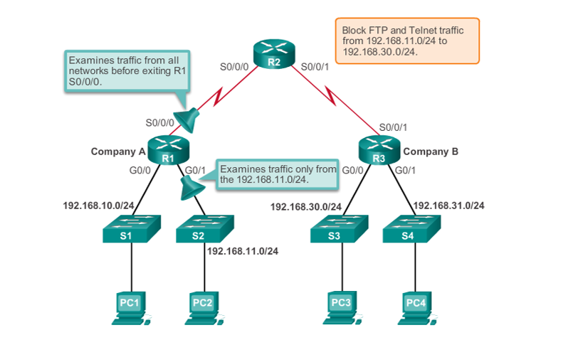

## Ghi chép về ACL - Access Lists Cisco

### Mục lục

[1. Lý thuyết](#lythuyet)<br>
[2. Thực hành](#thuchanh)<br>

<a name="lythuyet"></a>
## 1. Lý thuyết

**Nội dung chính**

```
- Giải thích ACLs sử dụng như nào để fillter traffic

- So sánh `standard` và `extended` IPv4 ACLs

- Giải thích ACLs sử dụng wildcard masks

- Giải thích các nguyên tắc tạo ACLs

- Giải thích các nguyên tắc để đặt ACLs

- Cấu hình chuẩn IPv4 ACLs để fillter traffic theo yêu cầu.

- Chỉnh sửa một standard IPv4 ACL sử dụng sequence number

- Cấu hình một standard ACL bảo mật cho vty access.

- Giải thích cấu trúc của một extended access control (ACE).

- Cấu hình một ACl limit debug output

- Giải thích cách một router xử lý các gói khi một ACL được áp dụng.

- Khắc phục các lỗi ACL phổ biến bằng cách sử dụng lệnh CLI.

- So sánh việc tạo ACL IPv4 và IPv6.
```

### 1.1. ACLs là gì?

Access Lists là một tập các rule để chặn lọc gói tin đi vào ra hệ thống mạng cho phép (allow) hoặc cấm (deny), cấu hình ở Switch hoặc router.

ACLs (Access control lists) hay còn gọi là access lists, là một danh sách tuần tự các câu lệnh hay còn gọi là ACEs (Access control entries), được áp dụng trên một Interface nào đó, và trên bộ đệm vào hoặc ra, điều khiểu Router từ chối hoặc chuyển tiếp các gói tin dựa vào thông tin trong IP header hoặc TCP/UDP header.


Sử dụng ACL trong firewall routers  được đặt giữa mạng nội bộ của bạn và mạng bên ngoài chẳng hạn như Internet.

Sử dụng ACL trên routers được đặt giữa hai phần mạng của bạn để kiểm soát lưu lượng truy cập vào hoặc ra một phần cụ thể của mạng nội bộ của bạn.

Định cấu hình ACL trên border routers, đó là bộ định tuyến nằm ở các cạnh của mạng của bạn.

Định cấu hình ACL cho từng giao thức mạng được định cấu hình trên border router interfaces. 

Một ACL cho mỗi giao thức (per protocol) - Để kiểm soát luồng lưu lượng trên một interface, một ACL phải được xác định cho mỗi giao thức được enabled interface.

Một ACL cho mỗi hướng (per direction ) - ACL điều khiển lưu lượng truy cập theo một hướng tại một thời điểm trên một interface. Hai ACL riêng biệt phải được tạo để control inbound và outbound traffic..

Một ACL cho mỗi giao diện (per interface) - ACL kiểm soát lưu lượng truy cập cho một interface, ví dụ: GigabitEthernet 0/1.

ACEs là một danh sách tuần tự các câu lệnh.

### 1.2. Packet Filtering

– Cơ chế lọc gói tin dựa trên các thông số trong header gói tin như: IP nguồn, IP đích, Port nguồn, port đích, trạng thái...


### 1.3. ACL Operation (Hoạt động)

ACL sẽ có 2 chiều: Inbound ACL (fillter traffic từ bên ngoài truy cập vào switch/router), Outbound ACL (fillter traffic từ bên trong switch/router ra ngoài)

Mặc định ACLs có một rule deny all, block all traffic mặc dù không thể hiện trong access list 

– Các lệnh (luật) trong danh sách ACL xử lý theo thứ tự từ trên xuống dưới, nếu có 1 luật thỏa mãn thì thoát luôn ACL mà không thực hiện các luật phía dưới.


### 1.4. Types of Cisco IPv4 ACLs

**Standard ACLs**

Standard ACL gồm các câu lệnh ACL đơn giản nhất. Được đánh số từ `1-99` hoặc `1300-1999` nếu là number ACL (ACL được ghi tên bằng số).

Standard ACL chỉ lọc địa chỉ nguồn trong header của IP packet, vì thế chúng hoạt động tại lớp 3 trong mô hình OSI hay lớp internet trong mô hình TCP/IP.

```
access-list 10 permit 192.168.30.0 0.0.0.255
```

**Extended ACLs**

Extended ACL là những câu lệnh ACL mở rộng, lọc dựa trên các tiêu chí như port number (application), source-destination IP address , protocol type, protocol number (IP, TCP, UDP...) và nhiều tùy chọn. Vì thế extended ACL hoạt động tại lóp 3 và lớp 4 mô hình OSI.

Extended ACL được đánh số từ `100- 199` hoặc `2000 - 2699`

Extended ACL lọc chính xác source/destination IP Address nên ta hay đặt ACL này gần nguồn để tránh tình trạng hao tổn băng thông mạng không cần thiết khi gói tin “lang thang” trước khi bị deny.

```
access-list 103 permit tcp 192.168.30.0 0.0.0.255 any eq 80
```

**Name ACL** chứa các ký tự căn bản, không chưa khoảng trăng và dấu chấm.

### 1.5. ACL Wildcard Masking

ACL có thể permit/deny một IP hoặc một `Hosts`, `Subnets`, `Range` với các tham số wildcard masks

```
access-list 1 permit 0.0.0.0 255.255.255.255
```

```
access-list 1 permit 192.168.10.10 0.0.0.0
```

```
access-list 1 permit host 192.168.10.10
```

### 1.6. Vị trí đặt ACLs

Mỗi ACL nên được đặt ở nơi nó có tác động lớn nhất đến hiệu quả. Các quy tắc cơ bản là:

```
Extended ACLs: Xác định vị trí ACL Extended càng gần nguồn lưu lượng truy cập được lọc càng tốt.

Standard ACLs: Bởi vì ACL Standard không chỉ định địa chỉ đích, hãy đặt chúng càng gần đích càng tốt.

Vị trí của ACL và do đó loại ACL được sử dụng cũng có thể phụ thuộc vào: mức độ kiểm soát của quản trị viên mạng, băng thông của các mạng liên quan và tính dễ cấu hình.
```

- Standard ACL Placement


- Extended ACL Placement



### 1.7. Cú phát cấu hình một ACLs

Lưu ý: Do ACLs được kiểm tra tuần tự từ trên xuống nên khi tạo ACLs cần chú ý các ACL ở trên không phủ định các ACLs dưới, các lệnh ACLs cụ thể đặt ở trên; các ACLs chung chung nên đặt gần cuối.

- Cú pháp

```
Router(config)# access-list access-list-number deny permit remark source [ source-wildcard ] [ log ]
```

- Xóa ACLs

```
no access-list
```

`remark` là một tư khóa sử dụng để dễ hiểu access list hơn, có thể bỏ, mô tả chức năng của ACL, làm cho ACL dễ dàng để hiểu. Mỗi remark giới hạn 100 ký tự.

- Applying Standard ACLs to Interfaces

```
Router(config-if)# ip access-group { access-list-number | access-list-name } { in | out }
```

```
Router(config)#access-list 1 deny host 192.168.10.10
Router(config)#access-list 1 permit any

Router(config)# interface g0/0
Router(config-if)# ip access-group 1 in
```

- Bỏ Applying access-list

Thao tác trên interface `no ip access-group` và bỏ ACL golbal `no access-list ` nếu muốn.


**Chi tiết hơn về cấu trúc của ACLs**

- Cấu trúc lệnh cấu hình standard ipv4 `numbered` ACLs :

```
Router(config)# access-list access-list-number { deny | permit | remark } source [source-wildcard ][ log ]

```

```
Access-list-number: Định danh số của một ACL, sử dụng số thập phân từ 1-99 và 1300-1999

Deny: Từ chối lưu lượng truyền thông nếu thỏa điều kiện

Permit: Cho phép lưu lượng qua nến thỏa điều kiện

Remark: Mô tả chức năng của ACL, làm cho ACL dễ dàng để hiểu. Mỗi remark giới hạn 100 ký tự.

Source: Là mạng, host nguồn gói tin. Có hai cách để chỉ định nguồn gói tin:

     -  Sử dụng 32 bit để chỉ định nguồn gói tin;
     
     -  Hoặc có thể sử dụng từ khóa thay thế

Chú ý: nếu nguồn là host thì ta chỉ định source là host, sau đó là địa chỉ của host. Nếu nguồn là bất kỳ thì ta dùng từ khóa any.

source-wildcard: 32 bits wildcard mask được áp dụng với nguồn

Log: Thông điệp ghi lại thông tin về các gói tin thỏa ACEs. Thông điệp này gồm thông tin về chỉ số ACL mà gói tin được phép thông qua hay từ chối, địa chỉ nguồn và số gói tin. Thông điệp được tạo ra khi gói tin đầu tiên thỏa ACE và định kỳ 5 phút.
```

- Cấu trúc lệnh cấu hình standard ipv4 `named` ACLs :

```
Router(config)#ip access-list standard name

Router(config-std-nacl)# [permit | deny | remark] source [source-wildcard] [log]
```

- Cấu hình extended Ipv4 `numbered` ACLs

```
Router(config)# access-list access-list-number { deny | permit | remark } source [source-wildcard ] protocol source [source-wildcard] [opterator operand ] [port port-number|name] destination [destination-wildcard] [operator operand] [port port-number|name] [established]
```

```
Access-list-number: Định danh số của một ACL, sử dụng số thập phân từ 100-199 và 2000-2699

Deny: Từ chối lưu lượng truyền thông nếu thỏa điều kiện

Permit: Cho phép lưu lượng qua nến thỏa điều kiện

Remark: Mô tả chức năng của ACL, làm cho ACL dễ dàng để hiểu. Mỗi remark giới hạn 100 ký tự.

Protocol: Tên hoặc số của giao thức Internet. Từ khóa thường dùng gồm: IP, TCP, UDP. Để thỏa bất kỳ giao thức Internet nào ta dùng từ khóa IP.

Source: Là mạng, host nguồn gói tin.

source-wildcard: 32 bits wildcard mask được áp dụng với nguồn.

Destination: Mạng hoặc host đích gói tin.

Destination-wildcard: 32 bits wildcard mask được áp dụng với đích.

Operator: So sánh cổng nguồn hoặc cổng đích. Toán tử so sánh có thể gồm: lt (less than), gt (greater than), eq (equal), neq (not equal), và range (vùng loại trừ)

Port: Số thập phân hoặc tên của cổng TCP hoặc UDP

Established: Chỉ cho phép luồng truyền thông đã thiết lập kết nối trước đó.
```

- Cấu hình extended Ipv4 ``numbered ACLs

```
Router(config)#ip access-list extended name

Router(config-std-nacl)# { deny | permit | remark } source [source-wildcard ] protocol source [source-wildcard] [opterator operand ] [port port-number|name] destination [destination-wildcard] [operator operand] [port port-number|name] [established]
```

- Sau khi tạo ACLs xong, tiến hành áp dụng ACLs lên Interface

```
Router(config-if)# ip access-group {access-list-number | access-list-name } {in | out }
```

Nếu áp dụng lên cổng VTY, ta sử dụng lệnh ở dưới:

```
Router(config-if)# ip access-class {access-list-number | access-list-name } {in | out }
```

- Sửa ACLs

**Cách 1:**

Đầu tiên dùng lệnh show access-list để copy ACLs đã cấu hình trên Router vào một trình soạn thảo nào đó, sửa lại theo mong muốn, rồi dán lại ACLs đã sửa vào cấu hình. Chú ý trước khi dán cấu hình ACLs mới ta cần loại bỏ ACLs cũ bằng lệnh no access-list.

Khuyến nghị: để đơn giản trong giám sát, cấu hình và chỉnh sửa sau này, chúng ta sử dụng một trình soạn thảo nào đó để viết và lưu lại lệnh cấu hình ACLs, sau đó copy và dán vào cấu hình ở chế độ cấu hình toàn cục. Khi muốn thay đổi cấu hình ACLs, chúng ta chỉ cần sửa lại lệnh ACLs theo yêu cầu, xóa cấu hình ACLs cũ với lệnh no access-list, dán cấu hình ACLs mới vào cấu hình.

**Cách 2: **

Thay đổi ACEs dựa trên sô tuần tự ACEs. Đầu tiên, ta sử dụng lệnh show access-list để xem các ACEs đã cấu hình trên Router. Sau đó xác định ACE cần sửa hoặc xác định vị trí cần chèn ACE. Tiếp theo, ta tiến hành thêm hoặc sửa hoặc xóa ACEs

```
ip access-list [standard | extended] [number | name]

//sửa ACE

No sequence-number

Sequence-number ACE-mới

//xóa ACE

No sequence-number

// chèn ACE

Sequence-number ACE-mới
```


### Tham khảo

https://hocmangcoban.blogspot.com/2014/05/acl-la-gi-standard-access-list-extended_26.html

https://anninhmang.net/tu-hoc-quan-tri-mang/acl-la-gi-phan-loai/


