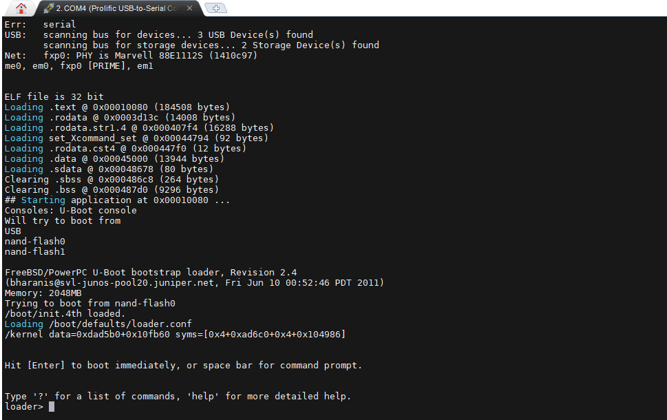
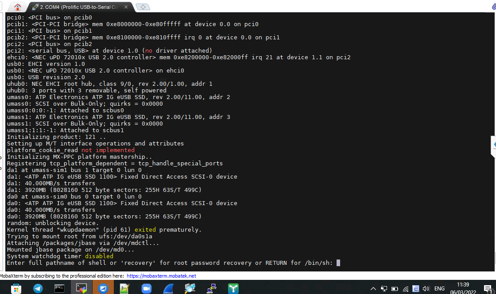
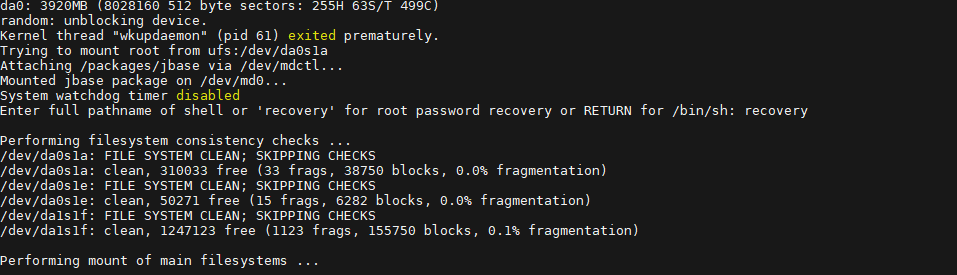

## Ghi chép các thao tác setup basic SW Juniper


### Mục lục

[1. Basic command](#command)<br>
[2. Thiết lập cơ bản](#coban)<br>


<a name="command"></a>
## 1. Basic command

**- Các mode truy cập**

+ User Mode hay User EXEC Mode

Đây là mode đầu tiên khi bắt đầu một phiên làm việc với switch. Ở mode này chỉ có thể thực hiện được một số lệnh thông thường của switch. Các lệnh này chỉ có tác dụng một lần như lệnh show hay lệnh clear một số các counter của switch hay interface. Các lệnh này sẽ không được ghi vào file cấu hình của switch và do đó không gây ảnh hưởng đến các lần khởi động sau của switch.

```
Password:

--- JUNOS 17.3R3.10 built 2018-09-06 23:15:56 UTC
root@%
root@%
root@%
```

+ Privileged mode 

Privileged EXEC Mode cung cấp các lệnh quan trọng để theo dõi hoạt động của switch, truy cập vào các file cấu hình, IOS, đặt password…
Privileged EXEC Mode là nơi phải vào để vào Configuration Mode, cho phép cấu hình tất cả các chức năng hoạt động của switch.

```
root@% cli
root>
```

```
root> ?
Possible completions:
  clear                Clear information in the system
  configure            Manipulate software configuration information
  file                 Perform file operations
  help                 Provide help information
  load                 Load information from file
  monitor              Show real-time debugging information
  mtrace               Trace multicast path from source to receiver
  op                   Invoke an operation script
  ping                 Ping remote target
  quit                 Exit the management session
  request              Make system-level requests
  restart              Restart software process
  save                 Save information to file
  set                  Set CLI properties, date/time, craft interface message
  show                 Show system information
  ssh                  Start secure shell on another host
  start                Start shell
  telnet               Telnet to another host
  test                 Perform diagnostic debugging
  traceroute           Trace route to remote host
root>
```

+ Configuration Mode

Configuration mode cho phép cấu hình tất cả các chức năng của Cisco switch bao gồm các interface, các routing protocol, các line console, vty (telnet), tty (async connection).

Các lệnh trong configuration mode sẽ ảnh hưởng trực tiếp đến cấu hình hiện hành của switch chứa trong RAM (running-configuration). Nếu cấu hình này được ghi lại vào NVRAM, các lệnh này sẽ có tác dụng trong những lần khởi động sau của switch.

```
root> configure
Entering configuration mode

[edit]
root#
```


**- Thao tác vật lý với SWITCH**

- Reboot SW

```
request system reboot
```

```
root> request system reboot
warning: The configuration has been changed but not committed
Reboot the system ? [yes,no] (no) yes

Shutdown NOW!
[pid 7198]

root>
*** FINAL System shutdown message from root@ ***

System going down IMMEDIATELY
```

- Tạm dùng SW

```
request system halt
```

```
root>
*** FINAL System shutdown message from root@ ***

System going down IMMEDIATELY


JWaiting (max 60 seconds) for system process `vnlru' to stop...done
Waiting (max 60 seconds) for system process `vnlru_mem' to stop...done
Waiting (max 60 seconds) for system process `bufdaemon' to stop...done
Waiting (max 60 seconds) for system process `syncer' to stop...
Syncing disks, vnodes remaining...0 0 0 0 done

syncing disks... All buffers synced.
Uptime: 10m54s
recorded reboot as normal shutdown

The operating system has halted.
Please press any key to reboot.

```

Nếu muốn reboot lại `Please press any key to reboot`

- Tắt SW

```
request system power-off
```

```
root> request system power-off
Power Off the system ? [yes,no] (no) yes

Shutdown NOW!
[pid 2150]

root>
*** FINAL System shutdown message from root@ ***

System going down IMMEDIATELY
```

**- Thông tin về interface**

Tùy từng dòng SWITCH juniper sẽ có hỗ trợ các loại interface với băng thông khác nhau:

- ge: Gigabit Ethernet

- xe: 10-Gigabit Ethernet

- et: 100-Gigabit Ethernet


**- Reset password root SW Juniper **

+ Tắt SW và bật SW đến màn `Hit [Enter] to boot immediately, or space bar for command prompt.` ấn phím "space" để vào mode kernel



- Vào chế độ 1 người dùng

```
loader> boot -s
```

+ Vào mode recovery





+ Vào configuration mode in the CLI

```
root> configure
Entering configuration mode
```

+ Đặt password mới


```
set system root-authentication plain-text-password
```

```
root> configure
Entering configuration mode

[edit]
root# set system root-authentication plain-text-password
New password:
Retype new password:

[edit]
root# commit
```

+ Thoát và reboot

**- Một số lệnh show**

+ Show cấu hình hiện tại của toàn bộ hệ thống

```
root> show configuration
```

+ Show toàn bộ trạng thái interface

```
show interfaces
```

+ Show cấu hình hiện tại của một interface

```
show configuration interfaces ge-0/0/5
```

+ Xem trạng thái port switch

```
show interfaces ge-1/1/8 terse
```

+ Thiết lập hostname


