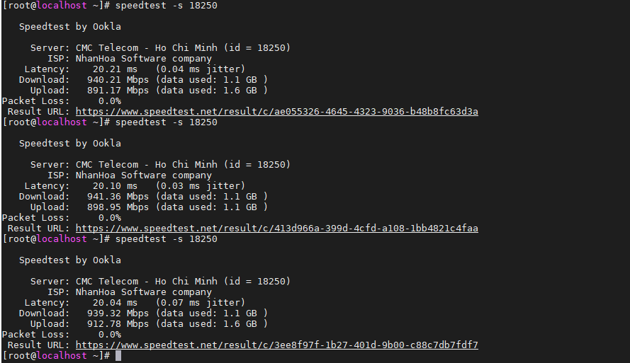
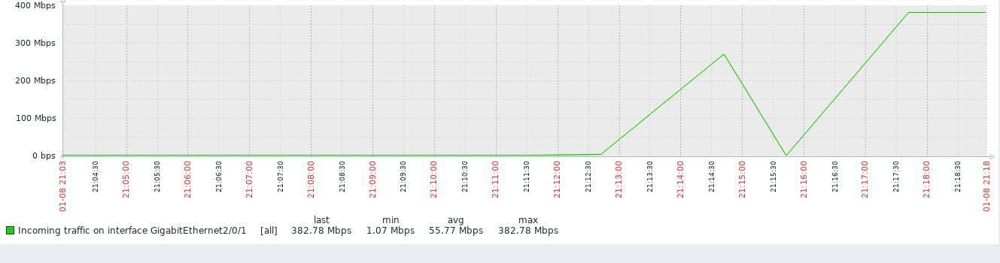
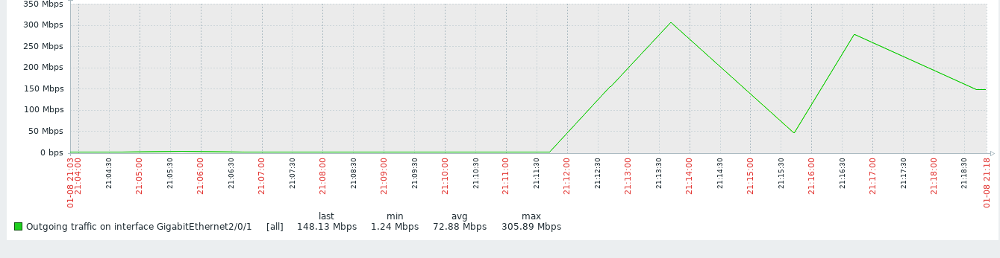
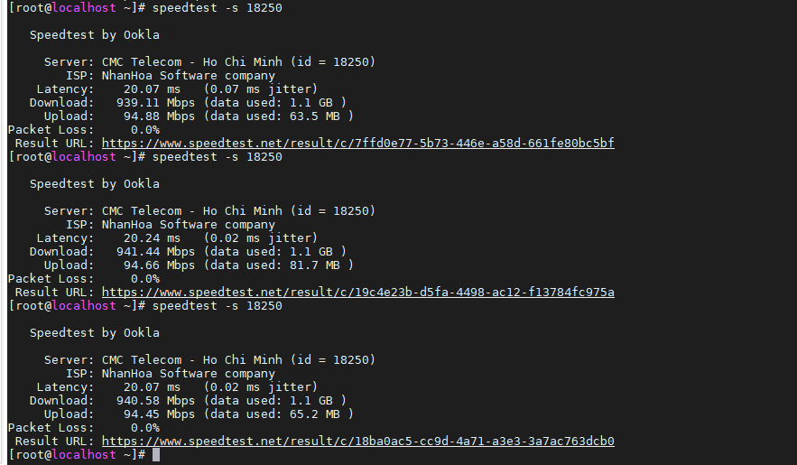

# Ghi chép tìm hiểu QoS - Policy map - Class map

## 1. Tổng quan

- Trong các thiết bị swich, router thường có hỗ trợ việc QoS kiểm soát lưu lượng mạng dựa vào đặc điểm, chính sách người quản trị thiết lập.

- `Policy-map`: dùng để cấu hình những đặc điểm của 1 policy ở trên để match với traffic tương ứng, dùng để quy định cách hành xử cho từng loại lưu lượng đã được phân loại, cách hành xử có thể đơn giản là phân loại dữ liệu, có thể là đánh dấu hay sử dụng trong các cơ chế QoS khác, luôn tồn tại 1 loại cấu hình class-map tên là class-default nhằm phân loại tất cả các lưu lượng chưa được phân loại bởi những class-map trước.

- `Class-map`: cấu hình để phân loại các traffic cụ thể, dùng để phân loại lưu lượng dữ liệu theo ý muốn của người sử dụng, có thể sử dụng kết hợp với nhiều công cụ phân loại như ACL.

- `service-policy`: đây là câu lệnh dùng để áp dụng policy-map đã cấu hình lên một giao tiếp (interface) tương ứng, mỗi giao tiếp/ cổng chỉ áp dụng được một policy-map theo hướng vào `và` / `hoặc` hướng ra.

Cấu trúc

```
  Policy Map ...
    Class ...
      police ...
```

Mặc định là sẽ `match-all`, là thỏa mãn cả tất cả điều kiện. Nếu là `match-any`, chỉ cần 1 trong nhiều điều kiện.


## 2. Vận hành

- Enable QoS

```
Sw-Thangnv-lab#show mls qos
QoS is disabled
QoS ip packet dscp rewrite is enabled
Sw-Thangnv-lab#
Sw-Thangnv-lab#configure terminal
Enter configuration commands, one per line.  End with CNTL/Z.

Sw-Thangnv-lab(config)#mls qos
Sw-Thangnv-lab(config)#end
Sw-Thangnv-lab#show mls qos
QoS is enabled
QoS ip packet dscp rewrite is enabled

Sw-Thangnv-lab#
```

Disable sử dụng lệnh `mls qos`

- Tạo access-list

```
Sw-Thangnv-lab(config)#ip access-list extended permit_all
Sw-Thangnv-lab(config-ext-nacl)#2990 permit ip any any
```


- Tạo class-map

```
Sw-Thangnv-lab#configure terminal
Enter configuration commands, one per line.  End with CNTL/Z.
Sw-Thangnv-lab(config)#class-map match-all Limit_100MBps
Sw-Thangnv-lab(config-cmap)#match access-group name Limit_100MBps
Sw-Thangnv-lab(config-cmap)#exit

```

```
Sw-Thangnv-lab#show class-map
 Class Map match-any class-default (id 0)
   Match any

 Class Map match-all Limit_100MBps (id 1)
   Match access-group name Limit_100MBps

Sw-Thangnv-lab#
```

- Tạo policy map

```
Sw-Thangnv-lab(config)#policy-map Limit_100MBps
Sw-Thangnv-lab(config-pmap)#class Limit_100MBps
Sw-Thangnv-lab(config-pmap-c)#police 100000000 1000000 exceed-action drop
```

`100000000`: Bits per second (B/s) - 100000000 Bit/s =  100 MBit/s

`1000000`: Normal burst bytes, 10000 Bit/s bằng 0,01 MBit/s


Burst refers to a period when user data is sent at irregular intervals, usually due to a high-bandwidth transmission over a short time.
Burst dùng để chỉ một khoảng thời gian khi dữ liệu người dùng được gửi theo chu kỳ không đều, thường là do truyền một lượng băng thông cao trong một thời gian ngắn.

`drop`: Loại bỏ.

- Test


class-map gán với access-list để cho cái gì trong access-list đi qua.
policy-map thì cấu hình để lượng băng thông được đi qua là bao nhiêu gán vào class-map.

Cho phép port 1 đi ra với băng thông 100M đối với các máy ở access-list.

### Tạo 1 tập policy cho swich

- Enable QoS

```
SW#show mls qos
QoS is disabled
QoS ip packet dscp rewrite is enabled
SW#
SW#configure terminal
Enter configuration commands, one per line.  End with CNTL/Z.

SW(config)#mls qos
SW(config)#end
Sw-Thangnv-lab#show mls qos
QoS is enabled
QoS ip packet dscp rewrite is enabled

SW#
```

- Tạo 1 access-list tên là `permit_all` không chặn gì cho tất cả các host, giao thức, đi qua.

Code

```
ip access-list extended name_acl
```

Run

```
SW#configure terminal
Enter configuration commands, one per line.  End with CNTL/Z.
SW(config)#ip access-list extended permit_all
SW(config-ext-nacl)#2990 permit ip any any
SW(config-ext-nacl)#exit
SW(config)#exit
```

- Tạo 1 class-map tên là `permit_all` để cho các máy được gán access-list `permit_all` đi qua.

Code

```
SW(config)#class-map match-all name_classmap_tuy_dat
SW(config-cmap)#match access-group name name_acl_da_tao_o_tren
```

Run

```
SW(config)#class-map match-all permit_all
SW(config-cmap)#match access-group name permit_all
SW(config-cmap)#exit
SW(config)#
```

- Tạo 1 policy-map kiểm soát băng thông gắn vào class-map `permit_all`

Code

```
SW(config)#policy-map nam_policy_map_tuy_dat
SW(config-pmap)#class name_class_map_da_tao_o_tren
SW(config-pmap-c)#police 100000000 1000000 exceed-action drop
```

Tạo policy-map kết hợp với class-map, cấu hình để tăng giảm băng thông, 100000000: Băng thông giới hạn bps, 1000000: Tốc độ burst Bytes (nên để 1000000)

`100000000`: Bits per second (B/s) - 100000000 Bit/s =  100 MBit/s

`10000`: Normal burst bytes, 10000 Bit/s bằng 0,01 MBit/s

Run

```
SW(config)#policy-map 100Mbps
SW(config-pmap)#class permit_all
SW(config-pmap-c)#police 1000000000 1000000 exceed-action drop
SW(config-pmap-c)#exit
SW(config-pmap)#exit
SW(config)#
```

- Gán policy cho port

```
SW(config)#interface Gi2/0/31
SW(config-if)#service-policy input 100Mbps
SW(config-if)#exit
SW(config)#
```

`service-policy input` kiểm soát lưu lượng chiều vào `incoming` của port switch.

- Tạo thêm các policy-map cũng trong một class-map

```
SW(config)#policy-map 200Mbps
SW(config-pmap)#class permit_all
SW(config-pmap-c)#police 200000000 1000000 exceed-action drop
SW(config-pmap-c)#exit
SW(config-pmap)#exit
SW(config)#
```

```
SW#show policy-map
  Policy Map 100Mbps
    Class permit_all
      police 100000000 1000000 exceed-action drop

  Policy Map 200Mbps
    Class permit_all
      police 200000000 1000000 exceed-action drop

SW#
```

```
SW(config)#policy-map 300Mbps
SW(config-pmap)#cla
SW(config-pmap)#class permit_all
SW(config-pmap-c)#police 300000000 1000000 exceed-action drop
SW(config-pmap-c)#exit
SW(config-pmap)#exit
SW(config)#policy-map 500Mbps
SW(config-pmap)#clas
SW(config-pmap)#class permit_all
SW(config-pmap-c)#police 500000000 1000000 exceed-action drop
SW(config-pmap-c)#end
```

- Test

+ Đứng ở phía server nload port mạng

Download - Incoming (nload server)  tương ứng với Outgoing nếu đứng ở port switch.

Upload - Outgoing (nload server) tương ứng với Incoming nếu đứng ở port switch.

+ Lúc không áp dụng policy







+ Lúc không áp dụng policy 100Mbps



=> Sử dụng policy map kiểm soát được băng thông chiều vào của port switch.


### Kiểm soát băng thông  Download - Incoming (nload server)  tương ứng với Outgoing nếu đứng ở port switch.

Sử dụng `srr-queue bandwidth`

```
SW(config-if)#srr-queue bandwidt ?
  limit  Configure bandwidth-limit for this interface
  shape  Configure shaping on transmit queues
  share  Configure shared bandwidth
```

```
shaped

     Chỉ có sẵn trên hàng đợi đi ra.

     Hàng đợi nhận được một phần dự trữ một phần của một cổng băng thông và không còn nữa.

Shared

     Có sẵn trên hàng đợi vào và ra.

     Hàng đợi được đảm bảo một phần của cổng băng thông.
```

srr-queue bandwidth share 10 25 35 50


### Tham khảo

https://community.cisco.com/t5/switching/how-configure-bandwidth-limit-with-catalyst-3750/td-p/1350453

https://www.daihockhonggiay.com/blogs/post/quality-of-service-policy`
