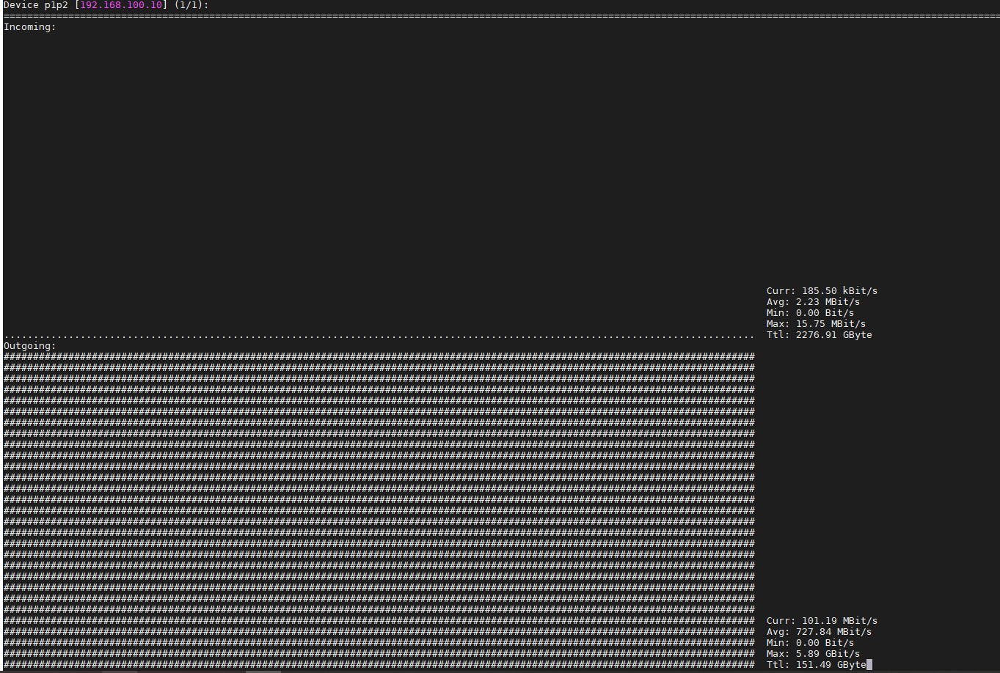
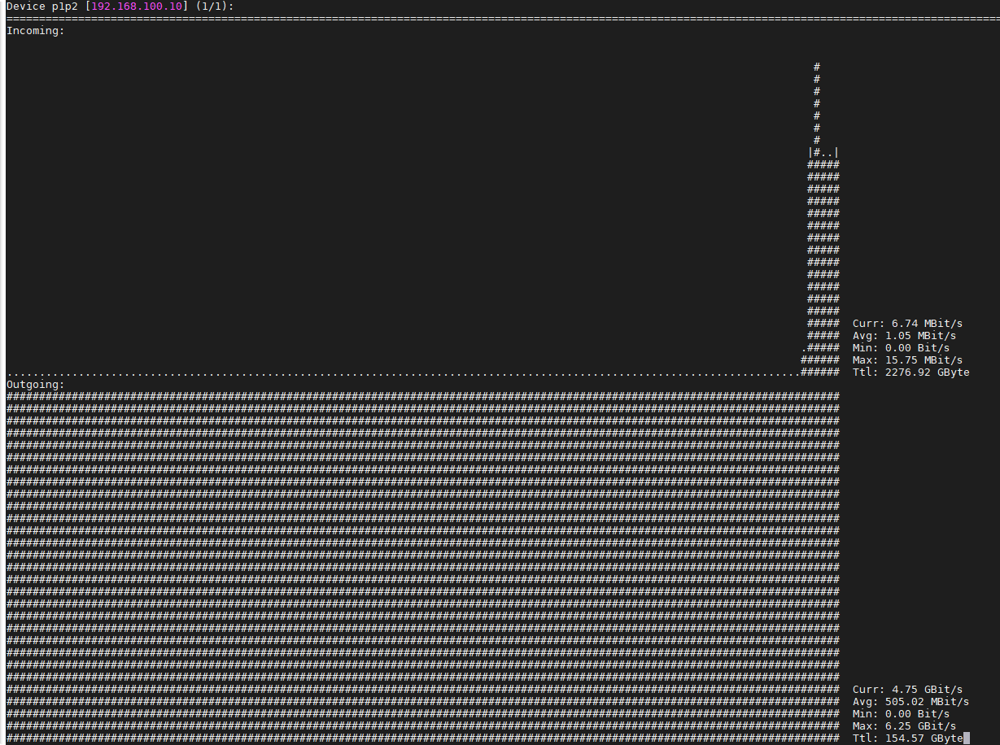

# Ghi chép tìm hiểu QoS - Policy map - Class map đối với switch cisco nexus 3064

## 1. Tổng quan

- Trong các thiết bị swich, router thường có hỗ trợ việc QoS kiểm soát lưu lượng mạng dựa vào đặc điểm, chính sách người quản trị thiết lập.

- `Policy-map`: dùng để cấu hình những đặc điểm của 1 policy ở trên để match với traffic tương ứng, dùng để quy định cách hành xử cho từng loại lưu lượng đã được phân loại, cách hành xử có thể đơn giản là phân loại dữ liệu, có thể là đánh dấu hay sử dụng trong các cơ chế QoS khác, luôn tồn tại 1 loại cấu hình class-map tên là class-default nhằm phân loại tất cả các lưu lượng chưa được phân loại bởi những class-map trước.

- `Class-map`: cấu hình để phân loại các traffic cụ thể, dùng để phân loại lưu lượng dữ liệu theo ý muốn của người sử dụng, có thể sử dụng kết hợp với nhiều công cụ phân loại như ACL.

- `service-policy`: đây là câu lệnh dùng để áp dụng policy-map đã cấu hình lên một giao tiếp (interface) tương ứng, mỗi giao tiếp/ cổng chỉ áp dụng được một policy-map theo hướng vào `và` / `hoặc` hướng ra.

Cấu trúc

```
  Policy Map ...
    Class ...
      police ...
```

Mặc định là sẽ `match-all`, là thỏa mãn cả tất cả điều kiện. Nếu là `match-any`, chỉ cần 1 trong nhiều điều kiện.

- Một số thuật ngữ:

CIR: Tốc độ truyền dữ liệu được cam kết bởi nhà cung cấp tính băng bps.

Tc: Khoảng thời gian tính bằng ms để truyền đủ lượng dữ liệu sao cho phù hợp với tốc độ CIR.

Bc: Tổng số bit dữ liệu có thể được truyền trong một chu kỳ Tc.

Be: Lượng dữ liệu bùng nổ (tính bằng bit). Giá trị này vượt qua giá trị Bc sau khoảng thời gian không gửi gói tin hoặc gửi gói tin với tốc độ thấp hơn tốc độ CIR.


## 2. Tạo 1 tập policy cho switch

- Tạo 1 access-list tên là `permit_all` không chặn gì cho tất cả các host, giao thức, đi qua.

Code

```
ip access-list permit_all
```

Run

```
switch(config)# no ip access-list test
switch(config)# ip access-list permit_all
switch(config-acl)# 2990 permit ip any any
switch(config-acl)# exit
```

- Tạo 1 `class-map` tên là `permit_all` để cho các máy được gán `access-list` `permit_all` đi qua.

Code

```
switch(config)# class-map match-all name_classmap_tuy_dat
switch(config-cmap-qos)# match access-group name name_acl_da_tao_o_tren
switch(config-cmap-qos)# exit
```

Run

```
switch(config)# class-map match-all permit_all
switch(config-cmap-qos)# match access-group name permit_all
switch(config-cmap-qos)# exit
```

- Tạo 1 `policy-map` kiểm soát băng thông gắn vào `class-map` `permit_all`

Code 

```
switch(config)# policy-map name_policy_map_tuy_dat
switch(config-pmap-qos)# class name_class_map_da_tao_o_tren
switch(config-pmap-c-qos)# police 1000000000
```

```
<1-100000000>  Bandwidth in kilobits

police 5000000 = 5 MBit/s
police 10000000 = 10 MBit/s
police 100000000 = 100 MBit/s
police 1000000000 = 1000 MBit/s
```

Run 

```
switch(config)# policy-map 100Mbps
switch(config-pmap-qos)# class permit_all
switch(config-pmap-c-qos)# police 1000000000
```

- Gán policy cho port

```
switch(config)# interface Ethernet1/3
switch(config-if)# service-policy input 100Mbps
switch(config-if)# exit
```

Lưu ý: Đối với một số cấu hình police, hay gán police cho port câu lệnh không gõ đủ các trường thì sẽ tự sinh ra các trường mặc định.

`policy-map 100Mbps` -> `policy-map type qos 100Mbps`

`service-policy input 100Mbps` -> `service-policy type qos input 100Mbps`

`police 1000000000` -> `police cir 1000000000 bps bc 200 ms conform transmit violate drop`


## 3. Test

Đứng ở phía server nload port mạng, dùng iperf đẩy

Download - Incoming (nload server) tương ứng với Outgoing nếu đứng ở port switch.

Upload - Outgoing (nload server) tương ứng với Incoming nếu đứng ở port switch.

- Áp dụng police cho port switch

```
switch(config)# interface Ethernet1/3
switch(config-if)# service-policy type qos input 100Mbps
```






## 4. Tham khảo

https://vnpro.vn/thu-vien/co-che-chung-cua-traffic-shaping-2211.html
