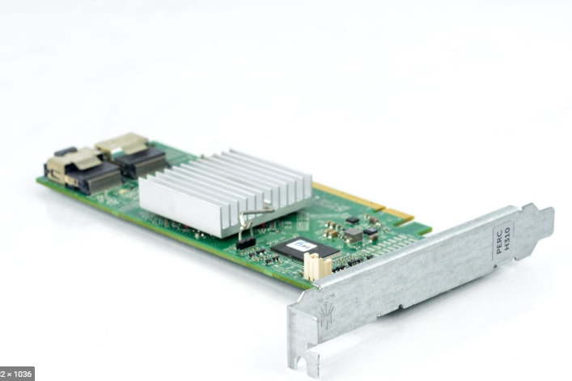
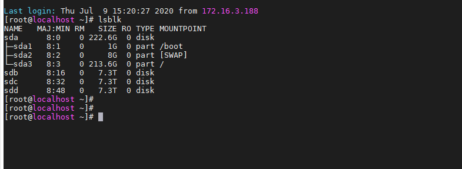

# Ghi chép các bước thao tác với một số case card raid H130 mini adapter

Card raid H730mini thường dùng trong dòng Dell R630, Dell R730 hỗ trợ các mode raid 0, 1, 5, 6, 10

## 6. Thay card raid đối với CEPH

- Dựng một node CEPH AIO

+ 2 ổ OS RAID1 
+ 3 ổ OSD none-raid add vào cái là nhận ổ do đặc thù của card raid H310 adapter.

Client đấu xuống CEPH đã có dữ liệu.

