# Ghi chép các bước thao tác với một số case card raid H730 mini

Card raid H710mini thường dùng trong dòng Dell R620, Dell R720 hỗ trợ các mode raid 0, 1, 5, 6, 10

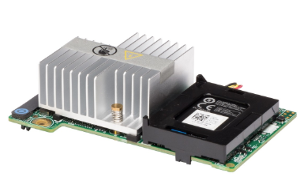


Cài megacli để hỗ trợ lệnh check raid

```
yum install -y pciutils 

yum install sg3_utils wget git -y
git clone https://github.com/nhanhoadocs/ghichep-megacli.git
rpm -ivh ghichep-megacli/MegaCli8.07.14/Linux/MegaCli-8.07.14-1.noarch.rpm
echo "alias megacli='/opt/MegaRAID/MegaCli/MegaCli64'" >> /root/.bashrc
source /root/.bashrc
```


## 1. Trường hợp hỏng 1 ổ lắp ổ mới vào raid1

- Ở trạng thái RAID1 chạy ổ định

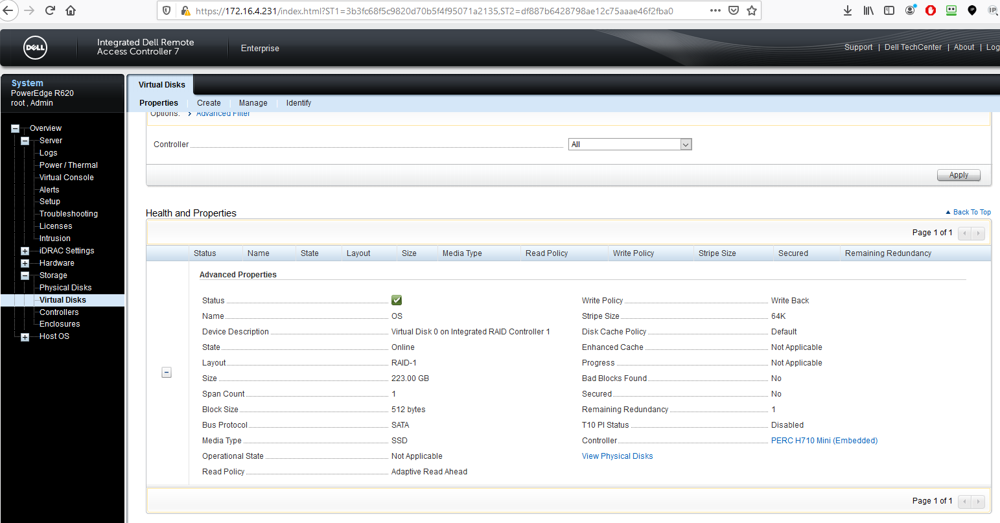

- Khi 1 ổ bị hỏng sẽ báo `DEGRADED`

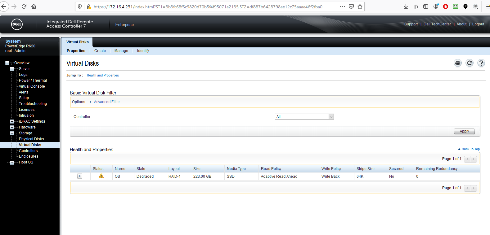

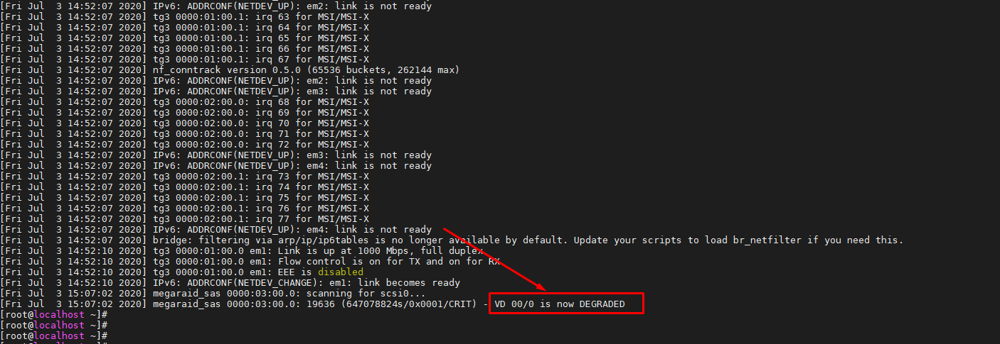

- Chuẩn bị 1 ổ mới tinh, clear raid, cùng chủng loại, formart.

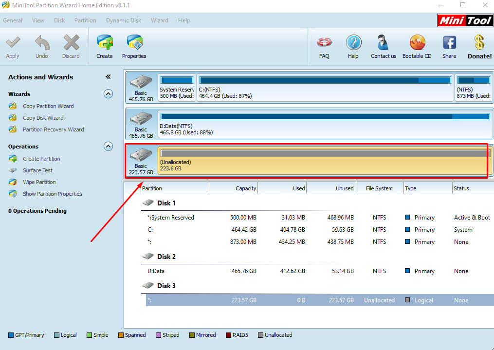

Card hỗ trợ auto rebuild nhưng phải check chắc chắn bằng lệnh

```
megacli -AdpAllinfo  -aALL  | grep -i rebuild
```

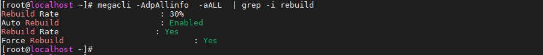

Cắm thay thế ổ hỏng.

Chạy lệnh để xem ổ đang rebuild

```
megacli -PDList -aALL | grep "Firmware state"
```

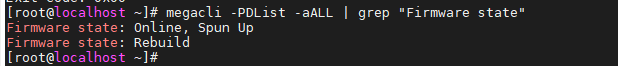

Hoặc xem all

```
megacli -PDList -aALL
```

Xem % đang rebuild

```
megacli -PDRbld -ShowProg -PhysDrv [32:1] -aALL
```

Trong đó 32:1 là các tham số sau: check băng lệnh

```
megacli -PDList -aall
```

```
Enclosure Device ID: 32
Slot Number: 1
```

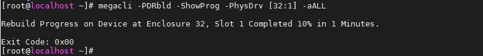

Tùy vào lượng dữ liệu nhiều hay ít nên thời gian rebuild lâu hay nhanh trung bình 2GB mất 10 phút. Sau khi rebuild xong

**Lưu ý**: Trường hợp đang rebuild đồng bộ dữ liệu mà server mất điện, có điện dữ liệu vẫn tiếp tục đồng bộ sang ổ mới cắm.

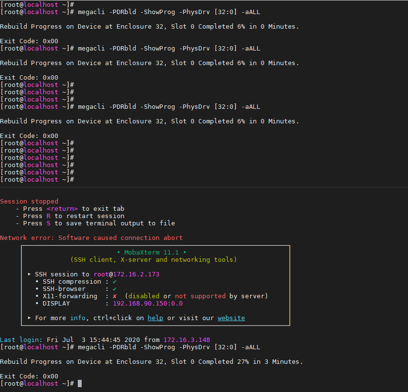

## 2. Trường hợp rút ổ khỏi bay

Khi raid đang chạy ổn định nếu rút 1 ổ khỏi raid ra thì tùy từng mode raid sẽ có thông báo khác nhau. Ví dụ như raid 1 sẽ có thông báo degrate.

Sau khi cắm lại chính ổ đó quá trình rebuild sẽ diễn ra.

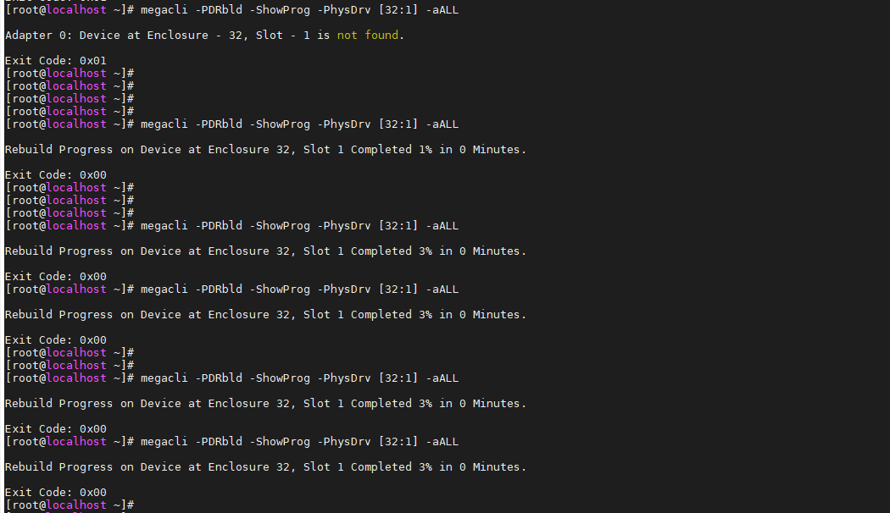

## 3. Trường hợp thay thế card raid

Chuẩn bị 1 card raid cùng loại

- Nếu card raid đó chưa tạo raid thì cắm vào cái nhận luôn không phải thao tác gì thêm.

- Thực hiện vào import lại raid:

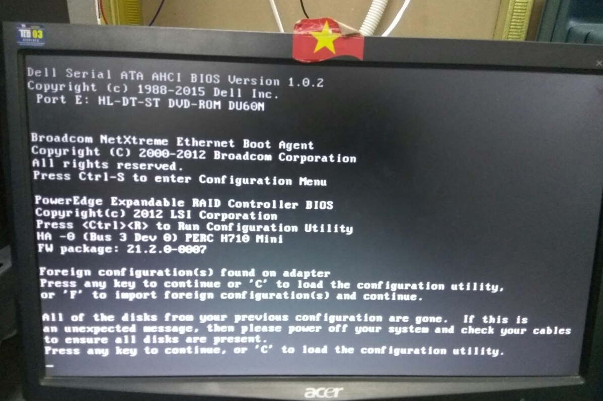

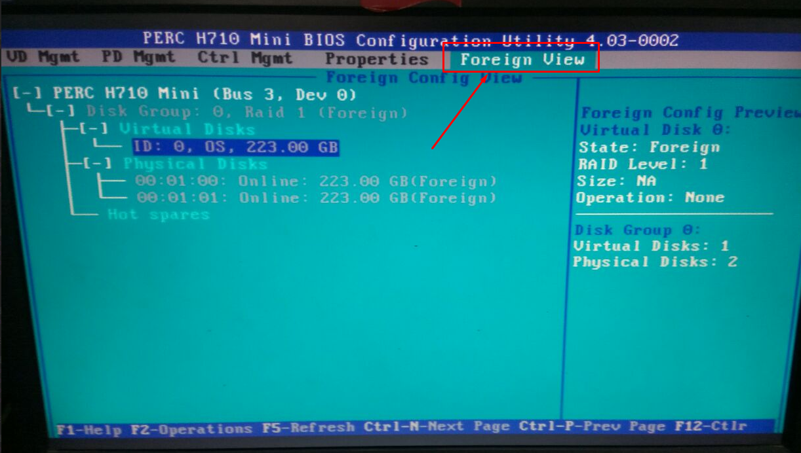

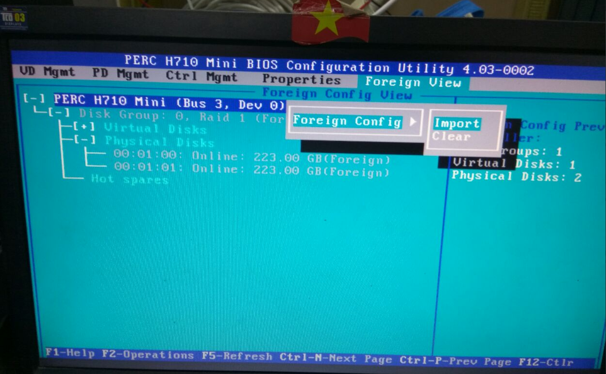

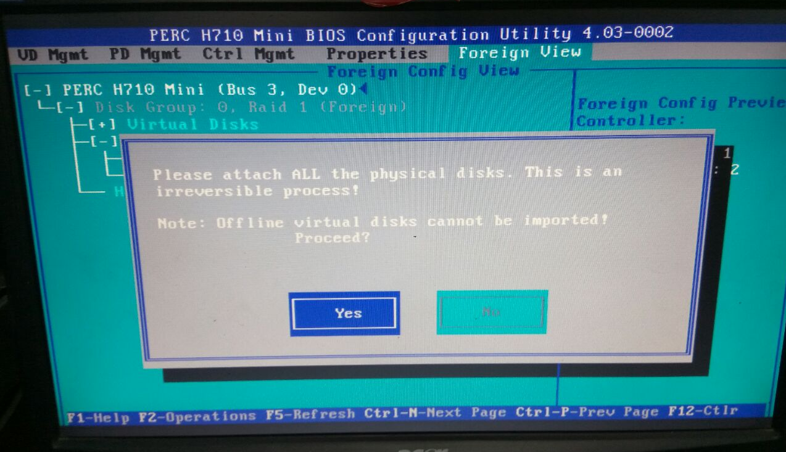

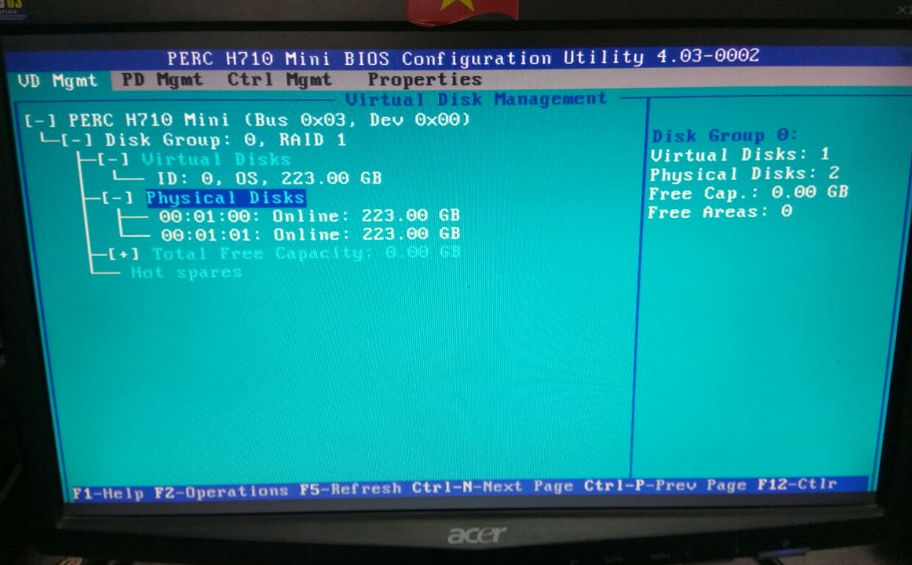

## 4. Trường hợp 2 ổ OS hỏng có ổ OS cài sẵn mang lên thay OS

- Chuẩn bị 2 ổ mới cùng loại raid 1 cài OS bình thường.

- Tắt server tháo 2 ổ đó mang đi thay thế lưu ý đúng vị trí slot.

- Tắt server cần thay ổ lắp 2 ổ mới và bật lên.

- Vào mode RAID thực hiện import

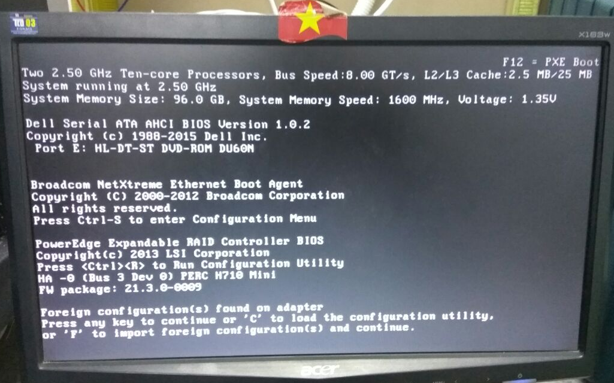

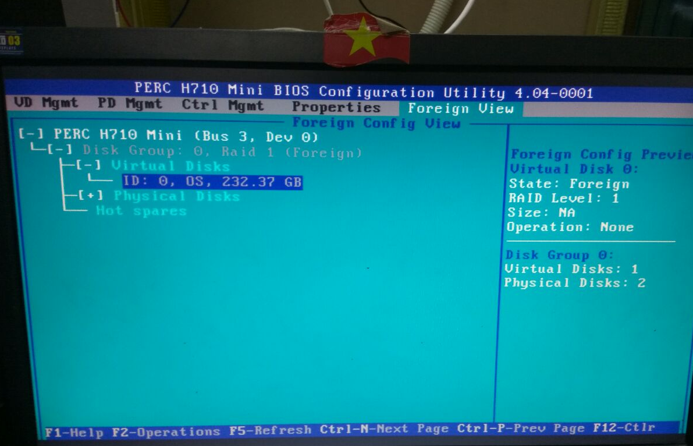

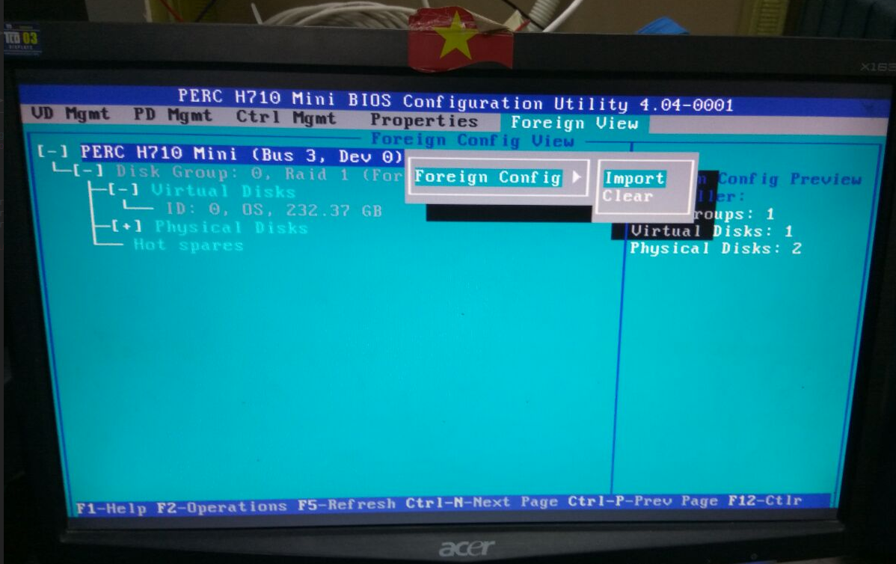

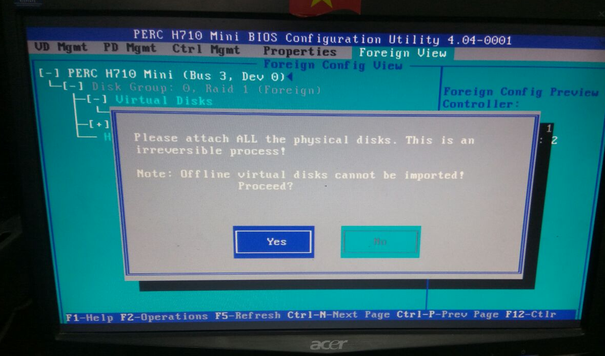

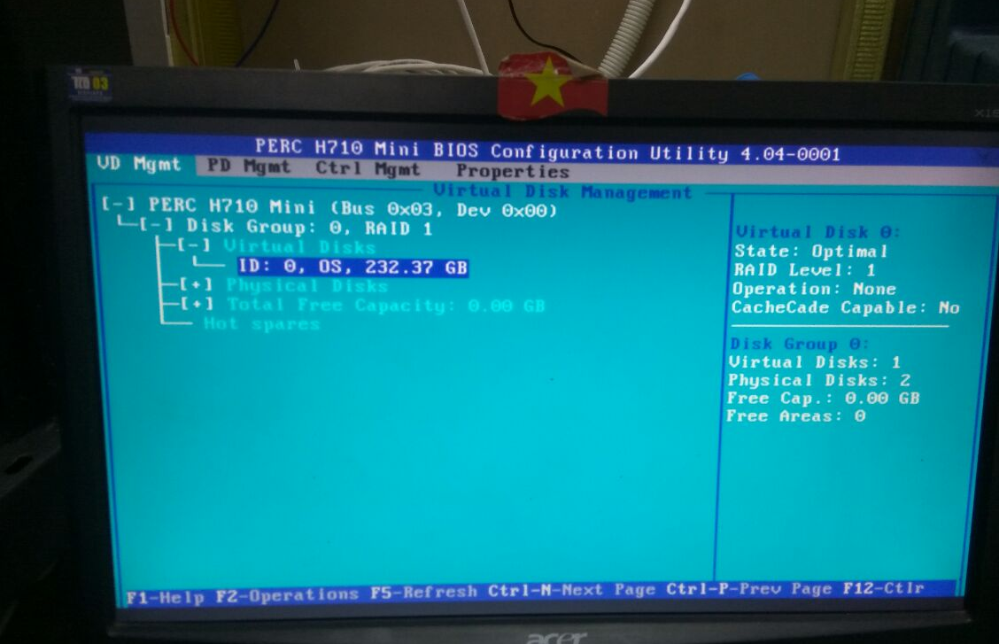


### Tham khảo

- Lệnh magraraid CLI

https://wikitech.wikimedia.org/wiki/MegaCli


