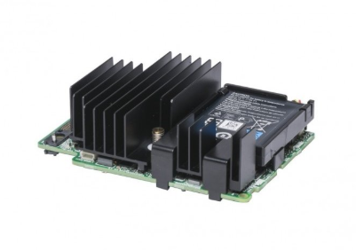
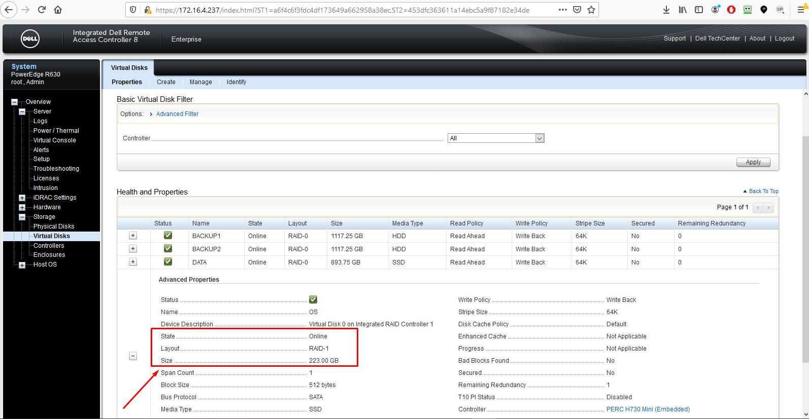
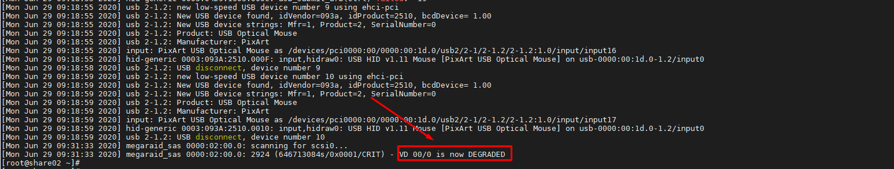
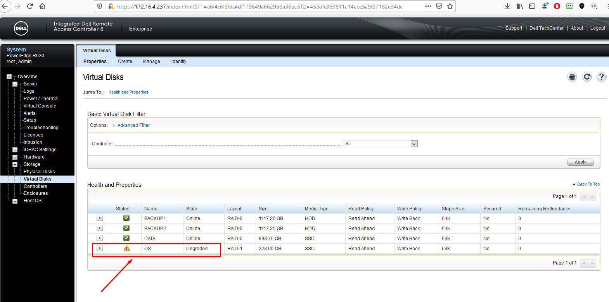
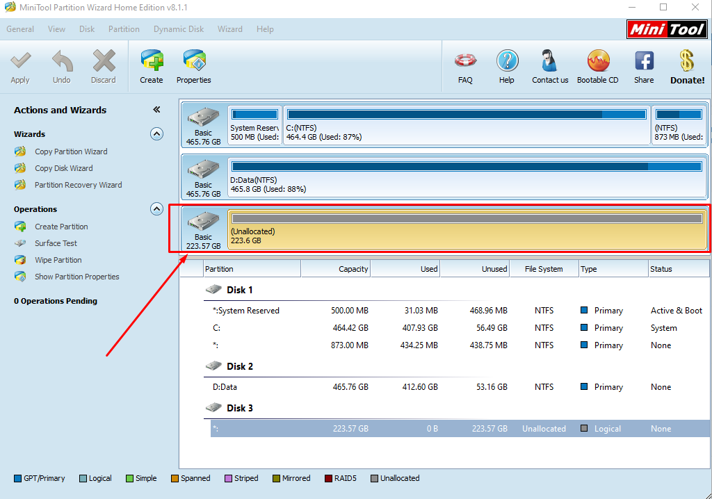
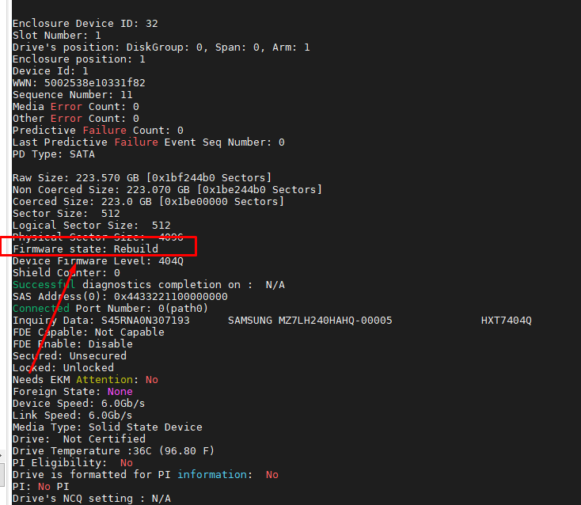
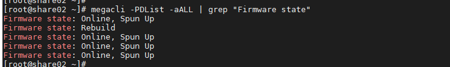
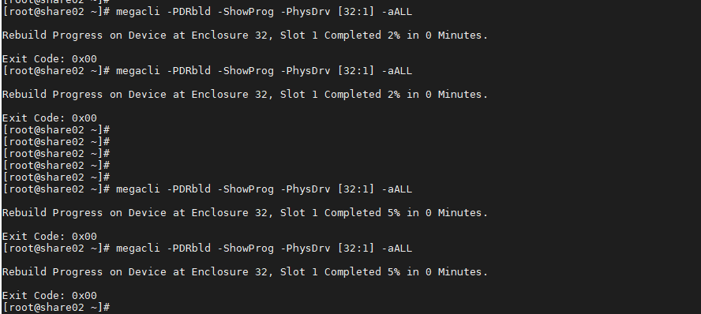
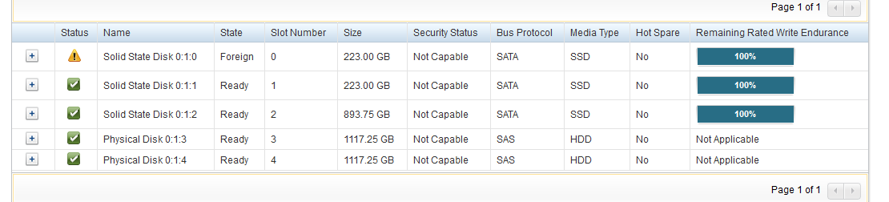
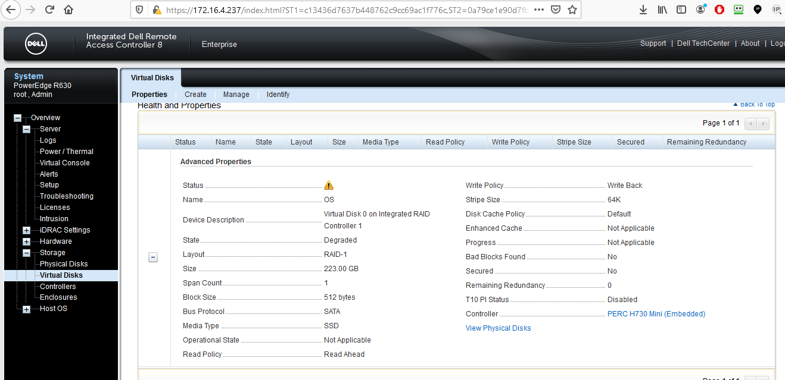

# Ghi chép các bước thao tác với một số case card raid H730mini

Card raid H730mini thường dùng trong dòng Dell R630, Dell R730 hỗ trợ các mode raid 0, 1, 5, 6, 10




Cài megacli để hỗ trợ lệnh check raid

```
yum install -y pciutils 

yum install sg3_utils wget git -y
git clone https://github.com/nhanhoadocs/ghichep-megacli.git
rpm -ivh ghichep-megacli/MegaCli8.07.14/Linux/MegaCli-8.07.14-1.noarch.rpm
echo "alias megacli='/opt/MegaRAID/MegaCli/MegaCli64'" >> /root/.bashrc
source /root/.bashrc
```


## 1. Trường hợp hỏng 1 ổ lắp ổ mới vào raid1

- Ở trạng thái RAID1 chạy ổ định



- Khi 1 ổ bị hỏng sẽ báo `DEGRADED`






- Chuẩn bị 1 ổ mới tinh, clear raid, cùng chủng loại, formart



Căm thay thế ổ hỏng.





Chạy lệnh để xem ổ đang rebuild

```
megacli -PDList -aALL | grep "Firmware state"
```



Hoặc xem all

```
megacli -PDList -aALL
```

Xem % đang rebuild

```
megacli -PDRbld -ShowProg -PhysDrv [32:1] -aALL
```

Trong đó 32:1 là các tham số sau: check băng lệnh

```
megacli -PDList -aall
```

```
Enclosure Device ID: 32
Slot Number: 1
```




Sau khi rebuild xong


## 2. Trường hợp rút ổ khỏi bay

Khi raid đang chạy ổn định nếu rút 1 ổ khỏi raid ra thì tùy từng mode raid sẽ có thông báo khác nhau. Ví dụ như raid 1 sẽ có thông báo degrate.

Sau khi căm lại chính ổ đó sẽ không join vào raid mà báo trạng thái Foreign



Phải reboot lại và import lại Foreign

Sẽ xuất hiện màn hình hiển thị "C" để clean, "F" để Foreign

Sau khi ấn F xong thì quá trình đông bộ dự liệu mới sang ổ diễn ra



## 3. Trường hợp thay thế card raid


### Tham khảo

https://wikitech.wikimedia.org/wiki/MegaCli

