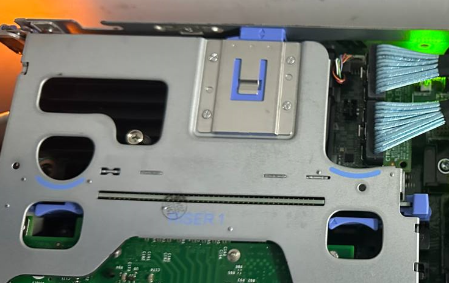
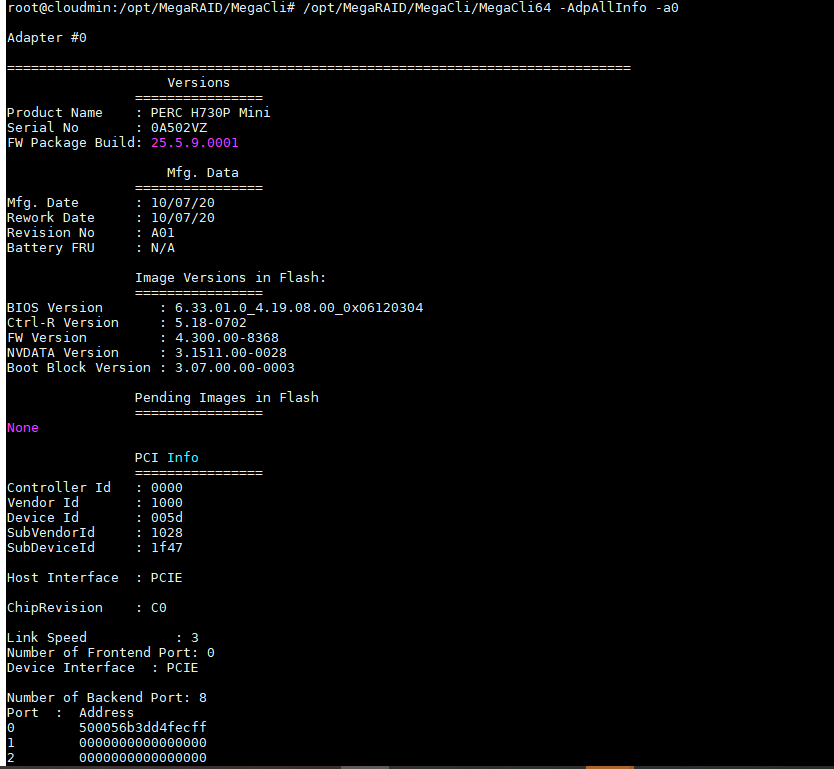
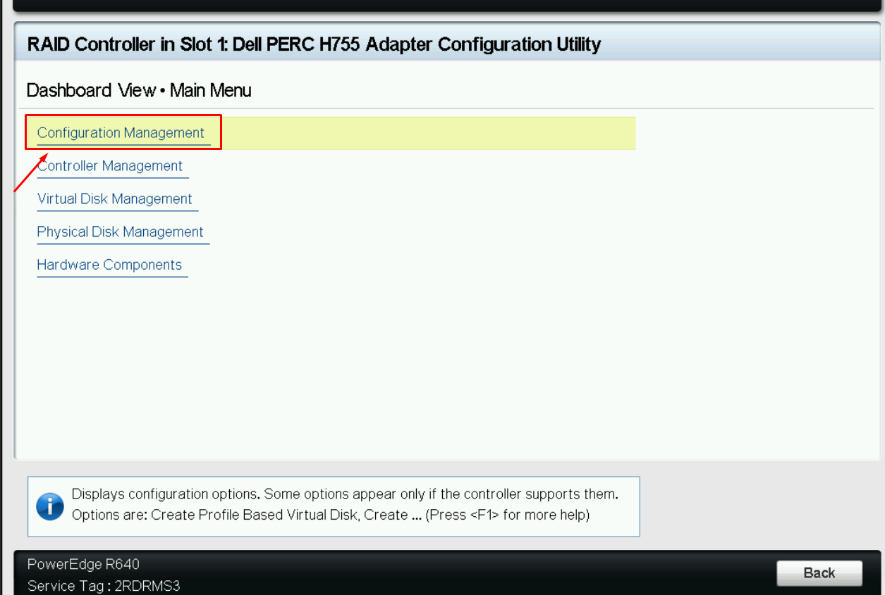
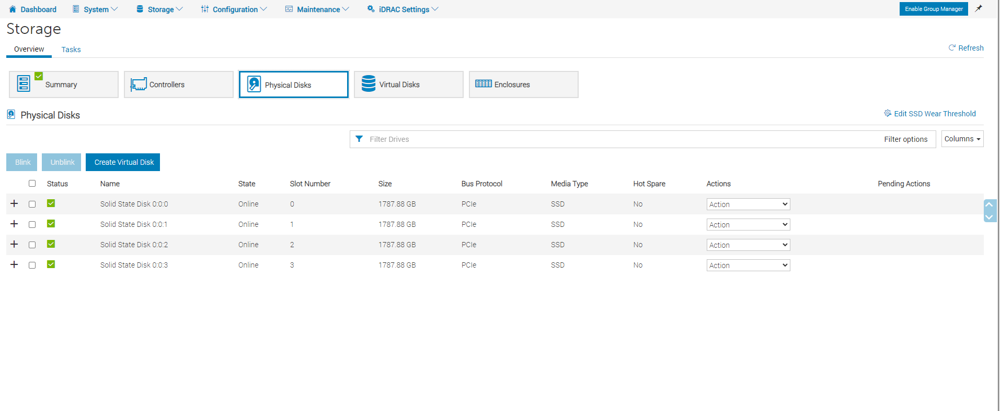
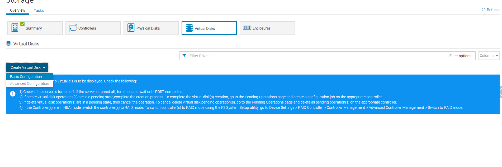
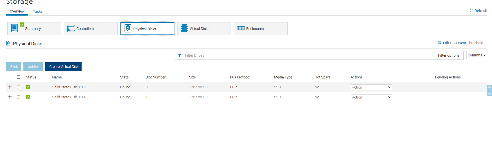
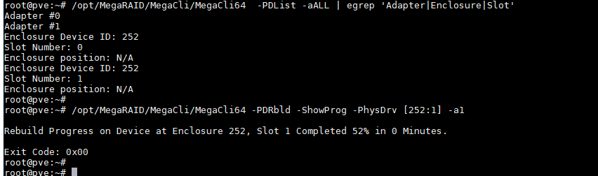
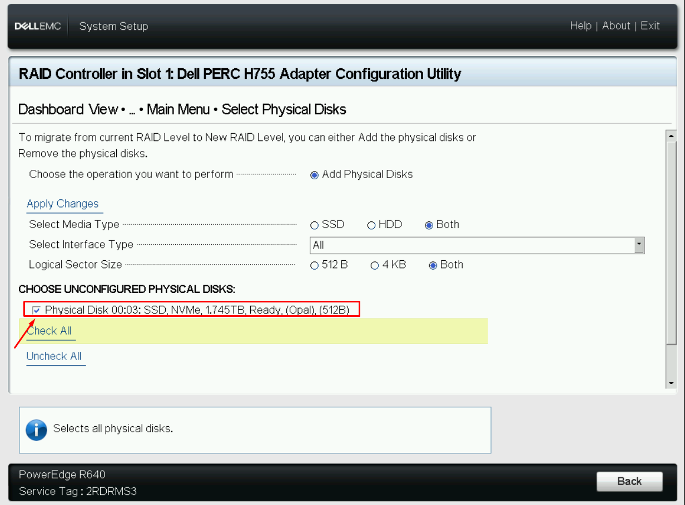
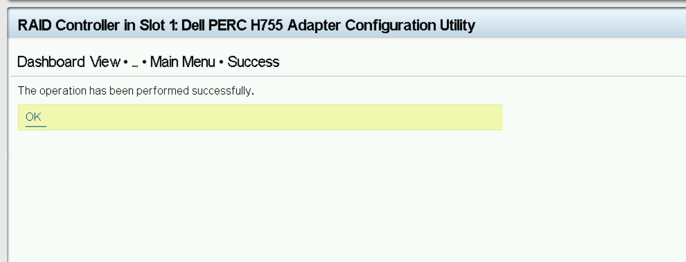
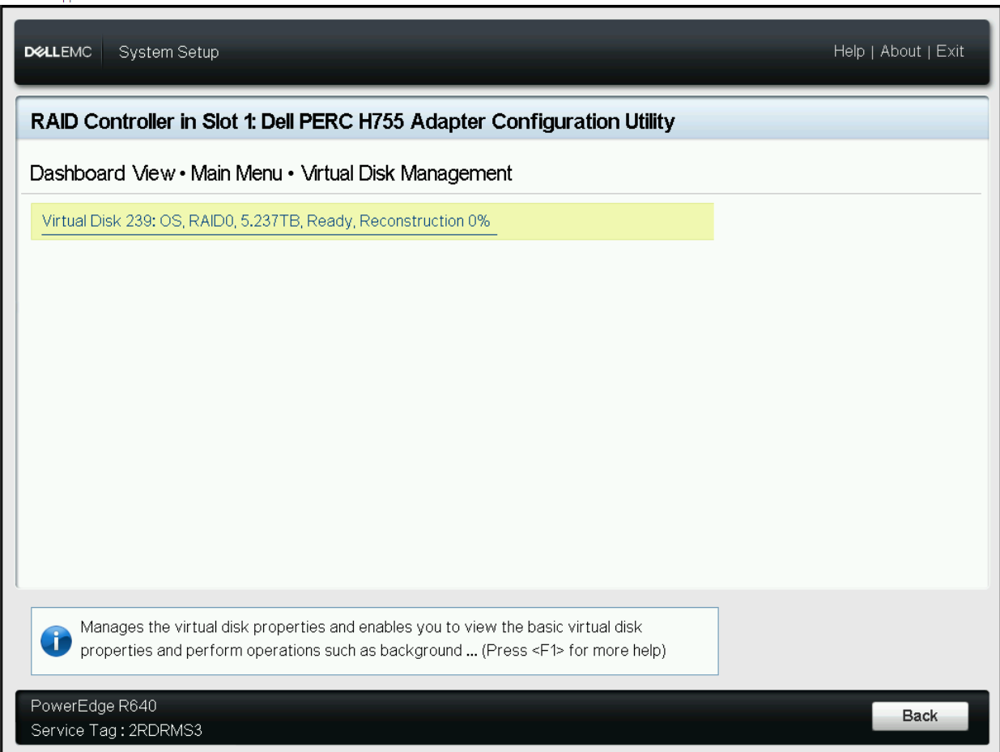

# Ghi chép các bước thao tác với một số case card raid H755 adapter

Card raid H730mini thường dùng trong dòng Dell R640, R740 hỗ trợ các mode raid 0, 1, 5, 6, 10




Cài đặt MegaCLI trên promox6 

```
apt-get update -y

apt-get install unzip -y
apt-get install alien -y
apt-get install wget -y
apt-get install libncurses5 -y
```

```
wget https://docs.broadcom.com/docs-and-downloads/raid-controllers/raid-controllers-common-files/8-07-14_MegaCLI.zip
unzip 8-07-14_MegaCLI.zip
cd Linux
alien MegaCli-8.07.14-1.noarch.rpm
dpkg -i megacli_8.07.14-2_all.deb
/opt/MegaRAID/MegaCli/MegaCli64 -h
```


https://gist.github.com/fxkraus/595ab82e07cd6f8e057d31bc0bc5e779


**Một số lệnh cơ bản**

- Hiển thị tổng quan

```
/opt/MegaRAID/MegaCli/MegaCli64 -ShowSummary -aALL
```


- Liệt kê thông tin chi tiết của cả card raid `a0`, `a1` là số thứ tự của các card raid có trong server

Hiểm thị số thứ tự card

```
/opt/MegaRAID/MegaCli/MegaCli64 -LDGetNum -aALL
```


```
/opt/MegaRAID/MegaCli/MegaCli64 -AdpAllInfo -a0

/opt/MegaRAID/MegaCli/MegaCli64 -AdpAllInfo -a1

/opt/MegaRAID/MegaCli/MegaCli64 -AdpAllInfo -aALL
```




- Thông tin chi tiết SAS/SATA

```
/opt/MegaRAID/MegaCli/MegaCli64 -CfgDsply -aALL
```

- Hiển thị thông tin gắn gọn

```
/opt/MegaRAID/MegaCli/MegaCli64 -EncInfo -aALL
```


- Xem các log, event

```
/opt/MegaRAID/MegaCli/MegaCli64 -AdpEventLog -GetEvents -f events.log -aALL && cat events.log
```

- Thông tin về các đổ đĩa vật lý (Physical Devices)

```
/opt/MegaRAID/MegaCli/MegaCli64 -PDList -aALL
/opt/MegaRAID/MegaCli/MegaCli64 -PDList -a0
```


- Thông tin về các ổ đĩa được RAID(Virtual Devices)

```
/opt/MegaRAID/MegaCli/MegaCli64 -LDInfo -Lall -aALL
```


- Thông tin về Pin của card RAID (Batery Backup Unit – BBU)

```
/opt/MegaRAID/MegaCli/MegaCli64 -AdpBbuCmd -aALL
```


- Cấu hình JBOD

Lưu ý: Việc cấu hình JBOD trên MegaCLI cần phải thao tác cẩn thận cần phải thực hiện tránh thao tác với các ổ đang sử dụng, có dữ liệu


List kiểm tra các Physical Devices

```
/opt/MegaRAID/MegaCli/MegaCli64 -PDList -aALL
```

Show kiểm tra lại các Virtual Devices

```
/opt/MegaRAID/MegaCli/MegaCli64 LDInfo -Lall -a0
/opt/MegaRAID/MegaCli/MegaCli64 LDInfo -Lall -a1
```

Kiểm tra JBOD đã được enable hay chưa

```
/opt/MegaRAID/MegaCli/MegaCli64 AdpGetProp EnableJBOD -aALL
```

Enabe JBOD nếu chưa được cấu hình

```
opt/MegaRAID/MegaCli/MegaCli64 AdpSetProp EnableJBOD 1 -a0
```

Lấy Adapter ID, Enclosure ID, Slot ID


```
/opt/MegaRAID/MegaCli/MegaCli64  -PDList -aALL | egrep 'Adapter|Enclosure|Slot'
```

Set trạng thái các disk cần chuyển qua Non-RAID (JBOD) là GOOD – Sẵn sàng sử dụng

```
/opt/MegaRAID/MegaCli/MegaCli64 -PDMakeGood -PhysDrv[32:4, 32:5, 32:6] -Force -a0
```

Set các disk trên về JBOD

```
/opt/MegaRAID/MegaCli/MegaCli64 -PDMakeJBOD -PhysDrv[32:4, 32:5, 32:6] -a0
```

## 1. Raid disk với card H755 adapter

### 1.1. Raid 0, 1, 5, 6, 10

- Truy cập system BIOS 


- Cấu hình raid trên BIOS - Device Settings


Xem các ổ vật lý hiện cắm


Xem các Virtual disk


Cấu hình raid 




Check thông tin trên iDRAC




### Raid trên giao diện iDRAC 

+ Chọn mode Apply now





Chờ tiến trình tạo raid từ iDRAC xong (Chọn mode Apply now khá lâu).

+ Chọn mode cấu hình ăn sau khi reboot 


Xem tiến trình cài đặt raid 


Chờ khoảng 15 - 20m sẽ chạy xong


## 1.2. Trường hợp hỏng 1 ổ lắp ổ mới vào raid1

Server cài OS chạy 2 disk raid 1 - Hỏng 1 ổ => Thay thế disk mới vào ổ lỗi




Ở trạng thái RAID1 chạy ổ định


Khi 1 ổ bị hỏng sẽ báo DEGRADED


Chuẩn bị 1 ổ mới tinh, clear raid, cùng chủng loại, formart.

Card hỗ trợ auto rebuild nhưng phải check chắc chắn bằng lệnh

```
/opt/MegaRAID/MegaCli/MegaCli64 -AdpAllinfo  -aALL  | grep -i rebuild
```


Cắm thay thế ổ hỏng.

```
/opt/MegaRAID/MegaCli/MegaCli64 -CfgDsply -aALL
```


```
/opt/MegaRAID/MegaCli/MegaCli64 -PDList -aALL | grep "Firmware state"
```


Xem % đang rebuild

```
/opt/MegaRAID/MegaCli/MegaCli64 -PDRbld -ShowProg -PhysDrv [252:1] -a1
```

Trong đó `252:1` là các tham số sau: check băng lệnh

```
/opt/MegaRAID/MegaCli/MegaCli64  -PDList -aALL | egrep 'Adapter|Enclosure|Slot'
```




Tùy vào lượng dữ liệu nhiều hay ít nên thời gian rebuild lâu hay nhanh trung bình 2GB mất 10 phút. Sau khi rebuild xong


Lưu ý: Trường hợp đang rebuild đồng bộ dữ liệu mà server mất điện, có điện dữ liệu vẫn tiếp tục đồng bộ sang ổ mới cắm.


## 1.3. Trường hợp rút ổ khỏi bay trong raid 

Khi raid đang chạy ổn định nếu rút 1 ổ khỏi raid ra thì tùy từng mode raid sẽ có thông báo khác nhau. Ví dụ như raid 1 sẽ có thông báo degrate.


Sau khi cắm lại chính ổ đó quá trình rebuild sẽ diễn ra.


## 1.4. Trường hợp 2 ổ OS hỏng có ổ OS cài sẵn mang lên thay OS

- Chuẩn bị 2 ổ mới cùng loại raid 1 cài OS bình thường.

- Tắt server tháo 2 ổ đó mang đi thay thế lưu ý đúng vị trí slot.

- Tắt server cần thay ổ lắp 2 ổ mới và bật lên.

- Tự động boot vào OS không cần phải làm gì.

## 1.5. Trường hợp chọn Convert disk to Non-RAID xong cài OS 


Hiện tại đang có 2 ổ raid + 2 ổ none raid 

Cài OS vào ổ Non-RAID: Thấy 2 ổ none raid để cài OS vào đó.


## 1.6. Trường hợp mở rộng disk raid 0

- Raid 0 - 3 disk cài OS 


- Cắm thêm disk mới vào server 

Cắm disk vào tuy server xanh đèn nhưng OS, iDRAC không hiển thị. Reboot để cấu hình disk.

- Mở rộng raid 0: Reboot server ấn `F2` vào `Setting`











Chờ khoảng 5 tiếng tùy thuộc vào dung lượng ổ cứng (có thể thoát F2 ra và theo dõi tiến trình thông qua iDRAC)


Check trong OS không thấy disk được mở rộng => Reboot => Check nhận dung lượng disk mới.


## 1.7. Trường hợp vừa chạy raid cho 2 ổ + vừa chạy ổ none-raid

### Test lần 1:

- Cài OS raid 1 cho 2 ổ OS 


- Cbi ổ mới cắm vào, ổ mới k raid mà thực hiện Convert Non-RAID qua iDRAC để không bị reboot server.

Chờ 1 lúc cho tới khi iDRAC hiển thị ổ thứ 3 mới cắm vào => Không thấy hiện => Reboot server thường thì iDRAC k nhận hay check lệnh thấy hiển thị disk.


=> Reboot server vào F2 


- Convert disk to Non-RAID chuyển ổ vừa cắm vào sang dạng Non-RAID trong F2 - BIOS 


### Test lần 2:

- Cài OS raid 1 cho 2 ổ OS 


- Cbi ổ mới cắm vào, ổ mới không raid mà thực hiện Convert Non-RAID qua iDRAC để không bị reboot server.

Chờ 1 lúc cho tới khi iDRAC hiển thị ổ thứ 3 mới cắm vào - Sẽ không nhận ổ mới cắm trong iDRAC hoặc OS 

=> Reboot => Thực hiện Convert Non-RAID 

- Đợi khoảng 1 tiếng trên iDRAC sẽ hiển thị ổ thứ 3 Non-RAID


## 1.8. Trường hợp thay thế card raid 

Chưa có điều kiện để kiểm thử.


