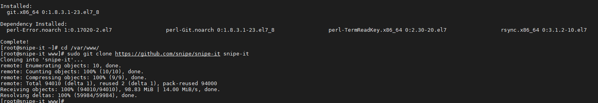

# Ghi chép lại các bước cài đặt Snipe-IT trên CentOS 7

### Mục lục

[1. Thiết lập ban đầu](#thietlap)<br>
[2. Cài đặt Snipe-IT](#caidat)<br>

<a name="thietlap"></a>
## 1. Thiết lập ban đầu

**Requirement**

+ PHP 7.1.2 hoặc lớn hơn.

+ PHP Extensions:

```
- OpenSSL PHP Extension
- PDO PHP Extension
- Mbstring PHP Extension
- Tokenizer PHP Extension
- cURL PHP Extension
- MySQL PHP Extension
- LDAP PHP extension (only if using LDAP)
- PHPZIP PHP extension
- Fileinfo PHP extension
- PHP BCMath PHP extension
- PHP XML PHP extension
```

+ MySQL hoặc MariaDB

+ GD Library (>=2.0) hoặc Imagick PHP extension (>=6.3.8)

+ Git

+ Trỏ domain muốn thiết lập về IP của server cài đặt Snipe-IT

**Thiết lập IP**

```
hostnamectl set-hostname snipe-it
sudo systemctl disable firewalld
sudo systemctl stop firewalld
sudo systemctl disable NetworkManager
sudo systemctl stop NetworkManager
sudo systemctl enable network
sudo systemctl start network
sed -i 's/SELINUX=enforcing/SELINUX=disabled/g' /etc/sysconfig/selinux
sed -i 's/SELINUX=enforcing/SELINUX=disabled/g' /etc/selinux/config
```

```
yum install epel-release -y
yum update -y
```

**Cài đặt NTPD**


```
yum install chrony -y 

systemctl start chronyd 
systemctl enable chronyd
systemctl restart chronyd 

chronyc sources -v
```

```
sudo date -s "$(wget -qSO- --max-redirect=0 google.com 2>&1 | grep Date: | cut -d' ' -f5-8)Z"
ln -f -s /usr/share/zoneinfo/Asia/Ho_Chi_Minh /etc/localtime
```

**CMD log**

```
curl -Lso- https://raw.githubusercontent.com/nhanhoadocs/ghichep-cmdlog/master/cmdlog.sh | bash
```

<a name="caidat"></a>
## 2. Cài đặt Snipe-IT


###  Install Apache web server

```
sudo yum -y install httpd
sudo systemctl start httpd.service
sudo systemctl enable httpd.service
```

### Install PHP 7.3

```
yum -y install yum-utils
rpm -Uvh http://rpms.remirepo.net/enterprise/remi-release-7.rpm
yum -y update

yum-config-manager --enable remi-php73
yum -y install php php-fpm php-ldap php-zip php-embedded php-cli php-mysql php-common php-gd php-xml php-mbstring php-mcrypt php-pdo php-soap php-json php-simplexml php-process php-curl php-bcmath php-snmp php-pspell php-gmp php-intl php-imap perl-LWP-Protocol-https php-pear-Net-SMTP php-enchant php-pear php-devel php-zlib php-xmlrpc php-tidy php-mysqlnd php-opcache php-cli php-pecl-zip unzip gcc
```

### Install MariaDB

```
sudo yum -y install mariadb mariadb-server
sudo systemctl start mariadb.service
sudo systemctl enable mariadb.service
```

+ Đổi pass root mariadb


```
sudo mysql_secure_installation
```

###  Tạo database cho Snipe-IT


```
mysql -u root -p
```

```
CREATE DATABASE snipeit_data;
CREATE USER 'snipeit_user'@'localhost' IDENTIFIED BY 'StrongPassword';
GRANT ALL PRIVILEGES ON snipeit_data.* TO 'snipeit_user'@'localhost';
FLUSH PRIVILEGES;
EXIT;
```

### Install Composer

```
cd ~
curl -sS https://getcomposer.org/installer | php
sudo mv composer.phar /usr/bin/composer
```


### Install Snipe-IT

```
sudo yum -y install git
```

```
cd /var/www/
sudo git clone https://github.com/snipe/snipe-it snipe-it
```



+ Tạo file thiết lập môi trường

```
cd /var/www/snipe-it
sudo cp .env.example .env
```

```
vi .env
```

```
APP_URL=null       #Provide your domain name or IP address here
APP_TIMEZONE='UTC' #Change it according to your country

DB_DATABASE=null   #Provide the database name you created earlier
DB_USERNAME=null   #Provide database user's username 
DB_PASSWORD=null   #Provide the DB user's password
```


+ Phân quyền file và thư mục chứa mã nguồn.

```
sudo chown -R apache:apache storage public/uploads
sudo chmod -R 755 storage
sudo chmod -R 755 public/uploads
```

+ Cài đặt PHP dependencies sử dụng Composer.

```
sudo composer install --no-dev --prefer-source
```

+ Tạo "APP_Key"

```
sudo php artisan key:generate
```


### Tạo virtual host


```
sudo vi /etc/httpd/conf.d/snipeit.chichchich.xyz.conf
```


Thêm các dòng config sau:


```
<VirtualHost *:80>
    ServerName snipeit.chichchich.xyz
    DocumentRoot /var/www/snipe-it/public
    <Directory /var/www/snipe-it/public>
        Options Indexes FollowSymLinks MultiViews
        AllowOverride All
        Order allow,deny
        allow from all
    </Directory>
</VirtualHost>
```

```
sudo systemctl restart httpd
```

### Kết thúc cài đặt


