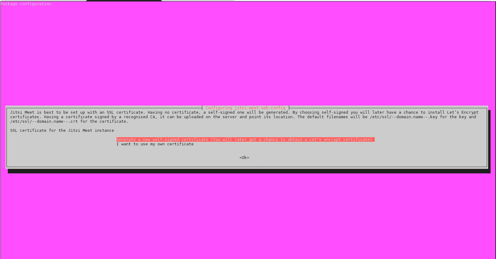
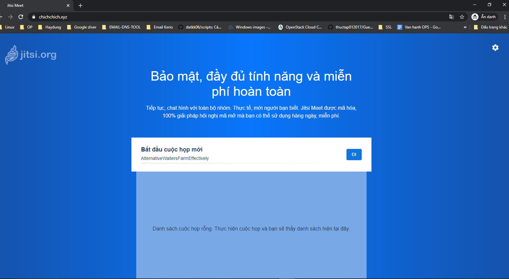
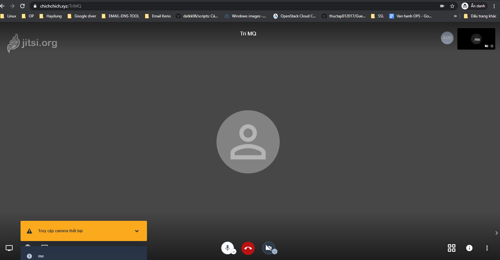

## Cài đặt Jitsi trên Ubunut 18/04

### Mục lục

[1. Chuẩn bị](#cbi)<br>
[2. Cài đặt](#caidat)<br>

<a name="cbi"></a>
### 1. Chuẩn bị

- Server Ubuntu 18.04 LTS

- 01 IP Public

- 01 domain đã được trỏ về IP public


<a name="caidat"></a>
### 2. Cài đặt

- Thiết lập hostname

```
hostnamectl set-hostname jitsimeetduydm
init 6
```

- Thiết lập firewall

```
sudo ufw allow OpenSSH
sudo ufw allow http
sudo ufw allow https
sudo ufw allow in 10000:20000/udp
sudo ufw enable
```

- Update

```
sudo apt update
sudo apt upgrade -y && sudo shutdown -r now
```

- Cài đặt OpenJDK Java Runtime Environment (JRE) 8

```
sudo add-apt-repository universe
sudo apt install -y openjdk-8-jre-headless
java -version
```

Set JAVA_HOME

```
echo "JAVA_HOME=$(readlink -f /usr/bin/java | sed "s:bin/java::")" | sudo tee -a /etc/profile
source /etc/profile
```

- Cài đặt web server nginx

```
sudo apt install -y nginx
sudo systemctl start nginx.service
sudo systemctl enable nginx.service
```

- Cài đặt Jitsi Meet

```
wget -qO - https://download.jitsi.org/jitsi-key.gpg.key | sudo apt-key add -
sudo sh -c "echo 'deb https://download.jitsi.org stable/' > /etc/apt/sources.list.d/jitsi-stable.list"
sudo apt update -y
```

```
sudo apt install -y jitsi-meet
```

Tới bước yêu cầu nhập domain đã được trỏ về IP máy chủ cài đặt. Nếukhông có domain có thể nhập IP của server.

Lựa chọn SSL cert, lựa chọn `Generate a new self-signed certificate (You will later get a chance to obtain a Let’s Encrypt certificate)`.



Cài đặt hoàn tất chạy script để cài đặt SSL Let’s Encrypt.

```
sudo /usr/share/jitsi-meet/scripts/install-letsencrypt-cert.sh
```

- Truy cập

```
https://domain
```

```
https://chichchich.xyz/
```







